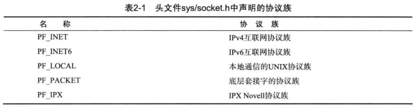

## 网络编程与套接字

<br>

### 理解网络编程与套接字

#### 网络编程中接收连接请求套接字过程

以下为一个服务端构建 socket 套接字需要做到的完整四个步骤

1. 调用 socket 函数创建套接字
2. 调用 bind 函数分配 IP 地址和端口号
3. 调用 listen 函数转换为可接受请求的状态
4. 调用 accept 函数受理连接请求

<br>

#### 客户端套接字处理

对于需要连接上服务端的客户端而言，相对于的代码就简洁了很多

仅需先调用 socket 函数创建套接字，之后再调用 connect 函数向服务器端发送链接请求

<br>

### 基于 linux 的文件操作

#### 文件描述符

文件描述符（file descriptor）是一个整数值，用于表示操作系统中的打开文件或者输入/输出设备。它是对打开文件或设备的引用，通过文件描述符可以进行读取、写入和其他操作。

文件和套接字一般需要经过创建过程才会被分配文件描述符

在 UNIX 系统中，对应的输入输出三个文件描述符是：
标准输入（stdin）、标准输出（stdout）和标准错误（stderr）分别有文件描述符 0、1 和 2

<br>

#### 数据操作

由于 Linux 不区分文件以及套接字，可以直接使用对应的文件处理函数来处理套接字  
比如 open、close、write

常见的以 `_t` 结尾的数据类型：

1. `size_t`: 这是一个无符号整数类型，在 <cstddef> 头文件中定义。它用于表示对象大小或容器的大小。
2. `ptrdiff_t`: 这是一个有符号整数类型，在 <cstddef> 头文件中定义。它用于表示指针之间的差异（偏移量）。
3. `time_t`: 这是一个整数类型，在 <ctime> 头文件中定义。它用于表示从特定时间点（通常是 1970 年 1 月 1 日）起经过的秒数。
4. `int32_t, int64_t, uint32_t, uint64_t`: 这些是固定宽度的整数类型，在 <cstdint> 头文件中定义。它们分别表示有符号的 32 位整数、有符号的 64 位整数、无符号的 32 位整数和无符号的 64 位整数。

<br>

这是一个简单的，使用文件操作的小案例

```c
#include <iostream>   // 标准输入输出操作
#include <fcntl.h>    // 文件控制选项
#include <unistd.h>   // 文件操作

int main(void) {
    int fd;                              // 文件描述符变量
    char buf[] = "helloworld\n";         // 要写入的数据缓冲区

    fd = open("data.txt", O_CREAT | O_WRONLY | O_TRUNC);  // 打开文件以进行写入操作
    if (fd == -1) {
        // 如果文件打开失败，进行错误处理
        std::cerr << "无法打开文件。" << std::endl;
        return 1;  // 返回非零值表示错误
    }

    std::cout << "文件描述符：" << fd << std::endl;  // 打印文件描述符

    if (write(fd, buf, sizeof(buf)) == -1) {
        // 如果写入操作失败，进行错误处理
        std::cerr << "写入文件失败。" << std::endl;
        close(fd);  // 在返回前关闭文件
        return 1;   // 返回非零值表示错误
    }

    close(fd);   // 关闭文件
    return 0;    // 返回0表示成功执行
}
```

<br>

#### 同时创建文件描述符与套接字

以下代码示例，创建文件和套接字，使用整数返回文件描述符值

```cpp
#include <iostream>   // 标准输入输出操作
#include <sys/types.h>   // socket 函数相关类型
#include <sys/socket.h>  // socket 函数
#include <fcntl.h>    // 文件控制选项
#include <unistd.h>   // 文件操作

int main(void) {
    int fd1, fd2, fd3;
    fd1 = socket(PF_INET, SOCK_STREAM, 0);  // 创建 TCP 套接字
    fd2 = open("test.txt", O_CREAT | O_WRONLY | O_TRUNC);  // 打开文件进行写入操作
    fd3 = socket(PF_INET, SOCK_DGRAM, 0);  // 创建 UDP 套接字

    close(fd1);  // 关闭套接字
    close(fd2);  // 关闭文件
    close(fd3);  // 关闭套接字

    return 0;  // 返回0表示成功执行
}
```

<br>

### 基于 windows 平台的实现

windows 下的句柄相当于 linux 的文件描述符  
但不同的是 windows 还包括了文件句柄和套接字句柄

由于 windows 下的 CPP 开发不切实际，所以这里就不多陈述了，大家可以查阅相关的资料补全这部分内容，如果大家感兴趣的话！

接下来将会把全本的笔记主要集中在 linux 开发上

<br>

## 套接字类型和协议设置

<br>

### 套接字协议及其数据传输特性

如何创建套接字？

```cpp
int socket(int domain, int type, int protocol);       // domain：采取的协议族，一般为 PF_INET；type：数据传输方式，一般为 SOCK_STREAM；protocol：使用的协议，一般设为 0 即可。
                //成功时返回文件描述符，失败时返回 -1
```

创建套接字的函数 socket 的三个参数的含义：

- `domain`：使用的协议族。一般只会用到 PF\*INET，即 IPv4 协议族。
- `type`：套接字类型，即套接字的数据传输方式。主要是两种：SOCK_STREAM（即 TCP）和 SOCK\*（即 UDP）。
- `protocol`：选择的协议。一般情况前两个参数确定后，protocol 也就确定了，所以设为 0 即可。

<br>

#### 协议族



重点关注 IPV4 对应的 `PF_INET` 协议族，绝大部分情况下使用它，即便目前 IPV6 正在推广

<br>

#### 套接字类型

`SOCK_STREAM` 面向链接的套接字，代表 TCP 协议

- 可靠传输，传输的数据不会消失。
- 按序传输。
- 传输的数据没有边界：从面向连接的字节流角度理解。接收方收到数据后放到接收缓存中，用户使用 read 函数像读取字节流一样从中读取数据，因此发送方 write 的次数和接收方 read 的次数可以不一样。

```cpp
int tcp_socket = socket(PF_INET, SOCK_STREAM, 0);
```

<br>

`SOCK_DGRAM` 面向消息的套接字，代表 UDP 协议

- 快速传输。
- 传输的数据可能丢失、损坏。
- 传输的数据有数据边界：这意味着接收数据的次数要和传输次数相同，一方调用了多少次 write（send），另一方就应该调用多少次 read（recv）。
- 限制每次传输的数据大小。

```cpp
int udp_socket = socket(PF_INET, SOCK_DGRAM, 0);
```

<br>

#### 协议最终选择

当同一协议族中存在多个数据传输方式相同的协议时，需要使用第三个参数来明确指定协议信息

`IPV4中面向链接的套接字`这么写

```cpp
int tcp_socket = socket(PF_INET, SOCK_STREAM, IPPROTO_TCP);
```

`IPV4中面向消息的套接字`这么写

```cpp
int tcp_socket = socket(PF_INET, SOCK_STREAM, IPPROTO_UDP);
```

<br>

#### TCP 套接字案例分析

服务端程序 `tcp_server.c`

```cpp
#include <stdio.h>       // 标准输入输出
#include <stdlib.h>      // 标准库函数
#include <string.h>      // 字符串操作
#include <unistd.h>      // UNIX 标准函数
#include <arpa/inet.h>   // 网络地址转换函数
#include <sys/socket.h>  // 套接字函数

void error_handling(char *message);

int main(int argc, char *argv[])
{
    int serv_sock;                 // 服务器套接字
    int clnt_sock;                 // 客户端套接字

    struct sockaddr_in serv_addr;  // 服务器地址结构体，用于持续监听连接请求
    struct sockaddr_in clnt_addr;  // 客户端地址结构体，用于与客户端连接以传输数据
    socklen_t clnt_addr_size;

    char message[] = "Hello World!";

    if (argc != 2) // 需要两个参数：可执行文件名、端口号
    {
        printf("Usage : %s <port>\n", argv[0]);
        exit(1);
    }

    serv_sock = socket(PF_INET, SOCK_STREAM, 0);  // 创建一个 TCP 套接字
    if (serv_sock == -1)
        error_handling("socket() error");

    memset(&serv_addr, 0, sizeof(serv_addr));      // 将 serv_addr 结构体全部置为 0，主要是为了将 serv_addr 的 sin_zero 成员设为 0
    serv_addr.sin_family = AF_INET;                // 选择 IPv4 地址族
    serv_addr.sin_addr.s_addr = htonl(INADDR_ANY); // htonl：将 long 类型数据从主机字节序转换为网络字节序；INADDR_ANY：表示接受任意 IP 地址
    serv_addr.sin_port = htons(atoi(argv[1]));     // 此程序运行时应在可执行文件名后跟一个端口号作为参数，例如：hello_server 3030

    if (bind(serv_sock, (struct sockaddr *)&serv_addr, sizeof(serv_addr)) == -1) // 将套接字与服务器的 IP 地址和端口号绑定
        error_handling("bind() error");

    if (listen(serv_sock, 5) == -1) // 将套接字转换为监听状态，最多允许同时连接 5 个客户端
        error_handling("listen() error");

    clnt_addr_size = sizeof(clnt_addr);
    clnt_sock = accept(serv_sock, (struct sockaddr *)&clnt_addr, &clnt_addr_size); // 接收一个连接请求，并将 clnt_sock 套接字与其连接
    if (clnt_sock == -1)
        error_handling("accept() error");

    write(clnt_sock, message, sizeof(message)); // 向客户端发送信息。注意：clnt_sock 不是客户端的套接字，而是服务器上与客户端连接的套接字
    close(clnt_sock);                           // 关闭与客户连接的套接字，断开该连接
    close(serv_sock);                           // 关闭监听端口的套接字，不再接受任何请求
    return 0;
}

void error_handling(char *message)
{
    fputs(message, stderr);
    fputc('\n', stderr);
    exit(1);
}
```

<br>

客户端 TCP 套接字程序 `tcp_client.c`

```cpp
#include <stdio.h>       // 标准输入输出
#include <stdlib.h>      // 标准库函数
#include <string.h>      // 字符串操作
#include <unistd.h>      // UNIX 标准函数
#include <arpa/inet.h>   // 网络地址转换函数
#include <sys/socket.h>  // 套接字函数

void error_handling(char *message);

int main(int argc, char *argv[])
{
    int sock;                           // 客户端套接字
    struct sockaddr_in serv_addr;       // 服务器地址结构体
    char message[30];                   // 存储接收到的消息
    int str_len;                        // 读取的消息长度

    if (argc != 3)
    {
        printf("Usage : %s <IP> <port>\n", argv[0]);
        exit(1);
    }

    sock = socket(PF_INET, SOCK_STREAM, 0);  // 创建一个 TCP 套接字
    if (sock == -1)
        error_handling("socket() error");

    memset(&serv_addr, 0, sizeof(serv_addr));      // 将 serv_addr 结构体全部置为 0
    serv_addr.sin_family = AF_INET;                // 选择 IPv4 地址族
    serv_addr.sin_addr.s_addr = inet_addr(argv[1]); // 设置服务器 IP 地址
    serv_addr.sin_port = htons(atoi(argv[2]));     // 设置服务器端口号

    if (connect(sock, (struct sockaddr *)&serv_addr, sizeof(serv_addr)) == -1) // 连接到服务器
        error_handling("connect() error");

    str_len = 0;
    int idx = 0, read_len = 0;
    while (read_len = read(sock, &message[idx++], 1)) // 只有当 read 函数读到 EOF (即服务器端调用了 close 函数) 才会中止循环
    {
        if (read_len == -1)
            error_handling("read() error");
        str_len += read_len; // 统计读取的消息长度
    }

    printf("Message from server: %s\n", message);
    printf("Function read call count: %d\n", str_len);
    close(sock); // 关闭套接字
    return 0;
}

void error_handling(char *message)
{
    fputs(message, stderr);
    fputc('\n', stderr);
    exit(1);
}
```

<br>

## 地址族与数据序列

<br>

### 分配给套接字的 IP 与端口

`IPV4` 属 4 字节地址族  
`IPV6` 属 16 字节地址族

A 类地址首字节范围：0-127  
B 类地址首字节范围：128-191  
C 类地址首字节范围：192-223

计算机内部的网络接口卡（NIC）传输数据时，会附带一个端口号，计算机根据此端口号传递到对应套接字里面

端口号特点

- 无法把一个端口号分给不同套接字
- 端口号可分配范围 0-65535
- 0-1023 为知名端口，分给特定应用程序
- TCP 套接字和 UDP 套接字不会共用端口号

<br>

### 地址信息表示

#### sockaddr_in

该结构体定义了套接字地址的格式，用于在套接字编程中指定服务器和客户端的网络地址

```cpp
struct sockaddr_in {
    sa_family_t     sin_family;   // 地址族，通常为 AF_INET（IPv4）;AF_INET6（IPV6）
    uint16_t        sin_port;     // 16 位端口号，使用网络字节序（大端序）
    struct in_addr  sin_addr;     // 表示 32 位 IP 地址的结构体
    char            sin_zero[8];  // 不使用，填充字节，通常为全零
};
```

<br>

#### 通用结构体 sockaddr

该结构体为通用型，不仅仅用于 IPV4

```cpp
struct sockaddr {
    sa_family_t   sin_family;   // 地址族，用于指定地址的类型
    char          sa_data[14];  // 地址信息，具体格式取决于地址族的类型
};
```

<br>

### 网络字节序与地址转换

#### 字节序与网络字节序

CPU 向内存保存数据的方式有两种：

- 大端序：高位字节存放到低位地址。网络字节序为大端序。
- 小端序：高位字节存放到高位地址。目前主流的 Intel 系列 CPU 按小端序方式保存数据。

数据数组首先转换成统一的大端序格式进行网络传输——网络字节序  
小端序系统传输数据时应当转换为大端序格式

接收数据是以小端存储的

<br>

#### 字节序转换

这是几个景点的转换字节序的函数：`htons、ntohs、htonl、ntohl`

现在对 htons 分析：

- h 表示主机 host，字节序
- to 表示转化为
- n 表示网络 network，字节序
- s 表示 short，对应的 l 表示 long

> 仅有向 sockaddr_in 结构体变量填充数据之外，其余情况不需考虑字节序问题

<br>

### 网络地址的初始化与分配

我们需要把我们经常看到的 IP 地址形式（点分十进制）改为 sockaddr_in 所接受的 32 位整型数据

下面有两种函数可以实现此功能

#### inet_addr

转换类型附带网络字节序转换，还可以识别错误的 IP 地址

```cpp
#include <arpa/inet.h>
in_addr_t inet_addr(const char* string);
```

<br>

#### inet_aton

他利用了 `inet_addr` 结构体，效率更高

他接受一个 `inet_addr` 指针，运行完毕后把数据原路保存到该指针

```cpp
#include <arpa/inet.h>
int inet_aton(const char* string, struct in_addr* addr);
```

> 顾名思义，则可以得到 inet_ntoa 就是一个反向转换

<br>

#### 网络地址初始化

```cpp
struct sockaddr_in addr;                             // 声明一个 sockaddr_in 结构体变量 addr
char *serv_ip = "211.217.168.13";                     // 声明 IP 地址字符串
char *serv_port = "9190";                             // 声明端口号字符串
memset(&addr, 0, sizeof(addr));                       // 将 addr 的所有成员初始化为 0，主要是为了将 sockaddr_in 的成员 sin_zero 初始化为 0。
addr.sin_family = AF_INET;                            // 指定地址族为 AF_INET，表示 IPv4 地址族
addr.sin_addr.s_addr = inet_addr(serv_ip);            // 使用 inet_addr 函数将字符串形式的 IP 地址转换为二进制形式，并将结果存储在 sin_addr.s_addr 中
addr.sin_port = htons(atoi(serv_port));               // 使用 atoi 函数将端口号字符串转换为整数，并使用 htons 函数将端口号转换为网络字节序（大端序），然后存储在 sin_port 中
```

<br>

当然，你要是嫌麻烦的话，可以避免每次都输入 IP 地址，改为使用 `INADDR_ANY` 作为替代品

使用此方法，可以自动获取运行服务器端的主机 IP 地址（服务端优先采用此方法）

<br>

## 基于 TCP 服务器端与客户端

<br>

### 理解 TCP/UDP
