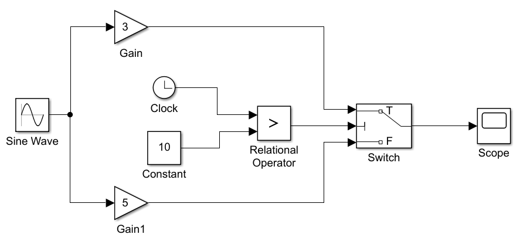

### 前言

以下所有内容均基于 `MATLAB R2022a` 演示

<br>

### simulink 仿真基础

<br>

#### 模块库与环境

在命令行内输入 simulink 即可打开仿真窗口

点击新建一个空白模型

<br>

默认情况下，我们拖拽到场景的模块是不显示名称的，我们需要先随意选择一个模块，然后进入顶部的 APP 菜单项，找到名称，取消勾选下图中的“隐藏自动模块名称”


<br>

打开“库浏览器”，随便按照下图拖拽对应模块构成以下图形（R2022a 比旧版本智能很多，布线也更加准确和智能）

然后任意框选模块，进入 APP 选项卡，点击“创建子系统”，此时的模块被构成一个子模块系统


<br>

#### 仿真

新版本取消了顶部菜单栏，我们可以通过以下方式打开仿真设置界面

建模->模型设置->求解器->求解器详细信息


里面的参数默认已配置好，均为 auto 自动状态，此时即可点击绿色的 run 按钮开始仿真，待运行完毕后打开 scope 输出显示器即可查看结果！

<br>

以下是一些重要的求解器设置参数的介绍

1. 仿真时间：决定了模型仿真的时间或取值范围，其设置完全根据待仿真系统的特性确定，反映在输出显示上就是示波器的横轴坐标值的取值范围
2. 求解器类型：分为变步长（仿真过程系统自动调整步长）和定步长（设置固定基准步长）
3. 仿真算法：很多，选择适合的即可

<br>

### 动态系统仿真

<br>

#### 简单系统仿真

满足以下条件的被称为简单系统

- 系统某一时刻的输出直接且唯一依赖于该时刻的输入量
- 系统对同样的输入，其输出响应不随时间的变化而变化
- 系统中不存在输入的状态量，所谓的状态量是指系统输入的微分。

<br>

构建以下一个简单模型



其中

- Gain 增益为 3
- Gain1 增益为 5
- Constant 值为 10
- 操作符修改为大于号
- switch 阈值改为 0.5

点击仿真后，发现仿真图精度很差，这是因为我们默认设置最大仿真步长为 auto，此时系统就会自动往较大的步长去取，所以导致精度下降

打开求解器设置，找到最大步长，将其改为 0.1

再次执行，即可发现图像变得十分平滑了！

<br>

下面是 simulink 中的步长计算公式

$$h=\frac{t_{final}-t_{start} }{50 } $$

<br>

#### 离散系统仿真

离散系统构成的条件

- 系统每隔固定的时间间隔才更新一次，即系统的输入与输出每隔固定的时间间隔便改变一次。固定的时间间隔称为系统的采样时间
- 系统的输出依赖于系统当前的输入、以往的输入与输出
- 离散系统具有离散的状态。状态指的是系统前一时刻的输出量。

<br>

### simulink 子系统

<br>

#### 高级子系统

所谓高级，即子系统可以被 `控制信号` 操纵，并且动态开闭

条件执行子系统：只有满足一定的条件时子系统才被执行

条件执行子系统可以分为以下三个类别

- 使能子系统：指当控制信号的值为正时，子系统开始执行
- 触发子系统：指当控制信号的符号发生改变时，子系统开始执行。触发子系统的触发执行有三种形式。  
  控制信号上升沿触发：控制信号具有上升沿形式。控制信号下降沿触发：控制信号具有下降沿形式。控制信号双边沿触发：控制信号在上升沿或下降沿时触发子系统。
- 函数调用子系统：这时条件子系统是在读者自定义的 S-Function 中发出函数调用时开始执行

<br>

#### 子系统封装遮罩

构建一个简单的一阶线性方程模型，注意编辑子系统


右键点击子系统（上图左侧系统的中间那个玩意）  
依次选择：封装->新建封装

在打开的封装编辑器，选择“图标”

因为我们想要直接在子系统封装模块上显示函数图像  
填入下方代码，这样就可以渲染出我们想要的图像了

```c
t=0:0.1:2;
y=3*t+1;

plot(t,y)
port_label('input', 1, 'x');
port_label('output', 1, 'y');
```


<br>

### 命令行仿真
