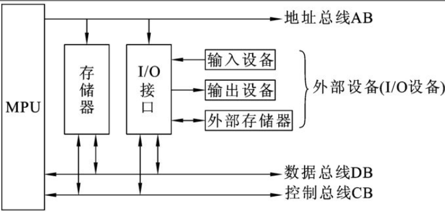
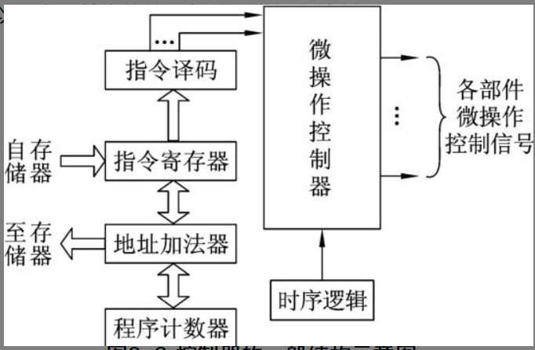

## $\color{deepskyblue} {微机原理及接口技术}$

 

### 微机基础

 

#### 微机组成

下图展示了微型计算机的硬件系统基本结构

中央处理器(CPU): 负责执行计算机程序指令,进行数据运算和逻辑运算。

主存: 用于 storing 程序和数据,包括只读存储器 ROM 和随机存储器 RAM。

输入设备: 外部数据输入的途径,如鼠标、键盘、扫描仪等。

输出设备: 外部显示输出的仪器,如显示器、打印机等。

输入/输出控制器: 负责管理输入输出设备与中央处理器之间的数据通信。

系统总线: 用于相互连接 CPU、内存模块及 I/O 控制器,实现数据和指令的传输。

电源系统: 向整个系统提供工作所需的电源。

 

#### 微机运作原理

微型计算机系统的工作原理可以概括为以下几个方面:

1. 指令执行:CPU 按序号顺序读取指令程序,执行相应的运算或控制功能。它与各个组件通过总线相连,控制数据和地址线的传输。

2. 输入输出:当 CPU 需要访问外部设备(读取或写入)时,它会发出 I/O 请求。I/O 控制器会接受请求,与外设通信,并将结果返回给 CPU。

3. 存储与传输:CPU 读取指令和数据时,首先将地址输出到地址线上。内存会根据此地址,在 RAM 中查找相应的字(word)并通过数据总线返回给 CPU。

4. 时钟控制:一个时钟发生器周期性地产生脉冲信号。CPU 根据这些时钟脉冲来协调和同步它的各个部分的工作,以保证系统的稳定性。

5. 中断响应:当外设需要 CPU 的即时响应时(如鼠标移动),它会发出一个中断请求。CPU 会暂停当前工作,先处理这个中断。执行完中断服务程序后,再回到之前的工作。

6. 总线传输:系统总线将 CPU 、内存和 I/O 控制器相连。数据和地址线通过总线实现组件间的通信。

 

### 8086

> 微处理器内部总体上由 3 个部分组成，即运算器、控制器和寄存器组

 

#### 运算器

运算器由`算术逻辑单元 ALU (arithmeticlogical unit）、通用或专用寄存器组及内部总线` 3 个部分组成

运算器根据总线结构可以分为以下三种

1. 单总线结构运算器：此时所有的部件都通过一条内部总线传递信
2. 双总线结构：内部用两条总线来传送操作数的
3. 三总线结构：速度最快

 

#### 控制器

下图展示了一个控制器的基本运行流程图

控制器必须具备以下功能

- 指令控制：控制器要能根据指令所在的地址按顺序或在遇到转移指令时按照转移地址取出指令，分析指令（指令译码），传送必要的操作数，并在指令执行结束后存放运算结果
- 时序控制：指令的执行是在时钟信号的严格控制下进行的，一条指令的执行时间称为指令周期
- 操作控制

 

控制器的内部主要由以下几个部分组成

- 程序计数器 PC `(programmingcounter）`
- 指令寄存器 IR `(instructionregister）`
- 指令译码器 ID `(instructiondecoder）`
- 时序控制部件
- 微操作控制部件

 

#### 8086 微处理器

> 由于该处理器冗余部分过多，就不一一介绍寄存器的名称和地址了，只介绍重要原理，融会贯通即可

程序执行时，CPU 总是有规律的执行以下操作

1. 从存储器中取出下一条指令；
2. 指令译码（或分析指令）;
3. 如果指令需要，从存储器中读取操作数；
4. 执行指令（包括算术逻辑运算、I/O 操作、数据传送、控制转移等）;
5. 如果需要，将结果写入存储器

 

实模式（8086/8088CPU 只能工作于此模式）

- CPU 只能访问最多 1MB 的内存,并且很少对内存进行保护
- 不使用段机制,CPU 直接访问线性地址
- 需要 Segment 机制,因此实模式下的开销比较低

 

段地址和偏移地址是 x86 微处理器使用的两种寻址模式:

段地址:

- 段地址模式下,内存被划分为多个段(segment)。
- 每个段有一个段基址(base address)和段长度(limit)。
- 指令由一个段寄存器和一个偏移地址组成。段寄存器指定段基地址,偏移地址指定该段内的一个绝对地址。
- 在实模式下,只有一个段,所有段寄存器都指向相同的基地址(0),此时段地址模式实际上相当于线性地址。
- 在保护模式下,不同的段寄存器可指向不同的段,实现内存保护。

偏移地址:

- 在偏移地址模式下,内存被看作是一整块,没有分割为段。
- 指令只包含一个线性地址,指定内存的一个绝对位置。
- 使用偏移地址模式时,x86 处理器会忽略段寄存器,直接使用线性地址。
- 偏移地址模式提供了最简单、最高效的寻址方式。

 

### 8086 指令系统
