### 前言

参考文献《模拟电路与数字电路自学手册》，微信读书提供对应电子书供阅读

 

### 数字电路基础与门电路

 

#### 数电基础

数字电路中常将 `0 ～ 1V` 范围的电压称为低电平，用“0”表示；而将 `3 ～ 5V` 范围的电压称为高电平，用“1”表示。

正逻辑体制规定：高电平为 1，低电平为 0。  
负逻辑体制规定：低电平为 1，高电平为 0。

 

对于一个 NPN 型 BJT 而言，当输入数字信号时会发生如下情况

- 低电平：B 无电流流经，BJT 处于截止区
- 高电平：B 存在高位电流，BJT 处于放大区

而由于数字信号仅需要输入的电压处于一定的范围就可以解释为高低电平，所以一定程度上可以弥补模拟信号因为电压波动而影响元器件性能的问题

 

#### 基本门电路

与门电路

逻辑表达式是：`Y=A·B`

74LS08 是一种较常用的与门芯片

 

或门电路

逻辑表达式为：`Y=A+B`

74LS32 是一种较常用的或门芯片

 

非门电路

非门逻辑符号 $$Y=\overline{A}$$

74LS04 是一种常用的非门芯片（又称反相器）

 

#### 复合门电路

与非门

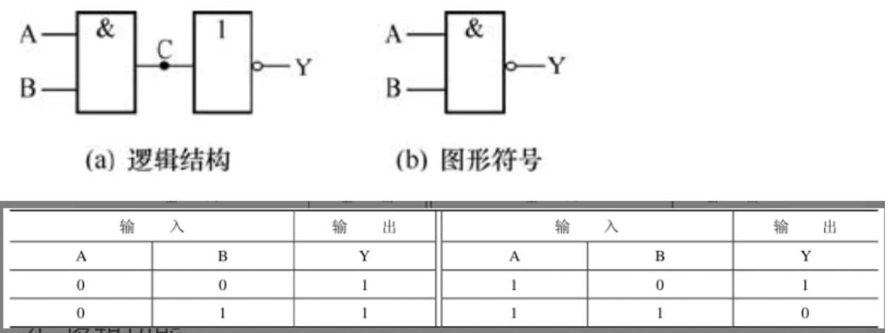

主要功能：只有输入端全为“1”时，输出端才为“0”；只要有一个输入端为“0”，输出端就为“1”

逻辑符号 $$Y=\overline{A\cdot B} $$

`74LS00` 是一种常用的与非门芯片

 

或非门

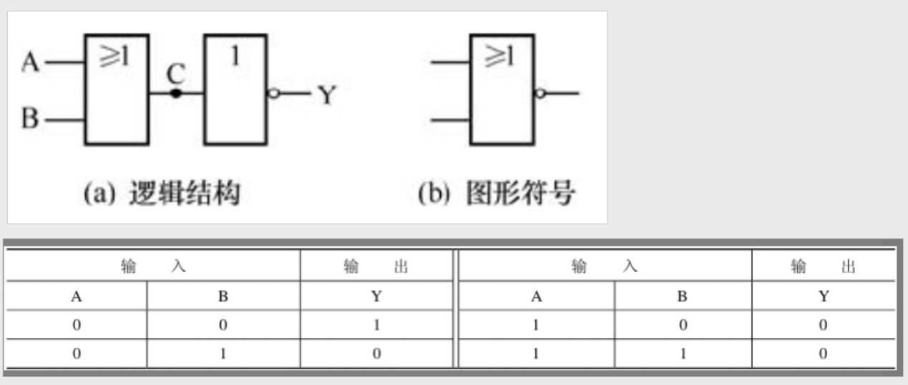

只有输入端全为“0”时，输出端才为“1”；只要输入端有一个“1”，输出端就为“0”

逻辑符号 $$Y=\overline{A+B} $$

`74LS27` 是一种常用的或非门芯片

 

与或非门

逻辑功能是：只要 A、B 端或 C、D 端中有一组全为“1”，输出端就为“0”，否则输出端为“1”

`74LS54` 是一种常用的与或非门芯片

 

异或门

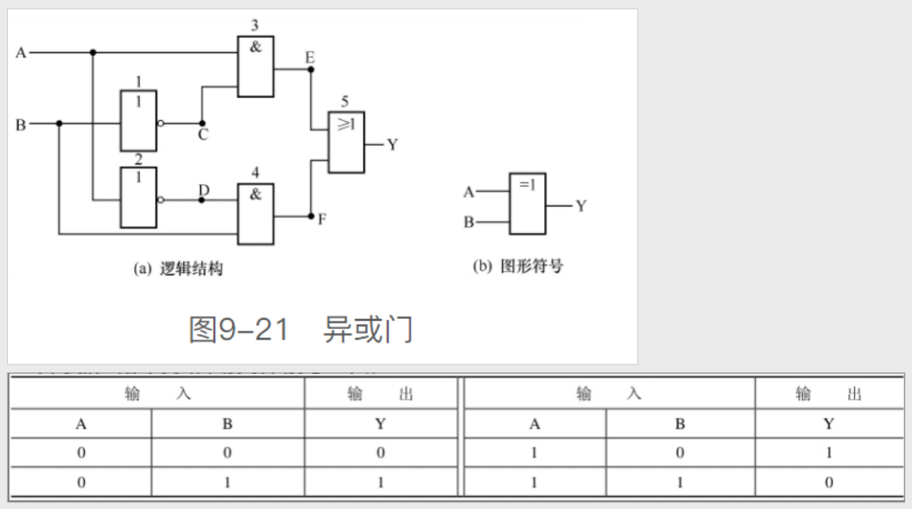

逻辑功能：两输入相同时输出 0，相异时输出 1

逻辑表达式：$$Y=A\oplus  B$$

`74LS86` 是一个 4 组 2 输入异或门芯片

 

同或门

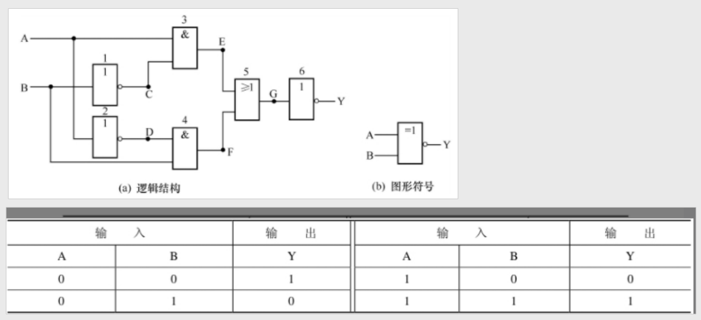

逻辑功能：两输入相同时输出 1，相异时输出 0

逻辑表达式：$$Y=A\odot  B$$

`74LS266` 是一个 4 组 2 输入同或门芯片

 

#### TTL 门电路

> 名称由来：芯片内部主要采用双极型晶体管（即三极管）来构成门电路

74LS 系列和 74 系列芯片属于 TTL 门电路

TTL 门电路是电流控制型器件，其功耗较大，但工作速度快、传输延迟时间短

 

**多发射晶体管**

即拥有两个及以上发射极的 BJT

下面以常见的三个发射极的 NPN-BJT 作为介绍

根据发射极处于高电平个数的不同，可以动态调节基极的电压，从而使得集电极电压发生变动

 

TTL 集电极开路门（OC 门）

此门的输入与输出之间有“与非”的关系

 

**三态输出门（TS 门）**

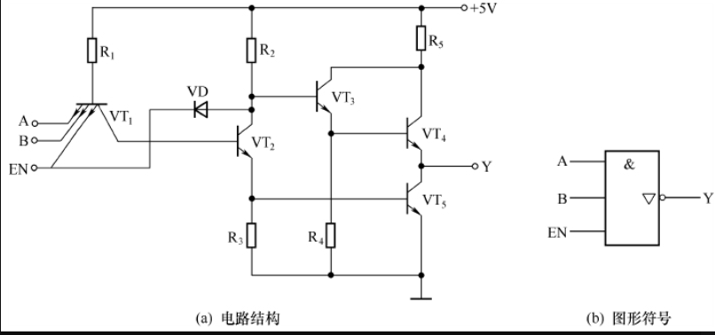

三态输出门即具有三种状态：高电平、低电平、高阻态

`EN=0（0V）` 无论 A、B 端输入“1”还是“0”，VT1 与 EN 相连的发射结和二极管 VD 都处于导通状态，最终 VT4、VT5 都处于截止状态。（此状态称为高阻态）

`EN=1（5V）` 此时使能 EN 作用消失，整个元件变成普通的与非门电路

74LS126 是一种常用的高电平有效型三态门芯片（高电平有效，即使能 EN=1 时才解除高阻态）

三态门可应用于计算机总线设计，譬如一个总线上有 N 个三态门，同一时刻内有且仅有一个三态门 EN=1，可进行信息传递，其余都高阻态

 

**对于 TTL 器件的要求**

输出端禁止直接接电源或接地

输入端高电平有两种获得方式：一是输入端通过串接 1 个 1 ～ 10kΩ 的电阻与电源连接；二是输入端直接与电源连接。输入端直接接地获得低电平

电源电压 VCC 允许范围为`+5V（1±10%）`

 

#### CMOS 门电路

> 芯片内部主要采用 MOS 场效应管(MOSFET)来构成门电路

74HC、74HCT 和 4000 系列芯片属于 CMOS 门电路

CMOS 门电路是电压控制型器件，其工作速度较 TTL 电路慢，但功耗小、抗干抗性强、驱动负载能力强

 

**CMOS 非门**

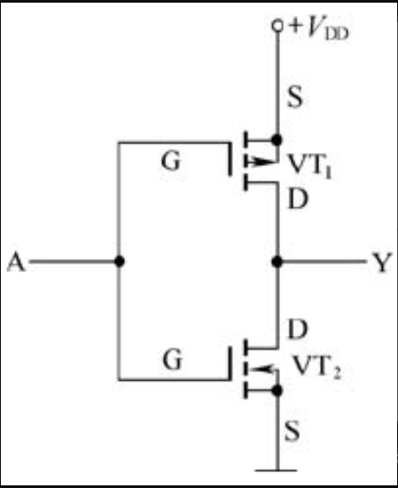

CMOS 由一个增强型 PMOS 和增强型 NMOS 组成

当 A=1 时，上方 PMOS 截止，下方 NMOS 导通，此时 Y 低电平

当 A=0 时，上方 PMOS 导通，下方 NMOS 截止，此时 Y 高电平

 

**CMOS 传输门**

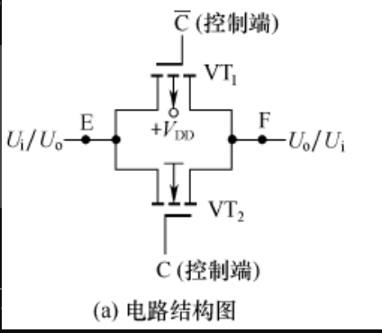

CMOS 传输门，顾名思义即具有双向传递信号的能力

上方为 PMOS，下方为 NMOS

图中上下两个控制端输入的电平总是相反的；

当上方 PMOS 的 C 控制端输入 0，下方的 NMOS 的 C 控制端输入 1 时，两管导通，此时 E 输入的信号就可从 F 输出

当 PMOS 控制端输入 1，NMOS 控制端输入 0，两个门关闭，此时信号无法输出！

为什么说他可双向传递？因为你同样可以吧 F 当做输入端，E 做输出端，最终的效果都是一样的

 

### 数制、编码与逻辑代数

 

#### 数制

本小节主要陈述十进制、二进制、十六进制及其对应的转换法则，网上对应的文章已经有很多，且开发中多用二转十，剩余的场景可以直接使用在线进制转换器解决，就不多费笔墨记录此处笔记

 

#### 编码

> 用二进制数表示各种数字或符号的过程称为编码。编码是由编码电路来完成的

**BCD 码**

`8421BCD` 码是一种有权码，它的 4 位二进制从高到低的位权依次为 23=8、22=4、21=2、20=1

`2421BCD` 码的 4 位二进制从高到低的位权依次为 2、4、2、1  
`5421BCD` 码的 4 位二进制从高到低的位权依次为 5、4、2、1

 

**余 3 码**

由 8421BCD 码加上 3（0011）得来的，它是一种无权码

 

**格雷码**

两个相邻代码之间仅有 1 位数码不同的无权码称为格雷码

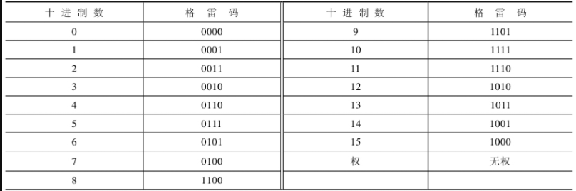

 

#### 逻辑代数

下面为所有逻辑运算的表格

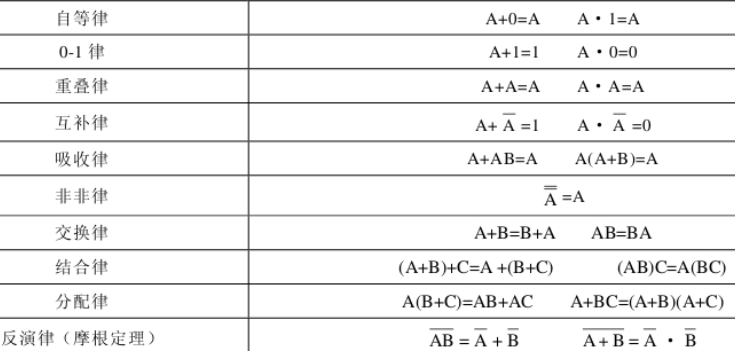

 

### 组合逻辑电路

 

#### 组合逻辑电路分析与设计

根据以下组合逻辑电路，分析得到对应的逻辑表达式为

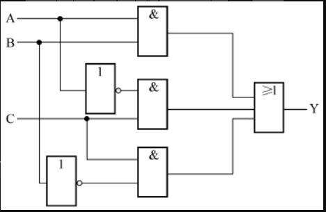

$$Y=AB+\bar{A}C+\bar{B}C$$

 

#### 编码器

> 将输入信号转换成一组二进制代码的过程称为编码。编码器是指能实现编码功能的电路

**普通编码器**

- 任何时刻只允许输入一个信号
- 同时输入多个信号，编码输出就会产生混乱
- 闭合 S0，由于 A 不接入电路，故输出均为 0
- 闭合 S5，此时 G1=1 G3=1，故输出二进制 101

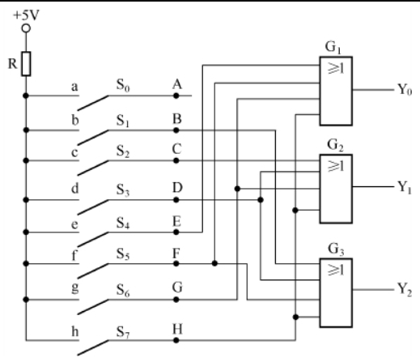

 

**优先编码器**

- 同一时刻允许输入多个信号
- 仅对输入信号中优先级别最高的一个信号进行编码输出
- 74LS148 是一种常用的 8 线-3 线优先编码器芯片
- 38 编码器，输入的 8 个引脚优先级从高到低为 7、6、5...0  
  使能 EI=1 输出均为 1，无法编码  
  使能 EI=0 此时运行编码

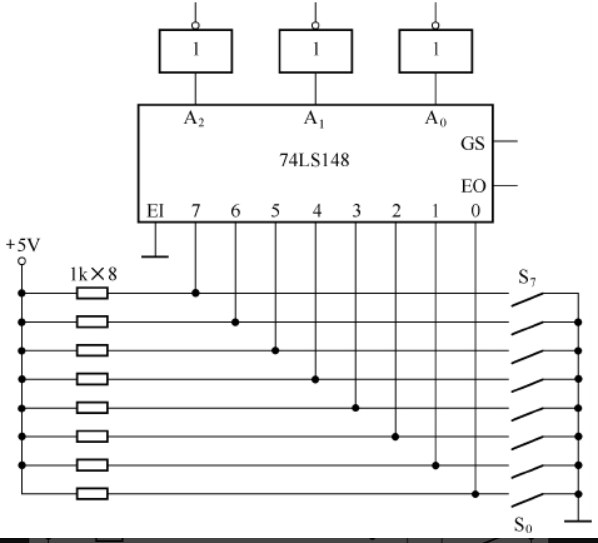

除此之外还有一个 16-4 编码器，但是不太常用，可以不学

 

#### 译码器

> 译码是将二进制代码翻译成特定输出信号的过程。能完成译码功能的电路称为译码器

**二进制译码器**

下面展示一个俩输入，四输出的二进制译码器

例如：当 A=0、B=0 时，非门 GA 输出“1”，非门 GB 输出“1”，与门 G3 两个输入端同时输入“0”，故输出端 Y3=0

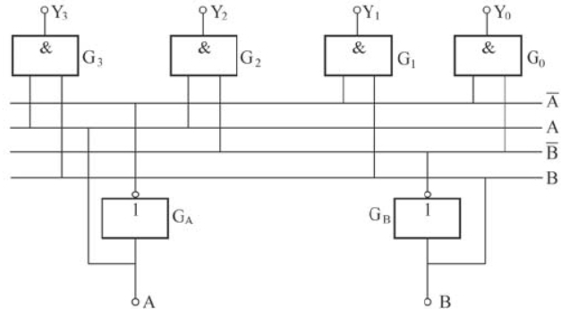

 

**数码显示器**

数码显示器即数码管，配合译码器信号可以直观的显示十进制数码

常见的有七段数码管，分为共阴极（输入高电平导通），和共阳极（输入低电平导通）两种接法

检测数码管极性：万用表选择 ×10kΩ 挡，黑表笔接 com 引脚（公共引脚），红表笔接 com 引脚外的任意一脚，若测得阻值小，则该数码管为共阳极；若测得阻值接近无穷大，则为共阴极

 

荧光数码显示器工作时，要给灯丝提供约 6.3V 的交流电压，灯丝发热后才能发射电子

液晶显示器工作时不需要电流，耗电很少，但由于本身不发光，所以需借助外界光源照射显示数码。

 

**显示译码器**

该译码器的功能主要是：将输入的二进制代码译成一定的输出信号，让输出信号驱动显示器来显示与输入代码相对应的字符

常见的为 `BCD 七段显示译码器`

显示译码器一般和数码管相互结合，通过输入端给予不同的电平，从而让输出端输出八位二进制码，从而驱动数码管对应 LED 亮起

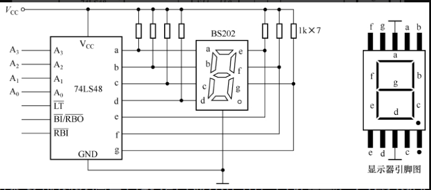

 

#### 加法器

**半加器**

> 两个 1 位二进制数相加运算，称为半加，实现半加运算功能的电路称为半加器

半加器可以有如下两种组成方式，对应的电路符号如下图最右侧展示

当 A 端输入“0”，B 端输入“1”时，异或门的 S 端输出“1”（异或门的功能是输入相同时输出为“0”，输入相异时输出为“1”），而与门的 C 端输出“0”，即`“0+1=1”`

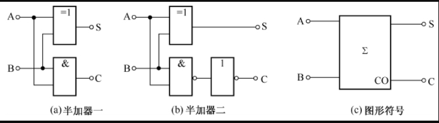

 

**全加器**

> 全加是带进位的加法运算，它除了要将两个同位数相加外，还要加上低位送来的进位数

由两个半加器外带一个或门组成，Cn-1 表示进位，若为 1 表示低位进位，若为 0 表示不进位

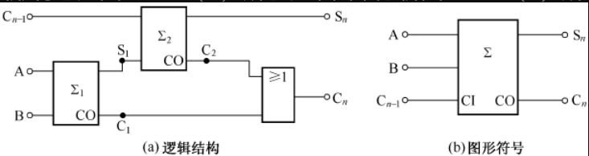

 

还有一个所谓的多位加法器，其由多个全加器或者全加器与半加器混合组成

 

#### 数值比较器

**等值比较器**

一位等值比较器，可以使用异或非门实现（相同输入则输出 1，相异输入则输出 0）  
提供两个输入端 AB 以及一个输出端 Y

多位等值比较器仅需使用多个异或非门配合一个与门即可实现

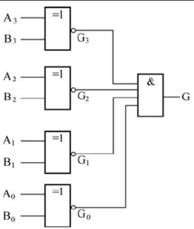

 

**数值比较器**

一位数值比较器，使用一个异或非门、两个与门和两个非门构成

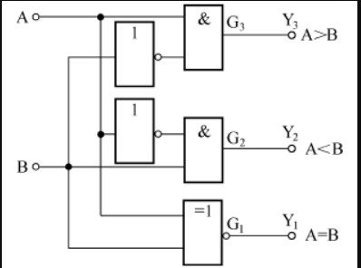

`74LS85` 是一个常用的 4 位数值比较器芯片

 

#### 数据选择器

> 数据选择器又称为多路选择开关，它是一个多路输入、一路输出的电路，其功能是在选择控制信号的作用下，能从多路输入的数据中选择其中一路输出

常见的四选一选择器，通过 S0 和 S1 控制哪一个输入有效

- 当 S0=0、S1=1 时,A2 数据能通过与门 G2 和或门 G4 从 Y 端输出
- 当 S0=1、S1=1 时，与门 G3 开通，A3 数据被选择输出
- 当 S0=0、S1=0 时，与门 G0 开通，A0 数据被选择输出
- 当 S0=1、S1=0 时，与门 G1 开通，A1 数据被选择输出

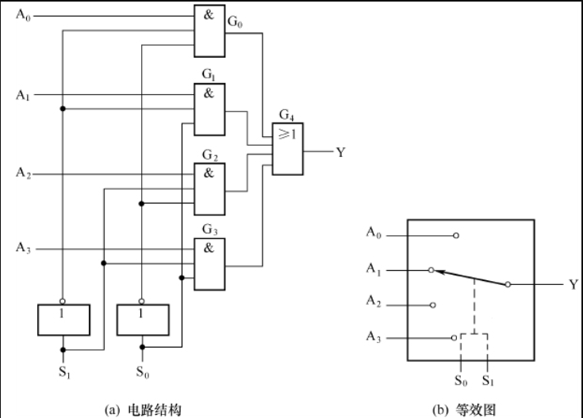

 

#### 奇偶校验器

> 奇偶校验有奇校验和偶校验之分。对于奇校验，若数据中有奇数个“1”，则校验结果为 0，若数据中有偶数个“1”，则校验结果为 1；对于偶校验，若数据中有偶数个“1”，则校验结果为 0，若数据中有奇数个“1”，则校验结果为 1

下图展示了奇偶校验器的实际作用

1. 发送器发送数据 10101100
2. 发送端奇偶校验器设置为奇校验，故因为有偶数个 1，故输出 1
3. 发送端奇偶校验器输出值传输到接收端奇偶校验器
4. 接收端奇偶校验器接收发送器传来的数据，并进行奇校验
5. 若得出结果相一致，表示校验成功，数据未丢失

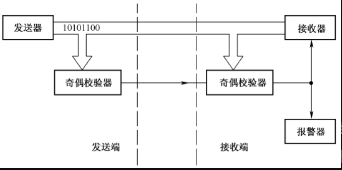

奇偶校验器可以使用异或门构成，如下图所示

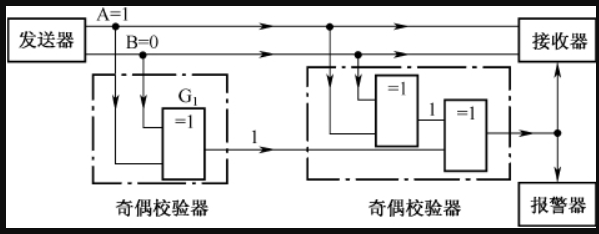

 

### 时序逻辑电路

 

#### RS 触发器

> 触发器是一种具有记忆功能的电路，它是时序逻辑电路中的基本单元电路

基本 RS 触发器逻辑电路

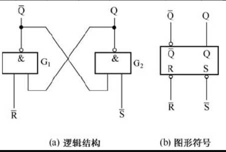

$\bar{R}$ 端（称为置“0”端）  
$\bar{S}$ 端（称为置“1”端）  
字母上标“-”表示该端低电平有效，对应的输入端上的小圆圈也表示低电平有效

$\bar{Q}$ 和 Q 的状态永远相反  
取 Q 作为触发器状态

故当 Q=0 时，$\bar{Q}$=1

 

当 $\bar{R}$=1，$\bar{S}$=1 时，触发器状态保持不变

当 $\bar{R}$=0，$\bar{S}$=1 时，触发器状态马上变成 0

当 $\bar{R}$=1，$\bar{S}$=0 时，触发器状态马上变成 1

当 $\bar{R}$=0，$\bar{S}$=0 时，不允许出现此状况！！！

 

#### 同步 RS 触发器

控制脉冲称为时钟脉冲，简称 CP，用于使得多个触发器按照同一节拍工作

时钟脉冲每个周期可分为 4 个部分：低电平部分、高电平部分、上升沿部分、下降沿部分

同步 RS 触发器在无时钟脉冲时不工作，在有时钟脉冲时，其逻辑功能与基本 RS 触发器相同：置“0”、置“1”和保持

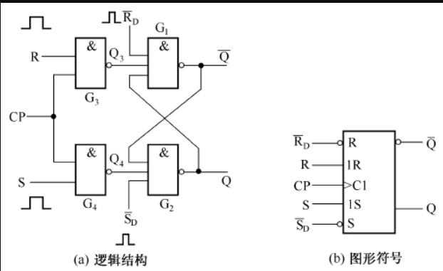

 

#### D 触发器

> D 触发器又称为延时触发器或数据锁存触发器

D 触发器实际上就在同步触发器的基础上添加了一个非门，避免同步触发器的 RS 端同时输入 1 导致触发器不稳定

D 触发器的逻辑功能是：在无 CP 脉冲时不工作；在有 CP 脉冲时，触发器的输出 Q 与输入 D 的状态相同

 

#### JK 触发器

在输入端上添加两根反馈线，就可构成 JK 触发器

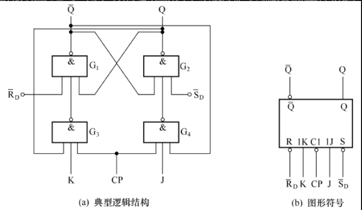

 

主从 JK 触发器的逻辑功能与 JK 触发器是一样的，都具有翻转、置“1”、置“0”和保持的功能

边沿触发器只有在 CP 脉冲上升沿或下降沿来时输入才有效，其他期间处于封锁状态，即使输入信号变化也不会影响触发器的输出状态

 

#### 寄存器
