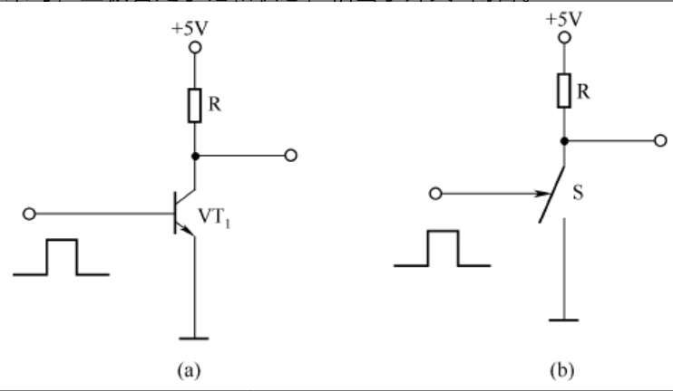
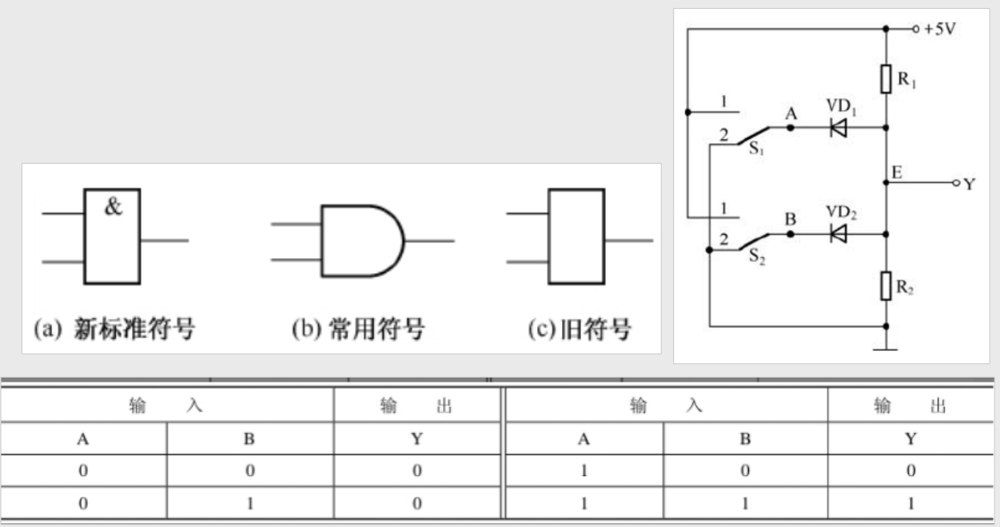
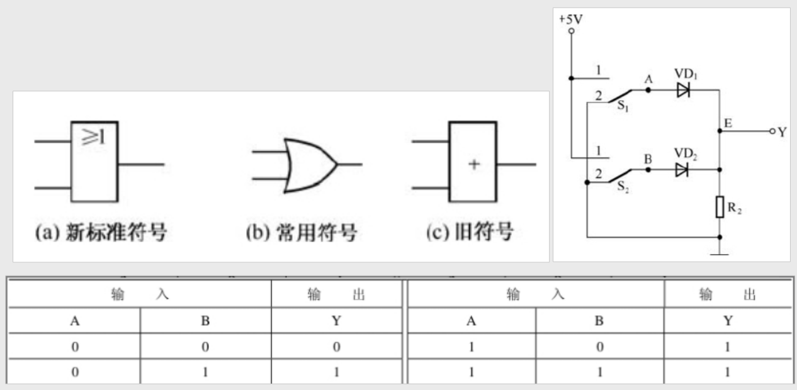
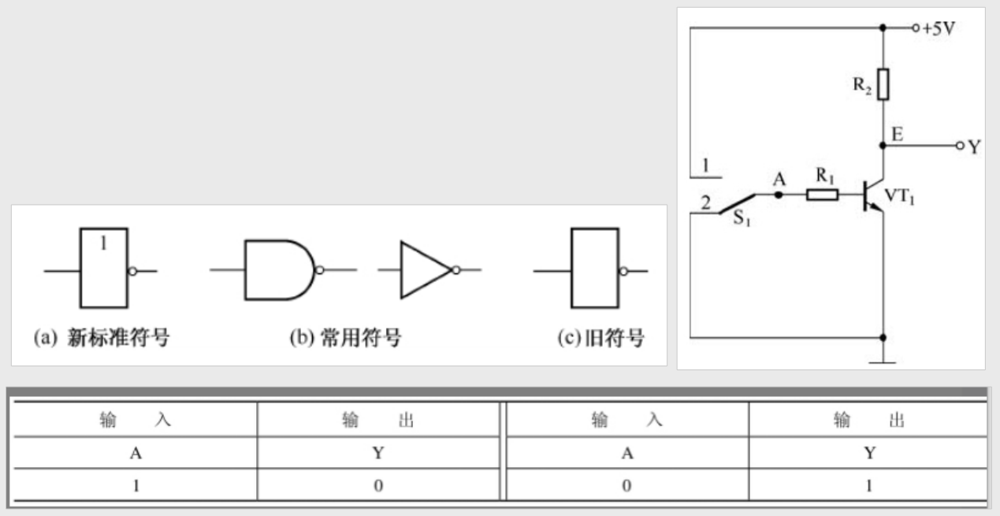

### 前言

参考文献《模拟电路与数字电路自学手册》，微信读书提供对应电子书供阅读

 

### 数字电路基础与门电路

 

#### 数电基础

数字电路中常将 `0 ～ 1V` 范围的电压称为低电平，用“0”表示；而将 `3 ～ 5V` 范围的电压称为高电平，用“1”表示。

正逻辑体制规定：高电平为 1，低电平为 0。  
负逻辑体制规定：低电平为 1，高电平为 0。

 

对于一个 NPN 型 BJT 而言，当输入数字信号时会发生如下情况

- 低电平：B 无电流流经，BJT 处于截止区
- 高电平：B 存在高位电流，BJT 处于放大区

而由于数字信号仅需要输入的电压处于一定的范围就可以解释为高低电平，所以一定程度上可以弥补模拟信号因为电压波动而影响元器件性能的问题

 

#### 基本门电路

与门电路

逻辑表达式是：`Y=A·B`

74LS08 是一种较常用的与门芯片

 

或门电路

逻辑表达式为：`Y=A+B`

74LS32 是一种较常用的或门芯片

 

非门电路

非门逻辑符号 $$Y=\overline{A}$$

74LS04 是一种常用的非门芯片（又称反相器）

 
