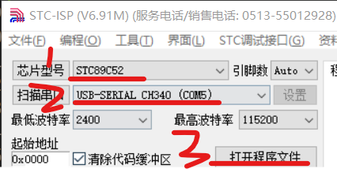

### 前言

目前我们的开发需求很简单，仅需三个软件：

- keli5 编写代码
- proteus8 professional 描绘电路板
- STC-ISP 串口烧录

 

具体教程在 CSDN 等博客平台上已经有很多，这里就不再赘述（对应软件也可以直接在网上找到）

这里将主要集中于讲述我在配置过程中出现的错误以及对应的解决方法，全程跟下来相信你也能成功连接到开发板上并烧录你的第一个程序！

 

### 连接到开发板

> Win10 用户看这里！！！安装部分可能会遇到些许问题，下文有针对性的分析

 

#### micro-usb 测试

再开始一切操作之前，务必检测开发板是否能和电脑正常链接

特别注意！链接开发板的 micro-usb 线必须是能传输数据的，单纯充电的不可以用！  
当你发现连接到电脑时没有弹出任何提示窗口，且无法检测到 usb 接入时，就必须考虑这根线是不是数据线！！！  
（鉴别指南：可传输数据的数据线一般较粗，且其中包裹着四根导线；而仅具备充电效果的线只包裹两根导线，且比较细）

一般的，仅具有充电功能的线链接到电脑后，开发板点击 power 键是可以正常上电并亮灯的，但是你无法做任何操作，因为电脑压根不识别；

此时，如果你使用了数据线链接电脑，会发现弹出一个“无法识别此驱动程序”，或者其他窗口，反正只要显示插入了一个设备，那么你这条线就没问题！

> 接下来我们将处理驱动的问题

 

#### 安装串口驱动

> 前往该网址下下载最新版的串口驱动程序：https://www.wch.cn/download/CH341SER_EXE.html

接下来请严格按照我标注的步骤执行

1. 保证单片机处于开启状态（默认单片机是关的，我们要摁一下 power 键，让他保持开启状态）
2. 将 usb 连接到电脑上，此时单片机由于 power 键开启，立刻亮灯
3. 打开串口驱动程序，点击"安装"，稍等几秒后出现"驱动安装成功"后，即完成！

 

如果安装驱动时弹出“驱动预安装成功”，就表示安装失败了！  
此时请检查一下你的单片机是否连接到了电脑（就比如说不要出现我们上面提出的用充电线连接单片机的现象）  
单片机接口是否有损坏？  
电脑的 usb 口供电是否充足？

 

串口驱动安装完毕后需要重启电脑

如果上述方法还是不能解决驱动安装失败的问题，那么可以尝试关闭 win10 的数字签名检测功能，具体过程网上自查

 

### 烧写

#### 准备源码

本普中 A2 单片机开发笔记为跟随 B 站江科大视频记录而来，具体源码以及软件等请直接去对应视频简介栏获取：  
https://www.bilibili.com/video/BV1Mb411e7re/?spm_id_from=333.337.search-card.all.click

 

下载源码文件，进入文件夹：`KeilProject\2-1 点亮一个LED\Objects`

找到文件 `Project.hex` 待会我们将会将他烧录到开发板里面

 

#### 烧录

打开 STC-ISP

左上角选择两个关键要素

- 芯片型号，我这边的型号为 `STC89C52`
- 串口，这里务必选择格式为 `USB-SERIAL CH340`的串口

之后点击“打开程序文件”，选择我们上午提到的 hex 文件 `Project.hex`

 

烧写过程

1. 首先保持开发板处于关闭状态
2. 点击“下载/编程”，此时提示“正在检测目标单片机”
3. 点击开发板 power，为其上电
4. 此时开始烧写，等待一秒左右烧写完毕

 
