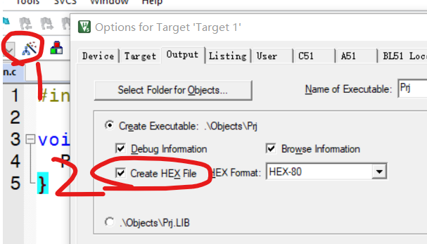
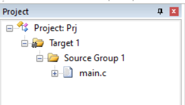
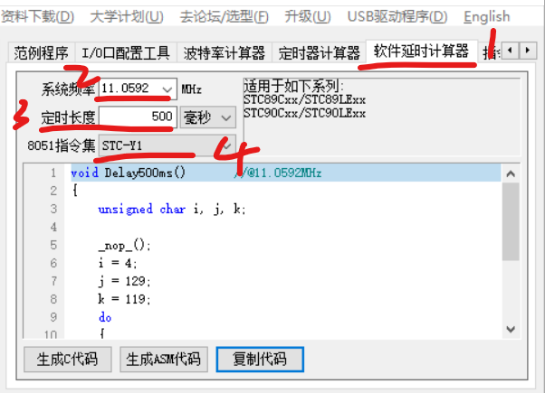
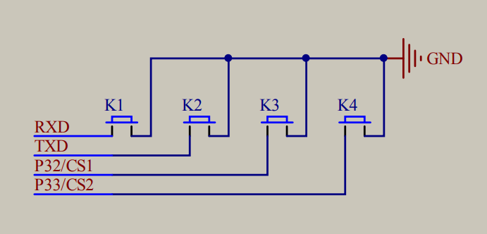

### 点亮一个 LED

#### 电阻的表示形式

如电阻 `103`，表示 `10x10^3`，即 `10000 欧姆`

同理，473 表示 `47000 欧姆`

<br>

#### 编写程序



点击上图所示按钮，进入 `options for target1`

在 output 选项卡勾选 `create hex file`  
这样每次 build 后都会自动生成 hex 文件，方便我们直接调试

<br>



在 `source group1` 下新建 `main.c` 文件，作为我们的主入口；  
每个工程都必须存在一个主入口

<br>

#### main.c 代码清单

```c
#include <REGX52.H>

// 主入口
void main(){
	// 1表示高电平，0表示低电平，低电平亮灯
	// 由于有8个LED，故1111 1110表示7个关灯，一个亮灯
	P2=0xFE; // 对应二进制1111 1110
}
```

<br>

### LED 闪烁

#### 生成延迟函数

STC-ISP 自带了一个帮我们生成延迟函数的小工具

按下图所示找到该工具，下面是我们需要注意的几个关键点

1. 系统频率：查看自己开发板中晶振频率，一般会写在上面
2. 定时长度
3. 8051 指令集：选择 STC-Y1 指令集，因为这个刚好对应 STC89C52



<br>

#### main.c

```c
#include <REGX52.H>
#include <INTRINS.H> // 注意哦，这里导入了一个新的头文件

// 生成的延迟函数
void Delay500ms()		//@11.0592MHz
{
	unsigned char i, j, k;

	_nop_();
	i = 4;
	j = 129;
	k = 119;
	do
	{
		do
		{
			while (--k);
		} while (--j);
	} while (--i);
}


void main()
{
	// 在循环中调用延迟函数，实现灯泡闪烁
	while(1)
	{
		P2=0xFE;
		Delay500ms();
		P2=0xFF;
		Delay500ms();
	}
}
```

<br>

### 流水灯

```c
#include <REGX52.H>
#include <INTRINS.H>

void Delay1ms(unsigned int xms);

void main()
{
	while(1)
	{
		P2=0xFE;//1111 1110
		Delay1ms(1000);
		P2=0xFD;//1111 1101
		Delay1ms(1000);
		P2=0xFB;//1111 1011
		Delay1ms(100);
		P2=0xF7;//1111 0111
		Delay1ms(100);
		P2=0xEF;//1110 1111
		Delay1ms(100);
		P2=0xDF;//1101 1111
		Delay1ms(100);
		P2=0xBF;//1011 1111
		Delay1ms(100);
		P2=0x7F;//0111 1111
		Delay1ms(100);
	}
}

void Delay1ms(unsigned int xms)		//@11.0592MHz
{
	unsigned char i, j, k;

	_nop_();
	i = 4;
	j = 129;
	k = 119;
	do
	{
		do
		{
			while (--k);
		} while (--j);
	} while (--i);
}

```

<br>

### 按键控制 LED 亮灭

#### sbit 分析

在头文件 REGX52.H 中，已经预定义好了各个引脚所对应的十六位值

譬如下图所示开发板的四个按钮原理图，他们分别对应 `P3_1 P3_2 P3_3 P3_4` 口



<br>

#### 简单控制

```c
#include <REGX52.H>

void main()
{
	while(1)
	{
		// 通过预定义寄存器获取P32口对应电平
		// 0为低电平，即按钮按下时
		if(P3_1==0)
		{
			// 按钮按下时切换对应LED为低电平，此时灯亮
			P2_0=0;
		}
		else
		{
			// 否则切换为高电平，此时灯灭
			P2_0=1;
		}
	}
}
```

<br>

#### 开关记忆

按键模块在使用的过程中存在三种状态：

- 5-10ms 的按下态
- 任意时长的持续按下态
- 5-10ms 的松开态

<br>

我们需要做的是为按下态和松开态做防抖处理，以实现该效果：  
按下按钮后松开才改变 LED 电平，而不是在使用按键的整个过程中改变电平！

```c
#include <REGX52.H>

// 可修改时长的延迟函数
void Delay(unsigned int xms)		//@11.0592MHz
{
	unsigned char i, j;

	while(xms)
	{
		i = 2;
	j = 199;
	do
	{
		while (--j);
	} while (--i);
	xms--;
	}
}


void main()
{
	while(1)
	{
		// 检测到按下按键
		if(P3_1==0)
		{
			// 延迟20ms，按下防抖
			Delay(20);
			// 阻塞线程，此刻为持续按下状态
			while(P3_1==0);
			// 延迟20ms，松开防抖
			Delay(20);

			// 最后直接取反，避免else编写重复逻辑
			P2_0=~P2_0;
		}
	}
}
```

<br>

### LED 逐个亮灭

#### 二进制知识

众所周知，点亮第一盏灯需要设置二进制为：`1111 1110`  
则不难得出结论，上述二进制可以由 `0000 0001` 取反而来

所以从 `0000 0001` 开始，每次都左移位一次，然后取反，就可以完美的实现按顺序点亮 LED 的效果啦~

譬如如下过程

1. 当前点亮第一盏灯，此时为 0000 0001
2. 左移位一次，此时为 0000 0010
3. 对其取反，得到 1111 1101，此时点亮第二盏灯

<br>

#### 源码

这里定义了一个全局变量 LEDNumber，用来记录当前移位的长度（以此来决定需要点亮那一盏灯）

依然使用十六进制表示，`0x01` 表示 `0000 0001`

```c
#include <REGX52.H>

// 全局变量存储移位长度
unsigned char LEDNumber=0;

void Delay(unsigned int xms)		//@11.0592MHz
{
	unsigned char i, j;

	while(xms--)
	{
		i = 2;
	j = 199;
	do
	{
		while (--j);
	} while (--i);
	}
}

void main()
{

	while(1)
	{
		if(P3_1==0)
		{
			Delay(20);
			while(P3_1==0);
			Delay(20);

			// 首先序号+1
			LEDNumber++;
			// 假如序号大于等于8，表示已经移位到最后一个灯，此时需要执行复位操作
			if(LEDNumber>=8)
			{
				// 复位，回归零点
				LEDNumber=0;
			}

			// 按照上述原理，得出根据0x01进行移位后直接取反，点亮LED
			P2=~(0x01<<LEDNumber);
		}

		// 如法炮制一个递减点亮LED的判断语句
		if(P3_0==0)
		{
			Delay(20);
			while(P3_0==0);
			Delay(20);

			LEDNumber--;
			if(LEDNumber==0)
			{
				LEDNumber=7;
			}
			P2=~(0x01<<LEDNumber);
		}
	}
}
```

<br>

###
