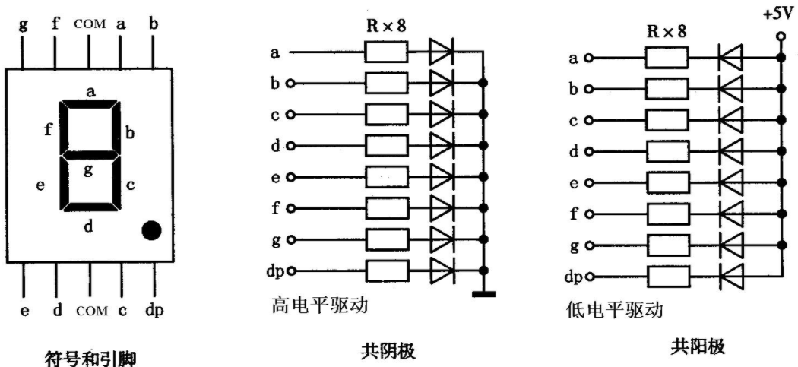
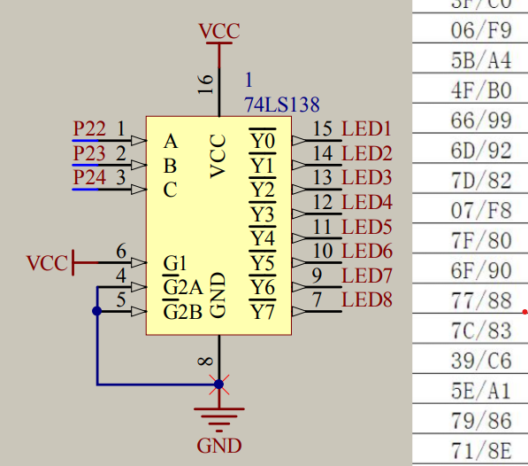
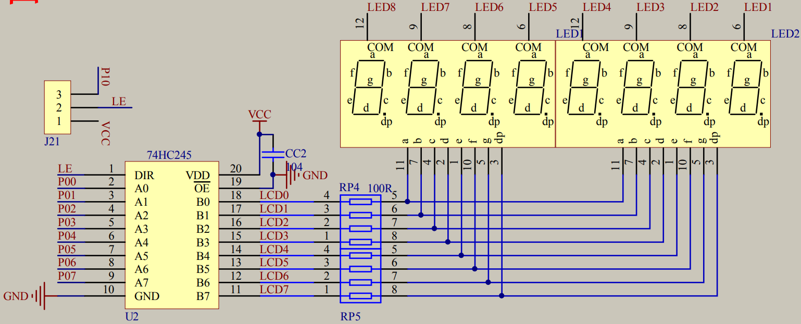

### 数码管主要概念

> 参考文献：[点击前往](https://blog.csdn.net/m0_56646606/article/details/120802526?ops_request_misc=%257B%2522request%255Fid%2522%253A%2522168082700016800182113048%2522%252C%2522scm%2522%253A%252220140713.130102334..%2522%257D&request_id=168082700016800182113048&biz_id=0&utm_medium=distribute.pc_search_result.none-task-blog-2~all~top_positive~default-1-120802526-null-null.142^v81^insert_down1,201^v4^add_ask,239^v2^insert_chatgpt&utm_term=%E5%8D%95%E7%89%87%E6%9C%BA%E6%95%B0%E7%A0%81%E7%AE%A1&spm=1018.2226.3001.4187)

<br>

#### 数码管分类

`字形重叠数码管`：将不同数字、字母与符号重叠，需要用到那个就显示那个

`分段式数码管`：最常见的数码管，按照笔画来显示，主要有七段式和八段式数码管

`点矩阵式数码显示`：顾名思义

<br>

#### 八段式数码管

数码管的显示方式分为两种，共阴极以及共阳极

- 共阴极：输出端接地且恒为低电平；若输入端为高电平，此刻导通，LED 点亮；输入端若为低电平，则 LED 熄灭
- 共阳极：输出端接电源且恒为高电平；LED 点亮方式和共阴极相反

普中 A2 开发板中的数码管均为共阴极数码管

下图所示数码管的 COM 口即为输出端，剩余的引脚均为输入端



<br>

八段式数码管顾名思义，有八个引脚控制八个笔画，其中一个笔画是小数点 DP

那么对应下图，根据共阴极性质，输入端定义为 `0x3F` ，此时转换为二进制为 `1111 1100`  
对应的 ABCDEF 六个笔画的引脚均为高电平，直接导通，此时 LED 点亮，显示的图形为 0

其余数字&字母的显示均遵循上述规定，十分简单！


<br>

#### 七段式数码管

和八段式数码管略有差别，七段式没有小数点

他有一个输出端，三个输入端

根据三个输入端输入结果（二进制）转换为十进制来显示对应的笔画  
譬如输入端输入 101，则转换为二进制为 5，则对应的 5 号位笔画 e 点亮！

至于如何显示一个完整的数字，此时就需要使用循环的方式，在极短的时间内循环点亮不同的笔画，由于人眼无法分辨，故看起来就像是正常显示一样

<br>

#### 联排数码管

> 即四个单位数码管联合而成的四位数码管

首先认识一下译码器；

译码器的原理和七段式数码管几乎一样，输入端 `P22 P23 P24` 有三个，输出端有 8 个  
输入端输入的二进制转换为 10 进制后，对应数字的输出端即为高电平导通

下图为普中原理图，译码器输出端标注了可以点亮的八个 LED，这分别表示点亮的第几位数字，下面有详细介绍



<br>

如下图，数码管上的每一位上方都对应了一个输入端，此处接入我们译码器传过来的信号，用于指向性的点亮对应位数的数码管

下方即为八段式数码管的输入端，用于点亮对应笔画，很简单



<br>

### 案例

#### 静态点亮数码管

译码器输出称为“位码输出”（即点亮哪一位）  
STC 输出称为“段码输出”（即点亮那个笔画）

下图展示了点亮对应数位数码管，且显示指定数字的效果

```c
#include <REGX52.H>

// 段码表，可以对照前面提到的表格，输出对应的数字/字母
unsigned char NixieTable[]={0x3F,0x06,0x5B,0x4F,0x66,0x6D,0x7D,0x07,0x7F,0x6F};

//数码管显示子函数
void Nixie(unsigned char Location,Number)
{
	switch(Location)		//位码输出
	{
        // 按照二进制转10进制，直接组合出8种情况，使用switch判断
		case 1:P2_4=1;P2_3=1;P2_2=1;break;
		case 2:P2_4=1;P2_3=1;P2_2=0;break;
		case 3:P2_4=1;P2_3=0;P2_2=1;break;
		case 4:P2_4=1;P2_3=0;P2_2=0;break;
		case 5:P2_4=0;P2_3=1;P2_2=1;break;
		case 6:P2_4=0;P2_3=1;P2_2=0;break;
		case 7:P2_4=0;P2_3=0;P2_2=1;break;
		case 8:P2_4=0;P2_3=0;P2_2=0;break;
	}

    // P0口输出二进制信号，点亮对应笔画
	P0=NixieTable[Number];	//段码输出
}

void main()
{
	Nixie(2,3);	//在数码管的第2位置显示3
	while(1)
	{

	}
}
```

<br>

#### 动态点亮数码管

所谓动态，即同时显示多个位数的数码管

显示方式很简单，while 循环内交替显示各个位上的数码管，特别注意每次显示完毕后需要归零（即设置 0x00），避免 LED 切换时的残影影响视觉效果

```c
#include <REGX52.H>

//数码管段码表
unsigned char NixieTable[]={0x3F,0x06,0x5B,0x4F,0x66,0x6D,0x7D,0x07,0x7F,0x6F};

//延时子函数
void Delay(unsigned int xms)
{
	unsigned char i, j;
	while(xms--)
	{
		i = 2;
		j = 239;
		do
		{
			while (--j);
		} while (--i);
	}
}

//数码管显示子函数
void Nixie(unsigned char Location,Number)
{
	switch(Location)		//位码输出
	{
		case 1:P2_4=1;P2_3=1;P2_2=1;break;
		case 2:P2_4=1;P2_3=1;P2_2=0;break;
		case 3:P2_4=1;P2_3=0;P2_2=1;break;
		case 4:P2_4=1;P2_3=0;P2_2=0;break;
		case 5:P2_4=0;P2_3=1;P2_2=1;break;
		case 6:P2_4=0;P2_3=1;P2_2=0;break;
		case 7:P2_4=0;P2_3=0;P2_2=1;break;
		case 8:P2_4=0;P2_3=0;P2_2=0;break;
	}
	P0=NixieTable[Number];	//段码输出
	Delay(1);				//显示一段时间
	P0=0x00;				//段码清0，消影
}

void main()
{
	while(1)
	{
		Nixie(1,1);		//在数码管的第1位置显示1
//		Delay(20);
		Nixie(2,2);		//在数码管的第2位置显示2
//		Delay(20);
		Nixie(3,3);		//在数码管的第3位置显示3
//		Delay(20);
	}
}
```

<br>
