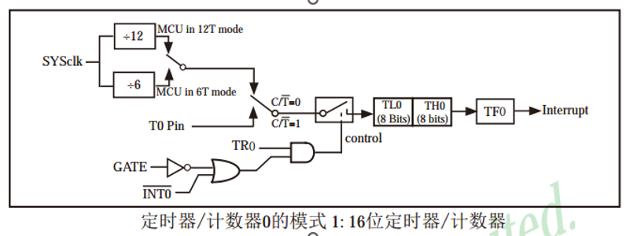
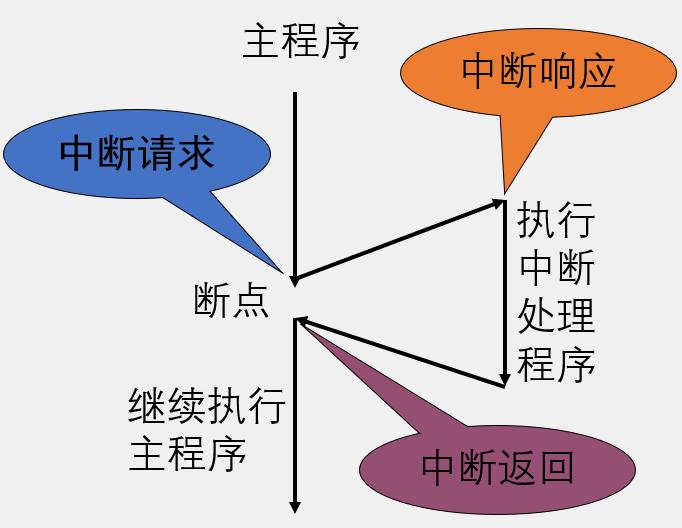
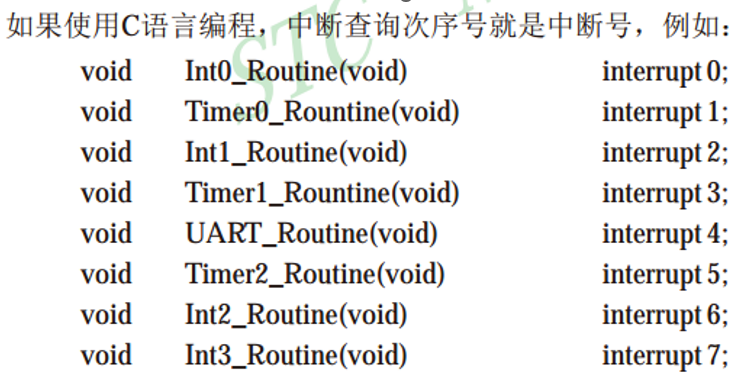

### 定时器通俗讲义

#### 定时器概览

定义：51 单片机的定时器属于单片机的内部资源，其电路的连接和运转均在单片机内部完成

当前单片机定时器：`T0/T1/T2`

- T0/T1 均搭载于传统 51 单片机上，且操作方式均相同
- T2 是该单片机增加的资源

<br>

#### 工作模式

STC89C52 的定时器 `T0/T1` 均有四种工作模式

- 模式 0：13 位定时器/计数器
- 模式 1：16 位定时器/计数器（常用）
- 模式 2：8 位自动重装模式
- 模式 3：两个 8 位计数器



<br>

根据上图，现对对应模块做简单介绍

`SYSclk` 系统时钟，可视为晶振周期，一般开发板上的晶振都有标注时钟周期，本板子为 11.0598MHZ
`T0 Pin` 此口可外接晶振，用于取代系统时钟；如不接晶振，则可作为计数器使用

`C/T0 C/T1` 相当于一个开关，用于选择是否使用内部晶振 `SYSclk` 还是外部晶振 `T0 Pin`

<br>

#### 中断系统

`中断`：CPU 处理任务过程中中断，转而处理另一任务，待另一任务处理完后回来继续执行原任务的过程

请示 CPU 中断的请求源称为`中断源  
`
中断源有`优先级`，CPU 总是响应优先级最高的那个

`中断嵌套`：若处理一低级中断源请求时又有一高级中断源请求，CPU 会转而处理更高级的那个，待处理完毕后又返回处理低级中断，以此类推



<br>

中断源默认有八个（外部中断 0，定时器中断 0，外部中断 1，定时器中断 1，串口中断，外部中断 2，外部中断 3）  
中断优先级有四个

在任意方法后面加上 `interrupt x`（x 为中断源序号） 即可表示此方法为中断入口



<br>

### 串口


<br>

### 实战

#### 快速生成定时器

可以使用 STC-ISC 烧写器中自带的软件定时器功能，根据单片机的参数来生成对应的定时器

譬如，这是一个频率为 11.0592、16 位不自动重载、时钟 12T 的生成代码：

```c
void Timer0_Init(void)		//1毫秒@11.0592MHz
{
	AUXR &= 0x7F;			//定时器时钟12T模式
	TMOD &= 0xF0;			//设置定时器模式
	TMOD |= 0x01;			//设置定时器模式
	TL0 = 0x66;				//设置定时初始值
	TH0 = 0xFC;				//设置定时初始值
	TF0 = 0;				//清除TF0标志
	TR0 = 1;				//定时器0开始计时
}
```

<br>

#### 单 LED 闪烁

使用前均需初始化定时器，后在中断函数内书写对应逻辑，实现 LED 间隔点亮熄灭

```c
#include <REGX52.H>

void Timer0_Init(void)		//1毫秒@11.0592MHz
{
    // 定时器基础配置
	TMOD &= 0xF0;			//设置定时器模式
	TMOD |= 0x01;			//设置定时器模式
	TL0 = 0x66;				//设置定时初始值
	TH0 = 0xFC;				//设置定时初始值
	TF0 = 0;				//清除TF0标志
	TR0 = 1;				//定时器0开始计时

    // 设置中断函数，调用中断标识1
	EA=1;
	ET0=1;
	PT0=0;

}

// 中断1对应函数设置
unsigned int T0Count;
void Timer0_Routine() interrupt 1
{
	TL0 = 0x66;				//设置定时初始值
	TH0 = 0xFC;				//设置定时初始值
	T0Count++;
	if(T0Count>=1000){
		T0Count=0;
		P2_0=~P2_0;
	}
}


void main(){
    // 主函数内初始化定时器
	Timer0_Init();
    // while进程保活
	while(1){

	}
}
```

<br>

####
