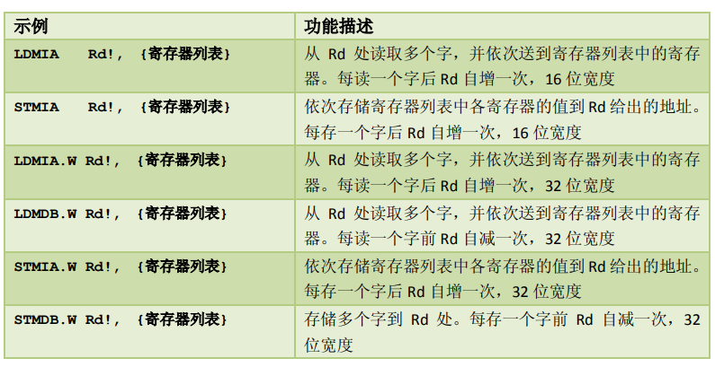
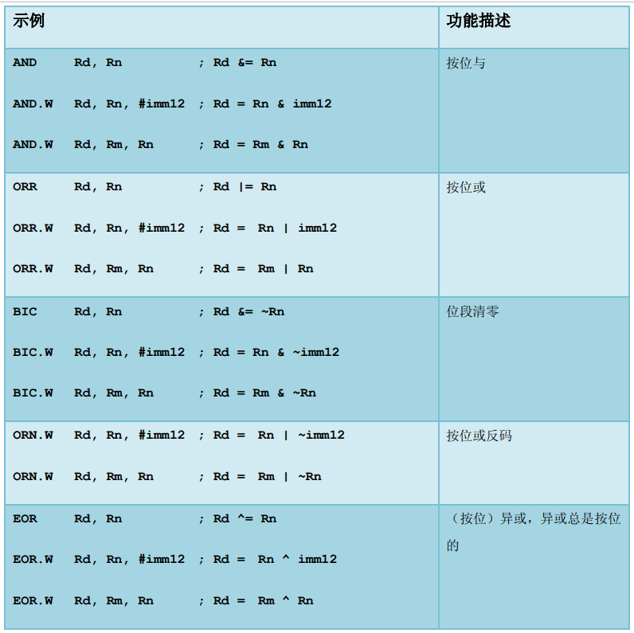

## 介绍

<br>

### 三种主流 Cortex 款式

款式 A：设计用于高性能的“开放应用平台”  
款式 R：用于高端的嵌入式系统，尤其是那些带有实时要求的  
款式 M：用于深度嵌入的，单片机风格的系统中

<br>

### 指令集发展

ARM 处理器一直支持两种形式上相对独立的指令集，它
们分别是

- 32 位的 ARM 指令集。对应处理器状态：ARM 状态
- 16 位的 Thumb 指令集。对应处理器状态：Thumb 状态

Thumb 指令集在功能上是 ARM 指令集的一个子集，但它能带来
更高的代码密度

<br>

## Cortex-M3 概览

<br>

### 寄存器组

Cortex-M3 处理器拥有 `R0-R15` 的寄存器组。其中 R13 作为`堆栈指针 SP`

SP 有两个，但在同
一时刻只能有一个可以看到，这也就是所谓的“banked”寄存器


<br>

#### 寄存器分析

`R0-R12`：通用寄存器

`Banked R13`: 两个堆栈指针，含有主堆栈指针（MSP）以及进程堆栈指针（PSP）；  
前者操作系统内核，后者处理用户应用代码

`R14`：连接寄存器，当呼叫一个子程序时，由 R14 存储返回地址

<br>

#### 特殊功能寄存器


<br>

### 操作模式与特权


两种操作模式

1. 处理者模式（handler mode）
2. 线程模式（thread mode）

两种特权操作

1. 特权级
2. 用户级

<br>

用户切换到特权级需要经过此步骤：执行系统调用指令 SVC，触发 SVC 异常，通过异常服务例程接管后修改 CONTROL 寄存器，才可以进入特权级

<br>

### 内建嵌套向量中断控制器

嵌套向量中断控制器 NVIC(Nested Vectored Interrupt Controller)

其提供的功能：

1. 涵盖了所有外部中断和绝大多数异常，可赋予异常优先级，若硬件发现高优先级进来就会立刻抢占当前异常位
2. 开始响应一个中断后，CM3 会自动定位一张向量表，并且根据中断号从表中找出 ISR 的入口地址，然后跳转过去执行
3. 软件可以在运行时期更改中断的优先级
4. 既可以屏蔽优先级低于某个阈值的中断/异常，也可以全体封杀

<br>

### 存储器映射


`system level` 系统寄存区，这里的设备均使用固定地址

<br>

### 总线接口

Cortex-M3 拥有以下三大总线接口：

1. 指令存储区总线：I-Code 总线（用于取指）和 D-Code 总线（用于查表）
2. 系统总线：用于访问内存和外设
3. 私有外设总线：负责一部分私有外设的访问，主要就是访问调试组件

<br>

### 存储器保护单元（MPU）

该部件为可选的，开启它以对特权访问以及用户访问进行不同限制

MPU 最常见的就是保护特权级代码不被其他低级用户随意篡改，通过吧内存区设置为只读来进行保护

<br>

### 指令集

`Cortex-M3` 只使用 `Thumb-2` 指令集，它允许同时处理 32 位指令和 16 位指令

再过去的 cortex 架构，在 32 位和 16 位状态下，分别处于 ARM 状态和 Thumb 状态，需要执行状态切换，存在开销

<br>

### 中断及异常

`ARMv7-M` 开创了一个全新的异常模型，他支持 11 种系统异常，240 个外部终端输入，并取消了 `FIQ` 概念

CM3 的所有中断机制都由 `NVIC` 实现

<br>

## Cortex-M3 基础

<br>

### 寄存器组

`通用目的寄存器 R0-R7`  
R0-R7 也被称为低组寄存器。所有指令都能访问它们。它们的字长全是 32 位，复位后的初始值是不可预料的

`通用目的寄存器 R8-R12`  
R8-R12 也被称为高组寄存器。这是因为只有很少的 16 位 Thumb 指令能访问它们，32 位的  
thumb-2 指令则不受限制

<br>

#### 堆栈指针 R13

主堆栈指针（MSP）：由 OS 内核、异常服务例程等特权访问程序使用

进程堆栈指针（PSP）：常规应用程序代码

`cortex-m3` 给予了两根指令 PUSH 和 POP 处理堆栈指针的操作

<br>

#### 链接寄存器 R14（LR）

LR 寄存器用于存储函数调用的返回地址。

当一个函数被调用时，当前函数的返回地址会被保存到 LR 寄存器中，以便在函数执行完毕后返回到正确的位置。

<br>

#### 程序计数器 R15（PC）

`R15 寄存器` 在 ARM 架构中用于存储下一条将要执行的指令的地址。它指示了程序执行的当前位置，并在指令执行期间自动递增，以便跳转到下一条指令的地址。

<br>

### 特殊功能寄存器组

#### 程序状态寄存器 PSR

PSR 包括三个子状态寄存器

- 应用程序 PSR（APSR）
- 中断号 PSR（IPSR）
- 执行 PSR（EPSR）

使用 MSR 和 MRS 指令

<br>

屏蔽寄存器组


<br>

#### 控制寄存器 CONTROL


控制寄存器有两种作用：定义特权级别、选择当前使用的堆栈指针

Cortex-M3 的 handler 模式中，`CONTROL[1]`总是 0。在线程模式中则可以为 0 或 1

这两个 CONTROL 都必须位于特权级下才可以进行写操作

<br>

### 操作模式

线程模式+用户级下，无法访问系统控制空间（SCS）

越权访问一律产生 fault，单少部分情况下会被忽略掉而不产生 fault

<br>

特权级下置位 `CONTROL[0]` 进入用户级，再通过异常返回先前的用户级  
如下图所示，特权级和用户级之间的转换


<br>

### 栈内存操作

我们所谓的堆栈操作实际上就是对内存的读写，访问地址通过 SP 给予

一般的，PUSH 和 POP 必须要成对使用，对应寄存器先后顺序必须一致  
使用这两条指令时对应 SP 指针也会自增和自减

PUSH 指令等效于与使用 R13 作为地址指针的 `STMDB` 指令，而 POP 指令则等效于使用
R13 作为地址指针的 `LDMIA` 指令

<br>

### Cortex-M3 堆栈实现

Cortex-M3 使用的是“向下生长的满栈”模型，即栈空间从高地址向低地址生长的一种栈结构。

Cortex-M3 具有两个堆栈，分别是：主堆栈和进程堆栈  
双堆栈的作用是可以在主堆栈处理异常的错误而不会影响到进程堆栈中的应用程序执行

<br>

### 复位序列

在 CM3 中，在 0 地址处提供 MSP 的初始值，然后紧跟着就是向量表（向量表在以后还可以被移至其它位置——译注）。  
向量表中的数值是 32 位的地址，而不是跳转指令。向量表的第一个条目指向复位后应执行的第一条指令。

<br>

## 指令集

<br>

### 汇编语言基础

一条简单的汇编指令格式（注释使用一个分号）：  
`操作码 操作数 1, 操作数 2, … ;注释`

下面表示寄存器移位存储方法，对于立即数必须要以#开头

```s
MOV R0, #0x12 ; R0 -> 0x12
MOV R1, #’A’ ; R1 -> 字母 A 的 ASCII 码
```

EQU 指示字来定义常数  
DCI 编译器指示字，用来表示某些汇编器无法识别的特殊指令助记符  
DCB 来定义一串字节常数  
DCD 来定义一串 32 位整数

```s
DCI 0xBE00 ; 用于指代断点BKPT

DCD 0x123 ; 定义整数

DCB "heloworld",0 ; 定义字符串
```

<br>

#### UAL

统一汇编语言（UAL），是一个语法规则，用于支持 Thumb-2

你依然可以使用传统的 thumb 语法，这里不做介绍

```s
ADD R0, R0, R1  ;等效R0=RO+R1

ANDS R0, R0, R1

ADDS.N R0, #1 ;指定使用 16 位指令（N＝Narrow）
ADDS.W R0, #1 ;指定使用 32 位指令（W=Wide）
```

<br>

### 近距离检视指令

#### 数据传输

CM3 中的数据传送类型有如下几个

- 在两个寄存器间传送数据
- 在寄存器与存储器间传送数据
- 在寄存器与特殊功能寄存器间传送数据
- 把一个立即数加载到寄存器

<br>

常用存储器访问指令  
(LDR 加载指令，STR 存储指令)

`LDRB Rd, [Rn, #offset]` 从地址 Rn+offset 处读取一个字节送到 Rd

`LDRD Rd1, Rd2, [Rn, #offset]` 从地址 Rn+offset 处读取一个双字(64 位整数)送到 Rd1（低 32 位）和 Rd2（高 32 位）中

`STR Rd, [Rn, #offset]` 把 Rd 中的低字存储到地址 Rn+offset 处

<br>

常用的多重存储器访问方式  


感叹号的作用是：

````asm
STMIA.W R8!, {r0-R3} ; R8 值变为 0x8010，每存一次增一次，先存储后自增
)。增/减单位：字（4 字节）。例如，记R8=0x8000，则下面两
条指令：
STMDB.W R8, {R0-R3} ; R8 值的“一个内部复本”先自减后再存储数据，但 R8 的值不变```
````

<br>

带预索引的 LDR 和 STR

`LDR.W R0, [R1, #20]!` 该指令先把地址 R1+offset 处的值加载到 R0，然后，R1 <- R1+ 20

<br>

后索引：在后索引中，基址寄存器是无条件被更新，省略感叹号

`STR.W R0 [R1], #-12` 该指令是把 R0 的值存储到地址 R1 处的。在存储完毕后， R1 <- R1+(-12)

> 注：利用 LDR 和 STR 时，可以使用寄存器作为偏移值，而不用背立即数  
> 但如果拿寄存器作偏移值就绝对不可以使用预索引和后索引了

<br>

LDR 伪指令和 ADR 伪指令

`LDR r0, =address1`：将地址 address1 的立即数加载到寄存器 r0 中。

`ADR r0, address1`：将标签 address1 的地址加载到寄存器 r0 中

<br>

#### 数据处理

ADD 指令有如下几个用法

- `ADD R0, R1` ; R0 += R1
- `ADD R0, #0x12` ; R0 += 12
- `ADD.W R0, R1, R2` ; R0 = R1+R2

<br>

除了 ADD 指令之外，CM3 中还包含 `SUB, MUL, UDIV/SDIV` 等用于算术四则运算

`SUB Rd, Rm` 常规减法，Rd -= Rn  
`SBC Rd, Rm` 带错位的减法，Rd -= Rm+C  
`RSB.W Rd, Rn, #imm12` 反向减法，Rd = imm12-Rn  
`MUL Rd, Rm` 常规乘法，`Rd *= Rm`

<br>

常规逻辑操作  


<br>

移位以及循环指令

`LSL Rd, Rn, #imm5 ; Rd = Rn<<imm5` 逻辑左移  
`LSR Rd, Rn, #imm5 ; Rd = Rn>>imm5` 逻辑右移  
`ASR Rd, Rn, #imm5 ; Rd = Rn>>imm5` 算数右移

> 其余指令出现频率很低，面试不会细分考察，我们仅需掌握重点简单的内容就好了，别为难自己

<br>

#### 子程呼叫与无条件跳转指令

最基础的两个无条件跳转指令：

- `B Label` 跳转到 Label 处对应的地址
- `BX reg` 跳转到由寄存器 reg 给出的地址
- `BL Label` 跳转到 Label 对应的地址，并且把跳转前的下条指令地址保存到 LR
- `BLX reg` 跳转到由寄存器 reg 给出的地址，并根据 REG 的 LSB 切换处理器状态，还要把转移前的下条指令地址保存到 LR

> 在执行 BLX 时，必须置位 LSB=1，否则触发 fault

<br>

#### 标志位与条件转移
