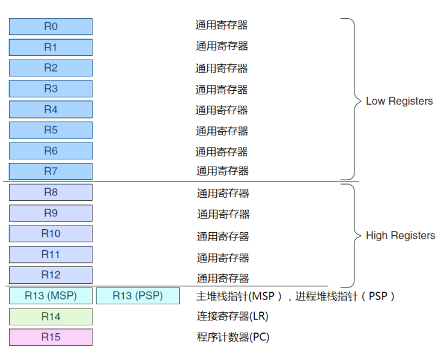
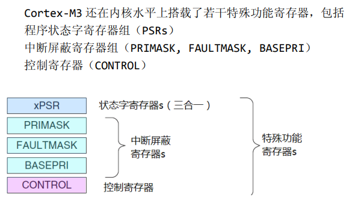
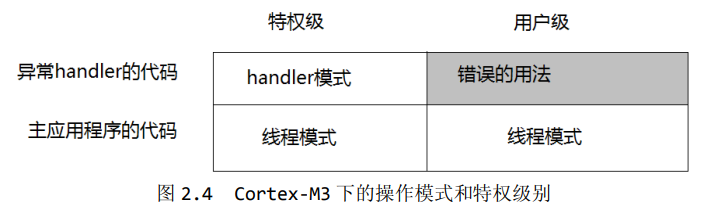
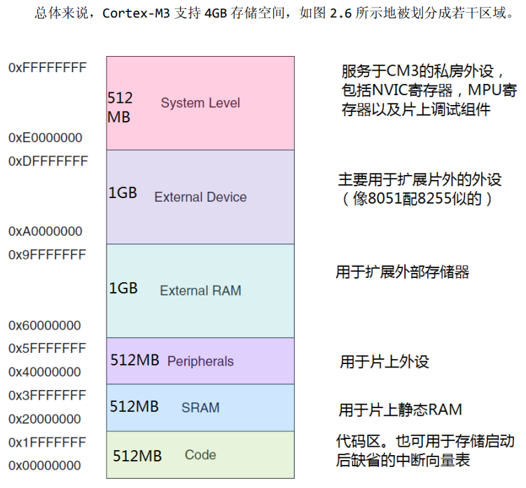
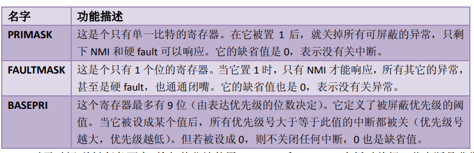
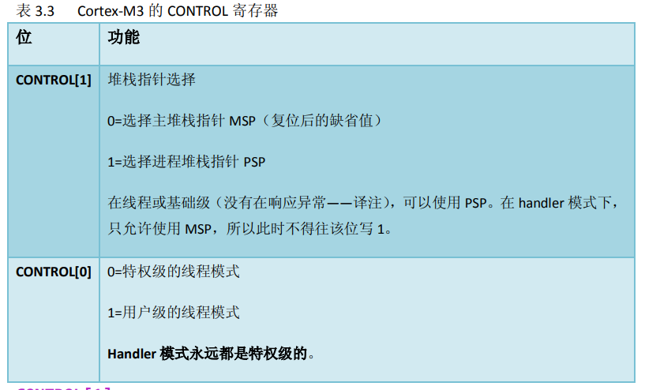
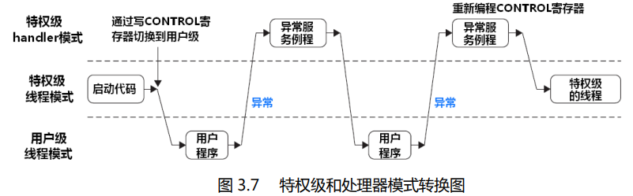

## 介绍

 

### 三种主流 Cortex 款式

款式 A：设计用于高性能的“开放应用平台”  
款式 R：用于高端的嵌入式系统，尤其是那些带有实时要求的  
款式 M：用于深度嵌入的，单片机风格的系统中

 

### 指令集发展

ARM 处理器一直支持两种形式上相对独立的指令集，它
们分别是

- 32 位的 ARM 指令集。对应处理器状态：ARM 状态
- 16 位的 Thumb 指令集。对应处理器状态：Thumb 状态

Thumb 指令集在功能上是 ARM 指令集的一个子集，但它能带来
更高的代码密度

 

## Cortex-M3 概览

 

### 寄存器组

Cortex-M3 处理器拥有 `R0-R15` 的寄存器组。其中 R13 作为`堆栈指针 SP`

SP 有两个，但在同
一时刻只能有一个可以看到，这也就是所谓的“banked”寄存器

 

#### 寄存器分析

`R0-R12`：通用寄存器

`Banked R13`: 两个堆栈指针，含有主堆栈指针（MSP）以及进程堆栈指针（PSP）；  
前者操作系统内核，后者处理用户应用代码

`R14`：连接寄存器，当呼叫一个子程序时，由 R14 存储返回地址

 

#### 特殊功能寄存器

 

### 操作模式与特权

两种操作模式

1. 处理者模式（handler mode）
2. 线程模式（thread mode）

两种特权操作

1. 特权级
2. 用户级

 

用户切换到特权级需要经过此步骤：执行系统调用指令 SVC，触发 SVC 异常，通过异常服务例程接管后修改 CONTROL 寄存器，才可以进入特权级

 

### 内建嵌套向量中断控制器

嵌套向量中断控制器 NVIC(Nested Vectored Interrupt Controller)

其提供的功能：

1. 涵盖了所有外部中断和绝大多数异常，可赋予异常优先级，若硬件发现高优先级进来就会立刻抢占当前异常位
2. 开始响应一个中断后，CM3 会自动定位一张向量表，并且根据中断号从表中找出 ISR 的入口地址，然后跳转过去执行
3. 软件可以在运行时期更改中断的优先级
4. 既可以屏蔽优先级低于某个阈值的中断/异常，也可以全体封杀

 

### 存储器映射

`system level` 系统寄存区，这里的设备均使用固定地址

 

### 总线接口

Cortex-M3 拥有以下三大总线接口：

1. 指令存储区总线：I-Code 总线（用于取指）和 D-Code 总线（用于查表）
2. 系统总线：用于访问内存和外设
3. 私有外设总线：负责一部分私有外设的访问，主要就是访问调试组件

 

### 存储器保护单元（MPU）

该部件为可选的，开启它以对特权访问以及用户访问进行不同限制

MPU 最常见的就是保护特权级代码不被其他低级用户随意篡改，通过吧内存区设置为只读来进行保护

 

### 指令集

`Cortex-M3` 只使用 `Thumb-2` 指令集，它允许同时处理 32 位指令和 16 位指令

再过去的 cortex 架构，在 32 位和 16 位状态下，分别处于 ARM 状态和 Thumb 状态，需要执行状态切换，存在开销

 

### 中断及异常

`ARMv7-M` 开创了一个全新的异常模型，他支持 11 种系统异常，240 个外部终端输入，并取消了 `FIQ` 概念

CM3 的所有中断机制都由 `NVIC` 实现

 

## Cortex-M3 基础

 

### 寄存器组

`通用目的寄存器 R0-R7`  
R0-R7 也被称为低组寄存器。所有指令都能访问它们。它们的字长全是 32 位，复位后的初始值是不可预料的

`通用目的寄存器 R8-R12`  
R8-R12 也被称为高组寄存器。这是因为只有很少的 16 位 Thumb 指令能访问它们，32 位的  
thumb-2 指令则不受限制

 

#### 堆栈指针 R13

主堆栈指针（MSP）：由 OS 内核、异常服务例程等特权访问程序使用

进程堆栈指针（PSP）：常规应用程序代码

`cortex-m3` 给予了两根指令 PUSH 和 POP 处理堆栈指针的操作

 

#### 链接寄存器 R14（LR）

LR 寄存器用于存储函数调用的返回地址。

当一个函数被调用时，当前函数的返回地址会被保存到 LR 寄存器中，以便在函数执行完毕后返回到正确的位置。

 

#### 程序计数器 R15（PC）

`R15 寄存器` 在 ARM 架构中用于存储下一条将要执行的指令的地址。它指示了程序执行的当前位置，并在指令执行期间自动递增，以便跳转到下一条指令的地址。

 

### 特殊功能寄存器组

#### 程序状态寄存器 PSR

PSR 包括三个子状态寄存器

- 应用程序 PSR（APSR）
- 中断号 PSR（IPSR）
- 执行 PSR（EPSR）

使用 MSR 和 MRS 指令

 

屏蔽寄存器组

 

#### 控制寄存器 CONTROL

控制寄存器有两种作用：定义特权级别、选择当前使用的堆栈指针

Cortex-M3 的 handler 模式中，`CONTROL[1]`总是 0。在线程模式中则可以为 0 或 1

这两个 CONTROL 都必须位于特权级下才可以进行写操作

 

### 操作模式

线程模式+用户级下，无法访问系统控制空间（SCS）

越权访问一律产生 fault，单少部分情况下会被忽略掉而不产生 fault

 

特权级下置位 `CONTROL[0]` 进入用户级，再通过异常返回先前的用户级  
如下图所示，特权级和用户级之间的转换

