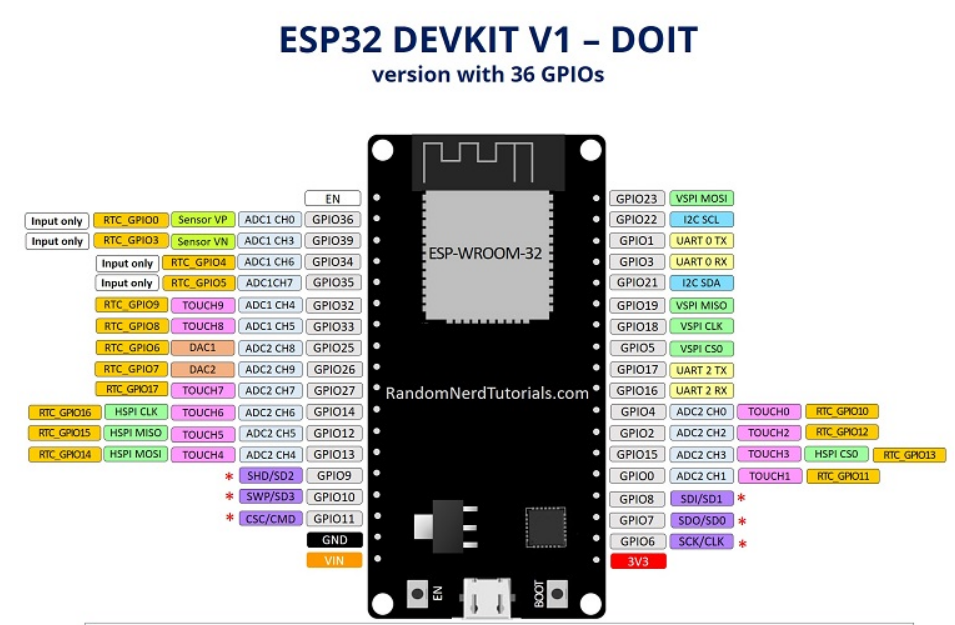

### 实用 GPIO



<br>

### PWM

```c
// 定义LED引脚的编号
const int ledPin = 2; // 15 对应GPIO16

// 设置PWM属性
const int freq = 5000; // PWM频率
const int ledChannel = 0; // PWM通道
const int resolution = 8; // 分辨率

void setup(){
    // 配置LED的PWM功能
    ledcSetup(ledChannel, freq, resolution);

    // 将PWM通道附加到要控制的GPIO引脚
    ledcAttachPin(ledPin, ledChannel);
}


// 增加LED亮度
void loop(){
    for(int dutyCycle = 0; dutyCycle <= 255; dutyCycle++){
        // 使用PWM改变LED亮度
        ledcWrite(ledChannel, dutyCycle);
        delay(15);
    }
    // 减小LED亮度
    for(int dutyCycle = 255; dutyCycle >= 0; dutyCycle--){
        // 使用PWM改变LED亮度
        ledcWrite(ledChannel, dutyCycle);
        delay(15);
    }
}
```

<br>

### 定时器
