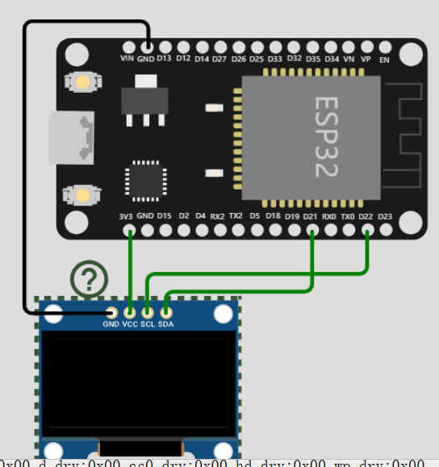

### 实用 GPIO

> 用到再查，熟能生巧，别上来就背图，一天你就忘了！


#### 仅输入引脚

下面的四个引脚由于内部没有上拉下拉电阻，所以仅仅支持输入信号  
GPIO 34  
GPIO 35  
GPIO 36  
GPIO 39

<br>

#### SPI Flash 闪存引脚

这些引脚都是对 ESP32 内部 flash 进行操作的，最好不要使用这些引脚进行输入输出操作！

GPIO 6 (SCK/CLK)  
GPIO 7 (SDO/SD0)  
GPIO 8 (SDI/SD1)  
GPIO 9 (SHD/SD2)  
GPIO 10 (SWP/SD3)  
GPIO 11 (CSC/CMD)

<br>

#### 电容触摸引脚

这个引脚比较有意思，他们自带了电容触摸传感器，当我们直接用手触摸引脚时会发生电荷改变，从而传感器接收到并输出大小不一的信号脉冲

Arduino IDE 中的触摸引脚分配存在问题。GPIO 33 在分配中与 GPIO 32 交换。这意味着，如果要引用 GPIO 32，则应在代码中使用 T8；对于 GPIO 33，则使用 T9

T0 (GPIO 4)
T1 (GPIO 0)
T2 (GPIO 2)
T3 (GPIO 15)
T4 (GPIO 13)
T5 (GPIO 12)
T6 (GPIO 14)
T7 (GPIO 27)
T8 (GPIO 33)
T9 (GPIO 32)

<br>

下面是一个小实验，我们要实现触摸 GPIO4（对应 T0）口实现板上 LED 亮灭；  
仅需使用一个公对母线，连接到 GPIO4 口上，然后用手指触摸引出的公端口即可进行测试；

使用 `touchRead` 方法，检测对应 GPIO 口上的传感器对应返回数值；

经过测试，得出结果：当手指触摸时数值 10-20，手指移开后数值 70-80；所以可以得到以下检测代码

```c
const int LED = 2;

void setup()
{
  pinMode(LED,OUTPUT);

  Serial.begin(115200);
  delay(1000); // give me time to bring up serial monitor
  Serial.println("ESP32 Touch Test");
}

void loop()
{
  // touchRead(T0)直接读取对应带触摸传感器GPIO的代号
  Serial.println(touchRead(T0));
  // touchRead(4)或者直接指定GPIO口
  touchRead(4)<=20 ? digitalWrite(LED,HIGH) : digitalWrite(LED,LOW);
}
```

<br>

#### ADC 模数转换器引脚

基本上半数以上引脚都支持模数转换，具体引脚请看图片，这里空间有限不一一指出

在使用 WIFI 时建议仅使用 ADC1 类型的引脚，因为 ADC2 类型的引脚大概率会出错；

ADC 引脚用于将电压值转换为数值，但是实际情况不是线性的，ESP32 存在以下特殊情况：

- 0.0v-0.1v 时，转换数值均为 0
- 3.2v-3.3v 时，转换数值均为 4095

<br>

#### DAC 数模转换器引脚

这个就比较少了，只有俩  
DAC1 (GPIO25)
DAC2 (GPIO26)

<br>

#### RTC

用于睡眠唤醒以及时钟操作

<br>

#### IIC

> 在某些板子上，SDA 线也可能标记为 SDI，而 SCL 线标记为 SCK。

ESP32 自带两个 I2C 接口

GPIO 21 (SDA)  
GPIO 22 (SCL)

<br>

#### PWM 脉冲宽度调制

所有具有 OUTPUT 特性的引脚均可使用 PWM

<br>

### PWM

```c
// 定义LED引脚的编号
const int ledPin = 2; // 15 对应GPIO16

// 设置PWM属性
const int freq = 5000; // PWM频率
const int ledChannel = 0; // PWM通道
const int resolution = 8; // 分辨率

void setup(){
    // 配置LED的PWM功能
    ledcSetup(ledChannel, freq, resolution);

    // 将PWM通道附加到要控制的GPIO引脚
    ledcAttachPin(ledPin, ledChannel);
}


// 增加LED亮度
void loop(){
    for(int dutyCycle = 0; dutyCycle <= 255; dutyCycle++){
        // 使用PWM改变LED亮度
        ledcWrite(ledChannel, dutyCycle);
        delay(15);
    }
    // 减小LED亮度
    for(int dutyCycle = 255; dutyCycle >= 0; dutyCycle--){
        // 使用PWM改变LED亮度
        ledcWrite(ledChannel, dutyCycle);
        delay(15);
    }
}
```

<br>

### IIC

> 在此之前需要下载六个重要的外部库到 arduino 里面才可以

Adafruit GFX Library  
Adafruit SSD1306  
Adafruit Sensor Calibration  
Adafruit Sensor Lab  
Adafruit Unified Sensor

<br>

#### 检测处于 IIC 线路上的设备

回顾一下两个 I2C 输出引脚：`GPIO 21 (SDA)  ；GPIO 22 (SCL)`

如果要是有 IIC，就必须导入头文件 `Wire.h`

```c
#include <Wire.h>
void setup() {
  Wire.begin(); // 初始化I2C总线
  Serial.begin(115200); // 初始化串口通信，波特率为115200
  Serial.println("\nI2C扫描程序"); // 输出提示信息
}

void loop() {
  byte error, address; // 定义错误码和设备地址变量
  int nDevices; // 定义设备数量变量
  Serial.println("扫描中..."); // 输出扫描提示信息
  nDevices = 0; // 设备数量初始化为0

  for(address = 1; address < 127; address++ ) { // 循环扫描从1到127的设备地址
    Wire.beginTransmission(address); // 开始传输数据到设备地址
    error = Wire.endTransmission(); // 结束传输并获取错误码
    if (error == 0) { // 如果错误码为0，表示找到了设备
      Serial.print("在地址0x"); // 输出设备地址提示信息
      if (address<16) { // 如果设备地址小于16，前面补0
        Serial.print("0");
      }
      Serial.println(address,HEX); // 输出设备地址
      nDevices++; // 设备数量加1
    }
    else if (error==4) { // 如果错误码为4，表示设备没有响应
      Serial.print("在地址0x"); // 输出设备地址提示信息
      if (address<16) { // 如果设备地址小于16，前面补0
        Serial.print("0");
      }
      Serial.println(address,HEX); // 输出设备地址
      Serial.println("发生未知错误"); // 输出错误信息
    }
  }
  if (nDevices == 0) { // 如果设备数量为0，表示没有找到设备
    Serial.println("没有找到I2C设备\n"); // 输出提示信息
  }
  else { // 否则表示找到了设备
    Serial.println("扫描完成\n"); // 输出提示信息
  }
  delay(5000); // 延时5秒
}
```

<br>

#### 最简 SSD1306 屏显



```c
#include <Wire.h> // 引用 Wire 库，用于 I2C 通讯
#include <Adafruit_GFX.h> // 引用 Adafruit_GFX 库，用于 OLED 显示屏图形操作
#include <Adafruit_SSD1306.h> // 引用 Adafruit_SSD1306 库，用于 OLED 显示屏驱动
#include <Adafruit_Sensor.h> // 引用 Adafruit_Sensor 库，用于传感器操作

#define SCREEN_WIDTH 128 // OLED 显示屏宽度，以像素为单位
#define SCREEN_HEIGHT 64 // OLED 显示屏高度，以像素为单位

Adafruit_SSD1306 display(SCREEN_WIDTH, SCREEN_HEIGHT, &Wire, -1); // 创建 OLED 显示屏对象

void setup() {
  Serial.begin(115200); // 初始化串口通讯，波特率为 115200

  if(!display.begin(SSD1306_SWITCHCAPVCC, 0x3C)) { // 初始化 OLED 显示屏
    Serial.println(F("SSD1306 allocation failed")); // 如果初始化失败，打印错误信息
    for(;;); // 程序进入死循环
  }

  delay(2000); // 延时 2 秒
  display.clearDisplay(); // 清空 OLED 显示屏
  display.setTextColor(WHITE); // 设置 OLED 显示屏文本颜色为白色
}

void loop() {
  display.clearDisplay(); // 清空 OLED 显示屏

  display.setTextSize(2); // 设置文本字体大小为 2
  display.setCursor(0,0); // 设置文本显示位置为 (0, 0)
  display.print("Hello!"); // 显示 "Hello!" 文本

  display.display(); // 将图像显示在 OLED 显示屏上

  delay(1000); // 延时 1 秒
}
```
