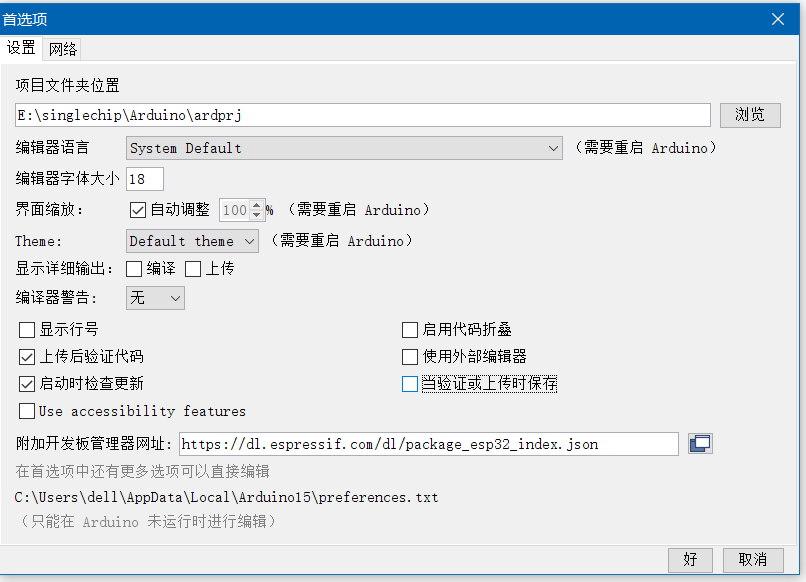
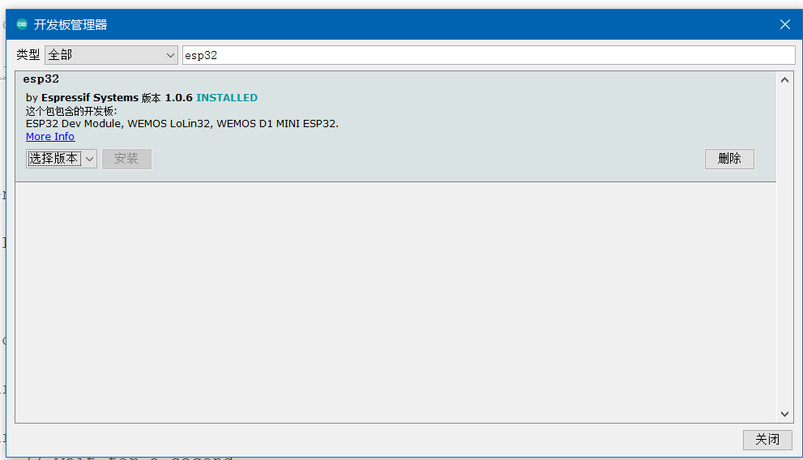
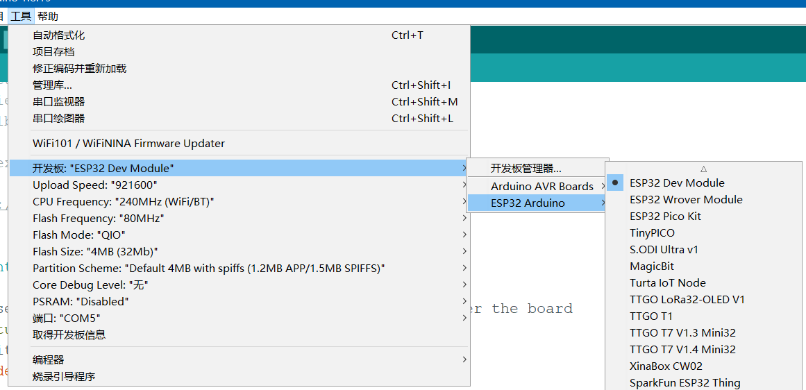
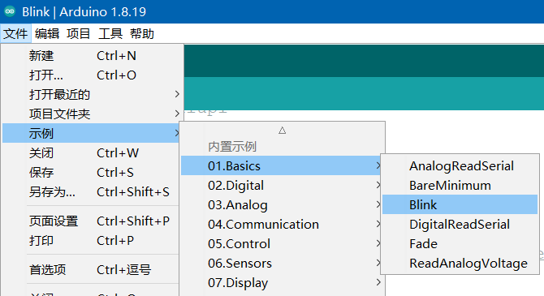
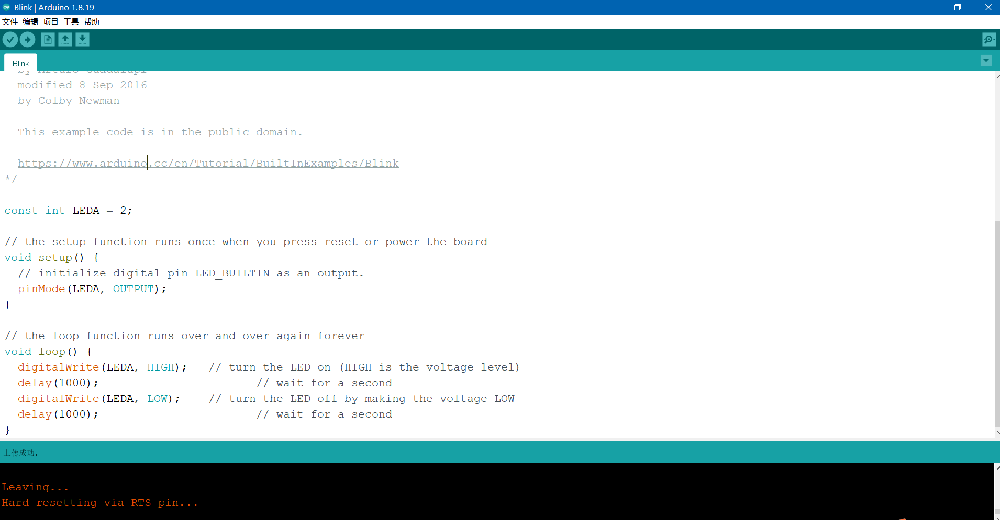

### 环境配置

<br>

#### 安装 IDE

> 参考文献：[CSDN](https://blog.csdn.net/Mark_md/article/details/121326060?ops_request_misc=%257B%2522request%255Fid%2522%253A%2522168636105316800227469208%2522%252C%2522scm%2522%253A%252220140713.130102334..%2522%257D&request_id=168636105316800227469208&biz_id=0&utm_medium=distribute.pc_search_result.none-task-blog-2~all~top_positive~default-1-121326060-null-null.142^v88^control_2,239^v2^insert_chatgpt&utm_term=arduino%20esp32&spm=1018.2226.3001.4449)

首先下载 Arduino IDE  
请注意，一定要选择 1.8+ 版本的，千万别用 2.0+版本！！！

建议直接下载 windows 的 ZIP 压缩包，解压即用，十分方便

官方下载地址：https://www.arduino.cc/en/software

<br>

#### 下载固件

打开 IDE，点击 `文件->首选项`

按照下图操作：

- 修改项目文件夹位置：你可不愿意所有文件都去占用 C 盘空间吧？
- 附加开发板地址：`https://dl.espressif.com/dl/package_esp32_index.json`



之后点击确定，关闭窗口

点击 工具->开发板->开发板管理器  
搜索 esp32，选择 1.0.6（编写本文章时的最新版固件），然后安装！



> 安装注意事项：你可以开代理（dev-sidercar）或者用魔法（clash）；但是极度推荐使用手机热点链接电脑然后下载，这样子速度很快，比你直接连接路由器快得多！  
> 科学上网不是必须的，只是速度会慢一些

<br>

固件安装完毕，我们现在就要切换开发板了

按照下图选择 `工具->开发板->ESP32 Arduino->ESP32 Dev Module`



此时我们就会看见图中所示，展示了板子的波特率、CPU 主频以及 flash 大小  
这些参数都可以人为修改，但建议保持默认值即可！

<br>

### 项目测试

<br>

> 固件已经安装完毕，我们接下来就要拿一个简单的闪烁灯泡小程序进行测试

先把板子（ESP32）连接到电脑上  
然后在 IDE 里面，选择 `工具->端口` 找到板子对应的端口并选择它！

之后按照下图选择对应的 arduino 默认示例项目  
`文件->示例->01.basic->blink`



此时会打开一个新窗口来展示我们的 blink 代码，所以我们把旧窗口关掉；

此时的 blink 文件处于只读状态，必须将其保存后才可以烧写；  
保存位置任意，路径别有中文就行了

接下来看看代码，由于代码默认是支持 arduino 开发板的，所以对应的 GPIO 口必然和 ESP32 不一致，我们仅需重新设置为 LED 灯对应的 IO 口即可！

```c
// 重新设定GPIO口，设为ESP32板子上的LED灯
const int LED = 2;

// the setup function runs once when you press reset or power the board
void setup() {
  // initialize digital pin LED_BUILTIN as an output.
  pinMode(LED, OUTPUT);
}

// the loop function runs over and over again forever
void loop() {
  digitalWrite(LED, HIGH);   // turn the LED on (HIGH is the voltage level)
  delay(200);                       // wait for a second
  digitalWrite(LED, LOW);    // turn the LED off by making the voltage LOW
  delay(200);                       // wait for a second
}
```

代码很简单，就是让 LED 灯每隔 200ms 就开闭一次

现在进入烧写过程

点击 IDE 左上角的一个向右的小箭头，此时就会开始上传代码到板子上去

上传成功图如下所示，输出窗口输出`Hard resetting via RTS pin...`就表示上传成功了



<br>

### 疑难解答

<br>

#### micropython 固件冲突问题

如果我们之前使用 thonny 进行 micropython 开发，那就表示板子已经被刷入 micropython 固件，此时就无法执行 c++代码了

micropython 刷固件必须要使用乐鑫官方给出的软件，而 arduino 则提供自动刷入，很方便

我们上述示例代码测试时，点击上传按钮后，板子就会自动将固件转换为 arduino 架构，不需要人为再次重新刷固件

这也就意味着如果要重新回到 micropython 下编写，就又得重新刷对应固件了。。。

<br>
