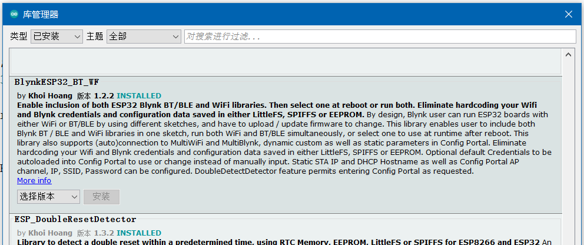
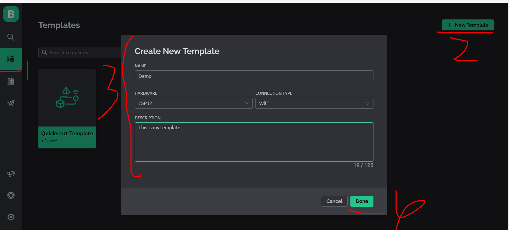
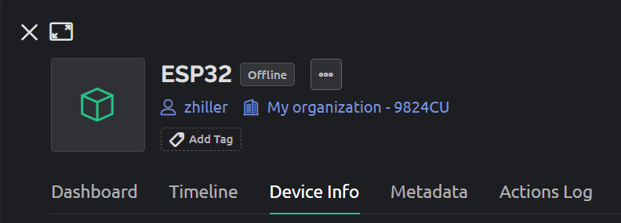
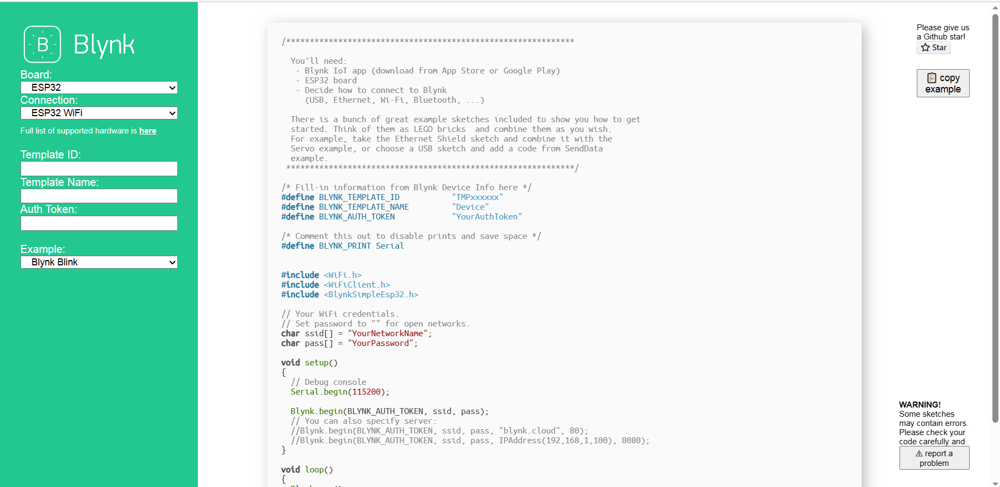
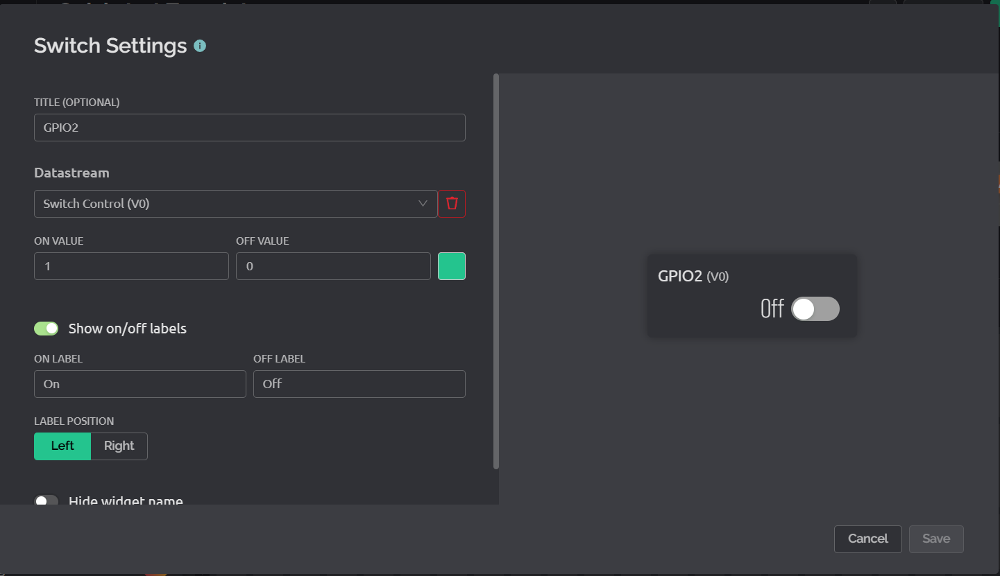

### 环境配置

<br>

#### 依赖库安装

> 参考 [blynk 官方快速上手文档](https://docs.blynk.io/en/getting-started/what-do-i-need-to-blynk/how-quickstart-device-was-made)

如果要使用 blynk 提供的环境，我们就必须安装对应的库

选择基于 blynk 且适用于 ESP32 的库并安装到 arduino 上：



<br>

#### blynk 基础设置

进入官网并且注册一个账号 https://blynk.io/

直接跳过向导，进入控制台

按照下图所示，点击 new template 新建模板，模板名称自取，HARDWARE 选择 ESP32，连接类型选择 WIFI



<br>

点开这个 template，查看对应的 device info

我们需要拿小本本记下以下三个参数

- AUTHTOKEN
- TEMPLATE NAME
- TEMPLATE ID



<br>

之后进入 [blynk 模板代码生成网站](https://examples.blynk.cc/?board=ESP32&shield=ESP32%20WiFi&example=GettingStarted%2FBlynkBlink)

选择板子为 esp32，把刚刚记下来的三个参数全部填进去，复制右侧生成的一大段代码



<br>

把代码黏贴到 arduino 里面，现在看应该是这样的

注意补全示例代码的 `ssid` 以及 `pass` 常量，这是你链接到的路由器或者热点

```c
/* Fill-in information from Blynk Device Info here */
#define BLYNK_TEMPLATE_ID           "xxx"
#define BLYNK_TEMPLATE_NAME         "xxx"
#define BLYNK_AUTH_TOKEN            "xxx"

/* Comment this out to disable prints and save space */
#define BLYNK_PRINT Serial


#include <WiFi.h>
#include <WiFiClient.h>
#include <BlynkSimpleEsp32.h>

// 在这里我设置了手机热点SSID以及对应密码
char ssid[] = "zhiller";
char pass[] = "pp12345678";

void setup()
{
  // Debug console
  Serial.begin(115200);

  Blynk.begin(BLYNK_AUTH_TOKEN, ssid, pass);
  // You can also specify server:
  //Blynk.begin(BLYNK_AUTH_TOKEN, ssid, pass, "blynk.cloud", 80);
  //Blynk.begin(BLYNK_AUTH_TOKEN, ssid, pass, IPAddress(192,168,1,100), 8080);
}


void loop()
{
  Blynk.run();
  // You can inject your own code or combine it with other sketches.
  // Check other examples on how to communicate with Blynk. Remember
  // to avoid delay() function!
}
```

此时可直接把代码上传到 esp32 里面去

上传完毕并且成功连接到 WIFI 后，回到 blynk 控制台，你会发现 template 上面显示设备状态为 `online`  
这就表示成功的将设备连接到了服务器上！

<br>

### GPIO 点灯实验

还是依据上面创建的 template

我们进入 `web dashboard` 界面，即 blynk 为我们提供的能快速操纵 esp32 的一个图形化控制面板  
免费版用户可以创建 10 个控件，这也足够我们学习使用了

默认他给了我们一个按钮空间，我们点开它的设置，将其 `DATASTREAM` 项改为 `Switch Control`



<br>

回到我们的 arduino，修改代码如下

在 `setup` 方法里面添加 `pinMode` 方法设置 GPIO2 口（即蓝色 LED 对应的端口）为输出状态

定义的 `BLYNK_WRITE(V0)` 表示：当我们在云端 blynk 的 dashboard 点击对应按钮时，就会触发该方法内的响应  
我们即可通过此方法实现对 LED 灯的开灭控制！

```c
#define BLYNK_TEMPLATE_ID           "xxx"
#define BLYNK_TEMPLATE_NAME         "xxx"
#define BLYNK_AUTH_TOKEN            "xxx"

#define BLYNK_PRINT Serial


#include <WiFi.h>
#include <WiFiClient.h>
#include <BlynkSimpleEsp32.h>

char ssid[] = "zhiller";
char pass[] = "pp12345678";

void setup()
{
  Serial.begin(115200);

  // 设置引脚2口为输出状态OUTPUT
  pinMode(2, OUTPUT);

  Blynk.begin(BLYNK_AUTH_TOKEN, ssid, pass);
}

// 当V0口在云端被改变时，就会触发如下代码
BLYNK_WRITE(V0) // Executes when the value of virtual pin 0 changes
{
  if(param.asInt() == 1)
  {
    // execute this code if the switch widget is now ON
    digitalWrite(2,HIGH);  // Set digital pin 2 HIGH
  }
  else
  {
    // execute this code if the switch widget is now OFF
    digitalWrite(2,LOW);  // Set digital pin 2 LOW
  }
}

void loop()
{
  Blynk.run();
}
```

<br>

上传代码到 esp32

blynk 看见 online 状态后，前往 dashboard，以较低频率点击按钮（由于网络延迟的原因，手速太快切换开关的话会导致紊乱，板子无法响应）

可以看见蓝色 LED 根据按钮点击实现了开闭

此云端控制还可通过下载 blynk 对应的手机 APP，实现移动控制，十分方便！
