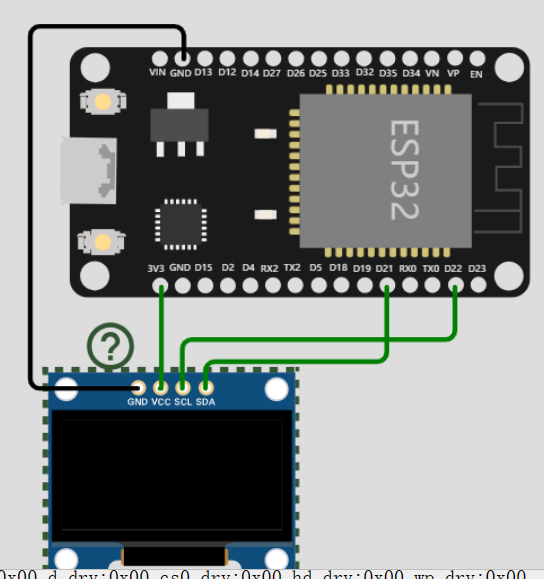

### 实用 GPIO

> 用到再查，熟能生巧，别上来就背图，一天你就忘了！


#### 仅输入引脚

下面的四个引脚由于内部没有上拉下拉电阻，所以仅仅支持输入信号  
GPIO 34  
GPIO 35  
GPIO 36  
GPIO 39

<br>

#### SPI Flash 闪存引脚

这些引脚都是对 ESP32 内部 flash 进行操作的，最好不要使用这些引脚进行输入输出操作！

GPIO 6 (SCK/CLK)  
GPIO 7 (SDO/SD0)  
GPIO 8 (SDI/SD1)  
GPIO 9 (SHD/SD2)  
GPIO 10 (SWP/SD3)  
GPIO 11 (CSC/CMD)

<br>

#### 电容触摸引脚

这个引脚比较有意思，他们自带了电容触摸传感器，当我们直接用手触摸引脚时会发生电荷改变，从而传感器接收到并输出大小不一的信号脉冲

Arduino IDE 中的触摸引脚分配存在问题。GPIO 33 在分配中与 GPIO 32 交换。这意味着，如果要引用 GPIO 32，则应在代码中使用 T8；对于 GPIO 33，则使用 T9

T0 (GPIO 4)
T1 (GPIO 0)
T2 (GPIO 2)
T3 (GPIO 15)
T4 (GPIO 13)
T5 (GPIO 12)
T6 (GPIO 14)
T7 (GPIO 27)
T8 (GPIO 33)
T9 (GPIO 32)

<br>

下面是一个小实验，我们要实现触摸 GPIO4（对应 T0）口实现板上 LED 亮灭；  
仅需使用一个公对母线，连接到 GPIO4 口上，然后用手指触摸引出的公端口即可进行测试；

使用 `touchRead` 方法，检测对应 GPIO 口上的传感器对应返回数值；

经过测试，得出结果：当手指触摸时数值 10-20，手指移开后数值 70-80；所以可以得到以下检测代码

```c
const int LED = 2;

void setup()
{
  pinMode(LED,OUTPUT);

  Serial.begin(115200);
  delay(1000); // give me time to bring up serial monitor
  Serial.println("ESP32 Touch Test");
}

void loop()
{
  // touchRead(T0)直接读取对应带触摸传感器GPIO的代号
  Serial.println(touchRead(T0));
  // touchRead(4)或者直接指定GPIO口
  touchRead(4)<=20 ? digitalWrite(LED,HIGH) : digitalWrite(LED,LOW);
}
```

<br>

#### ADC 模数转换器引脚

基本上半数以上引脚都支持模数转换，具体引脚请看图片，这里空间有限不一一指出

在使用 WIFI 时建议仅使用 ADC1 类型的引脚，因为 ADC2 类型的引脚大概率会出错；

ADC 引脚用于将电压值转换为数值，但是实际情况不是线性的，ESP32 存在以下特殊情况：

- 0.0v-0.1v 时，转换数值均为 0
- 3.2v-3.3v 时，转换数值均为 4095

<br>

#### DAC 数模转换器引脚

这个就比较少了，只有俩  
DAC1 (GPIO25)
DAC2 (GPIO26)

<br>

#### RTC

用于睡眠唤醒以及时钟操作

<br>

#### IIC

> 在某些板子上，SDA 线也可能标记为 SDI，而 SCL 线标记为 SCK。

ESP32 自带两个 I2C 接口

GPIO 21 (SDA)  
GPIO 22 (SCL)

<br>

#### PWM 脉冲宽度调制

所有具有 OUTPUT 特性的引脚均可使用 PWM

<br>

### PWM

```c
// 定义LED引脚的编号
const int ledPin = 2; // 15 对应GPIO16

// 设置PWM属性
const int freq = 5000; // PWM频率
const int ledChannel = 0; // PWM通道
const int resolution = 8; // 分辨率

void setup(){
    // 配置LED的PWM功能
    ledcSetup(ledChannel, freq, resolution);

    // 将PWM通道附加到要控制的GPIO引脚
    ledcAttachPin(ledPin, ledChannel);
}


// 增加LED亮度
void loop(){
    for(int dutyCycle = 0; dutyCycle <= 255; dutyCycle++){
        // 使用PWM改变LED亮度
        ledcWrite(ledChannel, dutyCycle);
        delay(15);
    }
    // 减小LED亮度
    for(int dutyCycle = 255; dutyCycle >= 0; dutyCycle--){
        // 使用PWM改变LED亮度
        ledcWrite(ledChannel, dutyCycle);
        delay(15);
    }
}
```

<br>

### IIC

> 在此之前需要下载六个重要的外部库到 arduino 里面才可以

Adafruit GFX Library  
Adafruit SSD1306  
Adafruit Sensor Calibration  
Adafruit Sensor Lab  
Adafruit Unified Sensor

<br>

#### 检测处于 IIC 线路上的设备

回顾一下两个 I2C 输出引脚：`GPIO 21 (SDA)  ；GPIO 22 (SCL)`

如果要是有 IIC，就必须导入头文件 `Wire.h`

```c
#include <Wire.h>
void setup() {
  Wire.begin(); // 初始化I2C总线
  Serial.begin(115200); // 初始化串口通信，波特率为115200
  Serial.println("\nI2C扫描程序"); // 输出提示信息
}

void loop() {
  byte error, address; // 定义错误码和设备地址变量
  int nDevices; // 定义设备数量变量
  Serial.println("扫描中..."); // 输出扫描提示信息
  nDevices = 0; // 设备数量初始化为0

  for(address = 1; address < 127; address++ ) { // 循环扫描从1到127的设备地址
    Wire.beginTransmission(address); // 开始传输数据到设备地址
    error = Wire.endTransmission(); // 结束传输并获取错误码
    if (error == 0) { // 如果错误码为0，表示找到了设备
      Serial.print("在地址0x"); // 输出设备地址提示信息
      if (address<16) { // 如果设备地址小于16，前面补0
        Serial.print("0");
      }
      Serial.println(address,HEX); // 输出设备地址
      nDevices++; // 设备数量加1
    }
    else if (error==4) { // 如果错误码为4，表示设备没有响应
      Serial.print("在地址0x"); // 输出设备地址提示信息
      if (address<16) { // 如果设备地址小于16，前面补0
        Serial.print("0");
      }
      Serial.println(address,HEX); // 输出设备地址
      Serial.println("发生未知错误"); // 输出错误信息
    }
  }
  if (nDevices == 0) { // 如果设备数量为0，表示没有找到设备
    Serial.println("没有找到I2C设备\n"); // 输出提示信息
  }
  else { // 否则表示找到了设备
    Serial.println("扫描完成\n"); // 输出提示信息
  }
  delay(5000); // 延时5秒
}
```

<br>

#### 最简 SSD1306 屏显



```c
#include <Wire.h> // 引用 Wire 库，用于 I2C 通讯
#include <Adafruit_GFX.h> // 引用 Adafruit_GFX 库，用于 OLED 显示屏图形操作
#include <Adafruit_SSD1306.h> // 引用 Adafruit_SSD1306 库，用于 OLED 显示屏驱动
#include <Adafruit_Sensor.h> // 引用 Adafruit_Sensor 库，用于传感器操作

#define SCREEN_WIDTH 128 // OLED 显示屏宽度，以像素为单位
#define SCREEN_HEIGHT 64 // OLED 显示屏高度，以像素为单位

Adafruit_SSD1306 display(SCREEN_WIDTH, SCREEN_HEIGHT, &Wire, -1); // 创建 OLED 显示屏对象

void setup() {
  Serial.begin(115200); // 初始化串口通讯，波特率为 115200

  if(!display.begin(SSD1306_SWITCHCAPVCC, 0x3C)) { // 初始化 OLED 显示屏
    Serial.println(F("SSD1306 allocation failed")); // 如果初始化失败，打印错误信息
    for(;;); // 程序进入死循环
  }

  delay(2000); // 延时 2 秒
  display.clearDisplay(); // 清空 OLED 显示屏
  display.setTextColor(WHITE); // 设置 OLED 显示屏文本颜色为白色
}

void loop() {
  display.clearDisplay(); // 清空 OLED 显示屏

  display.setTextSize(2); // 设置文本字体大小为 2
  display.setCursor(0,0); // 设置文本显示位置为 (0, 0)
  display.print("Hello!"); // 显示 "Hello!" 文本

  display.display(); // 将图像显示在 OLED 显示屏上

  delay(1000); // 延时 1 秒
}
```

<br>

### SPI

> SPI 是一种主从交换的通信方式，一个 master 可以具有 n 个 slave

<br>

#### 简介

ESP32-DEVKIT-V1 标准开发板，定义了 2 组 SPI 引脚，下面所有的分析都按照该开发板解释  
（如果对引脚不熟悉的，可以直接移步顶部看引脚定义图）

VSPI：主 SPI 引脚；  
HSPI：副 SPI 引脚，默认情况不会被启用；

`VSPI` 对应的四个引脚，这些引脚都可直接使用字母表达，无需记住对应的引脚索引  
MOSI: 23  
MISO: 19  
SCK: 18  
NSS: 5

`HSPI` 对应的四个引脚，如果想要字母表达，请使用 define 宏定义实现  
MOSI: 13  
MISO: 12  
SCK: 14  
NSS: 15

<br>

#### 检测开发板的 SPI 引脚

由于不同的开发板具有不同的 SPI 引脚，我们在使用之前需要先行确定 `SCK\MOSI\MISO\NSS` 四个引脚对应的端口

```c
#include <SPI.h>  // SPI头文件在esp32库中自带，无需新下载

void setup() {
  // put your setup code here, to run once:
  Serial.begin(115200);
  delay(1000);  // 延迟1s，为了让我们在串口监视器上看到

  Serial.print("MOSI: ");
  Serial.println(MOSI);
  Serial.print("MISO: ");
  Serial.println(MISO);
  Serial.print("SCK: ");
  Serial.println(SCK);
  Serial.print("SS: ");
  Serial.println(SS);
}

void loop() {
  // put your main code here, to run repeatedly:

}
```

我的监测结果如下（开发板：`ESP32-DEVKIT-V1`）：

```
MOSI: 23
MISO: 19
SCK: 18
SS: 5
```

<br>

#### 双 SPI

> ESP32 自带两组 SPI，你可以通过以下方法使用这两种 SPI

自定义一个 SPI 或者使用现存的 SPI，主要分为以下几步

1. define 对应的引脚作为 SPI 的四个引脚
2. 定义 SPIClass 对应变量，首先给予空引用
3. new 一个 SPIClass 对象
4. 开始数据读写操作

```c
#include <SPI.h>


// ifdef是为了放置开发板不同导致引脚不同，适配多样SPI
#ifdef ALTERNATE_PINS
  #define VSPI_MISO   2
  #define VSPI_MOSI   4
  #define VSPI_SCLK   0
  #define VSPI_SS     33

  #define HSPI_MISO   26
  #define HSPI_MOSI   27
  #define HSPI_SCLK   25
  #define HSPI_SS     32
#else
  // 主VSPI可以使用字母直接表示
  #define VSPI_MISO   MISO
  #define VSPI_MOSI   MOSI
  #define VSPI_SCLK   SCK
  #define VSPI_SS     SS

  // 副HSPI只能使用GPIO口数字表示
  #define HSPI_MISO   12
  #define HSPI_MOSI   13
  #define HSPI_SCLK   14
  #define HSPI_SS     15
#endif

#if CONFIG_IDF_TARGET_ESP32S2 || CONFIG_IDF_TARGET_ESP32S3
#define VSPI FSPI
#endif

static const int spiClk = 1000000; // 1 MHz

// 第一步：定义SPI对象，首先给予空引用
SPIClass * vspi = NULL;
SPIClass * hspi = NULL;

void setup() {
  // 初始化对应VSPI接口，得到SPI对象
  vspi = new SPIClass(VSPI);
  hspi = new SPIClass(HSPI);

  #ifndef ALTERNATE_PINS
    //initialise vspi with default pins
    //SCLK = 18, MISO = 19, MOSI = 23, SS = 5
    vspi->begin();
  #else
    //alternatively route through GPIO pins of your choice
    vspi->begin(VSPI_SCLK, VSPI_MISO, VSPI_MOSI, VSPI_SS); //SCLK, MISO, MOSI, SS
  #endif

  #ifndef ALTERNATE_PINS
    //initialise hspi with default pins
    //SCLK = 14, MISO = 12, MOSI = 13, SS = 15
    hspi->begin();
  #else
    //alternatively route through GPIO pins
    hspi->begin(HSPI_SCLK, HSPI_MISO, HSPI_MOSI, HSPI_SS); //SCLK, MISO, MOSI, SS
  #endif

  //set up slave select pins as outputs as the Arduino API
  //doesn't handle automatically pulling SS low
  pinMode(vspi->pinSS(), OUTPUT); //VSPI SS
  pinMode(hspi->pinSS(), OUTPUT); //HSPI SS

}

// the loop function runs over and over again until power down or reset
void loop() {
  //use the SPI buses
  spiCommand(vspi, 0b01010101); // junk data to illustrate usage
  spiCommand(hspi, 0b11001100);
  delay(100);
}

// SPI数据传输流程外部函数
void spiCommand(SPIClass *spi, byte data) {
  // 设置SPI对应模式
  spi->beginTransaction(SPISettings(spiClk, MSBFIRST, SPI_MODE0));
  digitalWrite(spi->pinSS(), LOW); // NSS低电平，数据开始传输
  spi->transfer(data);
  digitalWrite(spi->pinSS(), HIGH); // NSS高电平，数据截止传输
  spi->endTransaction();
}
```

<br>

### 中断处理

#### 中断步骤

attachInterrupt 用于关联中断触发端口以及中断触发函数

以上函数的第三个参数分别由以下几个待选常量组成

- HIGH 高电平触发
- LOW 低电平触发
- CHANGE 当电平有高向低或者有低向高转换时触发
- RISING 电平由低到高转变时触发
- FALLING 电平由高到低转变时触发

```c
// 欲操纵的GPIO
const int led = 2;
// 中断检测的GPIO
const int motionSensor = 4;

// IRAM_ATTR专用表示中断类型函数
// 定义触发中断后执行的函数
void IRAM_ATTR detectsTouch(){
  digitalWrite(led,HIGH);
  delay(3000);
  digitalWrite(led,LOW);
}

void setup() {
  // LED设置默认低电平，即关闭
  pinMode(led,OUTPUT);
  digitalWrite(led,LOW);

  // 检测中断的GPIO必须设置为输入INPUT类型的，通过对输入电平变化检测来判断是否触发中断
  pinMode(motionSensor,INPUT_PULLUP);

  // attachInterrupt关联中断检测GPIO以及对应的中断函数
  // 参数一：中断检测引脚，digitalPinToInterrupt将对应GPIO输入信号转化为中断信号
  // 参数二：中断触发函数
  // 参数三：何时触发中断
  attachInterrupt(digitalPinToInterrupt(motionSensor),detectsTouch,RISING);
}

void loop() {
  // 在这里写针对中断触发的函数
}
```

<br>

### 定时器

```c
const int ledPin = 2;      // LED引脚号
int ledState = LOW;             // ledState用于设置LED

// 通常，应使用“unsigned long”存储时间变量
// 值很快就会变得太大，超出int所能存储的范围
unsigned long previousMillis = 0;        // 将存储上次更新LED的时间
const long interval = 1000;           // 闪烁的时间间隔（毫秒）

void setup() {
  // 将数字引脚设为输出:
  pinMode(ledPin, OUTPUT);
}

void loop() {
  // 在这里放需要一直运行的代码。
  // 检查是否到了闪烁LED的时间；即，如果
  // 当前时间与上次闪烁LED的时间之差大于你想要的
  // 闪烁LED的时间间隔。
  unsigned long currentMillis = millis();
  if (currentMillis - previousMillis >= interval) {
    // 保存上次闪烁LED的时间
    previousMillis = currentMillis;
    // 如果LED处于关闭状态，则打开它，反之亦然：
    if (ledState == LOW) {
      ledState = HIGH;
    } else {
      ledState = LOW;
    }
    // 使用变量ledState设置LED的状态：
    digitalWrite(ledPin, ledState);
  }
}
```

### 深度睡眠

#### 定时器睡眠唤醒

ESP32 自带一个 RTC 数据存储，他是一个 SRAM，只有当我们按下 EN 键后才会清空存储内容

为任意变量前加上 `RTC_DATA_ATTR `修饰即可将该变量存储到 RTC  
如下面的 `RTC_DATA_ATTR int bootCount`

`uS_TO_S_FACTOR` 定义睡眠的单位时间，而 `TIME_TO_SLEEP` 定义需要睡眠的总时长（乘以单位时间）

```c
#define uS_TO_S_FACTOR 1000000ULL  /* 微秒到秒的转换系数 */
#define TIME_TO_SLEEP  5        /* ESP32将进入睡眠状态的时间（秒） */

RTC_DATA_ATTR int bootCount = 0;  // 存储该变量到RTC内部

/*
打印ESP32被唤醒的原因
*/
void print_wakeup_reason(){
  esp_sleep_wakeup_cause_t wakeup_reason;
  wakeup_reason = esp_sleep_get_wakeup_cause();
  switch(wakeup_reason)
  {
    case ESP_SLEEP_WAKEUP_EXT0 : Serial.println("RTC_IO引脚的外部信号唤醒"); break;
    case ESP_SLEEP_WAKEUP_EXT1 : Serial.println("RTC_CNTL引脚的外部信号唤醒"); break;
    case ESP_SLEEP_WAKEUP_TIMER : Serial.println("定时器唤醒"); break;
    case ESP_SLEEP_WAKEUP_TOUCHPAD : Serial.println("触摸板唤醒"); break;
    case ESP_SLEEP_WAKEUP_ULP : Serial.println("ULP程序唤醒"); break;
    default : Serial.printf("唤醒不是由深度睡眠引起的：%d\n",wakeup_reason); break;
  }
}

void setup(){
  Serial.begin(115200);
  delay(1000); //打开串口监视器需要一些时间

  //每次重启都增加引导次数并打印
  ++bootCount;
  Serial.println("引导次数：" + String(bootCount));
  //打印ESP32的唤醒原因
  print_wakeup_reason();

  /*
  首先配置唤醒源
  我们设置ESP32每5秒唤醒一次
  1*1000000us = 1s
  */
  esp_sleep_enable_timer_wakeup(TIME_TO_SLEEP * uS_TO_S_FACTOR);
  Serial.println("设置ESP32每" + String(TIME_TO_SLEEP) +
  "秒进入睡眠状态");
  Serial.println("现在进入睡眠状态");
  Serial.flush(); // 清空串口通信缓冲区

  // 引导进入深入睡眠状态
  esp_deep_sleep_start();

  Serial.println("这将永远不会被打印");
}
void loop(){
  //这个函数不会被调用
}
```

<br>

#### 触摸板唤醒

> 下文实现用手按压 GPIO4 引脚，产生电荷差异，唤醒

`touchAttachInterrupt` 关联触摸按键与中断  
`esp_sleep_enable_touchpad_wakeup` 开启 touch 唤醒模式  
`esp_deep_sleep_start` 令 esp32 进入睡眠模式

```c

#define THRE 30

// 存储bootCount的值
RTC_DATA_ATTR int bootCount = 0;
// 唤醒状态，touch引脚信息
touch_pad_t touchPin;

void print_wakeup_touched(){
  touchPin = esp_sleep_get_touchpad_wakeup_status();
  switch(touchPin){
    case 0: Serial.println("出没了GPIO4");break;
    default: Serial.println("无法识别你摁到了什么");break;
  }
}

void touchCallback(){
  Serial.println("您点击了");
}

void setup() {
  // put your setup code here, to run once:
  Serial.begin(115200);
  delay(1000);

  ++bootCount;
  Serial.println("看看这是第几次了："+String(bootCount));

  print_wakeup_touched();

  touchAttachInterrupt(T0,touchCallback,THRE);
  esp_sleep_enable_touchpad_wakeup();

  Serial.println("又要睡着了");
  esp_deep_sleep_start();
}

void loop() {
  // put your main code here, to run repeatedly:

}
```

<br>

### 外部唤醒

外部唤醒重要特性

- 您只能将 RTC GPIO 用作外部唤醒;
- 您可以使用两种不同的方法：ext0 和 ext1;
- ext0 允许您使用单个 GPIO 引脚唤醒 ESP32;
- ext1 允许您使用多个 GPIO 引脚唤醒 ESP32。
