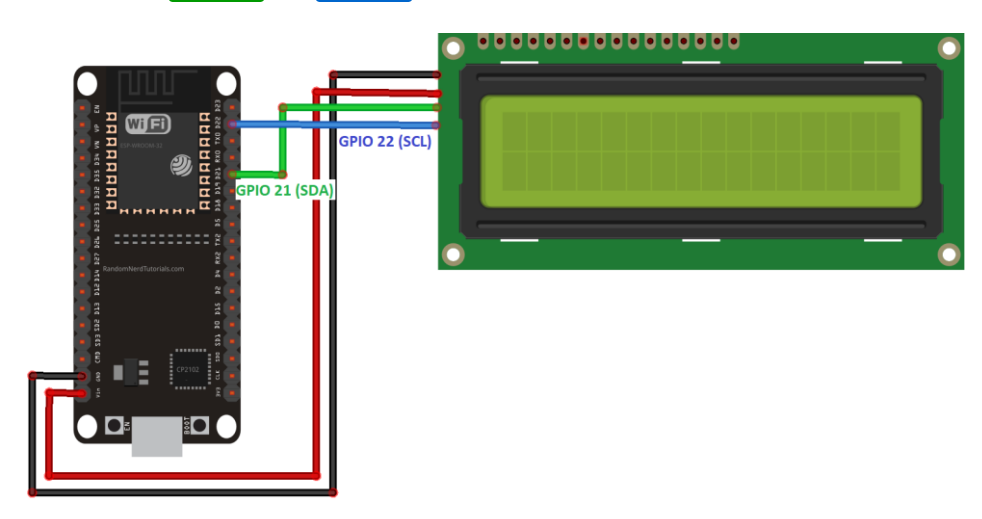
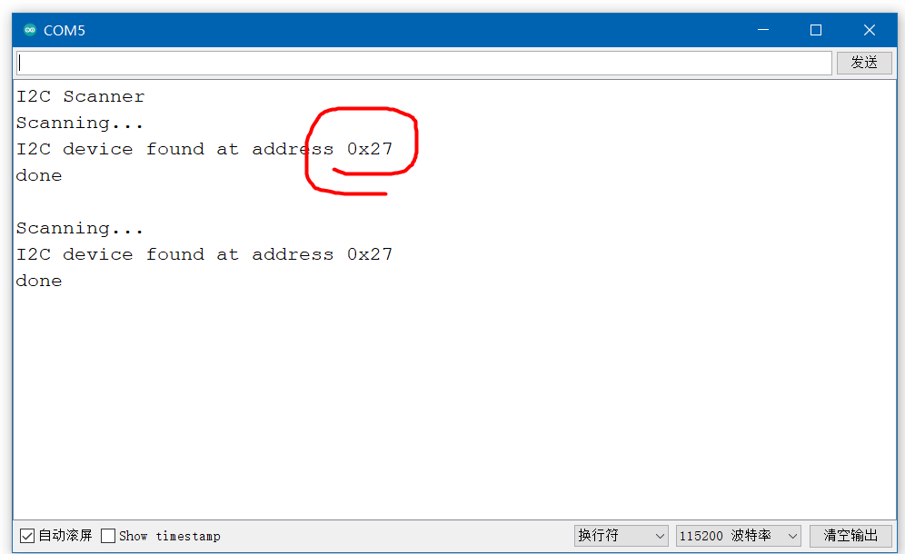
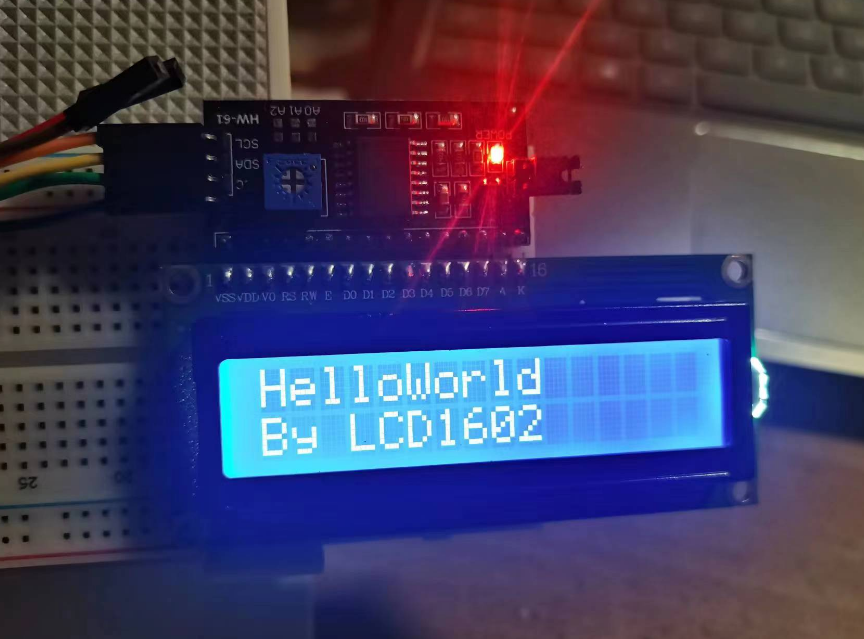

### LCD1602

> 实验将利用 LCD1602 显示文本  
> 参考文献：https://randomnerdtutorials.com/esp32-esp8266-i2c-lcd-arduino-ide/

<br>

#### 硬件准备

4 条母对母杜邦线  
LCD1602  
Esp32-Devkit-V1  
I2C 转接板（LCD1602 专用）  
一块面包板

一把小螺丝刀（用于调节电位器）

> 如果手头上没有对应硬件，可以去 https://wokwi.com/ 简单模拟实验一下

<br>

#### 环境搭设

基于 arduino 的 esp32 开发环境搭设这里就不废话了，网上有很多，大家可以自行去查看

LCD1602 显示内容，我们需要借用国外大神编写的一个库：  
前往 github 下载 `LiquidCrystal_I2C` 库 [点击前往](https://github.com/johnrickman/LiquidCrystal_I2C)

直接把整个仓库下载下来，得到的 ZIP 包就是库文件；  
然后打开 arduino，点击顶部菜单栏的 `项目->加载库->添加ZIP库` ，选中下载好的 ZIP 文件即可导入库

<br>

#### 接线

确保 LCD1602 以及对应的 I2C 转接板的接口一一对应



下面是转接板四个引脚与 ESP32 上的引脚对应情况（使用 IIC）  
GND - GND  
VCC - VIN  
SDA - D21  
SCL - D22

由于 LCD1602 需要的电压比较大，必须使用 5v 的，所以 VCC 需要连接到 ESP32 上的 5v 输出端 VIN

<br>

#### 获取 IIC 地址

在启用 LCD1602 之前，我们需要对 IIC 地址进行检测  
使用默认的 IIC Scanner 代码即可查找到地址

这是查找地址的代码，直接复制粘贴到 IDE 里面烧录即可  
从串口监视器上输出 IIC 地址

```c
#include <Wire.h>

 void setup() {
   Wire.begin(); // 初始化 I2C 总线
   Serial.begin(115200); // 初始化串口通信，波特率为 115200
   Serial.println("\nI2C 扫描器"); // 输出提示信息
 }

 void loop() {
   byte error, address; // 定义变量 error 和 address，类型为 byte
   int nDevices; // 定义变量 nDevices，类型为 int
   Serial.println("扫描中..."); // 输出提示信息
   nDevices = 0; // 初始化 nDevices 为 0
   for(address = 1; address < 127; address++ ) { // 遍历 I2C 地址
     Wire.beginTransmission(address); // 开始传输数据
     error = Wire.endTransmission(); // 结束传输数据，并返回传输状态
     if (error == 0) { // 如果传输状态为 0，表示找到了 I2C 设备
       Serial.print("在地址 0x"); // 输出提示信息
       if (address<16) {
         Serial.print("0"); // 如果地址小于 16，前面补 0
       }
       Serial.println(address,HEX); // 输出 I2C 设备地址
       nDevices++; // 统计找到的 I2C 设备数量
     }
     else if (error==4) { // 如果传输状态为 4，表示未知错误
       Serial.print("在地址 0x"); // 输出提示信息
       if (address<16) {
         Serial.print("0"); // 如果地址小于 16，前面补 0
       }
       Serial.println(address,HEX); // 输出 I2C 设备地址
     }
   }
   if (nDevices == 0) { // 如果没有找到 I2C 设备
     Serial.println("未找到 I2C 设备\n"); // 输出提示信息
   }
   else { // 如果找到了 I2C 设备
     Serial.println("扫描完成\n"); // 输出提示信息
   }
   delay(5000); // 延时 5 秒钟
 }
```

如果你的电路链接没有任何问题，且保证所有元器件均无损坏的情况下  
你可以从串口监视器看到对应的地址如下：

我这边得到的地址是 `0x27`



<br>

#### 显示第一行文本

> 特别注意！！！如果你发现写完代码成功烧录后屏幕啥都没有甚至有些暗，那可能就是电阻不对，拿出你的螺丝刀扭动电位器，直到屏幕正常显示文本即可！

新建一个项目，写入如下代码

```c
#include <LiquidCrystal_I2C.h>

// 定义行列数，默认不用更改，因为大家的LCD1602规格都是一致的
int lcdColumns = 16;
int lcdRows = 2;

// 初始化LCD1602
// 参数一为IIC地址
// 参数二为列数
// 参数三为行数
LiquidCrystal_I2C lcd(0x27, lcdColumns, lcdRows);

void setup(){
  // 初始化LCD
  lcd.init();
  // 打开LCD背光显示
  lcd.backlight();
}

void loop(){
  // 将光标移动到显示器0列0行位置
  lcd.setCursor(0, 0);
  // 打印字符
  lcd.print("Hello, World!");

  // 设置delay使其形成无效死循环，用于保持文本的显示
  delay(1000);
}
```

<br>

setCursor 设置光标的参数前后对应列和行；  
也就是说如果我要在第二行第一列开始输入文本，就需要设置 setCursor(0,1)

loop 代码块末尾的 delay 一定要加

<br>

你可以使用 clear 清除当前显示屏上的所有文本，然后重新打印一个新的

```c
lcd.clear();
```

下图即为静态文本显示测试成功后的结果图



<br>

#### 可滚动字符串

```c
#include <LiquidCrystal_I2C.h>

int lcdColumns = 16;
int lcdRows = 2;

LiquidCrystal_I2C lcd(0x27, lcdColumns, lcdRows);

// 设置静态字符串（第一行显示）
// 设置动态滚动字符串（第二行显示）
String messageStatic = "Static message";
String messageToScroll = "helloworld an esp32 platform devkit desktop funny for everyone.";

// 文本向左滚动的代码实现
void scrollText(int row, String message, int delayTime, int lcdColumns) {
  // 如果滚动文本长度小于屏幕最大一次显示长度，那就直接打印
  for (int i=0; i < lcdColumns; i++) {
    message = " " + message;
  }

  // 如果大于
  // 每次循环输出文本中的一小段，之后每次循环pos后移一位并显示，达到滚动显示的视觉效果
  message = message + " ";
  for (int pos = 0; pos < message.length(); pos++) {
    lcd.setCursor(0, row);
    lcd.print(message.substring(pos, pos + lcdColumns));
    delay(delayTime);
  }
}

void setup(){
  lcd.init();
  lcd.backlight();
}

void loop(){
  // 设置默认光标
  lcd.setCursor(0, 0);
  // 首先第一行打印静态字符串
  lcd.print(messageStatic);
  // 调用滚动输出函数，输出文本
  scrollText(1, messageToScroll, 250, lcdColumns);
}
```

<br>

#### 点灯小案例

> GPIO 点灯配合 LCD1602 显示当前状态

功能很简单，我们把 LCD 显示的代码抽离成一个方法 LCD_Setting  
之后每次小灯点亮或者熄灭一次，就调用该方法，判断小灯状态来显示对应的文本

记住要把 LCD 显示的代码写到 loop 循环里面哦！

LCD 显示内容之前记得 lcd.clear() 清屏哦！

```c
#include <LiquidCrystal_I2C.h>

LiquidCrystal_I2C lcd(0x27, 16, 2);

const int LED = 2;

void setup() {
  // put your setup code here, to run once:
  lcd.init();
  lcd.backlight();

  pinMode(LED,OUTPUT);
}

void loop() {
  digitalWrite(LED, HIGH);
  LCD_Setting(1);
  delay(500);
  digitalWrite(LED, LOW);
  LCD_Setting(0);
  delay(500);
}

void LCD_Setting(int status){
  lcd.clear();
  lcd.setCursor(0, 0);
  lcd.print("LED Status");
  lcd.setCursor(0, 1);
  lcd.print(status?"ON":"OFF");
}
```

此案例采用板卡默认自带小灯（GPIO2）实现，不需要额外接电路

<br>
