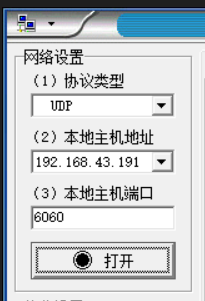

### WebServer

#### 一个简单的控制灯泡开关的服务器

> 请先准备三个设备：一台电脑、一块 ESP32，一台手机  
> 手机做热点，电脑和 ESP32 均链接手机的热点（如果现场有路由器，可以使用路由器取代手机）

下面展示搭设一个简单的服务器所要的基本步骤

```c
#include <WiFi.h>

// 链接到的WIFI或者热点的名称以及密码
const char* ssid = "zhiller";
const char* password = "pp12345678";

// 设置服务器运行的端口
WiFiServer server(80);

void setup() {
  Serial.begin(115200);

  // 尝试连接到WIFI，如果连接不上就一直尝试且每次输出一个小圆点，表示正在尝试连接
  Serial.print("Connecting to ");
  Serial.println(ssid);
  WiFi.begin(ssid, password);
  while (WiFi.status() != WL_CONNECTED) {
    delay(500);
    Serial.print(".");
  }

  // 链接成功后停止阻塞，此时展示ESP32在当前网络中的本地IP，然后begin运行服务器！
  Serial.println("");
  Serial.println("WiFi connected.");
  Serial.println("IP address: ");
  Serial.println(WiFi.localIP());
  server.begin();
}

void loop(){
  WiFiClient client = server.available();   // 监听加入的客户端

  // 如果客户端存在，则对其进行对应的操作
  if (client) {
    ...
  }
}
```

<br>

这是教程实例中的，通过 ESP32 生成一个静态网页，检测网页按键点击，可以快速修改对应引脚的高低电平

```c
#include <WiFi.h>

// Replace with your network credentials
const char* ssid = "zhiller";
const char* password = "pp12345678";

// Set web server port number to 80
WiFiServer server(80);

// Variable to store the HTTP request
String header;

// Auxiliar variables to store the current output state
String output26State = "off";
String output27State = "off";

// Assign output variables to GPIO pins
const int output26 = 26;
const int output27 = 27;

// Current time
unsigned long currentTime = millis();
// Previous time
unsigned long previousTime = 0;
// Define timeout time in milliseconds (example: 2000ms = 2s)
const long timeoutTime = 2000;

void setup() {
  Serial.begin(115200);
  // Initialize the output variables as outputs
  pinMode(output26, OUTPUT);
  pinMode(output27, OUTPUT);
  // Set outputs to LOW
  digitalWrite(output26, LOW);
  digitalWrite(output27, LOW);

  // Connect to Wi-Fi network with SSID and password
  Serial.print("Connecting to ");
  Serial.println(ssid);
  WiFi.begin(ssid, password);
  while (WiFi.status() != WL_CONNECTED) {
    delay(500);
    Serial.print(".");
  }
  // Print local IP address and start web server
  Serial.println("");
  Serial.println("WiFi connected.");
  Serial.println("IP address: ");
  Serial.println(WiFi.localIP());
  server.begin();
}

void loop(){
  WiFiClient client = server.available();   // Listen for incoming clients

  if (client) {                             // If a new client connects,
    currentTime = millis();
    previousTime = currentTime;
    Serial.println("New Client.");          // print a message out in the serial port
    String currentLine = "";                // make a String to hold incoming data from the client
    while (client.connected() && currentTime - previousTime <= timeoutTime) {  // loop while the client's connected
      currentTime = millis();
      if (client.available()) {             // if there's bytes to read from the client,
        char c = client.read();             // read a byte, then
        Serial.write(c);                    // print it out the serial monitor
        header += c;
        if (c == '\n') {                    // if the byte is a newline character
          // if the current line is blank, you got two newline characters in a row.
          // that's the end of the client HTTP request, so send a response:
          if (currentLine.length() == 0) {
            // HTTP headers always start with a response code (e.g. HTTP/1.1 200 OK)
            // and a content-type so the client knows what's coming, then a blank line:
            client.println("HTTP/1.1 200 OK");
            client.println("Content-type:text/html");
            client.println("Connection: close");
            client.println();

            // turns the GPIOs on and off
            if (header.indexOf("GET /26/on") >= 0) {
              Serial.println("GPIO 26 on");
              output26State = "on";
              digitalWrite(output26, HIGH);
            } else if (header.indexOf("GET /26/off") >= 0) {
              Serial.println("GPIO 26 off");
              output26State = "off";
              digitalWrite(output26, LOW);
            } else if (header.indexOf("GET /27/on") >= 0) {
              Serial.println("GPIO 27 on");
              output27State = "on";
              digitalWrite(output27, HIGH);
            } else if (header.indexOf("GET /27/off") >= 0) {
              Serial.println("GPIO 27 off");
              output27State = "off";
              digitalWrite(output27, LOW);
            }

            // Display the HTML web page
            client.println("<!DOCTYPE html><html>");
            client.println("<head><meta name=\"viewport\" content=\"width=device-width, initial-scale=1\">");
            client.println("<link rel=\"icon\" href=\"data:,\">");
            // CSS to style the on/off buttons
            // Feel free to change the background-color and font-size attributes to fit your preferences
            client.println("<style>html { font-family: Helvetica; display: inline-block; margin: 0px auto; text-align: center;}");
            client.println(".button { background-color: #4CAF50; border: none; color: white; padding: 16px 40px;");
            client.println("text-decoration: none; font-size: 30px; margin: 2px; cursor: pointer;}");
            client.println(".button2 {background-color: #555555;}</style></head>");

            // Web Page Heading
            client.println("<body><h1>ESP32 Web Server</h1>");

            // Display current state, and ON/OFF buttons for GPIO 26
            client.println("<p>GPIO 26 - State " + output26State + "</p>");
            // If the output26State is off, it displays the ON button
            if (output26State=="off") {
              client.println("<p><a href=\"/26/on\"><button class=\"button\">ON</button></a></p>");
            } else {
              client.println("<p><a href=\"/26/off\"><button class=\"button button2\">OFF</button></a></p>");
            }

            // Display current state, and ON/OFF buttons for GPIO 27
            client.println("<p>GPIO 27 - State " + output27State + "</p>");
            // If the output27State is off, it displays the ON button
            if (output27State=="off") {
              client.println("<p><a href=\"/27/on\"><button class=\"button\">ON</button></a></p>");
            } else {
              client.println("<p><a href=\"/27/off\"><button class=\"button button2\">OFF</button></a></p>");
            }
            client.println("</body></html>");

            // The HTTP response ends with another blank line
            client.println();
            // Break out of the while loop
            break;
          } else { // if you got a newline, then clear currentLine
            currentLine = "";
          }
        } else if (c != '\r') {  // if you got anything else but a carriage return character,
          currentLine += c;      // add it to the end of the currentLine
        }
      }
    }
    // Clear the header variable
    header = "";
    // Close the connection
    client.stop();
    Serial.println("Client disconnected.");
    Serial.println("");
  }
}
```

<br>

### WIFI

#### UDP 通信

> 再开始测试之前，请使用手机打开一个热点，并把电脑连接到手机热点上，这样子在后续测试中 ESP32 和电脑就会在同一个局域网（手机热点可以使用路由器代替）

新建任意文件，填入以下代码

`ssid` 和 `password` 即为我们热点的名称和密码

`remote_IP` 是电脑的局域网地址，可以在电脑上使用 ipconfig 进行查看  
`remoteUdpPort` 这是对应的 UDP 端口，可以随意设置！

```c
#include <WiFi.h>

const char *ssid = "zhiller";
const char *password = "pp12345678";

WiFiUDP Udp;
IPAddress remote_IP(192, 168, 43, 191);// 自定义远程监听 IP 地址
unsigned int remoteUdpPort = 6060;  // 自定义远程监听端口
int cnt = 0; //测试数据

void setup()
{
  Serial.begin(115200);
  delay(100);
  WiFi.mode(WIFI_STA);
  WiFi.setSleep(false); //关闭STA模式下wifi休眠，提高响应速度
  WiFi.begin(ssid, password);
  while (WiFi.status() != WL_CONNECTED)
  {
    delay(200);
    Serial.print(".");
  }
  Serial.print("Connected, IP Address: ");
  Serial.println(WiFi.localIP());
}

void loop()
{
  Udp.beginPacket(remote_IP, remoteUdpPort);//配置远端ip地址和端口
  String str_cnt(cnt);
  Udp.print(str_cnt);//把数据写入发送缓冲区
  Udp.endPacket();//发送数据
  cnt++;
  delay(500);
}
```

<br>

首先打开串口监视器，然后开始上传代码

从串口监视器中可以读取 ESP32 在当前局域网内的 IP 地址

使用 NetAssist 软件

- 协议类型选择 UDP
- 本地主机地址选择当前电脑的局域网 IP，这里是 `192.168.43.191`
- 端口选择我们设置的 UDP 端口，这里是 `6060`

你可以遵照下图配置  
打开串口后就可见 ESP32 传递过来的数据了



<br>

**UDP 接收数据**

如果要接收 UDP 数据，则可以使用如下代码

首先于文件开头定义 char 类型缓冲区变量 `buff` ，大小为 255  
之后使用 `parsePacket` 获取上位机传递过来的数据长度

```c
#include <WiFi.h>

const char *ssid = "zhiller";
const char *password = "pp12345678";

WiFiUDP Udp;
IPAddress remote_IP(192, 168, 43, 191);// 自定义远程监 IP 地址
unsigned int remoteUdpPort = 6060;  // 自定义远程监听端口
int cnt = 0; //测试数据

// 定义缓冲区
char buff[255];

void setup()
{
  Serial.begin(115200);
  delay(100);
  WiFi.mode(WIFI_STA);
  WiFi.setSleep(false); //关闭STA模式下wifi休眠，提高响应速度
  WiFi.begin(ssid, password);
  while (WiFi.status() != WL_CONNECTED)
  {
    delay(200);
    Serial.print(".");
  }
  Serial.print("Connected, IP Address: ");
  Serial.println(WiFi.localIP());
}

void loop()
{
  Udp.beginPacket(remote_IP, remoteUdpPort);//配置远端ip地址和端口

  // 获取上位机传递过来的数据长度
  int data_len = Udp.parsePacket();
  // 如果长度非0，表示数据存在且有效
  if(data_len){
    // 读取长度为255字节的数据并将他们保存到缓冲区buff里面
    int len = Udp.read(buff,255);
    // 由于长度不可能总是255，对于多出来的乱码部分采用截断处理
    if(len>0) buff[len]=0;
    // 把获取的数据打印到串口
    Serial.println(buff);
  }

  delay(500);
}
```

<br>

<br>

### LoRa

<br>

### BLE

> 低功耗蓝牙

<br>

#### GATT

GATT(全称是通用应用中的分布式事务)是一种用于管理分布式事务的规范。它提供了以下功能:

- 原子性:整个分布式事务要么全部提交,要么全部回滚。
- 一致性:分布式事务完成后,所有参与数据库的状态要保持一致。
- 隔离性:并发执行的多个分布式事务不会相互影响。
- 持久性:一旦分布式事务完成,其效果将持久保存。

GATT 通过两个基本步骤来完成分布式事务:

1. 准备(Prepare):每个参与分布式事务的节点都会进入准备阶段,此时还不会作出实际变更。
2. 提交(Commit):如果所有节点皆已准备好,则提交指令下发,各节点才会作出实际变更。

如果任何一个节点在准备阶段失败,则整个事务会回滚,所有节点均恢复到事务开始前的状态。

<br>

SIG 是分布式事务的一个子集(Subsets of Internal GATT,又称 SIG),是一种管理分布式事务的规范。

SIG 与 GATT 的主要区别在于:

1. SIG 中央协调者将事务状态与事务逻辑分离。GATT 事务协调者同时扮演状态管理和事务管理两个角色。
2. SIG 仅需协调各参与节点的准备阶段,而提交阶段交给各参与方自行完成。GATT 需要协调两个阶段。
3. SIG 较 GATT 协议更简单,因而实现和部署上具有更高的效率。

<br>

#### UUID

每一个 BLE 特性都包括一个 `UUID(Universally Unique Identifier)`  
你可以使用以下网站生成一个随机的 UUID：[点击前往](https://www.uuidgenerator.net/)

<br>

#### BLE Server

以下代码构建了一个简单的 BLE Server

我们必须为`服务器 BLEServer`、`特性 BLECharacteristic` 以及最后的`广播 BLEAdvertising`，均设置 `UUID`

构建一个服务器的基本步骤（这些都是基本格式，大概套用一下就没问题了）

1. 构建一个 BLE 服务器对象
2. 为 BLE 服务器对象设置其拥有的特性（即可操作的属性）
3. 广播该 BLE 服务器

```c
// 首先导入库
#include <BLEDevice.h>
#include <BLEUtils.h>
#include <BLEServer.h>


// 测量后使用随机的UUID生成器生成两个UUID就可以拿上去用了
#define SERVICE_UUID        "4fafc201-1fb5-459e-8fcc-c5c9c331914b"
#define CHARACTERISTIC_UUID "beb5483e-36e1-4688-b7f5-ea07361b26a8"

void setup() {
  Serial.begin(115200);
  Serial.println("Starting BLE work!");

  // BLEDevice::init 初始化BLE
  // BLEServer 设置当前蓝牙模式为服务器模式，即自身作为一个服务器
  // pService 用于获得设置了UUID的服务器
  // BLECharacteristic 设置BLE特性（或称属性）
  BLEDevice::init("Long name works now");
  BLEServer *pServer = BLEDevice::createServer();
  BLEService *pService = pServer->createService(SERVICE_UUID);
  BLECharacteristic *pCharacteristic = pService->createCharacteristic(
                                         CHARACTERISTIC_UUID,
                                         BLECharacteristic::PROPERTY_READ |
                                         BLECharacteristic::PROPERTY_WRITE
                                       );

  // 属性赋予默认值
  pCharacteristic->setValue("Hello World says Neil");
  // 开启服务器
  pService->start();

  // BLEAdvertising 蓝牙广播功能
  // 依然要为广播设置UUID，是否可被搜索到、对应的最小和最大适配
  BLEAdvertising *pAdvertising = BLEDevice::getAdvertising();
  pAdvertising->addServiceUUID(SERVICE_UUID);
  pAdvertising->setScanResponse(true);
  pAdvertising->setMinPreferred(0x06);
  pAdvertising->setMinPreferred(0x12);
  // 一切设计完毕后开启蓝牙广播
  BLEDevice::startAdvertising();

  Serial.println("Characteristic defined! Now you can read it in your phone!");
}

void loop() {
  // 你可以在这里写下主循环loop内的代码
}
```

> 成功运行以上代码后，使用 LightBlue 或者 BLE 调试助手，可以搜索到一个名字为 Long name works now 的蓝牙对象，并且链接成功后即可看见我们设置的两个特性（每个特性都对应了一个独有的 UUID）

<br>

你还可以监听客户端链接与断开，以实现对应的效果

实现以下效果

- 等待连接时 LED 亮起
- 链接成功后 LED 熄灭
- 链接断开，再次进入等待连接，LED 亮起
- 当链接断开后会自动重新广播

```c
#include <BLEDevice.h>
#include <BLEUtils.h>
#include <BLEServer.h>
#include <BLE2902.h>

#define SERVICE_UUID        "4fafc201-1fb5-459e-8fcc-c5c9c331914b"
#define CHARACTERISTIC_UUID "beb5483e-36e1-4688-b7f5-ea07361b26a8"

// 提前预定义好所有要用到的东西
BLEServer* pServer = NULL;
BLECharacteristic* pCharacteristic = NULL;

// 这两个变量可以在loop中使用，以间隔检测当前设备是否断开了或者是否有新的设备连进来了
// bool deviceConnected = false;
// bool oldDeviceConnected = false;

const int LED = 2; // 设置欲点亮的LED

// BLE服务器回调函数
class MyServerCallbacks: public BLEServerCallbacks {
  // 当服务器获得链接后执行
  void onConnect(BLEServer* pServer) {
    deviceConnected = true;
    Serial.println("客户端接入");
    digitalWrite(LED,LOW);
  };
  // 当服务器失去连接后执行
  void onDisconnect(BLEServer* pServer) {
    deviceConnected = false;
    Serial.println("客户端断开");
    digitalWrite(LED,HIGH);
    BLEDevice::startAdvertising();  // 当失去连接后，必须重新广播信号才可被客户端收到
  }
};

void setup() {
  Serial.begin(115200);
  delay(1000);
  Serial.println("BLE开始工作");

  // 刚开始设置LED是亮起的
  pinMode(LED,OUTPUT);
  digitalWrite(LED,HIGH);

  BLEDevice::init("Test BLE");
  pServer = BLEDevice::createServer();
  pServer->setCallbacks(new MyServerCallbacks()); // 挂载回调函数

  BLEService *pService = pServer->createService(SERVICE_UUID);
  pCharacteristic = pService->createCharacteristic(
                      CHARACTERISTIC_UUID,
                      BLECharacteristic::PROPERTY_READ |
                      BLECharacteristic::PROPERTY_WRITE |
                      BLECharacteristic::PROPERTY_NOTIFY |
                      BLECharacteristic::PROPERTY_INDICATE
                    );
  pCharacteristic->setValue("特征组");
  pCharacteristic->addDescriptor(new BLE2902());

  pService->start();  // 开启服务器

  // 广播信号
  BLEAdvertising *pAdvertising = BLEDevice::getAdvertising();
  pAdvertising->addServiceUUID(SERVICE_UUID);
  pAdvertising->setScanResponse(true);
  pAdvertising->setMinPreferred(0x06);
  pAdvertising->setMinPreferred(0x12);
  BLEDevice::startAdvertising();
  Serial.println("特征已经定义好了，你可以在你的手机上看到");
}

void loop() {
  ...
}
```

<br>

#### BLE 读写数据

> 实现效果：蓝牙发送 on 使引脚 4 高电平，发送 off 使引脚 4 低电平

`LightBlue` 来连接 ESP32

连接完毕后拉到最后，就会发现我们注册的特性  
该特性具有读写和通知这几个属性


数据格式改为 `UTF-8 String`  
在写区域输入 on，然后发送就完事了

```c
#include <BLEDevice.h>
#include <BLEServer.h>
#include <BLEUtils.h>
#include <BLE2902.h>

#define SERVICE_UUID        "4fafc201-1fb5-459e-8fcc-c5c9c331914b"
#define CHARACTERISTIC_UUID "beb5483e-36e1-4688-b7f5-ea07361b26a8"

BLEServer* pServer = NULL;
BLECharacteristic* pCharacteristic = NULL;
bool deviceConnected = false;
bool oldDeviceConnected = false;

class MyServerCallbacks: public BLEServerCallbacks {
    void onConnect(BLEServer* pServer) {
      deviceConnected = true;
      Serial.println("Device connected");
    };

    void onDisconnect(BLEServer* pServer) {
      deviceConnected = false;
      Serial.println("Device disconnected");
      BLEDevice::startAdvertising(); // 重新启动广播
    }
};

void setup() {
  Serial.begin(115200);

  pinMode(4, OUTPUT);
  digitalWrite(4, LOW);

  BLEDevice::init("TestBLE");
  pServer = BLEDevice::createServer();
  pServer->setCallbacks(new MyServerCallbacks());
  BLEService *pService = pServer->createService(SERVICE_UUID);
  pCharacteristic = pService->createCharacteristic(
                      CHARACTERISTIC_UUID,
                      BLECharacteristic::PROPERTY_READ |
                      BLECharacteristic::PROPERTY_WRITE |
                      BLECharacteristic::PROPERTY_NOTIFY |
                      BLECharacteristic::PROPERTY_INDICATE
                    );
  pCharacteristic->addDescriptor(new BLE2902());
  pService->start();

  BLEAdvertising *pAdvertising = BLEDevice::getAdvertising();
  pAdvertising->addServiceUUID(SERVICE_UUID);
  pAdvertising->setScanResponse(true);
  pAdvertising->setMinPreferred(0x06);
  pAdvertising->setMinPreferred(0x12);
  BLEDevice::startAdvertising();
  Serial.println("Waiting for a client connection...");
}

void loop() {
  if (deviceConnected) {
    // 获取客户端传过来的内容并存储到对应变量里面
    std::string value = pCharacteristic->getValue();
    // 如果长度大于0表示内容非空，可以分析
    if (value.length() > 0) {
      Serial.println("Received value: " + String(value.c_str()));

      // 检测到为on就开灯，检测到为off就关灯
      if(value=="on"){
        digitalWrite(4, HIGH);
        Serial.println("LED on");
      }else if(value=="off"){
        digitalWrite(4, LOW);
        Serial.println("LED off");
      }
    }
  } else {
    // 如果设备未连接，检查是否已连接
    if (oldDeviceConnected) {
      Serial.println("Device disconnected");
      oldDeviceConnected = false;
    }
  }
  delay(10);
}
```

<br>

####
