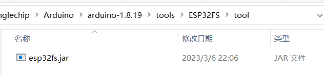
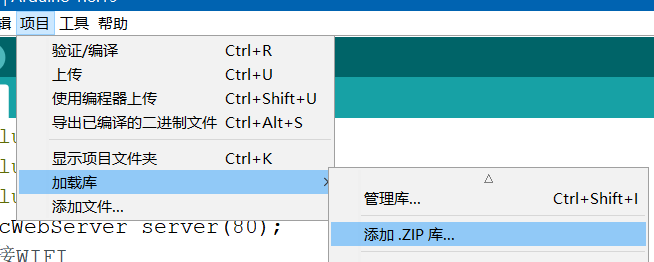
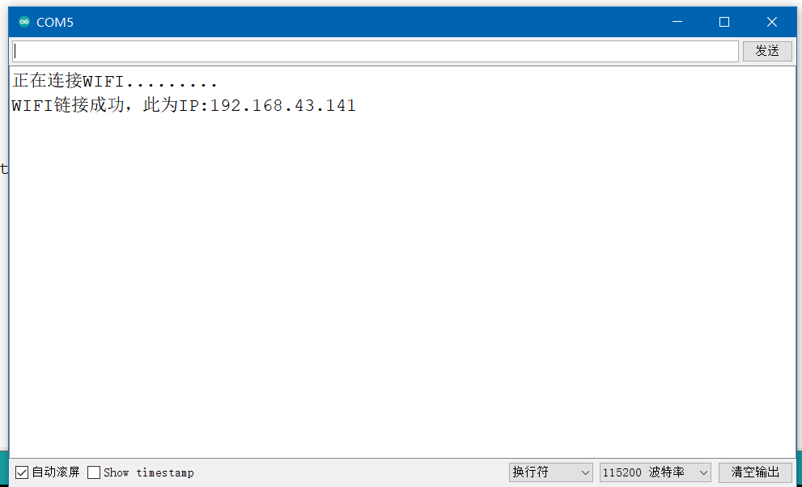

### WebServer 服务器

> 此案例中，我们将创建一个最简单的 webserver 服务器

案例实现：ESP32 通过 SPIFFS 上传网页文件并保存，之后手机开启热点，ESP32 连接到该热点；与手机处于同一热点下的任何一个设备（下面用电脑演示）都可以通过 ESP32 反馈的内网地址访问其构建的网页！

<br>

#### ESP32 filesystem uploader

`SPIFFS` 是一种嵌入式文件管理系统  
arduino 已经集成了对应库，但是依然需要我们下载另一个库来实现文件上传的功能

下载 ESP32 filesystem uploader  
https://github.com/me-no-dev/arduino-esp32fs-plugin

注意我们需要下载的是 jar 文件，即编译过后的，具体下载地址在上方 github 页面的 readme 里面有

下载对应的 ZIP 包后，直接解压到 arduino 根目录下的 tools 文件夹内即可（如下图所示）



<br>

重启 arduino，新建一个项目，项目内容保持为空

依次点击 `工具->ESP Sketch Data Upload`


由于我们是第一次使用 SPIFFS，需要进行初始化，弹出窗口点击 yes 即可

等待一段时间，当 arduino 下方输出框停止输出后，就会在当前项目目录下创建一个 data 文件夹

该文件夹存放网页文件，下次直接按照此方法再次运行 ESP Sketch Data Upload 即可上传文件到 ESP32 的 SPIFFS 里面了！

<br>

#### WebServer 库

此时需要外部的 webserver 库支持，下载下面这两个库

AsyncTCP https://github.com/me-no-dev/AsyncTCP  
ESPAsyncWebServer https://github.com/me-no-dev/ESPAsyncWebServer

依次点击 项目->加载库->加载 ZIP 库

选择我们下载完毕的两个库的 ZIP 压缩包，arduino 即可自动安装！



<br>

#### WIFI 链接

此时开启我们的手机热点

我的热点设置是  
热点名称（SSID）：zhiller  
热点密码：pp12345678

故得出以下代码

```c
#include <WiFi.h>
#include <SPIFFS.h>
#include "ESPAsyncWebServer.h"

// 设置ESP32服务器运行于80端口
AsyncWebServer server(80);

//连接WIFI
void connect_wifi(){

  // WIFI名称以及对应密码
  const char* wifi_ssid = "zhiller";
  const char* wifi_password = "pp12345678";

  // 设置串口波特率，以便通过串口监视器观察输出
  Serial.begin(115200);

  WiFi.begin(wifi_ssid, wifi_password);         //连接WIFI

  Serial.print("正在连接WIFI");

  //循环请求，直到连接成功
  while(WiFi.status() != WL_CONNECTED){
    Serial.print(".");
    delay(500);
  }

  Serial.println();
  IPAddress local_IP = WiFi.localIP();
  Serial.print("WIFI链接成功，此为IP:"); //连接成功提示
  Serial.println(local_IP);
}

// 开启webserver，挂载网页index.html
void web_server(){
 if(!SPIFFS.begin(true)){
    Serial.println("SPIFFS发生错误");
    return;
  }
  server.serveStatic("/", SPIFFS, "/").setDefaultFile("index.html");
  server.begin();                       //初始化
}

void setup() {
  connect_wifi();
  web_server();
}

void loop() {

}
```

<br>

#### 网页与代码烧录

随便写一个网页

代码清单 index.html

```html
<!DOCTYPE html>
<html>
	<head>
		<meta charset="utf-8" />
		<link
			rel="stylesheet"
			type="text/css"
			href="style.css"
		/>
		<title>测试网站</title>
	</head>
	<body>
		<h1>测试网站</h1>
		<p>测试测试测试</p>
	</body>
</html>
```

保存该网页到项目目录下的 data 文件夹

之后回到 arduino，依次执行 `工具->ESP Sketch Data Upload` 上传网页文件  
（此时必须要保证串口监视器是关闭状态，否则上传必定失败）

上传完毕后，先打开串口监视器（提前调节波特率到 115200），然后才开始上传代码

我们通过串口监视器可以观察到正在连接 WIFI，并且在连接到 WIFI 后，出现 ESP32 搭设的 webserver 的内网 IP



之后将电脑连接到手机热点

电脑上访问对应的 IP+端口，如 `192.168.43.141:80`  
此时即可浏览到对应的网页 `index.html` 啦

<br>
