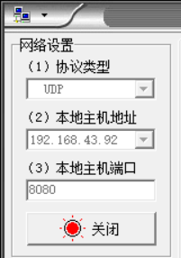

### EspressifIDE 烧写后 Thonny 无法控制

如果我们第一次即使用 micropython 开发，那么会在一开始使用对应的 bin 文件擦写 esp32 的 flash 区，此过程可以简单的视为在 esp32 板子上搭设了 micropython 开发环境

但如果你那天闲得无聊，突然转用 espressif 开发，并且构建后成功运行了，那么此时 esp32 板子上的开发环境架构就变成了 c/cpp 了

此时如果你再次重新转回使用 thonny 链接该 esp32，会发现无法控制其行为，且不能识别其内部存储或者烧写 python 文件

 

解决方法很简单，直接再次使用 micropython 对应的 bin 文件对 esp32 进行擦写即可，只不过此步骤会擦去所有存储好的文件，所以非必要不要乱转开发平台！！！

 

### rst:0x10 (RTCWDT_RTC_RESET),boot:0xb (HSPI_FLASH_BOOT) invalid header: 0xffffffff

> 个人分析：之前遇到此情况，主要原因是使用乐鑫官方提供的 flash 下载工具，一股脑直接把 esp32 擦干净了

错误表现：usb 连接到电脑上，thonny 一直循环输出这一段话，无论点任何按钮都无反应

解决方法：使用 micropython 提供的 bin 重新擦写 esp32

 

### 网络调试助手发送数据无响应？

若代码确实没有任何错误，那么请查看当前打开的端口以及对应的远程主机是否一一对应！！！

例如下面配置本地主机，需要注意三个点

1. 协议类型：取决于你 micropython 中开启的是哪一个协议的通信，一般都是 UDP
2. 本地主机地址：一定一定要写和 esp32 同一 WIFI 下的主机地址（我就犯了一个错误，因为我的电脑有虚拟机并且使用了 NAT 模式，故会多出一个 VMware8 网络适配器下的专属本地 IP，千万不要填这个！不然你试一辈子都试不出正确结果）
3. 端口：本地端口号，一般默认 8080 即可

 
