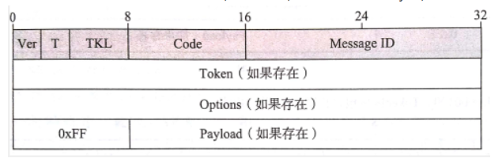

### CoAP 协议定义

> 受限制的应用协议（Costrained Application Protocal）

`CoAP` 提供轻量级的，为某些小型设备提供可替代 TCP/UDP 协议的解决方案

CoAP 是 `6LowPAN` 协议栈中的应用层协议，它适用于在资源受限的通信的 IP 网络

 

### 特性

- CoAP 位于应用层，就要 UDP 协议开发
- CoAP 是二进制的，HTTP 是文本格式的，CoAP 比 HTTP 更加紧凑
- CoAP 协议最小长度仅 4 个字节
- 支持可靠传输、数据重传、块传输。确保数据可靠到达
- 支持 IP 多播，即可以同时向多个设备发送请求
- 非长连接通信，适用于低速率、低功耗物联网场景
- CoAP 协议支持资源描述的缓存以优化其性能
- CoAP 协议支持异步通信，这对 M2M 通信应用来说是常见的休眠／唤醒机制

 

### 报文结构

自上到下四行

1. 第一行：消息头，大小固定为 4byte（其中字段 T 表示报文类型）
2. 第四行：开头必须要用一个 0xFF 将前面部分与载荷隔离开来

 

报文类型

- CON：请求必须要接收者发送 ACK 或者 RST 确认，如果发送者在规定的时间内收到 ACK 或者 RST，则会重发
- NON：不需要接收者确认。
- ACK：用于确认 Message ID 一致的 CON 报文，ACK 的 - payload 可能为空（在分离模式下）
- RST：用于对应无法处理 CON 的报文，Messages ID 需要与 CON 一致，且 payload 一定为空。

 
