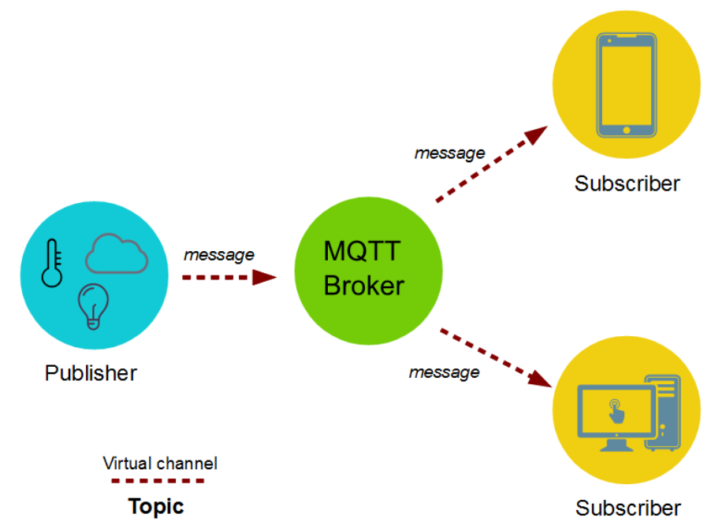

### MQTT 简介

> MQTT（Message Queuing Telemetry Transport，消息队列遥测传输协议）

主要特性：使用极少的代码和有限的带宽，为连接远程设备提供实时可靠的消息服务

`MQTT` 运行于 `TCP/IP` 协议之上

 

### 发布订阅模式

简要流程：发布者将信息发布给 `MQTT Broker`，他再将信息分发给订阅者

发布者发布消息时，会自带一个主题；当且仅当订阅者订阅了指定的主题，`MQTT Broker` 才会将信息分发给订阅者！！

MQTT 服务器只能充当发布者，而不能作为订阅者

 

### 消息格式

MQTT 提供 QoS  
QoS=0 会发生消息丢失或重复  
QoS=1 承诺消息将至少传送一次给订阅者  
QoS=2 保证消息仅传送到目的地一次

载荷 Payload 具有以下四种格式

- CONNECT，消息体内容主要是：客户端的 ClientID、订阅的 Topic、Message 以及用户名和密码
- SUBSCRIBE，消息体内容是一系列的要订阅的主题以及 QoS。
- SUBACK，消息体内容是服务器对于 SUBSCRIBE 所申请的主题及 QoS 进行确认和回复。
- UNSUBSCRIBE，消息体内容是要订阅的主题。

 
