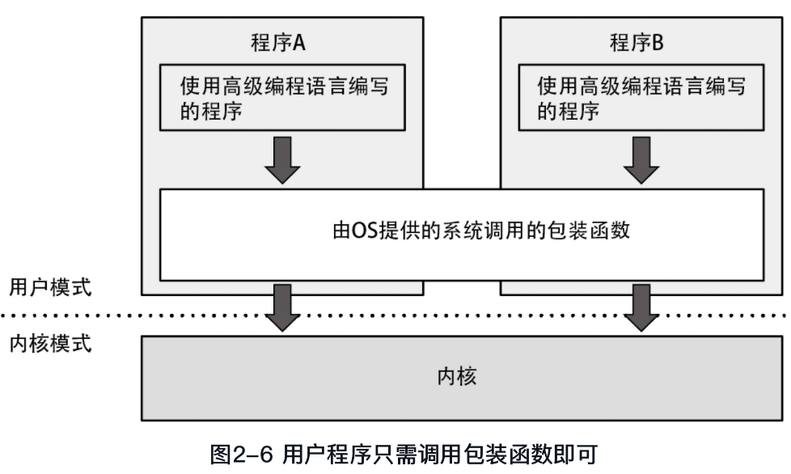
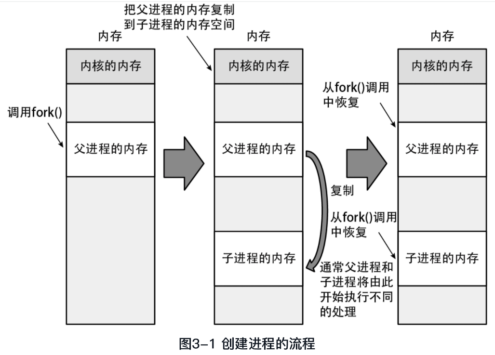
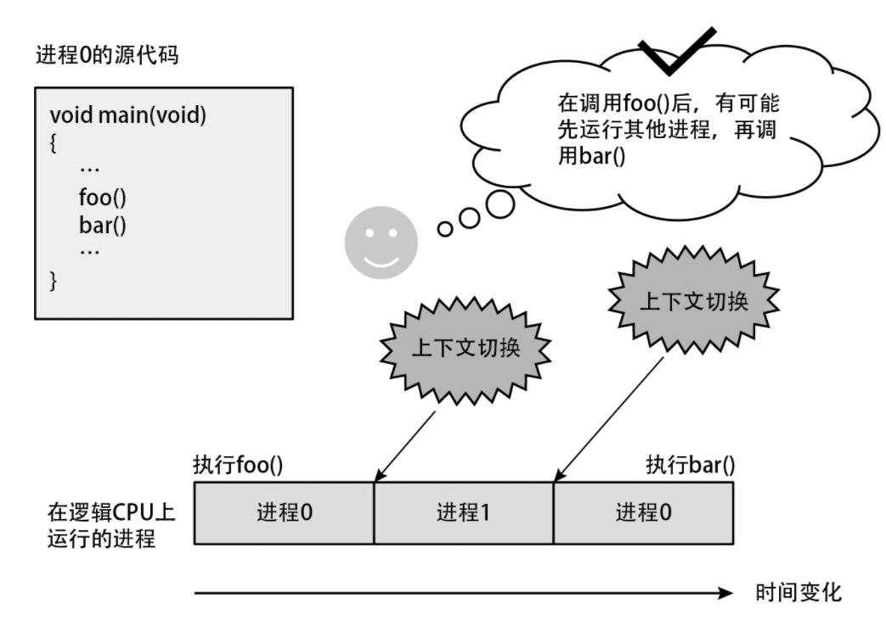
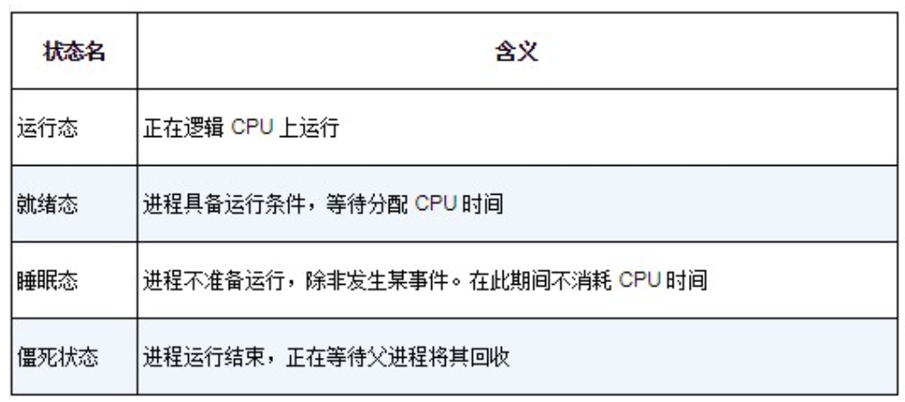
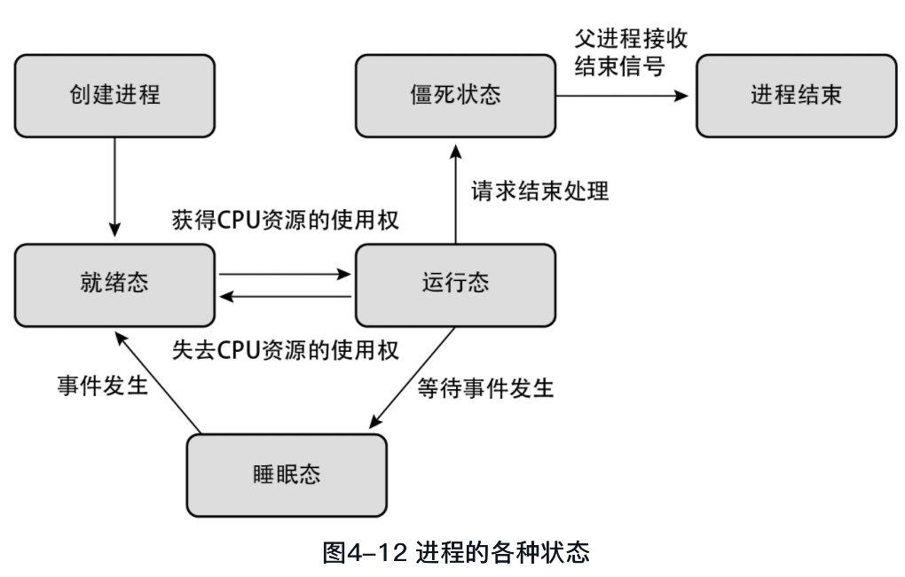
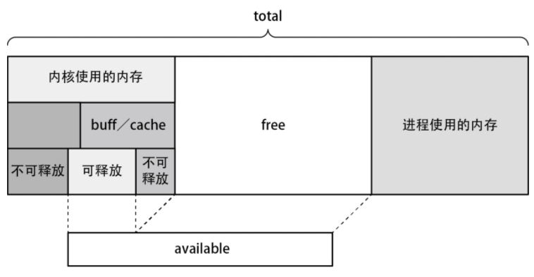
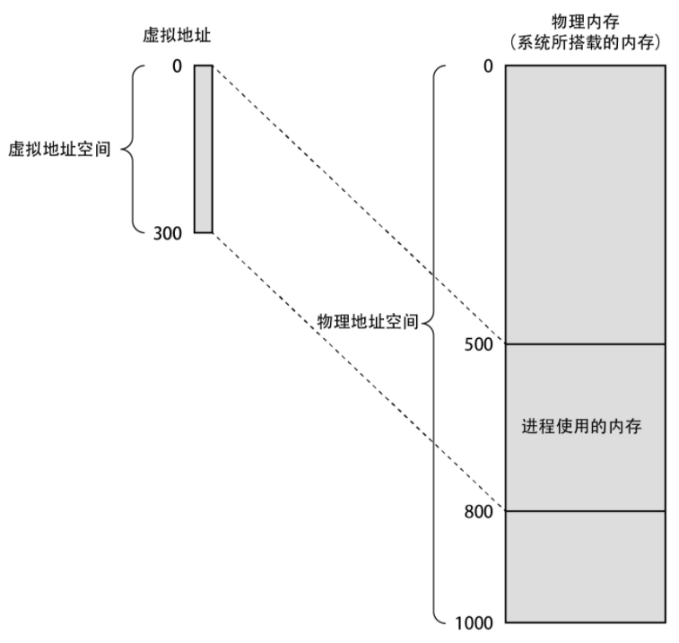
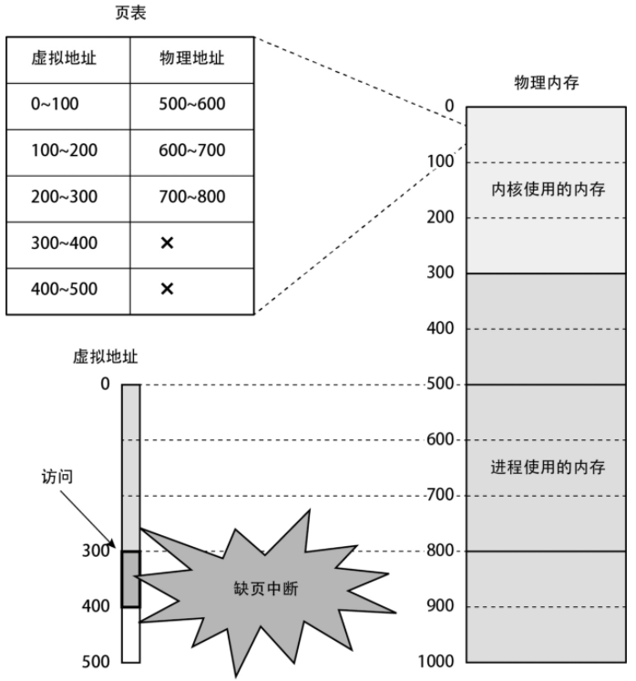
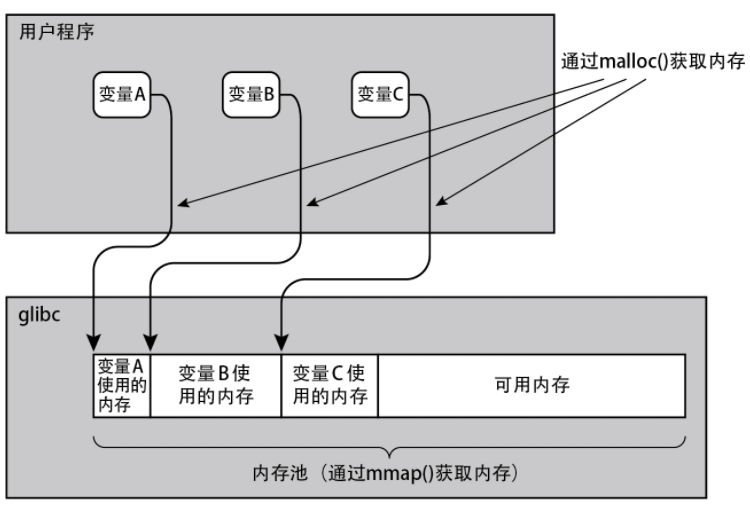
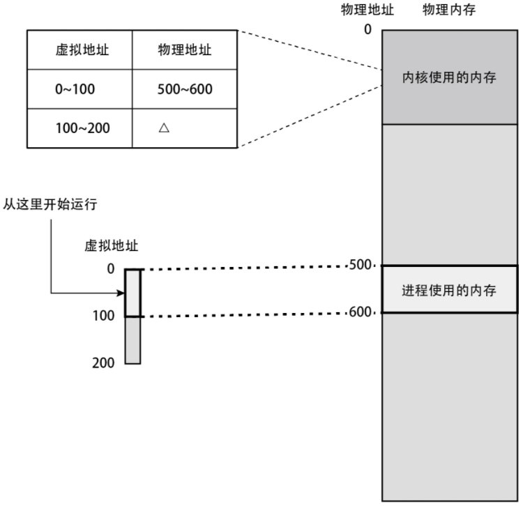

### 用户模式实现的功能

Linux 提供了绝大多数库函数；

调用系统函数需要使用汇编语言，而 `Linux 通过 OS 提供了系统调用的包装函数`，用户可以使用任意类型的高级语言并通过该包装函数转译成汇编语言来获取系统调用

 

Linux 提供了 C 标注库，而 GUN 还是默认使用 glibc 作为 C 标准库，用 C 语言编写的几乎所有程序都依赖于 glibc 库

 

### 进程管理

进程创建的方式

- 为子进程申请内存空间，并复制父进程的内存到子进程的内存空间。
- 父进程与子进程分裂成两个进程，以执行不同的代码。这一点的实现依赖于 fork() 函数分别返回不同的值给父进程与子进程。

 

内核运行程序时的流程

1. 读取可执行文件，并读取创建进程的内存映像所需的信息。
2. 用新进程的数据覆盖当前进程的内存。
3. 从最初的命令开始运行新的进程。

> 即启动另一个程序时，并非新增一个进程，而是替换了当前进程

 

### 进程调度器

进程调度的四个普适性结论

- 不管同时运行多少个进程，在任意时间点上，只能有一个进程运行在逻辑 CPU 上
- 在逻辑 CPU 上运行多个进程时，它们将按轮询调度的方式循环运行，即所有进程按顺序逐个运行，一轮过后重新从第一个进程开始轮流运行
- 每个进程被分配到的时间片的长度大体上相等
- 全部进程运行结束所消耗的时间，随着进程数量的增加而等比例地增加

 

上下文切换

每个进程都被赋予几乎等长的时间片，一旦时间片走完就立刻执行上下文切换，而不管当前进程是否还有代码执行完毕与否  
所以下方代码中，执行完 `foo()` 后可能刚好耗尽时间片，切换到另一进程，则 `bar()` 就不会立刻执行

 

进程的状态

进程具有以下四种状态，而大多数都处于睡眠态

进程之间可以执行切换

 

空闲状态

当逻辑 CPU 上无任何进程运行时，进入空闲状态，此时会执行一些无意义死循环或者开一个新进程，直到一个就绪态的子进程加入  
（系统自然不会这么傻白白耗电，他会主动休眠并等待就绪态进程出现，期间耗电量很小）

逻辑 CPU 的吞吐量随着处理线程数量的增多而升高，当且仅当 CPU 被进程填满后，无论增加多少进程吞吐量都不会变

 

多 CPU

当存在多个逻辑 CPU 时，linux 会使用“负载均衡”分配进程压力到各个 CPU 上面

> 对于多核 CPU 的计算机来说，只有同时运行多个进程才能提高吞吐量  
> 当进程数量多于逻辑 CPU 数量时，吞吐量就不会再提高

 

优先级指定

root 用户可通过 `nice()` 方法指定进程优先级，范围 `-19~20`

 

### 内存管理

Linux 通过内核中名为内存管理系统的功能来管理系统上搭载的所有内存。除了各种进程以外，内核本身也需要使用内存。

 

#### 内存不足

通过 free 指令可获得内存的不同信息，这是对于参数的分解图  

当 free 严重不足时，系统首先释放掉内核中“可释放区域”

若可释放区域释放完后，free 又不足了，此时进入 `OOM （out of memory）` 状态，OOM Killer 会随机选择一个进程直接杀掉，提供 free 内存

 

#### 虚拟内存

虚拟内存使进程无法直接访问系统上搭载的内存，但可通过虚拟地址间接访问  
访问虚拟地址上的指定地址，会自动在物理地址上进行对应转换操作

系统提供了一个页表，分别存储虚拟地址与物理地址的映射关系；  
当我们访问一个不存在的虚拟地址时，就会发生下图的“缺页中断”错误，此时该进程大概率崩溃然后被强制结束；

新建进程需要分配两大部分内存：代码段大小+数据段大小

当存在虚拟内存时，可以执行动态分配内存；

 

#### 内存分配

C 标准库的 `malloc` 方法可以获取字节内存，而其底层实现为调用 `mmap` 方法获取以页为单位的内存

内核内存存储着所有进程的虚拟内存页表，每个进程独占一段物理内存，其余进程无权访问

我们无需关系物理内存映射到那里，直接虚拟内存拿来就用即可

 

#### 高级内存操作

linux 为保证进程内存合理分配，使用以下步骤

- 进程访问入口点。
- CPU 参照页表，筛选出入口点所属的页面中哪些虚拟地址未关联物理地址。
- 在 CPU 中引发缺页中断。
- 内核中的缺页中断机构为步骤 1 中访问的页面分配物理内存，并更新其页表。
- 回到用户模式，继续运行进程。

虚拟内存不足时，无论物理内存还剩多少都无法分配；  
x86 架构的虚拟内存仅 4GB，而 x86_64 架构的虚拟内存增加到 128TB

 

写时复制：物理内存并非在发起 fork() 系统调用时进行复制，而是在尝试写入时才进行复制

子进程复制父进程并不是复制物理内存，而是复制虚拟地址页表

 

**Swap 交换区**  
当内存不足时，系统会暂时使用外部存储当做内存使用，这个外部存储区就是 Swap

换出：即将原本存储于物理内存的数据转存到 Swap 交换区；  
换入：将 Swap 交换区的数据转存到物理内存

 

标准大页机制  
linux 页表使用标准大页机制，可减免内存损耗

 

### 存储层次
