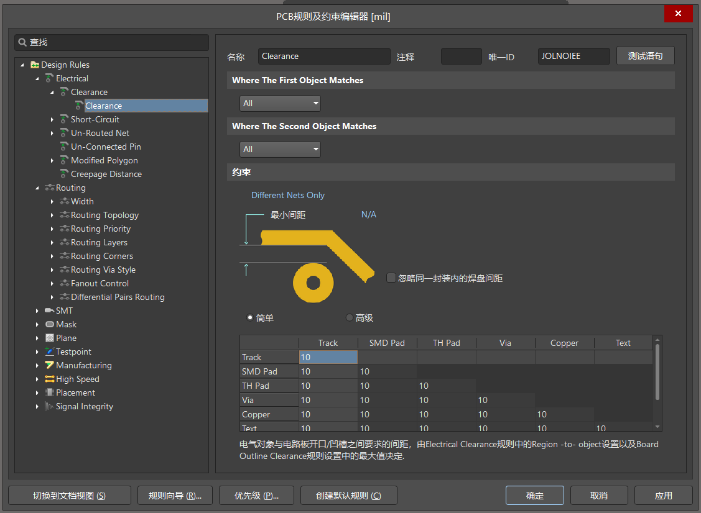
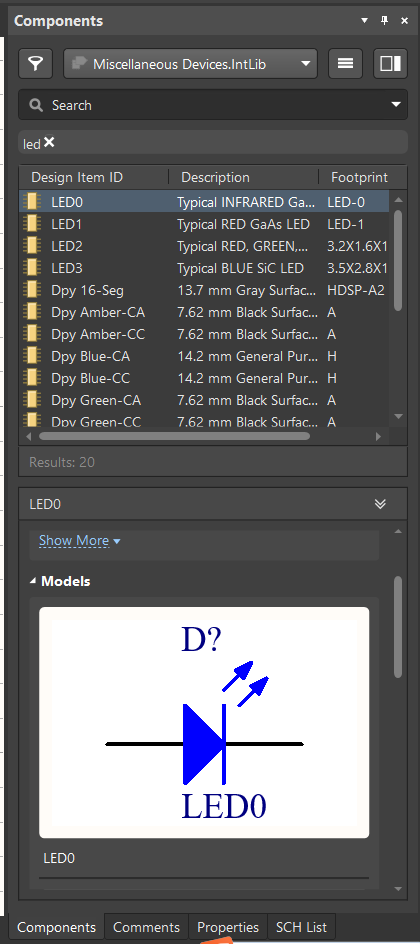
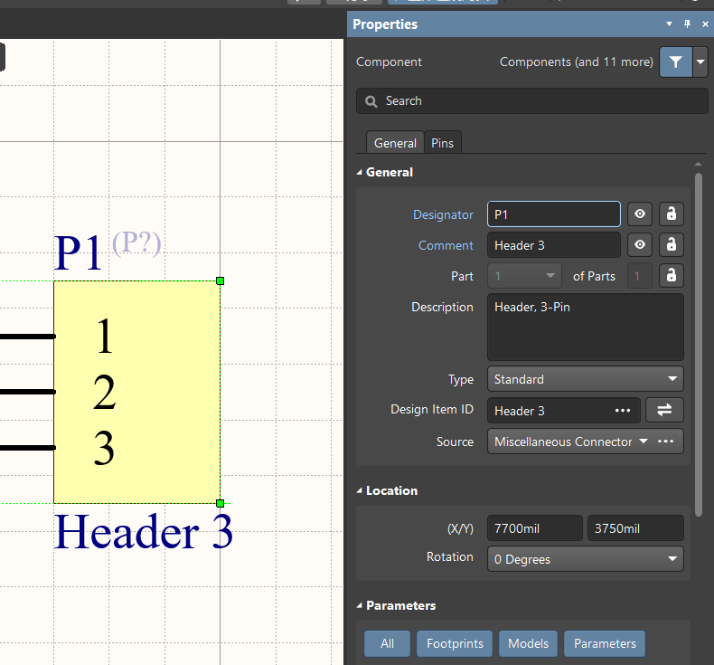
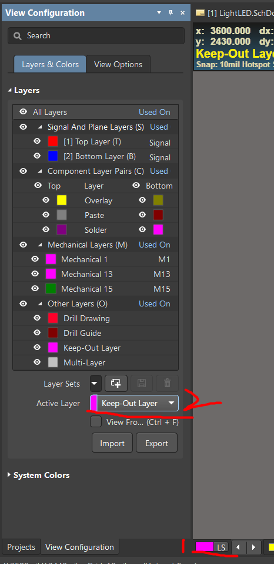
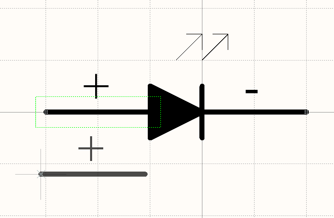
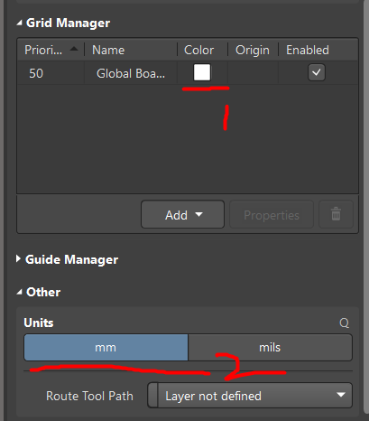
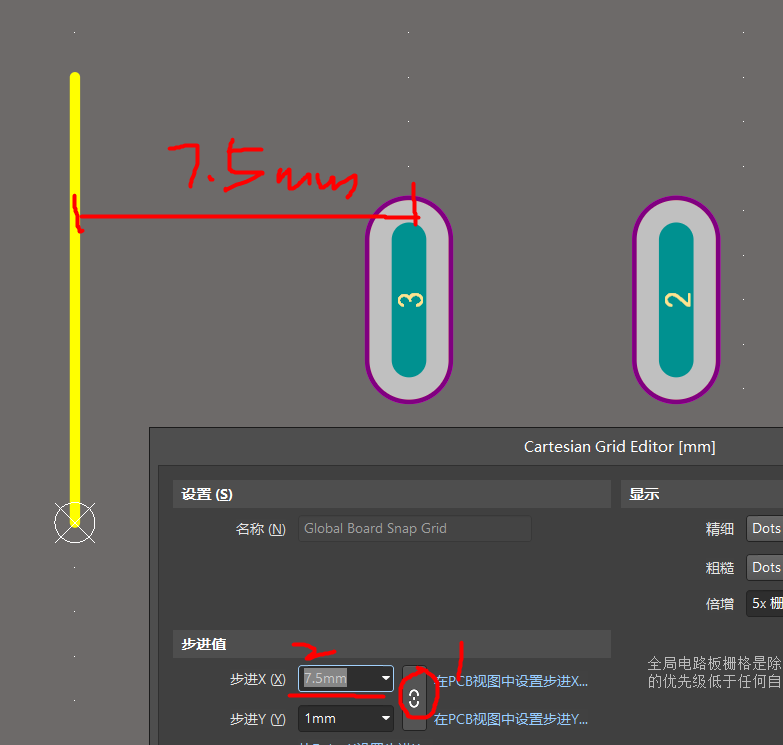
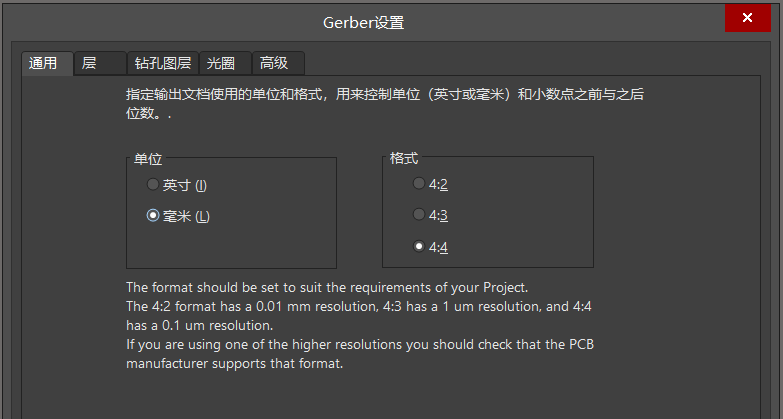
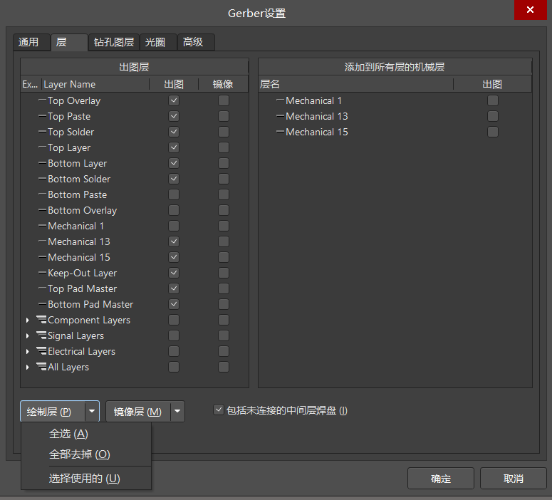

## 前置术语介绍

### 规则

在我们画板子的时候，例如布线等均需要按照一定的标准来绘制，AD 默认自带了规则，我们的绘制如果超出了规则所指定的范围，会自动对我们进行警告

查看规则请点击：设计->规则

#### 规则中英文介绍表

**Electrical 电气规则**  
clearance 安全间距规则  
short circuit 短路规则  
unrouted net 未布线网络规划  
unconnected pin 未连接引脚规则  
modified polygon 当铺铜后又对 PCB 执行修改，就会报错说铺铜失效

 

**Routing 布线规则**  
width 线宽设置  
routing topology 走线拓补布局规则  
routing priority 布线优先级规则  
routing layers 布线板层线规则  
routing corners 导线转角规则  
routing via style 布线过孔形式规则  
fan out control 布线扇出控制规则  
differential pairs routing 查分对布线规则

 

**SMT 表面贴装技术规则**  
SMD to corner 焊盘与导线拐角最小间距  
SMD to plane 焊盘与电源层过孔最小间距  
SMD neck down 焊盘颈缩率规划

<b>r

**Mask 阻焊层规则**  
solder mask expansion 阻焊层收缩率  
paste mask expansion 阻焊层收缩率

 

### Gerber 生成文件功能介绍

当使用 Altium Designer 生成 `Gerber` 文件时，以下是一些常见的 Gerber 文件及其对应的作用及文件后缀名：

1. Top Copper Layer (顶层铜层)：描述 PCB 顶层的铜导线图案，包括信号路径、电路连接和焊盘等。文件后缀名通常为".GTL"。

2. Bottom Copper Layer (底层铜层)：描述 PCB 底层的铜导线图案，与顶层铜层相似，但位于 PCB 底面。文件后缀名通常为".GBL"。

3. Top Solder Mask Layer (顶层焊盘阻焊层)：该文件定义了顶层焊盘的阻焊区域，用于控制焊盘的覆盖区域。文件后缀名通常为".GTS"。

4. Bottom Solder Mask Layer (底层焊盘阻焊层)：类似于顶层焊盘阻焊层，但是作用于底层焊盘。文件后缀名通常为".GBS"。

5. Top Silkscreen Layer (顶层丝印层)：描述顶层的丝印信息，包括元件标识、参考设计 ator、公司标志等。文件后缀名通常为".GTO"。

6. Bottom Silkscreen Layer (底层丝印层)：类似于顶层丝印层，但是作用于底层。文件后缀名通常为".GBO"。

7. Drill Drawing Layer (钻孔图层)：该文件描述了 PCB 板上的孔位信息，包括各种钻孔的位置和尺寸。文件后缀名通常为".TXT"。

8. Board Outline Layer (板外形层)：描述 PCB 的整体形状和尺寸，包括边界和切割线。文件后缀名通常为".GML"。

9. Internal Copper Layers (内部铜层)：如果 PCB 设计包含多层板，每个内部铜层都有对应的 Gerber 文件。这些文件描述了内部层的铜导线图案。文件后缀名通常为".GL2"（内部层 2）或".GL3"（内部层 3）等。

 

## 基础功能

### 原理图绘制

> 首先确保你已经新建一个项目了，后续的所有原理图、PCB 以及各种库都是建立在一个项目下面的

新建原理图：文件->新的->原理图

常用快捷键：ctrl+w 画电线，p 弹出绘制窗口

此时查看右侧，点开 components 窗口，我们可以在该窗口选择 AD 内置的两个元件库，在里面能找到大部分我们会用到的基础元器件，善用搜索功能  

此时我们随意拖动一个元件到原理图上，之后选中它，点击右侧的 properties 窗口，即可打开设置界面  
在这里对元件参数进行配置  

 

如果我们目前有多个原理图，那么有可能在生成对应 PCB 文件时会出现错误，我们可以在左侧的检视窗口内右键点击我们目前暂时用不到的原理图，然后选择 `remove from project` ，弹出窗口选择 `exclude` 即可

 

### PCB 绘制

#### 绘制前准备

在绘制 PCB 之前，确保你已经有（至少）一张原理图了

先新建一个 PCB：`文件->新的->PCB`  
然后回到原理图，点击：`设计->update pcb document xxx.pcbdoc`

此时就可以自动的把原理图中的元件全部导入到对应的 PCB 文件里面去了

 

#### 快捷键

常用快捷键：  
2 二维显示 PCB  
3 三维显示 PCB  
9 三维状态下，使 PCB 旋转到 90 度后正对着你  
0 三维状态下，使 PCB 旋转到 0 度后正对着你

ctrl w 交互式布线

space 旋转元件

 

#### 调节板子形状

> PCB 绘制界面中的纯黑色底板就是板子覆盖的大小

目前较新版本（当前演示版本为 AD22）绘制板子形状测步骤有所改变，请仔细根据以下步骤依次执行

首先点击绘制界面左下方的图层，左侧窗口中 `active layer` 选择为 `keep-out layer`  

绘制矩形，矩形大小即为你希望的板子大小（记得提前放置好元件，然后用矩形包裹住所有元件）

点击 ctrl+a 全选所有元件  
点击：`设计->板子形状->按照选择对象定义`

即可自动生成以矩形范围的板子

 

#### 布线

可以直接使用交互式布线，手动连线，联系布线规则

当然，图省事可以直接自动布线：`布线->自动布线->全部`

 

### 原理图库

创建新的原理图库：`文件->新的->库->原理图库`

下面是我简单绘制的 LED，注意绘制管脚时候鼠标位置会出现一个大十字，这个就是外接端子，他必须朝外！！！这很重要！！！  

再绘制管脚的时候（快捷键 p+p），按一下 tab 键可以暂停，然后右侧修改管脚参数，修改完毕后点击 esc 恢复，此时就可以放置我们改过参数后的管脚了

既然是原理图库，那么必然可以绘制多个元器件  
新增元器件的方法：`工具->新器件`

 

### PCB 元件库

创建新的 PCB 元件库：`文件->新的->库->PCB元件库`

首先点击任意空白处，在右侧的 properties 界面，我么需要修改一些参数

由于默认图纸的栅格原点很模糊，我们在 `grid manager` 里面将原点改为纯白色，有助于我们绘图  
之后可以在 `other` 里面修改单位制，或者直接用 `ctrl+q` 快速切换单位  

 

### 3D 建模

 

## 增效操作

### 单位调节对齐法

首先按 `ctrl+q` 将当前单位制切换成 mm

下图即为完成后的 PCB 图，我们通过设置栅格上 x 轴方向坐标轴之间的间距，从而实现快速调节指定间距的功能！

比如我想要槽 3 距离左侧黄线 7.5mm，那么按下 `ctrl+g` 打开全局栅格间距单位设置，然后按照下图所示

- 第一步先点掉锁链，即不让 xy 轴同时改变，我们只需要设置 x 轴的间距
- 第二步改变 x 轴间距为 7.5mm

此时直接移动槽 3，就可以实现快速调节到指定距离了

> 调节完毕后可以直接 `ctrl+g` 再次调回原来的 1mm，这都是可以的！

 

### 生成制版文件 GerberFile

> 为便于 PCB 厂商进行打板，我们需要获取当前 PCB 的制版文件 gerber

打开生成窗口：`文件->制造输出->Gerber Files`

通用选项组：可以选择制版单位，右侧的“格式”表示对应的精确度  
比如我们选择“毫米”，格式选择 4:4，那么对应的精确度就是 0.1um  
（详细的精确度可以看截图中的英文部分介绍）

 

层选项组：选择制版所需的层，我们可以直接点击左下方“绘制层”左侧的小三角，然后选择“选择使用的层”，AD 就会自动选择对应的层，无需我们手动选择！

`绘制层`：包含了 PCB 设计的电路连接、元件布局和走线等图形信息。它定义了导线、焊盘、孔位和其他元件的位置、形状和尺寸。  
`镜像层`：用于标记电子元件的位置、符号和标识。它包含了丝印（Silkscreen）的图形信息，如元件名称、参考设计 ator、公司标志等。

注意，为避免不必要的错误，请务必记得勾选“包括未连接的中间层焊盘”

 

其余的选项不需要做多余的变动，保持默认即可

所有操作完毕，直接点击确定，自动生成 `gerber` 文件

 

## 必背快捷键

### 绘制类

`ctrl w` 绘制线（原理图模式下）  
`p` 绘制工具窗口

`shift` 在 PCB 中调节元件位置时，按住该键可以实现对齐

 

### 单位调节

`g` 快速调节对齐单位  
`ctrl g` 全局网格对齐设置

`ctrl q` mm 和 mil 单位制切换（在任意窗口下使用此快捷键均可！）

`m` 偏移值设定

 
