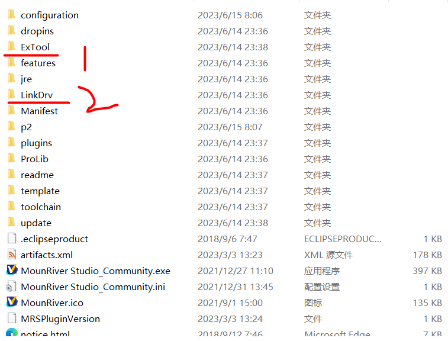
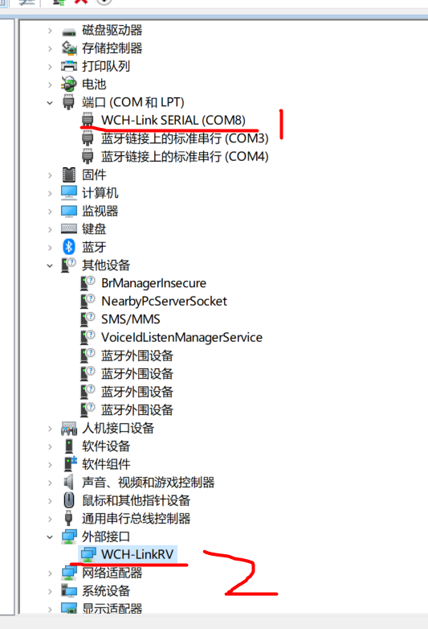
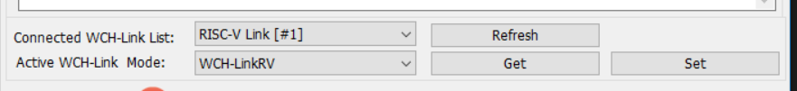
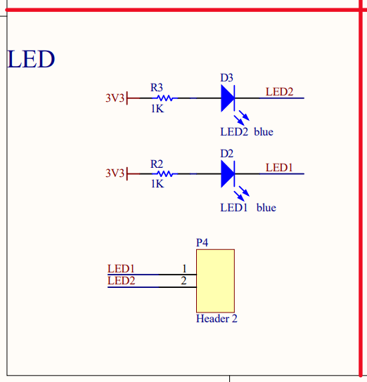
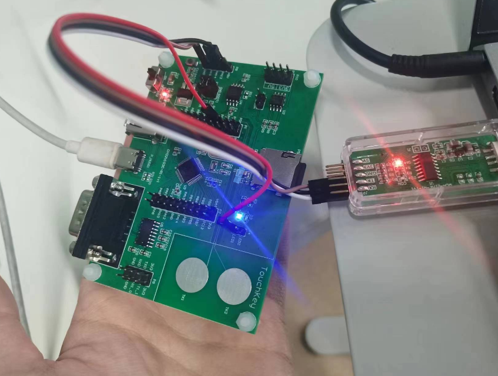
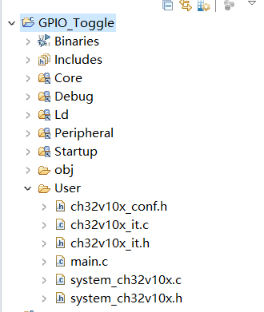
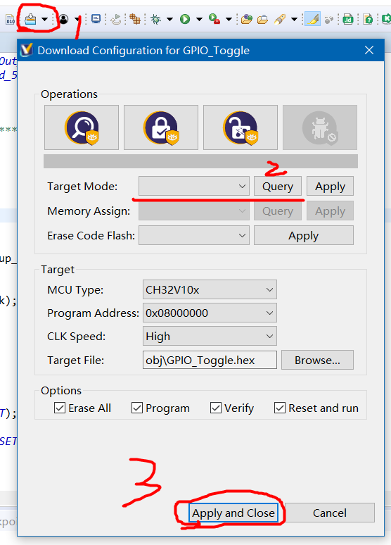

### 为什么选择这块板子？

它基于 `RISC-V` 架构，来看看 GPT 给出的介绍：

RISC-V 是一种开源的指令集架构(ISA),与 x86 和 ARM 相似。它具有以下主要特点
• 简单 - RISC-V 采用精炼而简单的 RISC 指令设计,只有一些基本的常用指令。这使得 RISC-V 体系结构相对便于实现。
• 可扩展 - RISC-V 定义了多个 ISA 方案,从最基础的只有 32 个指令的 RV32I,到带浮点的 RV64GC 等。这提供了不同需求的选择。
• 开源 - RISC-V 的 ISA 及其相关规范完全开源和免费。任何人都可以在不必支付许可费用的情况下实现和使用 RISC-V。
• 硬件/软件定制可控 - 由于 RISC-V 是开源的,所以硬件和软件设计人员可以定制和优化 RISC-V implementations 以满足其需要。
• 跨平台 - RISC-V 可以实现在不同类型硬件平台上,如标准 CPU、SOC、FPGA 和 ASIC 等。这提供了很大的灵活性。
• 被广泛采用 - 许多公司和组织已经采用 RISC-V 来设计 CPU、SOC 甚至超级计算机。RISC-V 也已在嵌入式场景应用广泛。

<br>

虽然沁恒已经给出了对应开发板的示例项目，但是对应库函数介绍或者内核介绍可以说几乎没有，甚至 `WCH-Link` 配置过程也相当简略而不透彻。

但是其使用的库函数与 STM32 基本一致，内核结构等也无差别，可以通过该板子快速上手库函数开发，了解一些简单的概念，比如 `GPIO ADC/DAC 看门狗 定时器 中断 PWM` 等核心知识点，之后再转 STM32，就会更加简单了

<br>

### CH32V103C8T6

> 还没有拿到沁恒开发板的小伙伴可以移步这里进行样品申请（板子免费但是运费顺丰到付）：[样品索取](https://www.wch.cn/services/request_sample.html)

我这里到手的是 `CH32V103C8T6` 评估板，运气不太好，有更高级的 30 系列的拿不到

去这里下载芯片手册和数据手：[手册下载](https://www.wch.cn/products/CH32V103.html)

我们还需要一个官方 ISP 工具：[WCHISPStudio](https://www.wch.cn/downloads/WCHISPTool_Setup_exe.html)

<br>

### MRS

MRS 全称 MounRiver Studio，专门为沁恒系列产品开发而设计的一款基于 Eclipse 的 IDE

[在这里下载 IDE](http://www.mounriver.com/download)

我选择的是社区版，最顶上的那个其实也可以，看个人需求；

安装过程就是一直下一步就好了；

<br>

安装完毕我们来到 IDE 的根目录下，有几个重要的文件夹需要大家知晓

ExTool 存放烧写工具等其余实用工具  
LinkDev 存放 WCH-Link 的驱动文件  


<br>

### WCH-Link

Link 工具可以使用以下两种方式安装：

- 方法一：如果在此之前我们已经安装了 MRS，那么 `WCHLinkUtility` 可以在 MRS 根目录下找到：  
  `..\MRS_Community\ExTool\SWDTool`
- 方法二：前往官网下载对应的 Link 烧录工具以及说明书：[点击前往](https://www.wch.cn/search?t=all&q=WCHLINK)

<br>

在 MRS 根目录下找到驱动安装文件位置（上一小节已经提到过）  
`..\MRS_Community\LinkDrv\WCHLink`

双击文件内的 SETUP.EXE 运行驱动安装程序，程序打开后点击安装驱动即可  
安装成功会弹出对应窗口

<br>

当我们拿到沁恒寄付的样品时，会默认拿到一个 Link，该版本是 `WCH-Link-R1-1V1`

我们直接把他插到电脑的 USB 接口上去，你会发现出现两种亮灯情况

- 只亮红灯：表示 Link 处于 RISC-V 状态
- 同时亮红灯和蓝灯，表示 Link 处于 ARM 状态

此时打开设备管理器（右键电脑->管理->设备管理器）  
看见端口识别且外部接口出现 WCH-LinkXX 字样即可（XX 根据你选择的架构师 RISC-V 还是 ARM 的不同而不同）



> 如果发现在“其他设备”一栏内部出现 WCH-Link，表示你的驱动还没有安装，windows 识别不了，安装一下然后重新插拔 Link 即可

<br>

> 此步骤也可以在 MRS 中实现，所以你可以跳过这一步

打开 WCHLinkUtility 工具

首先按照下图所示，先点击 Refresh 检测 Link，检测到了会出现对应名称  
然后点击下方的 Get，获取当前 Mode，我这边默认的是 WCH-LinkRV 模式

你可以任选一个，比如 DAP 模式，然后点击 Set，即可更改 Mode

更改时 Link 处于工作状态，此时蓝灯不断闪烁，红灯熄灭



<br>

### 第一个程序！

<br>

#### 连线

元件准备：

- 一个 WCH-Link 版本：`WCH-Link-R1-1V1`
- 一个沁恒评估板 版本：`CH32V103C-R1-1V1`
- 一条 Type-C 数据线
- 四条母对母杜邦线

在开始之前，我们需要分析一下原理图；  
打开原理图手册`CH32V103SCH.pdf` 他放在我们下载的数据包 `EVT/PUB`下面

我们找到该评估板对应原理图，发现比较抽象的是，板子上的 LED 并没有直接和芯片引脚链接，也就是说我们没法直接通过设置芯片 GPIO 高低电平直接控制 LED，还是需要引出一条外部跳线到下图所示的的 P4 上面，才可以控制对应 LED（连线图在后续会给出）



<br>

拿出我们的 Link，按照下述使用三条母对母线连接评估板上对应针脚

- SWCLK 连 PA13
- SWDIO 连 PA14
- GND 连 GND

为避免电流波动，我们改为使用 `type-c` 数据线给电  
把数据线连接到板子上唯一一个 type-c 口，我这边用的是 5V，不知道 3V 可不可以，大家可以试试

打开板子上的开关，此时红灯点亮，成功给电

在使用另外一根杜邦线，把 PA4 和 P4 上的 LED1 针脚链接

最终我们会呈现下图所示的状况（下图展示的是整个 GPIO 项目完成后的结果）



<br>

#### GPIO 项目

打开官方自带的 GPIO 项目

点击 IDE 左上方的 `file->open project from file system`  
注意，我们选择打开工程时，直接选择整个工程文件夹，不要学着 keil 的样子打开工程目录文件夹下的 `wvproj` 文件



<br>

打开文件 `User/main.c`

对于学过 STM32 的同学来说，第一段代码块肯定很熟悉，对对应 GPIO 口进行初始化

简单读一下默认程序，发现它初始化的是 `RCC_APB2Periph_GPIOA` 下的 `GPIO_Pin_0` 口  
说人话就是初始化 `PA0`

但是我们需要对其进行测试，则将输出 pin 改为 4 口，即 `GPIO_Pin_4` ，下方即为最终代码

```c
/**
 * @brief 初始化用于GPIO切换的GPIO引脚
 */
void GPIO_Toggle_INIT(void)
{
    GPIO_InitTypeDef GPIO_InitStructure = {0}; // 定义GPIO初始化结构体

    RCC_APB2PeriphClockCmd(RCC_APB2Periph_GPIOA, ENABLE); // 使能GPIOA的时钟

    GPIO_InitStructure.GPIO_Pin = GPIO_Pin_4; // 设置GPIO引脚为Pin_4
    GPIO_InitStructure.GPIO_Mode = GPIO_Mode_Out_PP; // 设置GPIO工作模式为推挽输出
    GPIO_InitStructure.GPIO_Speed = GPIO_Speed_50MHz; // 设置GPIO输出速度为50MHz

    GPIO_Init(GPIOA, &GPIO_InitStructure); // 初始化GPIOA引脚，应用上述设置
}

```

<br>

进入 main 函数块

我们想要实现的功能很简单，就是让 LED1 每隔一秒闪烁一次，直接使用沁恒提供的延迟库函数即可实现  
故将源代码改为如下内容

```c
int main(void)
{
    NVIC_PriorityGroupConfig(NVIC_PriorityGroup_2); // 配置中断优先级分组为Group 2
    Delay_Init(); // 初始化延时函数
    USART_Printf_Init(115200); // 初始化串口打印函数，波特率为115200
    printf("SystemClk:%d\r\n", SystemCoreClock); // 打印系统时钟频率

    printf("GPIO Toggle TEST\r\n"); // 打印测试提示信息
    GPIO_Toggle_INIT(); // 初始化GPIO引脚用于切换

    while(1)
    {
        Delay_Ms(1000); // 延时1秒
        GPIO_WriteBit(GPIOA, GPIO_Pin_4, Bit_SET); // 设置GPIO引脚输出为高电平
        Delay_Ms(1000); // 延时1秒
        GPIO_WriteBit(GPIOA, GPIO_Pin_4, Bit_RESET); // 设置GPIO引脚输出为低电平
    }
}
```

<br>

完整 `main.c` 代码清单

```c
#include "debug.h"
 // 初始化GPIO PA4为输出模式，用于LED灯控制
 void GPIO_Toggle_INIT(void)
 {
     GPIO_InitTypeDef GPIO_InitStructure = {0};
     // 使能GPIOA时钟
     RCC_APB2PeriphClockCmd(RCC_APB2Periph_GPIOA, ENABLE);
     // 配置GPIOA的第4个引脚
     GPIO_InitStructure.GPIO_Pin = GPIO_Pin_4;
     // 设置为推挽输出模式
     GPIO_InitStructure.GPIO_Mode = GPIO_Mode_Out_PP;
     // 设置输出速度为50MHz
     GPIO_InitStructure.GPIO_Speed = GPIO_Speed_50MHz;
     // 初始化GPIOA的第4个引脚
     GPIO_Init(GPIOA, &GPIO_InitStructure);
 }
 int main(void)
 {
     // 设置中断优先级分组为2
     NVIC_PriorityGroupConfig(NVIC_PriorityGroup_2);
     // 初始化延时函数
     Delay_Init();
     // 初始化USART printf函数，波特率为115200
     USART_Printf_Init(115200);
     // 打印系统时钟频率
     printf("SystemClk:%d\r\n", SystemCoreClock);
     // 打印GPIO Toggle测试的提示信息
     printf("GPIO Toggle TEST\r\n");
     // 初始化GPIOA的第4个引脚为输出模式
     GPIO_Toggle_INIT();
     while(1)
     {
         // 延时1秒
         Delay_Ms(1000);
         // 将GPIOA的第4个引脚设置为高电平
         GPIO_WriteBit(GPIOA,GPIO_Pin_4,Bit_SET);
         // 延时1秒
         Delay_Ms(1000);
         // 将GPIOA的第4个引脚设置为低电平
         GPIO_WriteBit(GPIOA,GPIO_Pin_4,Bit_RESET);
     }
 }
```

<br>

#### 编译烧写

右键点击 `Project Explore` 下的项目根文件夹，点击 `Build Project` 即可自动进行编译构建

编译完毕后 obj 文件夹会多出很多文件，最关键的就是 hex 文件，如果没有的话可以参考这里的 IDE 官网说明书自行配置：[看看说明书](http://www.mounriver.com/help)

<br>

按照下图，点击菜单栏的上的 Download 图标右侧小三角，下拉框选择 configuration 进入设置界面

如果我们之前使用 WCH-LinkUtility 设置了 Link 的模式为 WCH-LinkRV，那就不用管了，直接点击 query 后 apply 关闭页面即可

如果没有配置，我么需要先 query，然后在 target mode 内选好 WCH-LinkRV，再点击 apply 应用，会让你等一段时间以便更新固件，之后按照流程操作即可



<br>

最后一步！

确认开发板所有电路线都没有接错后，点击 `Download` 按钮，开始烧写；  
此时 Link 蓝灯闪烁，烧写完成，蓝灯熄灭

> 可见，再所有步骤完毕后，开发板上 LED1 所在位置亮起了蓝灯，间隔 1s 后熄灭

<br>
