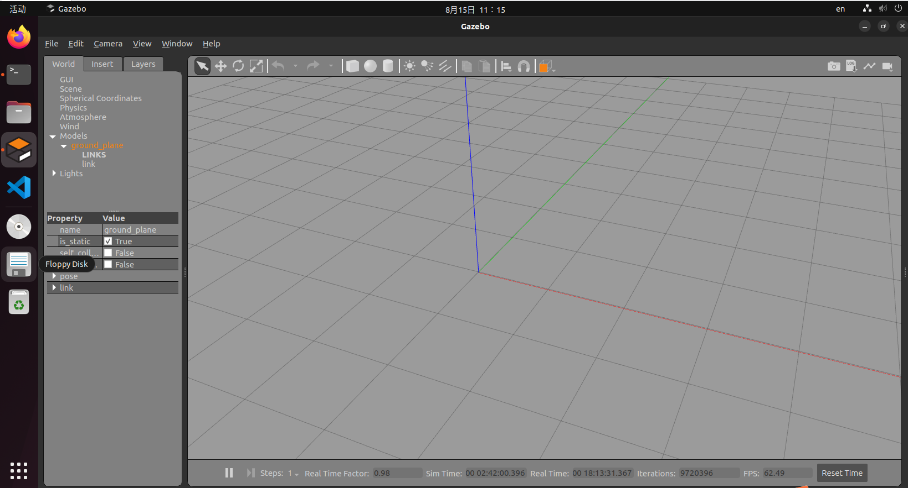

## 安装

> 实验环境：ubuntu22.04LTS

<br>

### 安装 Gazebo

首先我们需要安装必须的工具

```sh
sudo apt-get update
sudo apt-get install lsb-release wget gnupg
```

之后修改源，并 update 一下来更新

```sh
sudo wget https://packages.osrfoundation.org/gazebo.gpg -O /usr/share/keyrings/pkgs-osrf-archive-keyring.gpg
echo "deb [arch=$(dpkg --print-architecture) signed-by=/usr/share/keyrings/pkgs-osrf-archive-keyring.gpg] http://packages.osrfoundation.org/gazebo/ubuntu-stable $(lsb_release -cs) main" | sudo tee /etc/apt/sources.list.d/gazebo-stable.list > /dev/null
sudo apt-get update
```

最后，直接运行下载 gazebo 本体即可  
（目前是最新方法，目前网上部分于 2022 年发布的安装方法基本已经果实，大概率提示找不到软件包，所有请使用以下方法安装 gazebo）

```sh
sudo apt-get install gazebo
```

<br>

### 启动 Gazebo

成功安装后（大概需要 1GB 空间），点击桌面左下角的“显示应用程序”，里面找到 gazebo 快捷方式，点击即可打开

当然，为了方便，你也可以把该快捷方式拖动到左侧导航栏里面

成功运行后的界面是这样的



<br>

### 安装其余版本的 Gazebo

当你前往 gazebo 官网时，官网给出的安装方式使用的是 GazeboGarden 版本，安装完毕后运行是 GazeboSim 界面，并不是我们要做仿真用到的 GazeboGUI 界面

所以不要跟着官网的步骤安装 Gazebo

如果有必须要求，你可以去官网的安装界面进一步查看：[前往官网](https://gazebosim.org/docs/garden/install_ubuntu)

<br>

## 简单开始
