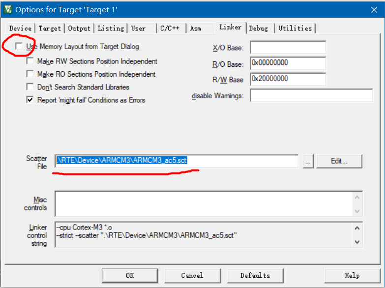

### 新建 FreeRTOS 工程

<br>

#### axf 报错

keli 默认使用 object 下的 axf 文件，他默认会报错，我们需要切换为以下路径的对应文件  
`.\RTE\Device\ARMCM3\ARMCM3_ac5.sct`

如下图，点击 keli 菜单上的魔法棒图标，进入 linker 选项卡，取消勾选 `use memory layout from target dialog`，之后在当前项目文件夹下找到下图所示的 axf 文件，然后点击确认

之后直接 rebuild 重新编译，即可消除该错误！！！



<br>

### 裸机系统与多任务系统

此部分和 uCOS 完全一致，不再过多废话

<br>

### 列表与列表项

<br>

这里的列表，实际上就相当于 C 中的链表结构

freertos 中最常用的实际上是双向链表

<br>

```c
// 定义链表节点
struct xLIST_ITEM
{
	TickType_t xItemValue;             // 辅助值
	struct xLIST_ITEM *  pxNext;       // 指向下一个节点
	struct xLIST_ITEM *  pxPrevious;   // 指向上一个节点
	void * pvOwner;					   // 指向该节点内核对象，通常为TCB
	void *  pvContainer;		       // 指向节点所在链表
};
typedef struct xLIST_ITEM ListItem_t;  // 节点数据类型重定义
```

<br>

### 任务定义与任务切换

<br>

#### 创建任务

多任务系统内所有任务均独立且互不干扰，故下方为创建任务的主要步骤

1. 定义一个全局数组作为任务栈
2. 定义任务函数，函数主体无限循环且不能返回
3. 定义存储各个任务基本信息的任务控制块（TCB）
4. 实现任务创建函数，任务创建有静态和动态两种方式

<br>

#### 就绪列表

> 任务创建好之后，我们需要把任务添加到就绪列表中，表示任务已经就绪，系统随时可以调度

实现就绪列表步骤

1. 定义一个 List_t 类型的数组作为就绪列表，数组的下标对应任务的优先级，同一优先级的任务统一插入就绪列表的同一条链表中
2. prvInitialiseTaskLists()函数内初始化就绪列表

TCB 中的 `xStateListItem` 成员可视为挂载到就绪列表的一个接口，将任务插入就绪列表中，就是通过将任务控制块的 xStateListItem 节点插入就绪列表中

<br>

#### 调度器

> 调度器是操作系统的核心，其主要功能就是实现任务的切换，即找到最高优先级任务然后执行它

`vTaskStartScheduler()` 函数完成调度器的启动

SVC 中断要想被成功响应，其函数名必须与向量表注册的名称一致

任务切换就是在就绪列表中寻找优先级最高的就绪任务，然后执行该任务

任务切换的流程（基于 PendSV 中断服务函数）

1. 定义全局指针 pxCurrentTCB 指向当前正运行或即将运行的任务的 TCB
2. 将 psp 的值存储到 r0 寄存器
3. 加载 pxCurrentTCB 的地址到 r3，再将其加载到 r2
4. 以 r0 作为基址，将 r0 的值存储到 r2 指向的内容
5. 将 r3 和 r14 临时压入栈，提供栈保护

<br>

#### 中断优先级

`BASEPRI寄存器` 该寄存器用于调配基准中断优先级（说人话就是，超过该寄存器设置的优先级值的中断才可被响应，否则一律过滤掉不响应！）

<br>

`PSP(Process Stack Pointer)`:进程堆栈指针,用于普通任务的栈。  
`MSP(Main Stack Pointer)`:主堆栈指针,用于中断服务例程的栈。

- PSP 指向任务栈的栈顶,用于任务的函数调用、变量局部化等。每个任务都有自己的 PSP。
- MSP 指向中断服务例程栈的栈顶。所有中断和异常都使用同一个 MSP。
- 开启中断后,CPU 会自动从 MSP 中保存上下文并恢复,因此中断服务例程使用 MSP。
- 任务切换时,任务上下文是从 PSP 中保存和恢复的。
- 在 FreeRTOS 初始化时,会初始化这两个寄存器:
- PSP 指向任务控制块中 taskTOP_OF_STACK 成员,对应任务栈的顶部。MSP 指向中断栈的顶部。
- 在中断服务例程中,不能修改 PSP,必须使用 MSP。
- 在任务中,不能修改 MSP,必须使用 PSP。

<br>

### 临界段保护

<br>

什么是临界段？  
即一段在执行时不能被中断的代码段

FreeRTOS 中，对中断的开和关是通过操作 BASEPRI 寄存器来实现

- 大于等于 BASEPRI 的值的中断会被屏蔽
- 小于 BASEPRI 的值的中断不会被屏蔽，不受 FreeRTOS 管理

开中断和关中断的区别？

- 开中断(Interrupts Enabled):中断使能状态,该状态下 CPU 可以响应中断请求。
- 关中断(Interrupts Disabled):中断禁止状态,CPU 不响应任何中断请求。

<br>

#### 关中断

分为两种

- 无返回值的关中断函数：不可嵌套、不可用于中断、没有存储参数的功能
- 带返回值的关中断函数：即向 BASEPRI 写入新值时，先将 BASEPRI 的值保存起来，在更新完 BASEPRI 的值时，将之前保存好的 BASEPRI 的值返回，返回的值作为形参传入开中断函数

<br>

#### 开中断

开中断也分为两个版本

- 不带中断保护：直接设置 BASEPRI=0
- 带中断保护：将上一次关中断时保存的 BASEPRI 的值作为形参

<br>

#### 临界段出入
