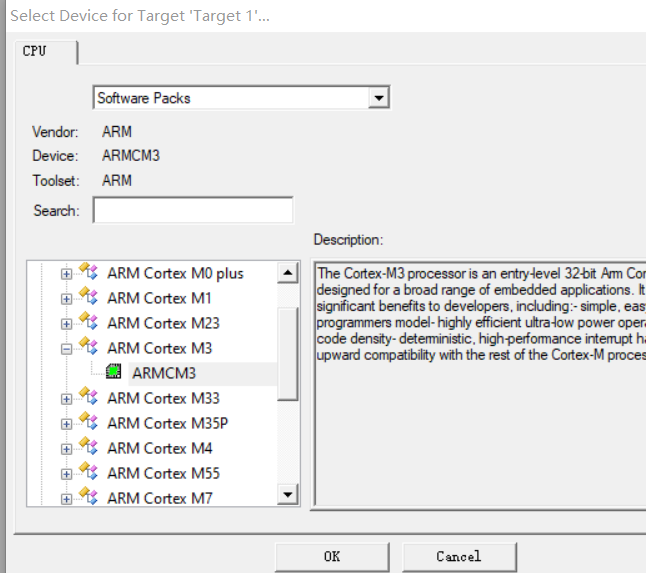
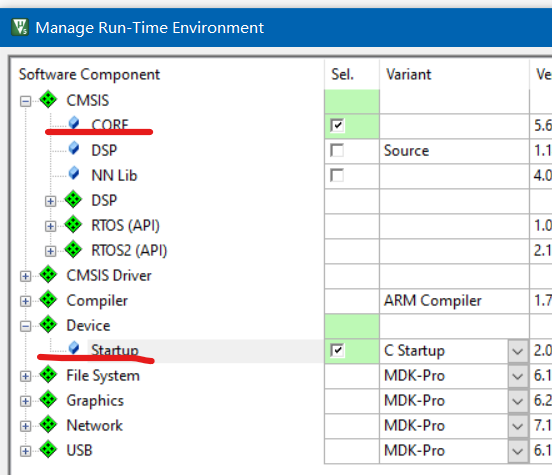
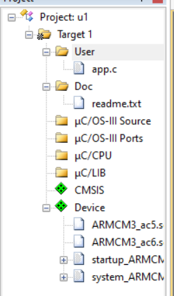
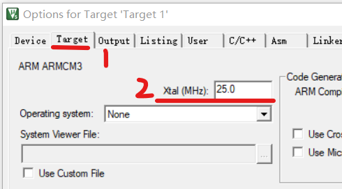
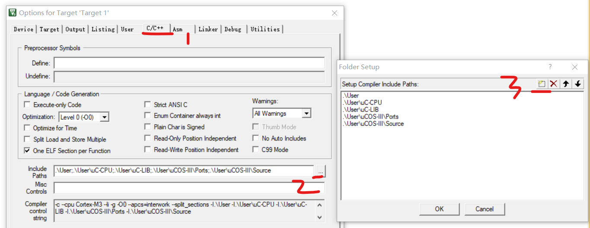
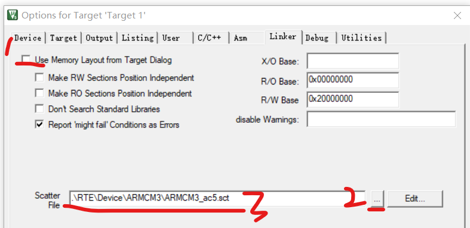
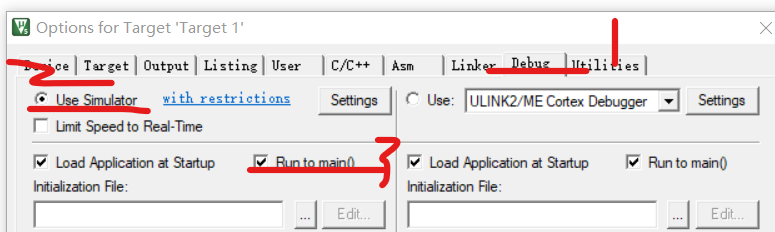
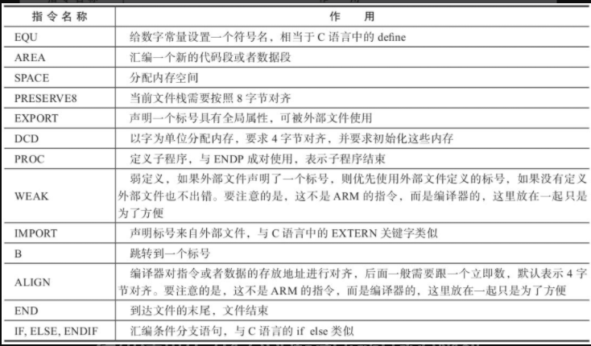

### 开发环境

> 万恶的开发环境配置，希望你不会遇到任何问题

#### MDK

由于 MDK5.15 以上的版本均使用的新的编译器（版本 6），导致编译现有的工程文件几乎全部报错，`必须使用`旧版的编译器（版本 5）

所以我们推荐下载 5.15 版本编译器，高版本除了事多以外乜有任何优点，代码补全啥的也没有任何优化

为避免直接从官网下载还需要经过一系列冗杂的注册与获取 LIC 的脑残过程，现提供如下直连下载  
官方下载连接（通过修改 MDKXXX.EXE，其中的 XXX 代表版本号，你想要下载那个版本就改为对应的版本号即可）：  
https://armkeil.blob.core.windows.net/eval/MDK536.EXE

<br>

安装过程不多废话，但请注意，安装时会设置两个路径，分别是软件本体以及对应的 package

MDK 安装时自带了 ARM 核心库，我们不需要再想 STM 那样安装额外的库了，拿来就用即可

<br>

#### 初始化工程

创建新的工程

设备直接选择 Cortex-M3 系列的



弹出窗口，我们导入下图中划横线的两个库，分别为 CMSIS 的 CORE 以及 Device 的 Startup



<br>

新建文件组，按下图所示创建 User、μC/OS-III Source、μC/OS-III Ports、μC/CPU、μC/LIB 和 Doc 文件组

在 Doc 下新建 `readme.txt` ，以及在 User 下新建入口文件 `app.c`



在 app.c 下写入简单的死循环代码，让系统保持运行状态

```c
int main(void){
	for(;;){}
}
```

<br>

#### 项目设置

> 重头戏，很多坑，别不注意看细节到时候错了别怪我哈

点击小魔法棒，打开项目设置面板

在 target 选项卡中修改晶振为 25



切换到 `C/C++` 选项卡  
添加所有我们之后会用到的库



<br>

切换到 Linker 选项卡

取消勾选 use memory layout from target dialog  
工程创建后会自动创建一个 scf 文件，我们不能使用默认的，只能使用工程生成的，即下图所示的路径所指的 scf 文件  
（因为我们的编译器为版本 5，故 scf 文件就选 AC5 后缀的！！！）



切到 debug 选项卡

直接选择 `use simulator` 即可



<br>

好的，由于我们已经写好的入口文件 app.c  
只需要依次点击下图所示的 translate->build->simulator 即可打开仿真器啦~

特别注意，翻译时或者构建时如果出现了任何一个 error，那么仿真器必定无法开启


<br>

### 裸机系统与多任务系统

<br>

#### 裸机系统

> 裸机系统通常分成轮询系统和前后台系统

轮询系统即在裸机编程时，先初始化好相关的硬件，然后让主程序在一个死循环里面不断循环，顺序地处理各种事件

轮询系统伪代码

```c
int main(void)
{
    /* 硬件相关初始化 */
    HardWareInit();

    /* 无限循环 */
    for (;;) {
        /* 处理事件1 */
        DoSomethin1();

        /* 处理事件2 */
        DoSomething2();

        /* 处理事件3 */
        DoSomething3();
    }
}
```

<br>

前后台系统是在轮询系统的基础上加入了中断。  
外部事件的响应在中断里面完成，事件的处理还是回到轮询系统中完成。  
中断在这里称为前台，main()函数中的无限循环称为后台

前后台系统伪代码

```c
int flag1 = 0;
int flag2 = 0;

int main(void)
{
    /* 硬件相关初始化 */
    HardWareInit();

    /* 无限循环 */
    for (;;) {
        if (flag1) {
            /* 处理事件1 */
            DoSomething1();
        }

        if (flag2) {
            /* 处理事件2 */
            DoSomething2();
        }
    }
}

void ISR1(void)
{
    /* 置位标志位 */
    flag1 = 1;
    /* 如果事件处理时间很短，则在中断里面处理
     * 如果事件处理时间比较长，则回到后台处理 */
    DoSomething1();
}

void ISR2(void)
{
    /* 置位标志位 */
    flag2 = 1;

    /* 如果事件处理时间很短，则在中断里面处理
     * 如果事件处理时间比较长，则回到后台处理 */
    DoSomething2();
}
```

<br>

#### 多任务系统

多任务系统的事件响应也是在中断中完成的，但是事件的处理是在任务中完成的

任务与中断一样，也具有优先级，优先级高的任务会优先执行。  
当一个紧急事件在中断中被标记之后，如果事件对应的任务的优先级足够高，就会立刻得到响应

多任务系统伪代码

```c
int flag1 = 0;
int flag2 = 0;

int main(void)
{
    /* 硬件相关初始化 */
    HardWareInit();

    /* 操作系统初始化 */
    RTOSInit();

    /* 操作系统启动，开始多任务调度，不再返回 */
    RTOSStart();
}

void ISR1(void)
{
    /* 置位标志位 */
    flag1 = 1;
}

void ISR2(void)
{
    /* 置位标志位 */
    flag2 = 2;
}

void DoSomething1(void)
{
    /* 无限循环，不能返回 */
    for (;;) {
        /* 任务实体 */
        if (flag1) {

        }
    }
}

void DoSomething2(void)
{
    /* 无限循环，不能返回 */
    for (;;) {
        /* 任务实体 */
        if (flag2) {

        }
    }
}
```

<br>

### 任务定义与切换

<br>

#### 多任务系统中的任务

裸机系统中，系统的主体就是 main()函数中顺序执行的无限循环，在这个无限循环中，CPU 按照顺序完成各种操作

多任务系统中，根据功能不同，可以把整个系统分割成一个个独立的且无法返回的函数，这种函数称为任务（或线程）

多任务系统中的任务形式

```c
void Task (void *parg)
{
    /* 任务主体，无限循环且不能返回 */
    for (;;) {
        /* 任务主体代码 */
    }
}
```

<br>

#### 创建任务

> μCOS 命名规范  
> 以 OS 开头，表示这是一个外部函数，可以由用户调用；  
> 以`OS_`开头的函数则表示内部函数，只能在 μC/OS-III 内部使用

多任务系统中，需要为每一个任务分配独立的栈空间，通常以一个全局数组概括；  
（即，定义两个任务，就需同时为各自定义对应的任务栈）

在`μC/OS-III`中，空闲任务的栈最小应该大于 128

该代码表示指定任务栈大小，CPU_STK 为预定义好的数据类型

```c
#define  TASK1_STK_SIZE       128          (1)
#define  TASK2_STK_SIZE       128

static   CPU_STK   Task1Stk[TASK1_STK_SIZE];(2)
static   CPU_STK   Task2Stk[TASK2_STK_SIZE];
```

<br>

`任务控制块（Task Control Block，TCB）`  
他相当于任务的信息卡，包裹了该任务的所有信息，日后可以通过此 TCB 直接操纵任务

`任务创建函数`  
任务栈、任务的函数实体、任务的 TCB 通过任务创建函数 OSTaskCreate()关联在一起

<br>

#### OSTaskStkInit()函数

> 该函数为任务栈初始化函数，在任务创建时，需要预先初始化好栈

`OSTaskStkInit()`函数工作流程

1. 获取函数传入的参数,包括任务函数 task、任务参数 args、参数指针 p_arg 以及堆栈起始地址 os_stk 和大小 stk_size。
2. 计算任务堆栈结束地址 stk_bottom,作为初始化堆栈的起始位置。
3. 向堆栈中依次压入:
   返回地址:任务函数 task 的起始地址。
   形参列表:任务参数 args。
   寄存器内容:初始化各个 CPU 寄存器的值。

4. 初始化任务的任务控制块(TCB):  
   记录堆栈指针:stk_bottom。  
   设置任务状态:初始化为就绪状态。  
   设置任务信息:如任务 ID、名称、优先级等。  
   返回任务堆栈的起始地址(BOT):stk_bottom。

5. 返回任务堆栈的起始地址(BOT):stk_bottom。

6. μC/OS 会根据返回的堆栈起始地址 BOT,在任务创建后完成上下文的切换,让任务开始运行

<br>

任务创建完毕，需要把任务添加到就绪列表（在 OSTaskCreate()函数中完成），表示任务已经就绪，系统随时可以调度

添加方式为把任务 `TCB` 添加到就绪列表 `OSRdyList`

```c
/* 将任务添加到就绪列表 */
OSRdyList[0].HeadPtr = &Task1TCB;(1)
OSRdyList[1].HeadPtr = &Task2TCB;(2)
```

`OSRdyList` 是一个类型为 `OS_RDY_LIST` 的全局变量

<br>

#### 操作系统初始化

1. 初始化内核对象:  
   初始化任务列表、互斥量列表、邮箱列表等内核对象。  
   为这些对象分配内存。  
   初始化内核对象控制块。

2. 初始化内核计数器:  
   初始化任务切换计数器 OSTaskSwCtr。  
   初始化系统小时间 OSTime。

3. 初始化中断禁用计数器:OSTaskCtxSwCtr。

4. 初始化内核数据结构:  
   初始化就绪任务队列待运行任务链表。  
   初始化互斥量、信号量和事件数据结构。

5. 创建内核任务:  
   创建内核任务 OSTaskIdle()。  
   调用 OSTaskStkInit() 初始化其堆栈。

6. 配置肩口时钟:配置中断以生成时钟中断。

7. 启用中断:允许中断。

8. 返回, 切换到 idle 任务运行。

<br>

#### 启动系统

系统启动函数 `OSStart()` 的简要结构如下所示

```c
void OSStart (OS_ERR *p_err)
{
	// 1. 若系统首次启动，则if为真
    if ( OSRunning == OS_STATE_OS_STOPPED ) {

		// 2. 在还未引入优先级的情况下，手动指定一个欲执行任务
        OSTCBHighRdyPtr = OSRdyList[0].HeadPtr;

        // 3. 用于启动任务切换，即配置PendSV的优先级为最低，然后触发PendSV异常
        OSStartHighRdy();

        /* 不会运行到这里，如果运行到这里，则表示发生了错误 */
        *p_err = OS_ERR_FATAL_RETURN;
    } else {
        *p_err = OS_STATE_OS_RUNNING;
    }
}
```

<br>

常用的 ARM 汇编指令表



<br>

在 μC/OS-III 中，上下文切换是在 PendSV 异常服务程序中执行的；  
配置 PendSV 的优先级为最低，从而排除了在中断服务程序中执行上下文切换的可能

如果中断启用且编写了 PendSV 异常服务函数，则内核会响应 PendSV 异常

<br>

#### 任务切换

`OSStartHighRdy()`函数，触发 PendSV 异常后，就需要编写 PendSV 异常服务函数，然后在其中进行任务切换

PendSV 异常服务中主要完成两项工作  
一是保存上文，即保存当前正在运行的任务的环境参数；  
二是切换下文，即把下一个需要运行的任务的环境参数从任务栈中加载到 CPU 寄存器，从而实现任务的切换

<br>

`PendSV 中断` 被称为挂起中断,它用于执行下列任务:

- 内核任务切换
- 内核中断处理完成后的返回
- 挂起某个任务
- 唤醒被挂起的任务

`PendSV_Handler` 中,操作系统会检测该标志位,然后执行实际的任务切换代码,如保存当前任务上下文,恢复其他任务上下文

<br>

#### main()函数

以下是完整的 `app.cpp` 代码

```c
/*
 2 *******************************************************************
 3 *                          包含的头文件
 4 *******************************************************************
 5 */
/*
10 *******************************************************************
11 *                            宏定义
12 *******************************************************************
13 */
/*
17 *******************************************************************
18 *                          全局变量
19 *******************************************************************
20 */

uint32_t flag1;
uint32_t flag2;

/*
26 *******************************************************************
27 *                        TCB & STACK &任务声明
28 *******************************************************************
29 */
#define  TASK1_STK_SIZE       20
#define  TASK2_STK_SIZE       20

static   CPU_STK   Task1Stk[TASK1_STK_SIZE];
static   CPU_STK   Task2Stk[TASK2_STK_SIZE];

static   OS_TCB    Task1TCB;
static   OS_TCB    Task2TCB;

void     Task1( void *p_arg );
void     Task2( void *p_arg );

/*
43 *******************************************************************
44 *                            函数声明
45 *******************************************************************
46 */
/*
50 *******************************************************************
51 *                            main()函数
52 *******************************************************************
53 */
 /*
55 * 注意事项：1)该工程使用软件仿真，debug需要选择为Ude Simulator
56 *         2)在Target选项卡中把晶振Xtal(MHz)的值改为25，默认是12，
57 *              改成25是为了与system_ARMCM3.c中定义的__SYSTEM_CLOCK相同，
58 *         3)确保仿真时时钟一致
59 */
int main(void)
{
    OS_ERR err;


    /* 初始化相关的全局变量 */
    OSInit(&err);

    /* 创建任务 */
    OSTaskCreate ((OS_TCB*)      &Task1TCB,
                  (OS_TASK_PTR ) Task1,
                  (void *)       0,
                  (CPU_STK*)     &Task1Stk[0],
                  (CPU_STK_SIZE) TASK1_STK_SIZE,
                  (OS_ERR *)     &err);

    OSTaskCreate ((OS_TCB*)      &Task2TCB,
                  (OS_TASK_PTR ) Task2,
                  (void *)       0,
                  (CPU_STK*)     &Task2Stk[0],
                  (CPU_STK_SIZE) TASK2_STK_SIZE,
                  (OS_ERR *)     &err);

    /* 将任务加入就绪列表 */
    OSRdyList[0].HeadPtr = &Task1TCB;
    OSRdyList[1].HeadPtr = &Task2TCB;

    /* 启动操作系统，将不再返回 */
    OSStart(&err);
}

/*
93 *******************************************************************
94 *                           函数实现
95 *******************************************************************
96 */
/* 软件延时 */
void delay (uint32_t count)
{
for (; count!=0; count--);
}


/* 任务1 */
void Task1( void *p_arg )
{
    for ( ;; ) {
        flag1 = 1;
        delay( 100 );
        flag1 = 0;
        delay( 100 );

        /* 任务切换，这里是手动切换 */
        OSSched();
    }
}

/* 任务2 */
void Task2( void *p_arg )
{
    for ( ;; ) {
        flag2 = 1;
        delay( 100 );
        flag2 = 0;
        delay( 100 );

        /* 任务切换，这里是手动切换 */
        OSSched();
    }
}
```

<br>

`OSSched()函数`通常是操作系统中任务调度器的入口点,主要功能是:

- 检查是否有高优先级任务可以运行
- 如果有,则进行任务上下文切换,从而让高优先级任务开始运行
- 如果没有高优先级任务,则保持当前任务继续运行

具体实现上,OSSched()函数主要做以下几件事:

- 保存当前任务的上下文,如寄存器状态等
- 遍历所有任务,找到最高优先级的可运行任务
- 如果找到比当前任务高优先级的任务:  
  恢复该高优先级任务的上下文  
  使高优先级任务成为 running 任务
- 如果没有高优先级任务:  
  当前任务继续运行,上下文无需恢复

<br>

#### 其余重要相关参量介绍

`OSTCBCurPtr` 是操作系统`任务控制块(TCB)指针`,指向当前正在运行的任务的 TCB。主要有以下几个方面

1. 保存当前任务上下文:

在任务切换前,需要保存正在运行任务的上下文,包括寄存器、堆栈指针等。通过 OSTCBCurPtr 可以找到当前任务的 TCB,进而保存上下文到 TCB 中。

2. 恢复下一个任务上下文:

在任务切换后,需要恢复新任务的上下文。操作系统遍历所有 TCB,找到最高优先级的任务,将其 TCB 指针赋值给 OSTCBCurPtr,然后根据 OSTCBCurPtr 来恢复该任务的上下文。

OSTCBCurPtr 的更新通常是在任务调度器 OSchedule()中完成的。

当找到新运行任务后,就将其 TCB 指针赋值给 OSTCBCurPtr,从而使 OSTCBCurPtr 指向下一个要运行的任务。

<br>

`OSTCBHighRdyPtr` 是操作系统指向就绪状态中最高优先级任务的 TCB 指针。

与 `OSTCBCurPtr` 不同,`OSTCBHighRdyPtr` 总是指向下一个要运行的任务。

在任务调度实现中,OSTCBHighRdyPtr 用于:

1. 任务就绪:

当一个任务从睡眠状态变为就绪状态时,如果它的优先级高于 OSTCBHighRdyPtr 指向的任务,则需要更新 OSTCBHighRdyPtr,使之指向这个刚刚就绪的高优先级任务。

2. 任务调度:

在 OSSched()中,任务调度器首先检查 OSTCBHighRdyPtr 指向的任务。如果比当前运行任务优先级更高,则需要进行任务切换。

3. 任务等待:

当 OSTCBHighRdyPtr 指向的任务进入等待状态时(比如等待 IO),需要更新 OSTCBHighRdyPtr,指向就绪队列中新出现的最高优先级任务。

总的来说,OSTCBHighRdyPtr 总是指向就绪队列中优先级最高的任务。
它的主要作用是:

- 快速找到下一个要运行的任务
- 在任务就绪和等待时保持指向最高优先级任务

OSTCBHighRdyPtr 的更新通常在:

- 任务就绪时
- 任务等待时
- 任务调度时 OSSched()

<br>

### 任务时间片运行

<br>

#### SysTick

`SysTick` 寄存器是 `ARM Cortex-M` 系列微控制器中的一个 timer,它主要用于以下两种情况:

1. 产生中断,实现操作系统的时钟 Tick
2. 实现延时,产生一定的计数周期

<br>

主要的 SysTick 寄存器包括:

- CTRL:控制和配置 SysTick 寄存器。

- LOAD:设置 SysTick 计数器的重载值,用来确定计数周期。

- VAL:当前 SysTick 计数的值。开始计数时始终为 LOAD 的值。当它减到 0 时,产生中断。

- CALIB: SysTick 校准值,表示一个 SYSCLK 时钟周期的数组单位数。

<br>

使用步骤是:

1. 配置 CTRL 寄存器,设置中断使能,时钟源等。

2. 设置 LOAD 值,确定计数周期。

3. 使能 SysTick 中断,绑定中断处理函数。

4. 启动计数,设置 CTRL 寄存器的 ENABLE 位。

<br>

#### SysTick 初始化函数

OS_CPU_SysTickInit()是一个初始化 SysTick 定时器的函数,主要用于操作系统时钟的初始化。

典型的函数实现大概如下:

```c
void OS_CPU_SysTickInit(void) {
    // 配置 SysTick 内核时钟源
    SysTick->CTRL = 0;                  // 关闭 SysTick

    SysTick->CTRL  |= SysTick_CTRL_CLKSOURCE_Msk;   // 选择外部时钟

    // 设置中断优先级为最高
    NVIC_SetPriority (SysTick_IRQn, (1<<__NVIC_PRIO_BITS) - 1);

    // 根据 CPU 主频设置节拍数
    SysTick->LOAD  = CPU_CLOCK / OS_TICKS_PER_SEC - 1;

    // 使能中断
    SysTick->CTRL |= SysTick_CTRL_INTEN;

    // 绑定中断服务程序
    NVIC_SetVector(SysTick_IRQn, OS_CPU_SysTickHandler);

    // 启动定时器
    SysTick->CTRL |= SysTick_CTRL_ENABLE;

    // 清零计数器
    SysTick->VAL   = 0;
}
```

<br>

#### SysTick 中断服务函数

OSTimeTick()是一个操作系统接口函数,它被调用来执行一个时钟滴答(时钟中断)，他在 SysTick 中断服务函数被调用

OSTimeTick()函数主要做以下事情:

1. 更新时钟计数器
2. 如果任务时间片用完,将此任务置为就绪状态
3. 执行任务调度
4. 唤醒被挂起的任务
5. 唤醒在定时器上等待的任务

<br>

#### SysTick 于 main()函数

在 main 函数调用 SysTick 的特性如下

首先需要关闭中断，当 OS 启动完毕后才重启中断

任务的调度是在 SysTick 的中断服务函数中完成的，中断的频率越高意味着操作系统的调度越高，系统的负荷就越重

任务调度将不再在各自的任务中实现，而是放到了 SysTick 中断服务函数中，从而实现每个任务都运行相同的时间片，平等地享有 CPU

<br>

### 空闲任务与阻塞超时

<br>

#### 实现空闲任务

首先要定义空闲任务栈

空闲任务栈的三个过程

- 存储空闲任务上下文
- 提供临时存储空间,借用给其他任务
- 在多核系统中,每个核心的空闲任务可共用空闲任务栈,以节省资源

<br>

空闲任务函数十分简单，即对全局变量执行 `OSIdleTaskCtr ++`

```c
/* 空闲任务 */
void  OS_IdleTask (void  *p_arg)
{
    p_arg = p_arg;

    /* 空闲任务什么都不做，只对全局变量执行OSIdleTaskCtr++ 操作
    for (;;) {
        OSIdleTaskCtr++;
    }
}
```

<br>

空闲任务的初始化用 OSInit()函数完成，即在系统启动前就创建好空闲任务

<br>

#### 实现阻塞延时
