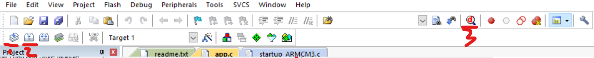

### 开发环境

> 万恶的开发环境配置，希望你不会遇到任何问题

#### MDK

由于 MDK5.15 以上的版本均使用的新的编译器（版本 6），导致编译现有的工程文件几乎全部报错，`必须使用`旧版的编译器（版本 5）

所以我们推荐下载 5.15 版本编译器，高版本除了事多以外乜有任何优点，代码补全啥的也没有任何优化

为避免直接从官网下载还需要经过一系列冗杂的注册与获取 LIC 的脑残过程，现提供如下直连下载  
官方下载连接（通过修改 MDKXXX.EXE，其中的 XXX 代表版本号，你想要下载那个版本就改为对应的版本号即可）：  
https://armkeil.blob.core.windows.net/eval/MDK536.EXE

<br>

安装过程不多废话，但请注意，安装时会设置两个路径，分别是软件本体以及对应的 package

MDK 安装时自带了 ARM 核心库，我们不需要再想 STM 那样安装额外的库了，拿来就用即可

<br>

#### 初始化工程

创建新的工程

设备直接选择 Cortex-M3 系列的


弹出窗口，我们导入下图中划横线的两个库，分别为 CMSIS 的 CORE 以及 Device 的 Startup


<br>

新建文件组，按下图所示创建 User、μC/OS-III Source、μC/OS-III Ports、μC/CPU、μC/LIB 和 Doc 文件组

在 Doc 下新建 `readme.txt` ，以及在 User 下新建入口文件 `app.c`


在 app.c 下写入简单的死循环代码，让系统保持运行状态

```c
int main(void){
	for(;;){}
}
```

<br>

#### 项目设置

> 重头戏，很多坑，别不注意看细节到时候错了别怪我哈

点击小魔法棒，打开项目设置面板

在 target 选项卡中修改晶振为 25


切换到 `C/C++` 选项卡  
添加所有我们之后会用到的库


<br>

切换到 Linker 选项卡

取消勾选 use memory layout from target dialog  
工程创建后会自动创建一个 scf 文件，我们不能使用默认的，只能使用工程生成的，即下图所示的路径所指的 scf 文件  
（因为我们的编译器为版本 5，故 scf 文件就选 AC5 后缀的！！！）


切到 debug 选项卡

直接选择 `use simulator` 即可


<br>

好的，由于我们已经写好的入口文件 app.c  
只需要依次点击下图所示的 translate->build->simulator 即可打开仿真器啦~

特别注意，翻译时或者构建时如果出现了任何一个 error，那么仿真器必定无法开启



<br>


