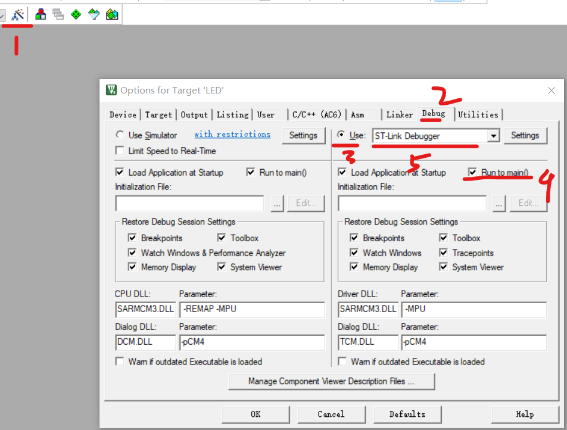
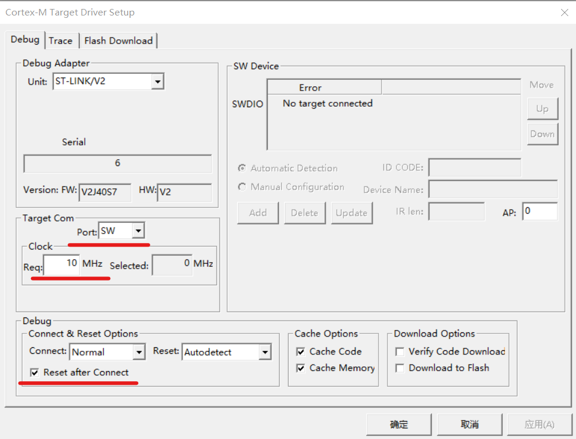
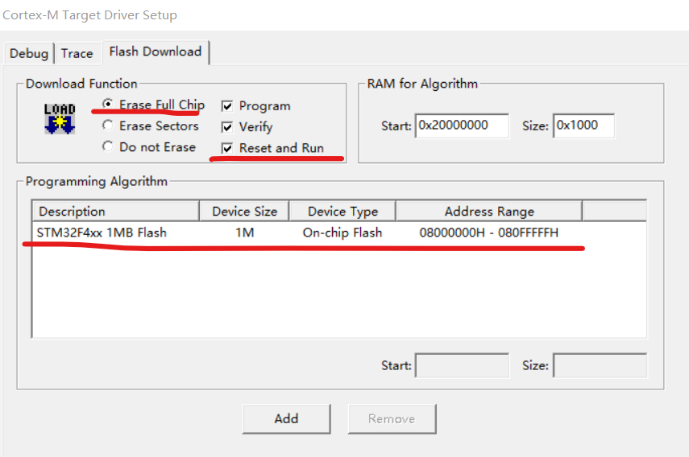
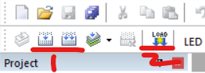

### ST-Link

#### stlink 特性

ST-LINK /V2 指定的 SWIM 标准接口和 JTAG / SWD 标准接口，其主要功能有：  
编程功能：可烧写 FLASH ROM、EEPROM、AFR 等；  
编程性能：采用 USB2.0 接口，进行 SWIM / JTAG / SWD 下载，下载速度快；  
仿真功能：支持全速运行、单步调试、断点调试等各种调试方法，可查看 IO 状态，变量数据等；  
仿真性能：采用 USB2.0 接口进行仿真调试，单步调试，断点调试，反应速度快。

 

#### 安装驱动

前往官网下载对应驱动（需要注册用户）：https://www.st.com/zh/development-tools/stsw-link009.html/

下载得到的压缩包，解压所有文件，管理员运行 `dpinst_amd64.exe`  
如果是 32 位的就运行另一个 exe 文件

安装过程会弹出窗口让你是否确认安装驱动，直接确认即可

 

#### 配置 STLink

> 安装 MDK-ARM 具体教程在网上有很多，这里就不演示了，还有安装对应的 MCU 库也一样

任意创建一个新的工程（注意，最好是全新的而不是打开一个原有的工程，否则会报错，具体原因后面解释）

点击小魔法棒，进入 debug 选项卡，按照下图所示内容操作并选择 STLINK

注意此时需要全程使用 USB 链接 STLINK

 

之后点击 setting 按钮（如果此步骤发生闪退，请看下方的解决办法）

按照下图配置即可

 

#### 校验调试

由于 STLINK 不供电，所以还需要额外通过 USB 进行供电  
此时你的电脑应该与板子有两个链接，一个 STLINK，一个 USB

点击板子上按钮上电，这是带电烧录，不需要冷启动！

首先对工程进行编译，然后点击下图右侧的 LOAD 小图标，如果一切正常的话，此时 STLINK 就会进行烧写

 

#### 常见错误

debug 选项卡，选择了 stlink 后点击 setting 直接闪退，或者程序无响应  
根据以下文章解释，是因为新版 keli（5.38a）加入了校验机制，必须要使用旧版本的 STLINK 才可以解决问题  
[参考此文章](https://blog.csdn.net/weixin_41542513/article/details/129462111?spm=1001.2014.3001.5502)

 
