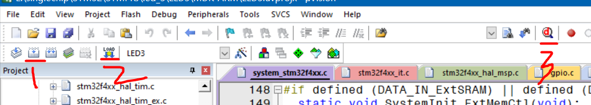

### 版本介绍

> 不推荐下最新版！不推荐下最新版！不推荐下最新版！

由于最新版对于很多库的支持都做出了变动，且无法手动修改晶振频率（XTAL），极其复杂且麻烦！

我们仅需 5.06 版本的 MDK 就可以适配大多数开发场景，不会受到其他因为版本过低而产生的限制性因素的影响；

前往官网选择 MDK-ARM 下载  
选择 5.06 版本下载即可，这里需要你注册一个 arm 账户才可以继续下载  
https://developer.arm.com/documentation/ka005198/latest

一定要下载专业版 MDK-ARM ，其包含最多的中间库！！！

 

### 调试功能

> 一款 STM32 最小核心板很便宜，十多块钱，所以大多数情况下都是直接使用硬件在线调试，即烧录程序到硬件上进行调试

准备好一个最基础的工程，连接到开发板，然后依次点击下图所示三个按钮即可开始进入调试过程

1. 构建代码
2. 将代码烧写到 STM32 芯片上
3. 开启 debug 调试器

 
