## 基础模块分析

> 基于韦东山提供的响应硬件基础入门教学

 

### 电子电路符号大全

[电路图常用符号大全 CSDN](https://blog.csdn.net/qq_41071754/article/details/114322888?ops_request_misc=%257B%2522request%255Fid%2522%253A%2522169232686916800213087857%2522%252C%2522scm%2522%253A%252220140713.130102334..%2522%257D&request_id=169232686916800213087857&biz_id=0&utm_medium=distribute.pc_search_result.none-task-blog-2~all~sobaiduend~default-2-114322888-null-null.142^v93^chatsearchT3_1&utm_term=%E5%B8%B8%E8%A7%81%E7%94%B5%E8%B7%AF%E7%AC%A6%E5%8F%B7)

[干货 | 工程师必收藏的电路图符号大全，人手一份！ CSDN](https://blog.csdn.net/weixin_68553999/article/details/126377061?ops_request_misc=%257B%2522request%255Fid%2522%253A%2522169232686916800213087857%2522%252C%2522scm%2522%253A%252220140713.130102334..%2522%257D&request_id=169232686916800213087857&biz_id=0&utm_medium=distribute.pc_search_result.none-task-blog-2~all~sobaiduend~default-1-126377061-null-null.142^v93^chatsearchT3_1&utm_term=%E5%B8%B8%E8%A7%81%E7%94%B5%E8%B7%AF%E7%AC%A6%E5%8F%B7)

[电工知识:常用电子元件名称及其对应图片实用大全 CSDN](https://blog.csdn.net/weixin_46169933/article/details/107930290?ops_request_misc=%257B%2522request%255Fid%2522%253A%2522169232693116800211543394%2522%252C%2522scm%2522%253A%252220140713.130102334.pc%255Fall.%2522%257D&request_id=169232693116800211543394&biz_id=0&utm_medium=distribute.pc_search_result.none-task-blog-2~all~first_rank_ecpm_v1~rank_v31_ecpm-1-107930290-null-null.142^v93^chatsearchT3_1&utm_term=%E7%94%B5%E5%AD%90%E5%85%83%E4%BB%B6%E8%8B%B1%E6%96%87%E7%AE%80%E7%A7%B0)

 

### GPIO 与门电路

#### 上下拉电阻

上拉电阻，即一段接正极输入（3.3v），一段可以悬空或者接地  
下拉电阻，即一段接地，另一端可悬空或接正极（3.3v）

 

上图展示一个 NPN 三极管，下面是他的工作原理

- 若 2440 提供高电平（1），则三极管导通，在上拉电阻的作用下，输出端 A 获得低电平（0）
- 若 2440 提供低电平（0），三极管截止，故输出端 A 获得高电平（1）

 

若使用 PNP 三极管，也就是上图的情况，相对对应的就可以采用下拉电阻

- 若 2440 提供低电平（0），三极管导通，下拉电阻旁边的输出端输出高电平（1）
- 若 2440 提供高电平（1），三极管截止，下拉电阻旁边的输出端输出低电平（0）

 

如下图所示的原理图，其中的三个电阻就属于上拉电阻，因为其一段恒定接着正极，另一端有 GPIO 输出决定高低电平

若 GPIO 输出低电平，则导通，此时 LED 会被点亮

 

### 电源模块

#### LM317 可调稳压电路

芯片 `LM317` 对应的参数如下

1. 输出电压 1.25V-37V
2. 输出电流 5mA-1.5A
3. 最大 IO 电压差：40V(DC)
4. 最小 IO 电压差：3V(DC)

该芯片有三个引脚，作用很明显，IN 和 OUT 分别为输入输出引脚，而 ADJ 则为控制引脚

 

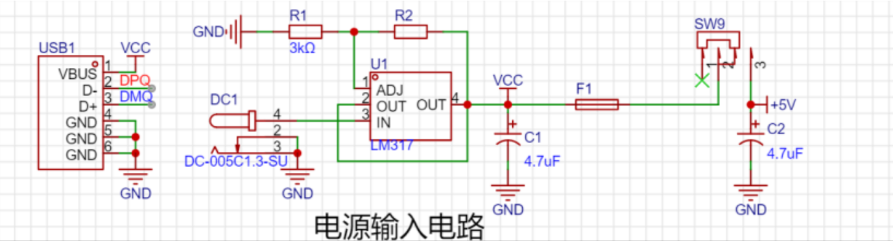

基于 LM317 的稳压电路模块分析  
参考开源项目：https://oshwhub.com/hbu_kejichuangxinxiehui/51-dan-pian-ji-kai-fa-ban

- 最左侧为方头 USB 输入接口仅使用其电源线以及两个数据线（D+、D-）
- 上方 R1/R2 用于给 ADJ 引脚提供参考电压公式为：Vo=1.25x(1+R2/R1)
- IN 引脚接一个 DC(12V 直流)，转换成稳定电压；同时也接一个 5V 直流
- 输入和输出电源端都会配置一个带方向的电容（如图 C1、C2）,用来执行滤波操作

 

### 下载模块

#### PL2303

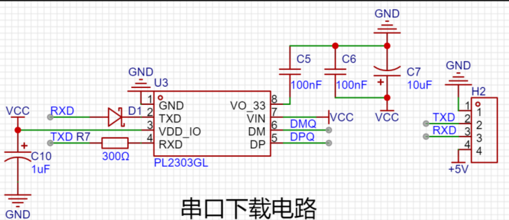

只要连接好对应的 RXD、TXD 引脚即可

只需两根信号线即可实现串口通信

 

#### CH340

 

### 光照检测模块

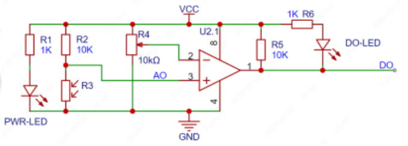

光照强度通过一个光敏电阻进行检测

上方即为光照检测模块的电路图，下面简述其作用：

1. 电路中部为一个运放，当电压 2>3 时，反向放大，引脚 1 输出低电平；当电压 3>2 时，同相放大，引脚 1 输出高电平
2. R3 为光敏电阻  
   光照强烈时，阻值极低，故几乎没有分压，所以使得引脚 3 电压增大，造成 3>2  
   黑暗环境时，阻值较高，分压较大，使得引脚 3 电压很小，造成 2>3
3. 调节 R4 滑动变阻器阻值，即可动态设置灵敏度

 

### 红外接收驱动

#### 红外通讯原理

红外光是以特定的频率脉冲形式发射，接收端收到到信号后，按照约定的协议进行解码；  
对于红外线， `NEC` 协议的频率就是 `38KHZ`

通信方式很简单：发射器发射一定频率的红外光，接收端接收到红外光就输出高电平，接收不到就输出低电平；根据红外光频率约定即可实现数据传输；

 

#### NEC 协议

大多数遥控器使用的都是 NEC 协议，但是对于某些空调比如格力这些，就会使用其特定的协议，但总体的规则大差不差

NEC 协议一次完整的传输包含: 引导码、8 位地址码、8 位地址反码、8 位命令码、8 位命令反码

 

#### 红外接收头硬件设计

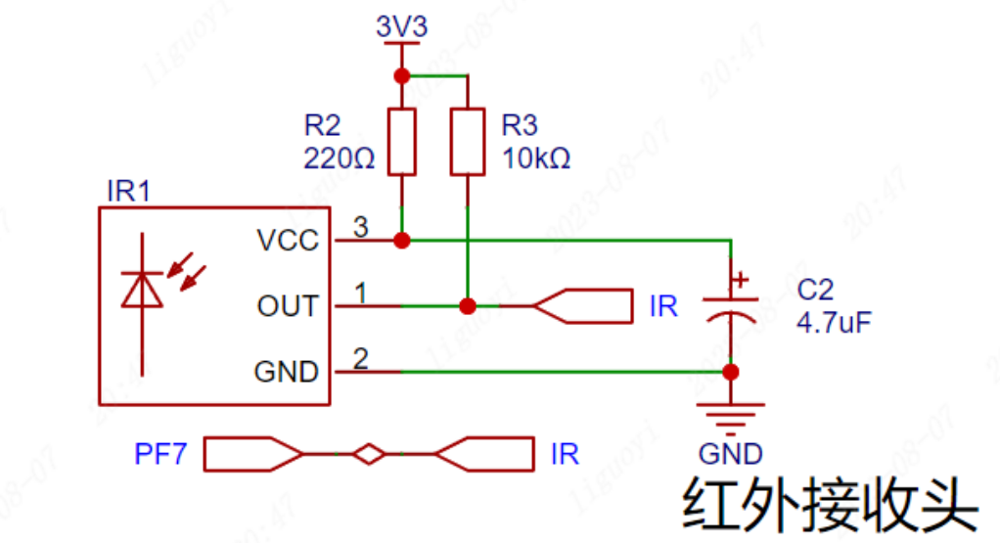

直接使用基本的 GPIO 即可接收红外高低电平信号了

 

### 语音识别模块

 

### 步进电机

#### 步进电机原理

步进电机是将电脉冲信号，转变为角位移或线位移的开环控制电机，又称为脉冲电机。
步进电机有两个重要的结构，即定子和转子

- 定子，就是由电流控制磁场方向，通电时就会产生磁力；
- 转子，被定子环绕在中间受定子磁场变化产生转动（下方示意图中转动的指针）

 

对于二相四线制步进电机，即有两个线圈，每个线圈有两条线（正负极）控制；  
A+与 A-为一相，B+与 B-为一相

步进电机的驱动方式有四拍制与八拍制，四拍值即每次通电一个线圈，使得转子转动  
下图展示四拍制驱动

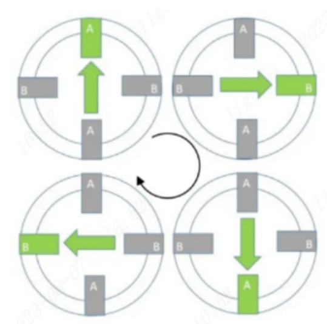

而八拍制即【A+】->【A+B+】->【B+】->【B+A-】->【A-】->【A-B-】->【B-】->【B-A+】

 

#### 模块 L9110S 驱动步进电机

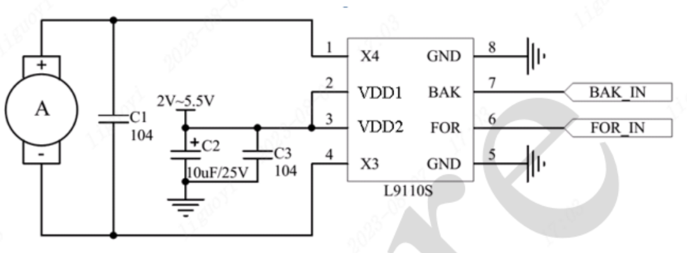

`BAK` 控制 X4 引脚的电平输出； `FOR` 控制 X3 引脚的电平输出

VDD1 和 VDD2 需要设置电容去噪！  
引脚 8、7 外接地

> 一个驱动只能驱动一个线圈，那么对于二相四线制电机，则需要两个驱动模块

 

### 连接器模块

#### MINI-USB

 

#### Micro-USB

 

#### Type-C

 

#### USB

 

 

### 零散模块

#### 蜂鸣器模块

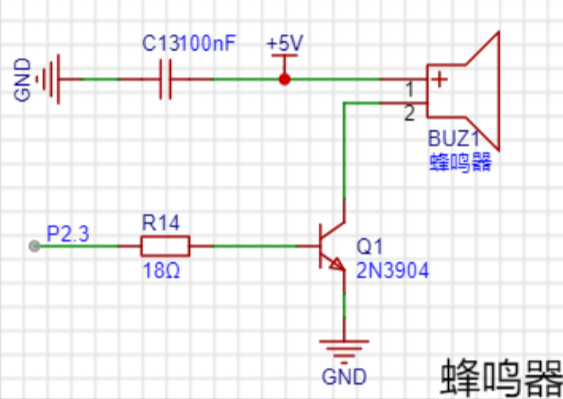

这里的蜂鸣器是`无源蜂鸣器`，即需要人为控制频率才可以发挥自己的声音

触发原理很简单，只需要引脚 P2.3 给予高电平即可使 NPN 三极管导通，此时蜂鸣器鸣叫；给予 P2.3 低电平则三极管截止，蜂鸣器停止鸣叫

仅需按照一定频率给予 P2.3 变换的高低电平输出，即可让蜂鸣器实现不同音调或者乐曲的演奏

 

#### 雨水传感器

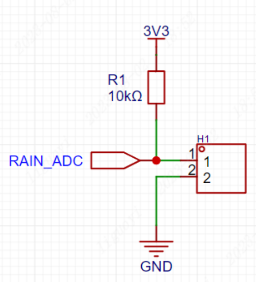

上图所示 H1 即为雨水检测模块，可以将其视为一个开关；  
当有水落在传感器上时，电路短路，等同于开关闭合；当传感器干燥时，电阻很大，等同于开关断开；  
（传感器电阻大小与雨水多少有关系，雨水越多电阻越小）

设置上拉电阻 R1 是为了避免由于雨水过多，传感器电阻过小而直接烧坏电路

当有雨水时，电路导通，RAIN_ADC 接收高电平信号；  
当没有水时，电路断开，RAIN_ADC 接收低电平信号；

 

## 通用电路结构剖析

 

### 基本斩波电路

> 将直流电变为另一固定电压或可调电压的直流电。也称为直流—直流变换器`（DC/DC Converter）`。

主要使用到的斩波电路有 Buck、Boost、Buck-Boost 三大电路，是作为直流开关电源的重要拓补结构

#### Boost

BOOST 电路是一种直流升压开关电路，这里展示使用该电路将直流 5V 升高到 12V

请看下图  

这是它升压作用的完整流程：

1. 晶体管 S 断开，由于电感与电源电流方向相同，故电压相加和平均为 12V。  
   此时通过二极管 D 流向负载 R 的电压就是 12V。  
   此时的电容器 C 进行充电。
2. 晶体管 S 闭合，电感与电源电流方向相反，故电压相互抵消，必定小于 5V。  
   但由于电容器 C 已被充电，可以供给负载 R 电压，故此时总和电压依旧位于 12V 上下。
3. 晶体管 S 再次断开，继续下一次循环

 

按照对应占空比，设置开关通断间隔，即可使得电压升至指定值

请注意，由于电容需要在晶体管 S 闭合时提供负载电压，故其电容必须够大。

 

#### Buck

Buck 电路是一种降压型直流-直流（DC-DC）转换器，用于将高电压转换为较低的稳定电压

下图演示将 12V 电压降到 5V 的流程  

这是降压的步骤：

1. 晶体管 Q 闭合时，由于电感不能立刻突变，故吸收一部分电压，此时流过电感后的电压平均为 5V；
2. 晶体管 Q 断开时，电感放电，此时电流依次流过 `L->R->D->L` ，依然可以保证负载电压为 5V 左右；
3. 晶体管 Q 再次闭合时，电感再次充电，如此循环往复，即可让输出电压稳定在 5V 左右

 

电路中电容的作用

- 平滑输出：电感充放电过程会产生纹波，电容可以环节该纹波使得输出平缓
- 降低开关噪声：由于晶体管 Q 每秒可开合上万次，产生电流电压噪声，可被电容滤波吸收掉
- 提供瞬态响应：当负载变化时，电容可以为 buck 电路提供该瞬态响应，使得过渡平顺

> 开关占空比越小，则输出电压越小

 

#### Buck-Boost

Buck-Boost 电路是一种常见的直流-直流（DC-DC）转换器，可以实现电压的升降转换。它结合了 Buck 和 Boost 两种拓扑结构的特点，能够将输入电压降低或升高到所需的输出电压。

下图为该电路的基本电路图

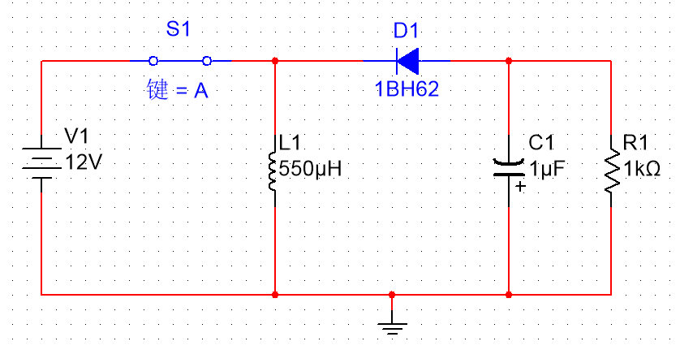

当开关闭合时：电源为电感充电，由于二极管的阻挡，电流无法流过去，所以负载电压只能由电容中存储的电能供应

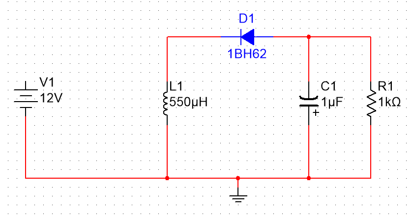

当开关断开时：电感放电，电流流动顺序为 `L1->R1->D1->L1`  
此时电感为负载供电，而电容执行充电过程

 

可以得出以下规律：

1. 当占空比大于 50%时，处于升压状态
2. 当占空比小于 50%时，处于降压状态

 

### 常用电容结构

#### 去耦电容

`去耦电容（Decoupling capacitor）`，也称为旁路电容或绕噪电容，是一种用于消除电路中噪声和波动的电容器。它通常与其他电子元件（如集成电路、传感器、放大器等）一起使用，以提供稳定的电源电压和减少信号干扰

简单的例子：一个电源上连接了 N 多个负载，由于负载电压变化，导致 VCC 提供的 DC 呈现噪声，而我们仅需在每个负载的正负极之间并联一个电容（作为去耦电容），即可吸收这部分噪声而使电压平缓

电容越大，则去耦效果越好

 

用于去耦的电容最常用的是便宜却实用的陶瓷电容，以及成本较高的钽电容

电容除了其基本特性之外，还有两个阻碍电流流动的因素：

- 电阻（ESR）：他一直保持固定的阻抗
- 电感（ESL）：随频率上升阻抗增加

随着电容封装越来越小，ESL 随之也降低；  
若要覆盖更高频率的旁路噪声，那必须尽可能的降低 ESL 的值；

同样容值，贴片（SMD）封装的电容比穿孔的电容效果更好

 

极端情况下，你可能会遇到如下有 6-7 个电容组成的去耦电容组

不同类型、容量的电容，分别赋予了不同的能力，将他们组合在一起可以针对大型设施提供去耦工作

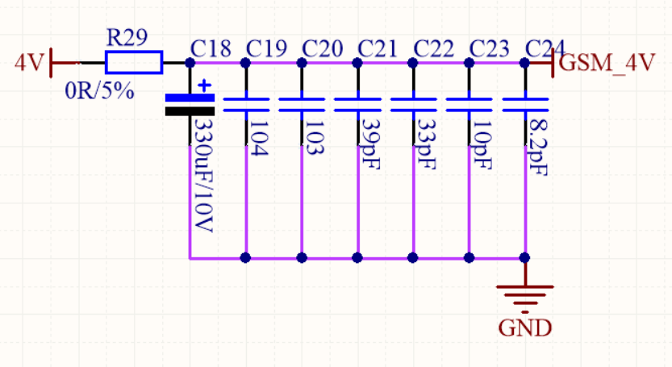

 

#### 去耦半径

**去耦半径对于电容的解释**

去耦电容离芯片尽可能近，如果太远了超出了去耦半径就会导致去耦作用大打折扣

去耦半径怎么来的？  
噪声源附近的一个小平面会产生电压扰动，电容捕获这一扰动并进行补偿，而这段补偿并反馈是需要一个时间片的，去耦半径的作用就是让这个时间片内反馈可以完美的消去噪声，而不会因为出现反馈过慢而导致相位不符使得噪声无法完全消去的结果。

 

**去耦半径对于电路线干扰的解释**

去耦半径（Decoupling Radius）是指电路板上两个相邻信号线之间的最小距离，用于减小信号线之间的相互干扰和串扰。它是设计电路板时考虑信号完整性和 EMI（电磁干扰）抑制的重要参数之一。

高速数字电路设计中，信号线之间的相互干扰和串扰可能导致信号完整性问题，去耦半径是通过在信号线周围保留一定的空白区域来减少这种干扰和串扰的影响

一般来说，高频信号线需要更大的去耦半径

> EMI（Electromagnetic Interference）抑制指的是采取措施来减少或抑制电子设备产生的电磁干扰，或者减少电子设备对其周围环境中其他设备的电磁干扰。

 

#### 旁路电容

由于电容特性（电容对于直流开路，对于交流低阻），所以直接将其并联在 DC 电源两端，此时直流电中的高频干扰信号就会通过电容直接回流到地，消去了电源噪声，这个就是旁路电容

旁路电容的作用和去耦电容一致，他的称呼来自于如下两种场景：

1. 用于对输入信号过滤高频噪声，称为旁路电容
2. 用于对输出信号干扰作为过滤对象，称为去耦电容

 

#### 滤波电容

> 滤波电容指安装在`整流电路`两端用以`降低交流脉动波纹系数`提升高效平滑直流输出的一种储能器件

滤波电容和旁路电容功能几乎一致，均为接在电源正负端，用于消去高频噪声，但是对于低频噪声消去效果微弱（需要使用电感等进行滤波）

滤波电容要求电容值较高，约为数百至数千微法  
滤波电容常用电解电容，在大多数 AC 转 DC 电路中，设置这些滤波电容可以使得电路性能稳定

 

工作原理：输入电压高于滤波电容两侧电压，电容充电；输入电压小于滤波电容两侧电压，电容开始放点；如此循环，得到相对平缓的电流波动

 

滤波电容容量选择

1. 滤波电容的容量越大，相应的纹波电压下降，但容量过大则对我们的收益就十分渺小了，而且成本也急剧上升
2. 滤波电容的容量过大，则充电电流（纹波电流）也会越大，而输入电流过大亦会对器件造成冲击而减少寿命
3. 平时做设计，前级用 4.7uF，用于滤低频，二级用 0.1uF（104 电容），用于滤高频。  
   4.7uF 的电容作用是减小输出脉动和低频干扰，  
   0.1uF 的电容应该是减小由于负载电流瞬时变化引起的高频干扰。
4. 一般低频滤波电容越大越好，两个电容值相差大概 100 倍左右。

 

#### 纹波系数

> 纹波系数（Ripple Factor）是用来衡量电源或信号中纹波（波动）程度的一个参数。在电源电路或信号处理中，纹波系数用来描述输出信号或电源电压的波动程度。

直流电源或信号，我们期望输出是稳定的直流信号，但其不是理想的，仍存在波动，这些波动就叫纹波

纹波系数通常用百分比或小数表示，表示纹波振幅与直流分量之比。  
整流电源电路中，纹波系数通常用于评估滤波电容的滤波效果。较小的纹波系数表示滤波效果较好。

纹波系数计算公式：`纹波系数 = 纹波振幅 / 直流分量`  
(纹波振幅表示波动的峰值到峰值值，直流分量表示输出信号或电源电压的直流成分)

 

#### 整流桥

> 参考文献：[电子电路学习笔记（10）——整流桥](https://blog.csdn.net/qq_36347513/article/details/120721636?ops_request_misc=%257B%2522request%255Fid%2522%253A%2522169232850316800226580818%2522%252C%2522scm%2522%253A%252220140713.130102334..%2522%257D&request_id=169232850316800226580818&biz_id=0&utm_medium=distribute.pc_search_result.none-task-blog-2~all~top_positive~default-1-120721636-null-null.142^v93^chatsearchT3_1&utm_term=%E6%95%B4%E6%B5%81%E6%A1%A5)

定义：整流桥可以将交流电转换为单向直流电

由于二极管具有单向导电性，故将二极管以下图形式摆放，左侧交流电，右侧直流电则对应的交流电正半周电流途径如下图所示  
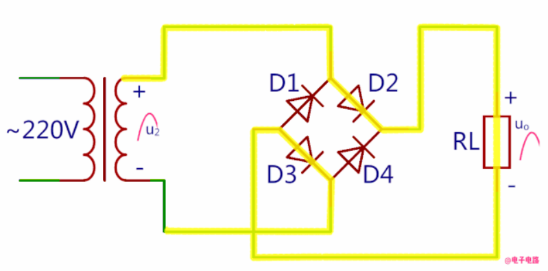

而对应的负半周如下图所示，我们注意到，直流负载上的电流方向依旧保持不变  
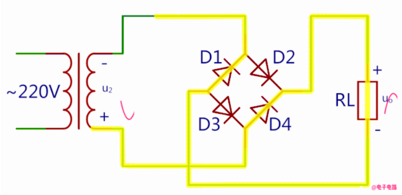

 

一般的，我们会在直流输出正负极并联一个滤波电容，此时会产生如下两种情况：

1. 若不介入滤波电容：`输出直流电压 = 输入交流电压的有效值 * 0.9`
2. 若介入滤波电容：`输出直流电压 = 输入交流电压的有效值 * 1.414`

 
