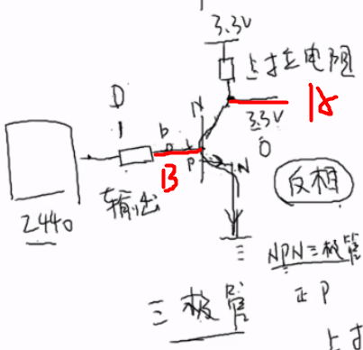
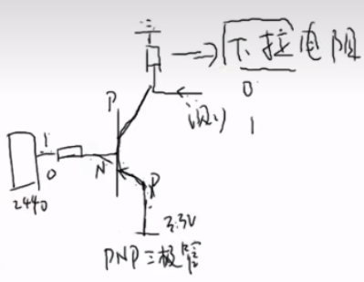
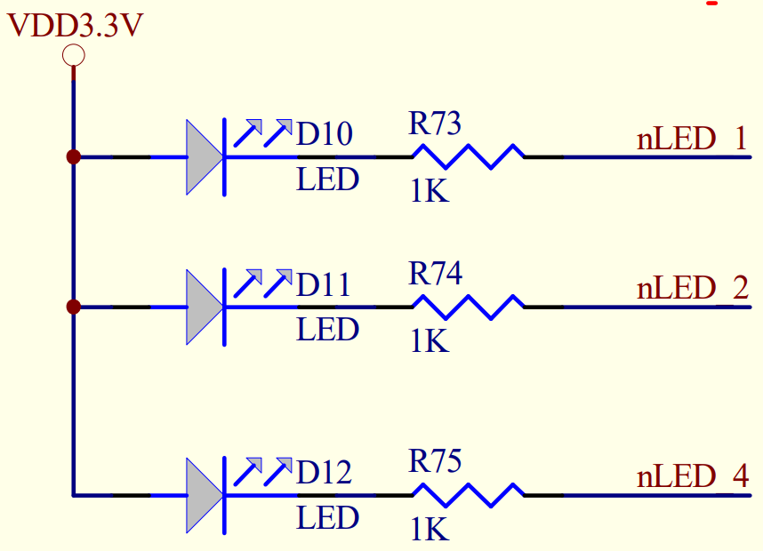
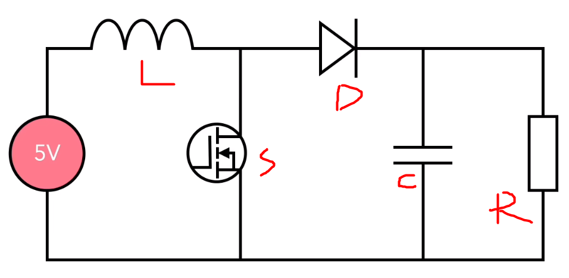
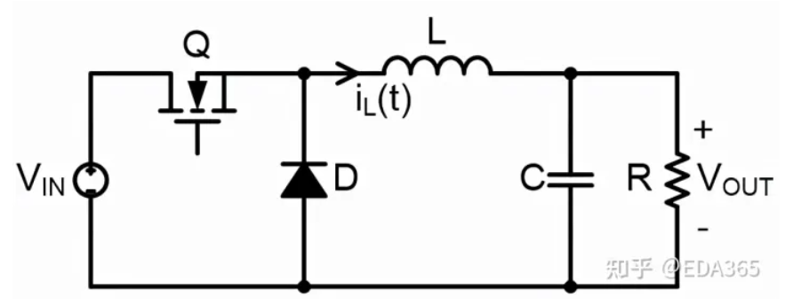

## 原理图快速分析

> 基于韦东山提供的响应硬件基础入门教学

 

### GPIO 与门电路

#### 上下拉电阻

上拉电阻，即一段接正极输入（3.3v），一段可以悬空或者接地  
下拉电阻，即一段接地，另一端可悬空或接正极（3.3v）

 

上图展示一个 NPN 三极管，下面是他的工作原理

- 若 2440 提供高电平（1），则三极管导通，在上拉电阻的作用下，输出端 A 获得低电平（0）
- 若 2440 提供低电平（0），三极管截止，故输出端 A 获得高电平（1）

 

若使用 PNP 三极管，也就是上图的情况，相对对应的就可以采用下拉电阻

- 若 2440 提供低电平（0），三极管导通，下拉电阻旁边的输出端输出高电平（1）
- 若 2440 提供高电平（1），三极管截止，下拉电阻旁边的输出端输出低电平（0）

 

如下图所示的原理图，其中的三个电阻就属于上拉电阻，因为其一段恒定接着正极，另一端有 GPIO 输出决定高低电平

若 GPIO 输出低电平，则导通，此时 LED 会被点亮

 

## 通用电路模块剖析

 

### 基本斩波电路

> 将直流电变为另一固定电压或可调电压的直流电。也称为直流—直流变换器`（DC/DC Converter）`。

主要使用到的斩波电路有 Buck、Boost、Buck-Boost 三大电路，是作为直流开关电源的重要拓补结构

#### Boost

BOOST 电路是一种直流升压开关电路，这里展示使用该电路将直流 5V 升高到 12V

请看下图  

这是它升压作用的完整流程：

1. 晶体管 S 断开，由于电感与电源电流方向相同，故电压相加和平均为 12V。  
   此时通过二极管 D 流向负载 R 的电压就是 12V。  
   此时的电容器 C 进行充电。
2. 晶体管 S 闭合，电感与电源电流方向相反，故电压相互抵消，必定小于 5V。  
   但由于电容器 C 已被充电，可以供给负载 R 电压，故此时总和电压依旧位于 12V 上下。
3. 晶体管 S 再次断开，继续下一次循环

 

按照对应占空比，设置开关通断间隔，即可使得电压升至指定值

请注意，由于电容需要在晶体管 S 闭合时提供负载电压，故其电容必须够大。

 

#### Buck

Buck 电路是一种降压型直流-直流（DC-DC）转换器，用于将高电压转换为较低的稳定电压

下图演示将 12V 电压降到 5V 的流程  

这是降压的步骤：

1. 晶体管 Q 闭合时，由于电感不能立刻突变，故吸收一部分电压，此时流过电感后的电压平均为 5V；
2. 晶体管 Q 断开时，电感放电，此时电流依次流过 `L->R->D->L` ，依然可以保证负载电压为 5V 左右；
3. 晶体管 Q 再次闭合时，电感再次充电，如此循环往复，即可让输出电压稳定在 5V 左右

 

电路中电容的作用

- 平滑输出：电感充放电过程会产生纹波，电容可以环节该纹波使得输出平缓
- 降低开关噪声：由于晶体管 Q 每秒可开合上万次，产生电流电压噪声，可被电容滤波吸收掉
- 提供瞬态响应：当负载变化时，电容可以为 buck 电路提供该瞬态响应，使得过渡平顺

> 开关占空比越小，则输出电压越小

 

#### Buck-Boost

Buck-Boost 电路是一种常见的直流-直流（DC-DC）转换器，可以实现电压的升降转换。它结合了 Buck 和 Boost 两种拓扑结构的特点，能够将输入电压降低或升高到所需的输出电压。
