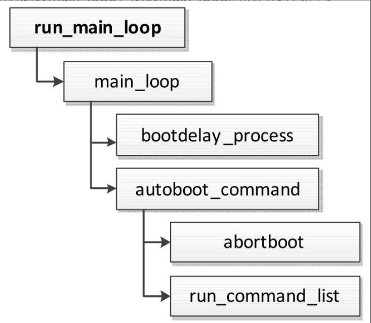
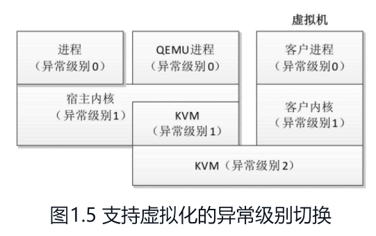
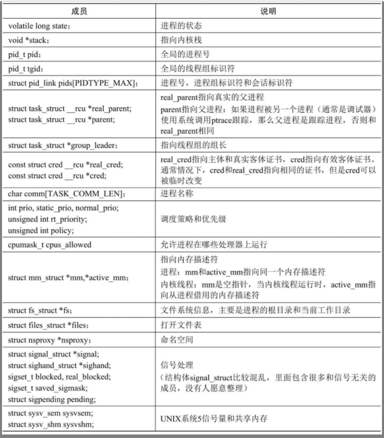

## 预备知识

### 同步原语 Synchronization Primitives

同步原语(Synchronization Primitives)是执行线程之间协调和同步的一种方法

主要功能：控制多个执行单元对共享资源的访问，同步执行单元的执行顺序和状态

常见同步原语

- 信号量(Semaphore):用于限制资源的访问数量。
- 互斥锁(Mutex):允许对共享资源的独占访问。
- 条件变量(Condition Variable):线程可等待其他线程改变某个条件后被唤醒。
- 栅栏(Barrier):保证在继续之前,多个线程达到同样的执行点。
- 自旋锁(Spinlock):线程等待时在 CPU 上忙循环,而不是阻塞。

 

### 自旋锁 spinlock

自旋锁是一种同步原语,用于保护共享资源免受并发访问的冲突。

自旋锁特性：线程在等待锁时并不阻塞。而是进入忙等待(spin)状态,不断检查锁是否被释放

 

自旋锁工作方法

1. 当一个线程请求获取自旋锁时,首先会尝试抢占锁。
2. 如果锁空闲,则获取锁成功。
3. 如果锁已被占用, requesting 线程将进入忙等待状态,不断检查锁是否被释放。
4. 一旦锁被释放,正在自旋的线程就会获得锁,从而继续执行。

 

### 自旋表 spintable

自旋表(spin table)是一种基于自旋锁实现的同步原语。  
自旋表用于多个线程需要同时访问但不能保证的一组数据。它通过为每个数据项分配一个独立的锁来实现。

自旋表实现

1. 为需要同步的每个数据项分配一个锁(例如原子操作计数器)。
2. 线程访问数据项前,先尝试获取对应锁。
3. 如果获取失败(锁被其他线程持有),则线程进入自旋模式,反复尝试获取锁。
4. 一旦获取锁成功,线程才能访问对应数据项。访问完后释放锁。

 

### 电源状态协调接口 PSCI

一种标准化的接口,用于在处理器和操作系统内核之间协调电源管理

主要作用

1. 允许内核控制集群级(Cluster Level)的电源管理状态,例如进入深睡眠(Deep Sleep)模式。
2. 管理不同的处理器核心,包括上电/下电,在运行时进入/退出低功耗状态等。
3. 提供标准的调用接口,实现不同核心和操作系统之间的统一。

重要的函数调用
`CPU_ON()`: 将 CPU 置于运行状态。
`CPU_OFF()`: 下电指定的 CPU。  
`CPU_SUSPEND()`: 暂停指定的 CPU。  
`SYSTEM_SUSPEND()`: 将整个系统置于低功耗状态。

 

### 停车协议 ACPI

一种电源管理标准,用于操作系统和硬件之间描述和管理电源

ACPI 两个主要组成  
`ACPI Specification` 定义了一套电源管理接口和规范。  
`ACPI BIOS` 提供了系统低功耗状态的实际硬件实现。

 

进入停车模式前 BIOS 需要做的

1. 挂起 PCI 总线和设备。
2. 关闭不必要的器件。
3. 保存硬件系统状态。
4. 进入停车模式。

 

## 内核引导与初始化

 

### 引导程序读取

读取引导程序指令步骤

1. 处理器在上电时自动把程序计数器设置为处理器厂商设计的某个固定值
2. 处理器的内存管理单元（Memory Management Unit, MMU）负责把虚拟地址转换为物理地址
3. ARM64 处理器到物理地址 0 取第一条指令

> 嵌入式设备通常使用 NOR 闪存作为只读存储器来存放引导程序

 

### 引导程序

#### `_start`

`_start`是 uboot 程序的入口点

 

#### 标号 reset

简要执行过程（省去 reset 源码）

1. 调用各种板卡自定义的函数 save_boot_params 来保存重要的寄存器
2. 调用函数 reset_sctrl 来初始化系统控制寄存器
3. 根据处理器当前的异常级别设置寄存器
4. 为处理器的缺陷打补丁
5. 调用函数 lowlevel_init 以执行函数 board_init_f()所需要的最小初始化
6. 配置主处理器和从处理器
7. spin_table_secondary_jump 函数是自旋表启动方式下的次要处理器入口,它会等待主处理器指定函数地址,然后跳转执行
8. 最后主处理器执行函数`_main`

 

**第二阶段程序加载器 SPL**

U-Boot 分为 SPL 和正常的 U-Boot 程序两个部分

定义：由于部分处理器内部 SRAM 较小，无法装载完整 uboot，故 SPL 主要负责初始化内存和存储设备驱动，然后把正常的 U-Boot 镜像从存储设备读到内存中执行

 

#### 主函数 `_main`

首先做厨师准备，分配内存空间

执行 `board_init_f` 前期初始化函数，把 uboot 程序复制到内存中  
若编译正常 uboot，则调用 `relocate_code`  
若编译 SPL，则调用 `spl_relocate_stack_gd` 重新定位栈

最终使用 `board_init_r` 执行后期初始化

 

#### run_main_loop

uboot 初始化完毕，使用 run_main_loop 函数处理命令

环境变量 `bootdelay` 定义延迟时间，即等待用户按键的时间长度；环境变量 `bootcmd` 定义要执行的命令

`autoboot_command` 对命令表进行查询操作

通常把 NOR 闪存分成多个分区，其中第一个分区存放 U-Boot 程序，第二个分区存放环境变量

 

#### 平展设备树(Flattened Device Tree, FDT)

其是一种以文本格式表达设备树的方法

在 uboot 中,可以加载平展设备树文件 (.dts 文件),然后将其解析为内存中的数据结构,为系统提供设备描述信息

 

### 内核初始化

#### 汇编部分

ARM64 架构的内核的入口是标号`_head`，直接跳转到标号`stext`

配置宏 CONFIG_EFI 表示提供 UEFI 运行时支持

UEFI 相比于 BIOS 有以下优势

- 支持最大分区大小超过 2TB
- 使用 GUID 分区表而不是 MBR 分区表
- 提供更安全的引导方式,能加密引导加载程序
- 识别和引导更多文件系统,如 ext4、NTFS 等
- 提供图形用户界面
- 支持更多操作系统,如 Windows、Linux 等

 

el2_setup 函数

- 如果异常级别是 1，那么在异常级别 1 执行内核
- 如果异常级别是 2，那么根据处理器是否支持虚拟化宿主扩展（Virtualization Host Extensions, VHE），决定是否需要降级到异常级别 1

 

#### 异常级别与虚拟化宿主扩展

> 通常 ARM64 处理器在异常级别 0 执行进程，在异常级别 1 执行内核

运行虚拟机的操作系统称为宿主操作系统（host OS）  
虚拟机里面的操作系统称为客户操作系统（guest OS）

现在常用的虚拟机是基于内核的虚拟机（Kernel-based Virtual Machine, KVM）  
KVM 的主要特点是直接在处理器上执行客户操作系统，因此虚拟机的执行速度很快  
KVM 是内核的一个模块，把内核变成虚拟机监控程序

 

常用的开源虚拟机管理软件是 QEMU, QEMU 支持 KVM 虚拟机

ARM64 架构引入了虚拟化宿主扩展，在异常级别 2 执行宿主操作系统的内核

 

#### 内核初始化 C 语言部分

该入口是函数 `start_kernel`  
start_kernel 首先初始化内核的各个子系统，然后调用函数 rest_init

rest_init 的执行流程

- 创建 1 号线程，即 init 线程，线程函数是 kernel_init。
- 创建 2 号线程，即 kthreadd 线程，负责创建内核线程。
- 0 号线程最终变成空闲线程。

 

#### SMP 与 ASMP

SMP 意为`对称多处理(Symmetric Multi-Processing)`,指的是一种具有多个处理器的系统,这些处理器共享存储器和 I/O 系统

`ASMP(非对称多处理)`,它有多个专用处理器和存储器

SMP 系统的主要特征

- 多个处理器对存储器和 I/O 系统有同等访问权限。
- 各个处理器运行速度相同,所使用的指令集也相同。
- 处理器之间通过中断、消息传递等方式进行协调和通信。
- 操作系统需要能够管理多个处理器,如任务调度、资源分配等。
- 所有的处理器共享内存空间,无专属内存。

 

#### SMP 系统引导

SMP 中，各个处理器低位平等，但启动过程时地位不平等  
0 号处理器称为引导处理器，负责执行引导程序和初始化内核  
其他处理器称为从处理器，等待引导处理器完成初始化

引导处理器启动从处理器的方法

1. 自旋表（spin-table）。
2. 电源状态协调接口（Power State Coordination Interface, PSCI）
3. ACPI 停车协议（parking-protocol）, ACPI 是高级配置与电源接口（Advanced Configuration and Power Interface）。

 

### init 进程

init 进程是用户空间的第一个进程，负责启动用户程序

 

## 进程管理

 

### 进程

进程描述符 `task struct` 的主要成员

