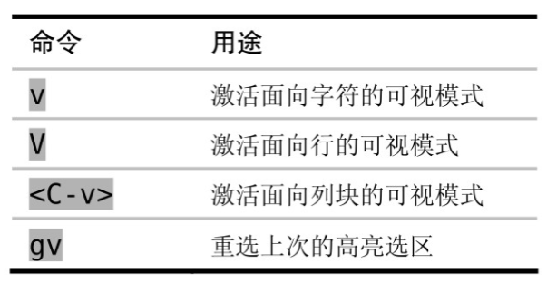
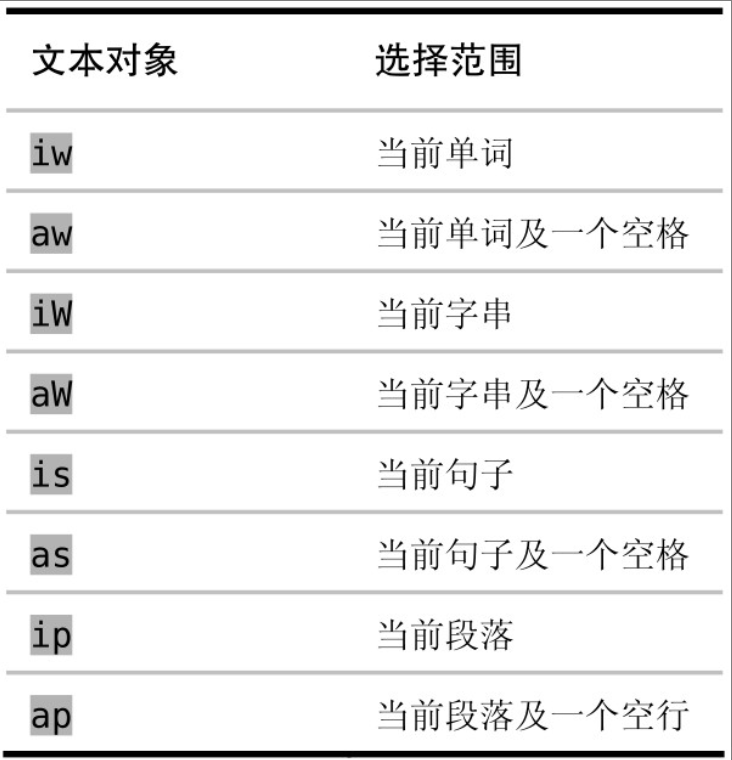

## 第一部分 模式

### 普通模式

> Vim 指令是区分大小写的

撤销命令会回退从进入插入模式到退出此模式期间输入（或删除）的全部字符

如果在插入模式中使用了 `<Up> 、<Down> 、<Left>或 <Right>` 这些光标键，将会产生一个新的撤销块

 

> VimGolf 一种评价 vim 按键次数的指标（譬如你完成一个删除操作时，输入了 3 次指令，那么该值等于 3）

下面三幅图提供了删除一个单词的三种方式：从后往前、从前往后、直接删除整个单词

 

**可以重复就不要使用多余次数**

比如想要删除光标后面两个单词可以有如下三种写法  
`2dw` 删除一个单词，执行两次  
`d2w` 一次删除两个单词  
`dw.` 删除一个单词，然后再执行删除一个单词操作（运行结果为删除两个单词）

修改光标后数三个单词为指定内容  

 

`操作符 + 动作命令 = 操作`

比如，daw，即为 `删除操作d + 一个单词aw = 删除一个单词daw`

当一个操作符命令被连续调用两次时，它会作用于当前行，比如 `删除当前行dd`

> 快速全文档自动缩进：gg=G（gg 调到文档开头，=G 自动缩进光标处到文档结尾处所有内容）

 

vim 还有一个相当短命的模式：`操作符待决模式`  
只有操作符才会激活操作符待决模式

当我们键入 d 后欲键入 w 的一段短瞬间就处于该模式，系统等待用户输入对应的动作以执行完整的指令

 

### 插入模式

在插入模式下，依然可以使用快捷键进行有限的单词删除操作

下图中的 `<C-h>` 表示 `ctrl+h` 键

 

插入模式切换到普通模式有三种快捷键，不一定非得用 esc

其中下图第三种方式可以暂时切换到普通模式，当我们执行一次命令后就切换回插入模式

 

运算寄存器

插入模式下键入如下指令，运算寄存器将计算 6*100 的值然后返回给你（CR 表示回车）  
`<C-r>=6*100<CR>`

 

字符编码插入非常用字符 `<C-v>{code}`

如果字符编码超过 3 位，那么可以使用该格式 ` <C-v>u{code}`

 

### 可视模式

激活可视模式的几种方法！

 

当我们需要重复修改或者执行文本操作，建议直接使用普通模式代替可视模式

可视模式专属行、列，可以快速修改增删

 

### 命令行模式

vim 中的命令行模式一般均通过 Ex 命令完善得来  

 

所谓命令行模式，其实就是在普通模式下输入对应的 Ex 指令即可完成操作

`:1` 光标移动首行  
`:$` 光标移动尾行

`:2p` 移动到第二行并打印  
`:2d` 移动到第二行并删除此行

`:1,3p` 打印 1-3 行内容  
`:.,$p` 打印当前位置到文件末尾内容

`:%p`==`:1,$p` 打印当前文件所有行

`:/start/,/end/p` 打印从文本 start 开始到以文本 end 结束的所有内容  
`:/start/+1,/end/-1p` 带上偏移值，可以不打印 start 和 end 所在行

 

复制指令可以使用以下三种：`:t` `:co` `:copy`

 

`:m` 进行对应行的移动

 

normal 指令可以快速执行相同的指令

`:%normal A;` 全文范围内，为每一行末尾添加一个分号  
`:%normal i//` 全文范围内，为每行行首添加注释符号（结果为全文注释）

 

在命令行模式下，想要重复执行上一次的命令，可以使用  
`:bnext` 或者 `@:`

 

命令行窗口专门存储执行命令的历史记录，我们可以从中取出对应的指令并加以复用

进入命令行窗口 `q:`  
退出命令行窗口 `:q`

 

## 第二部分 文件

### 管理多个文件

打开文件时，我们在 vim 上看到的内容实际上是位于缓冲区的内容，当且仅当我们保存后，缓冲区的修改才会应用到真正的文件上

假设当前目录下有 N 个 txt 后缀的文件，我们直接使用通配符在 vim 下把它们全部打开  
`vim *.txt`

`:ls` 查看当前位于缓冲区的所有文件列表  
`:bnext` 切换到下一个位于缓冲区的文件  
`:bprev` 切换到上一个位于缓冲区的文件  
`<C-^>` 缓冲区文件交替切换显示

`:buffer [编号]` 凭编号跳转到对应缓冲区文件

`:bdelete N1,N2` 关闭指定编号为 1 和 2 的缓冲区文件  
`:N,M bdelete` 按照区间关闭

 

隐藏缓冲区：当我们编辑当前文件而不保存，却强制切换到别的缓冲区文件后，未保存的文件就被放入隐藏缓冲区内

强制切换 `:bnext!`

退出编辑（如果存在未保存修改，会提示） `:quit`  
保存隐藏缓冲区的文件修改 `:write`

从硬盘重新读取文件而不保存 `:edit!`

 

Vim 在启动时只会打开单个窗口。  
用 `<C-w>s` 命令可以水平切分此窗口，使之成为两个高度相同的窗口；  
用 `<C-w>v` 命令对其进行垂直切分，这样会产生两个宽度相同的窗口

 

### 打开及保存文件

使用 `:edit %<Tab>` 命令，让任何位置的文件编辑时的缓冲区文件都保存在当前目录下，方便统一操作

 

配置查找路径  
`:set path+=app/ **` (表示 app 目录及其子目录下的所有路径均被加入)

添加 path 后，就可以使用 find 查找指定文件了  
`:find index.html`

 

`netrw` 文件管理系统为 vim 捆绑标准插件，当且仅当 `vimrc` 中设置可以使用插件后才能正常运行

在任意文件夹下打开 netrw `vim .`

 

`:edit {file}` 可以打开目录下名为 file 的文件，如果该文件不存在，则新建缓冲区

 

## 第三章 更快的移动与跳转

### 移动命令

注意区别“实际行”与“屏幕行”  
`j 和 k` 命令会根据实际行向下及向上移动  
`gj 和 gk` 则是按屏幕行向下及向上移动

vim 还提供了一组指令，让我们可以移动光标

 

单词：由字母、数字、下划线，或其他非空白字符的序列组成，以空白字符分割  
字串：由非空白字符序列组成，字串之间空白字符分割

 

请善用反向查找功能

 

针对单词内部和外部，可以使用范围文本对象操作选择对应区域内容

 
