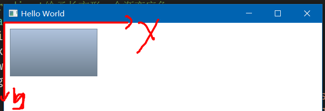
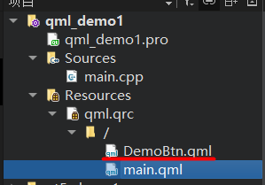
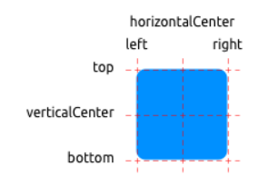

### 前言

基于如下环境

- Qt Quick 2.12
- Qt 5.12

参考文献

- [qmlbook](https://qmlbook.github.io/)

<br>

### Quick 预备知识

<br>

#### 二维坐标系

新建一个 quick 工程文件

`main.qml` 代码清单

```c
import QtQuick 2.12
import QtQuick.Window 2.12

// 主window
Window {
    width: 640
    height: 480
    visible: true
    title: qsTr("Hello World")

    // 构建一个长方形
    // 左上角绘制点为[0,0]
    // 绘制长宽为176 96
    // Gradient给予长方形一个渐变底色
    Rectangle {
        id: rect1
        x: 12; y: 12
        width: 176; height: 96
        gradient: Gradient {
            GradientStop { position: 0.0; color: "lightsteelblue" }
            GradientStop { position: 1.0; color: "slategray" }
        }
        border.color: "slategray"
    }
}

```

quick 中的坐标系如下图所示

- y 轴向下为正
- x 轴向右为正

所有的组件绘制起点都是左上角点，所以代码中我们设置 Rectangle 的坐标为 `[12,12]` 即为绘制起点坐标



<br>

#### text

很简单，学过类似的声明式页面开发都知道这些英文代表什么，就不多废话了

仅就不易辨别或者 QT 自带特有的属性进行分析讲解

```c
Text {
    width: 40; height: 120
    text: 'A very long text'

    // elide 表示文本省略的位置，省略位置会以三个英文原点代替
    // 这里表示中间省略，故文本最终展示为："A...t"
    elide: Text.ElideMiddle

    style: Text.Sunken
    styleColor: '#FF4444'

    verticalAlignment: Text.AlignTop
}
```

<br>

#### image

```c
Image {
    x: 12+64+12; y: 12
    // width: 72
    height: 72/2
    source: "assets/triangle_red.png"
    fillMode: Image.PreserveAspectCrop
    clip: true
}
```

<br>

#### mousearea

鼠标可点击位置

下方代码实现：点击左侧方形，改变右侧方形的显示与隐藏

```c
Rectangle {
    id: rect1
    x: 12; y: 12
    width: 76; height: 96
    color: "lightsteelblue"

    // 设置一个点击区域
    // onClicked 点击后触发的方法
    MouseArea {
        id: area
        width: parent.width
        height: parent.height
        onClicked: rect2.visible = !rect2.visible
    }
}

Rectangle{
    id: rect2
    x: rect1.width+24; y:12
    width: 76; height: 96
    color: "deepskyblue"
}
```

<br>

#### 组件

在 main.qml 同级目录下新建一个自定义组件文件 `DemoBtn.qml`  
下方展示最终文件结构



<br>

> 以下简单案例实现：自定义一个按钮 DemoBtn，并给予其两个插槽，可更改按钮显示文本以及按钮点击事件；在主界面 main.qml 调用自定义按钮，实现组件复用

下方为 DemoBtn.qml 代码清单

```c
import QtQuick 2.12

// 定义根元素
// 需要在根元素内定义接收的参数，让根元素下所有子元素调度
Rectangle {
    id: root

    // 既然这是一个自定义组件，就必须给予可传递的参数位置来改变组件内容
    // 导出属性使用 property alias
    property alias text: label.text
    // 导出信号或者其他触发方法使用 signal
    signal clicked

    width: 116; height: 26
    color: "lightsteelblue"
    border.color: "slategrey"

    Text {
        id: label
        anchors.centerIn: parent
        text: "Start"
    }
    MouseArea {
        anchors.fill: parent
        onClicked: {
            // 点击事件直接采用根元素接收来的参数clicked
            root.clicked()
        }
    }
}
```

回到咱们的 main.qml

由于处于同级目录，不需要 import 导入，直接使用自定义组件即可！

`自定义组件名==文件名`

```c
// 由于我们编写的自定义组件文件名为DemoBtn.qml，所以使用该组件时依旧使用此名称
DemoBtn {
    id: button
    x: 12; y: 12

    // 传递text参数
    text: "innerText"
    // 传递点击事件参数
    onClicked: {
        status.text="Button click!!!"
    }
}

// 被控制的text组件
Text {
    id: status
    x: 12; y: 76
    width: 116; height: 26
    text: "waiting ..."
    horizontalAlignment: Text.AlignHCenter
}
```

<br>

组件复用还可以使用另外一种方法 `Item`

在开发大型项目时，几乎都采用此方法

修改自定义组件 `DemoBtn.qml` 代码为

```c
import QtQuick 2.12

Item {
    id: root
    width: 116; height: 26

    property alias text: label.text
    signal clicked

    Rectangle {
        anchors.fill: parent
        color: "lightsteelblue"
        border.color: "slategrey"

        Text {
            id: label
            anchors.centerIn: parent
            text: "Start"
        }
        MouseArea {
            anchors.fill: parent
            onClicked: {
                root.clicked()
            }
        }
    }
}
```

<br>

#### 定位元件

`Column` 列定位
在其中添加的组件都会按照列的方向竖直排列

```c
Column{
    id: row
    x: 12; y:12

    // 每个组件之间垂直方向间隔
    spacing: 8

    // 所有组件（这里使用了我自己写的可复用组件，实际上就是一个带背景颜色的正方形）
    SimpleRect{}
    SimpleRect{color: "deepskyblue"}
    SimpleRect{color: "lightgreen"}
}
```

<br>

`Row` 行定位  
水平方向，不做过多解释

```c
Row{
    id: row
    x: 12; y:12
    spacing: 8
    SimpleRect{}
    SimpleRect{color: "deepskyblue"}
    SimpleRect{color: "lightgreen"}
}
```

<br>

Grid 栅格排列

```c
Grid{
    id: row
    x: 12; y:12
    rows: 2
    columns: 2
    spacing: 8
    anchors.centerIn: parent
    SimpleRect{}
    SimpleRect{color: "deepskyblue"}
    SimpleRect{color: "lightgreen"}
    SimpleRect{color: "orange"}
}
```

Grid 搭配 Repeater 可以实现循环渲染元素的效果

```c
Grid{
    id: row
    x: 12; y:12
    rows: 4
    columns: 4
    spacing: 8
    anchors.centerIn: parent

    // 将会渲染16个，4x4排列的，由正方形组成的矩阵
    Repeater{
        model: 16
        SimpleRect{}
    }
}
```

<br>

#### 布局项

子组件通过对其父组件的各个锚点，实现精确定位  
（这类似于 android 的约束布局，欠约束的子组件将会可以被改变位置）

使用 `anchors` 锚点作为定位手段



<br>

水平居中与垂直居中，并附带水平和垂直方向上的偏移

```c
Rectangle{
    id: rect1
    anchors.fill: parent

    Rectangle{
        id: rect2
        width: 100; height: 100
        color: "deepskyblue"
        anchors.horizontalCenter: parent.horizontalCenter
        anchors.verticalCenter: parent.verticalCenter
        anchors.verticalCenterOffset: 10
        anchors.horizontalCenterOffset: -10
    }
}
```

指定方向锚点约束，并附加 margin

```c
Rectangle{
    id: rect1
    anchors.fill: parent

    Rectangle{
        id: rect2
        width: 100; height: 100
        color: "deepskyblue"
        anchors.top: parent.top
        anchors.topMargin: 10
        anchors.left: parent.left
        anchors.leftMargin: 50
    }
}
```

<br>

#### 输入元素

输入元素即文本输入框 `TextInput`

首先看一下焦点定位与键盘切换焦点示例

```c
import QtQuick 2.5

Rectangle {
    width: 200
    height: 80
    color: "linen"

    TextInput {
        id: input1
        x: 8; y: 8
        width: 96; height: 20

        // 是否获取焦点
        focus: true
        text: "Text Input 1"

        // 点击键盘上的tab键后，焦点移动到哪一个组件上去
        KeyNavigation.tab: input2
    }

    TextInput {
        id: input2
        x: 8; y: 36
        width: 96; height: 20
        text: "Text Input 2"
        KeyNavigation.tab: input1
    }
}
```

<br>

使用 keys 进行按键检测，是不是想到实现一个角色控制游戏了？

```c
import QtQuick 2.5

DarkSquare {
    width: 400; height: 200

    GreenSquare {
        id: square
        x: 8; y: 8
    }
    focus: true
    Keys.onLeftPressed: square.x -= 8
    Keys.onRightPressed: square.x += 8
    Keys.onUpPressed: square.y -= 8
    Keys.onDownPressed: square.y += 8
    Keys.onPressed: {
        switch(event.key) {
            case Qt.Key_Plus:
                square.scale += 0.2
                break;
            case Qt.Key_Minus:
                square.scale -= 0.2
                break;
        }

    }
}
```

<br>

####

### 流元素

<br>

#### 动画

在使用任何动画之前，必须要在 `main.qml` 内导入以下头文件  
或者在任何需要调用动画的 qml 文件添加该头，否则会一直报错！

- 若使用 QT5 的 QML，使用：`import QtQuick.Controls 1.4`
- 若使用 QT6 的 QML，使用：`import QtQuick.Controls 2.0`

添加完毕后，必须要重新构建整个项目！

<br>

> `rect` 点击后在固定时间内持续自旋后停止案例

代码清单：`AnimationComp.qml`

```c
import QtQuick 2.0

Item {
    id: root
    width: 100; height: 100

    // 控制是否播放动画的属性
    property bool isRunning: false

    Rectangle{
        id: rect
        anchors.fill: parent
        anchors.margins: 20
        color: "deepskyblue"

        // RotationAnimation控制旋转类型的动画
        RotationAnimation on rotation{
            to: 360 // 从当前位置到360
            duration: 300 // 持续时间300ms
            running: root.isRunning // 当前动画状态
        }
    }

    // 设立一个按钮点击区域以便启动动画
    MouseArea{
        id: mouse
        anchors.fill: parent
        onClicked: root.isRunning = true
    }
}
```

在 main.qml 里面是这样的：

```c
import QtQuick 2.12
import QtQuick.Window 2.12

// 一定一定一定要记住导入这个头文件！！！
import QtQuick.Controls 1.4


Window {
    width: 640
    height: 480
    visible: true
    title: qsTr("Hello World")

    // 调用自己编写的带动画的rect组件
    AnimationComp{}
}
```

<br>

Rectangle 竖直方向移动动画  
我们可以使用两种方式实现

方法一：`Behavior` 监听位置变换

```c
Rectangle{
    id:rect
    width: 200; height: 200
    color: "deepskyblue"

    // 使用Behavior监听组件y轴位置
    // 一旦y值变化，则启动动画过渡效果
    Behavior on y{
        // NumberAnimation数值动画过渡效果
        NumberAnimation{
            duration: 1000
            easing.type: Easing.InOutQuad
        }
    }

    MouseArea{
        id:mouse
        anchors.fill: parent

        // 点击后修改y轴位置，触发对应Behavior
        onClicked: rect.y = 200
    }
}
```

方法二：`NumberAnimation` 触发

```c
Rectangle{
    id:rect
    width: 200; height: 200
    color: "deepskyblue"

    // NumberAnimation数值类型动画过渡
    NumberAnimation {
        id:anim         // 设置动画id
        target: rect    // 那个组件执行动画
        property: "y"   // 欲监听变动的属性
        to: 200         // 属性变化到哪个数值
        duration: 1000  // 动画持续时间
        easing.type: Easing.InOutQuad   // 过渡曲线
    }

    MouseArea{
        id:mouse
        anchors.fill: parent

        // 使用start显式触发对应id的动画！
        onClicked: anim.start()
    }
}
```

<br>

#### 分组动画

`ParallelAnimation` 非顺序分组动画  
由该组件包裹的所有动画全部都同时进行，不按顺序

```c
Rectangle{
    id:rect
    width: 100; height: 100
    color: "deepskyblue"

    MouseArea{
        id:mouse
        anchors.fill: parent
        onClicked: para.start() // 开启分组动画
    }

    ParallelAnimation{
        id:para
        NumberAnimation{
            target: rect
            properties: "y"
            to: 100
            duration: 1000
            easing.type: Easing.Bezier
        }
        NumberAnimation{
            target: rect
            properties: "x"
            to: 200
            duration: 1000
            easing.type: Easing.Bezier
        }
    }
}
```

`SequentialAnimation` 按顺序分组动画  
所有添加进去的动画都按照顺序依次执行

代码不做演示，直接把上方代码中的 ParallelAnimation 改为 SequentialAnimation 即可

<br>

#### 状态与转换

使用 states 进行状态管理，实现不同状态的切换

```c
import QtQuick 2.0

Item {
    id:root
    width: 100; height: 100

    // 起始状态
    state: "open"

    // 所有可能的状态
    states: [
        // open状态，颜色为灰色
        State {
            name: "open"
            PropertyChanges {
                target: rect
                color:"lightgray"
            }
        },
        // close状态，颜色为橙色
        State {
            name: "close"
            PropertyChanges {
                target: rect
                color:"orange"
            }
        }
    ]

    Rectangle{
        id:rect
        anchors.fill: parent
        color: "orange"

        MouseArea{
            id:mouse
            anchors.fill: parent
            // 鼠标点击切换状态
            onClicked: root.state = (root.state=="open" ? "close" : "open")
        }
    }
}
```

<br>

直接切换 state 显得是否僵硬，我们需要通过 transitions 添加一些过渡效果

直接把以下代码插入到上方代码中去

```c
// 设置过渡效果
transitions: [
    Transition {
        // 表示过渡效果针对所有state切换过程
        // 当然你也可以选择针对单次状态切换过程执行动画，比如from:"open"; to:"close"
        from: "*"; to:"*"
        // 一个标准的颜色切换过渡
        ColorAnimation {
            properties: "color"
            duration: 2000
            easing.type: Easing.Bezier
        }
    }
]
```

此时完整的代码应该是这样的

代码清单 `TransitionComp.qml`

```c
import QtQuick 2.0

Item {
    id:root
    width: 100; height: 100

    state: "open"
    states: [
        State {
            name: "open"
            PropertyChanges {
                target: rect
                color:"lightgray"
            }
        },
        State {
            name: "close"
            PropertyChanges {
                target: rect
                color:"orange"
            }
        }
    ]

    transitions: [
        Transition {
            from: "*"; to:"*"
            ColorAnimation {
                properties: "color"
                duration: 2000
                easing.type: Easing.Bezier
            }
        }
    ]

    Rectangle{
        id:rect
        anchors.fill: parent
        color: "orange"

        MouseArea{
            id:mouse
            anchors.fill: parent
            onClicked: root.state = (root.state=="open" ? "close" : "open")
        }
    }
}
```

<br>

### QuickControl

<br>
