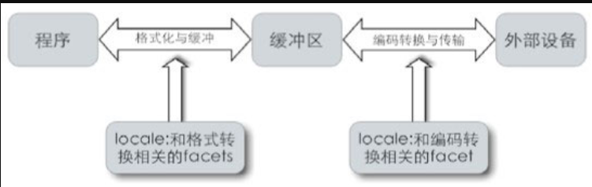
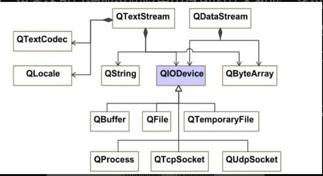

## 类模板特化

<br>

### 类模板特化

下面是一个标准的类模板，他没有使用任何的模板特化技术  
故无论模板参数 T 是什么类型，Stack 都具有相同的行为

```cpp
template <typename T>
class Stack {
private:
    std::vector<T> elems;
...
}
```

<br>

类模板特化有两种形式：

1. 完全类模板特化
2. 部分类模板特化

<br>

#### 完全特化

定义：指为所有模板参数都确定的情况下，为某个特定类型提供一个单独的实现

下方代码表示当模板参数为特定的 `std::string` 时，使用序号 2 后面的所有代码来对该类进行实例化

全特化要求

- template 内容应置空
- class 定义需要特化的数据类型
- 序号三填入对特化的数据类型需要执行的所有操作

```cpp
template<>                    ①
class Stack<std::string> {   ②
private:
    std::deque<std::string> elems;  ③
public:
    void push(std::string const & elem) {
        elems.push_back(elem);
    }
    void pop(){
        if (elems.empty()) return;
        elems.pop_back();
    }
    std::string top() const{
        if (elems.empty()) return NULL;
        return elems.back();
    }
}
```

<br>

#### 部分特化

定义：为一部分模板参数确定的情况下，为某个特定类型提供一个单独的实现

下方代码表示当我们传入的模板参数 `T` 都具有 `T*` 特征时，使用以下代码执行类实例化

```cpp
template <typename T>        ①
class Stack<T*>  {            ②
private:
    std::list<T*> list;     ③
public:
    void push(T* & elem) {
    list.push_front(elem);
    }
    void pop(){
    if (list.empty()) return;
    list.pop_front();
    }
    T* top() const{
    if (list.empty()) return NULL;
    return list.front();
    }
}
```

<br>

#### 特化模板

假设当前有一个主类模板

```cpp
template <typename T1, typename T2>
class MyClass {
…
};
```

那么对应的特化类模板可以这么写  
表示接收到的第二个模板参数 T2 需为 int 类型的

```cpp
template <typename T>
class MyClass<T,int> {
…
};
```

<br>

比如还有部分特化，可以参考以下代码

```cpp
template <typename T1, typename T2>
class MyClass<T1*,T2*> {
…
};
```

<br>

### Traits 技术

定义：Traits 技术是一种编程技术，它在面向对象编程中用于实现代码重用和可组合性。Traits 技术可以让程序员定义一些可复用的组件，这些组件可以被多个类或对象使用，并且可以在运行时进行组合

下面介绍使用 `traits` 技术的一个简单案例

<br>

```cpp
// 声明一个模板类 fp_traits，用于实现浮点类型的特性
template <typename numT>
struct fp_traits { };

// 模板特化，指定 float 类型的 fp_traits
template<>
struct fp_traits<float> {
    typedef float fp_type;   // 定义 typedef 为 float 类型
    enum { max_exponent = FLT_MAX_EXP };  // 定义枚举常量，表示 float 类型的最大指数
    static inline fp_type epsilon()      // 定义 inline 函数，返回 float 类型的极小值
    { return FLT_EPSILON; }
};

// 模板特化，指定 double 类型的 fp_traits
template<>
struct fp_traits<double> {
    typedef double fp_type;  // 定义 typedef 为 double 类型
    enum { max_exponent = DBL_MAX_EXP };  // 定义枚举常量，表示 double 类型的最大指数
    static inline fp_type epsilon()      // 定义 inline 函数，返回 double 类型的极小值
    { return DBL_EPSILON; }
};

// 声明模板类 matrix，使用 numT 模板参数表示矩阵中的数值类型
template <typename numT>
class matrix {
public:
    typedef numT num_type;   // 定义 typedef 为 numT 类型
    typedef fp_traits<num_type> num_type_info;  // 定义 typedef 为 fp_traits<num_type> 类型
    // 定义 inline 函数，返回 num_type_info 中的 epsilon() 函数结果
    inline num_type epsilon()
    {return num_type_info::epsilon();}
    ......
};

int main()
{
    matrix <float>  fm;     // 定义一个 float 类型的矩阵对象
    matrix <double> dm;    // 定义一个 double 类型的矩阵对象
    cout << "float  matrix: " << fm.epsilon() << endl;   // 输出 float 类型矩阵对象的 epsilon() 函数结果
    cout << "double matrix: " << dm.epsilon() << endl;   // 输出 double 类型矩阵对象的 epsilon() 函数结果
}
```

<br>

### 类型分类

定义：由于 cpp 自带的类型处理方法很少，所以使用类模板特化技术，设计专门的类模板来提供所需信息的方法称为类型分类技术

```cpp
// 类型模板，用于为指定类型 T 提供类型信息
template<typename T>
class TypeInfo {
public:
    enum { IsPtrT = 0, IsRefT = 0, IsArrayT = 0 };   // 定义三个枚举常量，表示 T 不是指针、不是引用、不是数组
    typedef T baseT;    // 定义 typedef 为 T 类型
    typedef T bottomT;  // 定义 typedef 为 T 类型
};

// 类型模板特化，用于为指针类型 T* 提供类型信息
template<typename T>
class TypeInfo<T*> {
public:
    enum { IsPtrT = 1, IsRefT = 0, IsArrayT = 0 };   // 定义三个枚举常量，表示 T* 是指针、不是引用、不是数组
    typedef T baseT;    // 定义 typedef 为 T 类型
    typedef typename TypeInfo<T>::bottomT bottomT;        // 定义 typedef 为 TypeInfo<T>::bottomT 类型
};

// 类型模板特化，用于为引用类型 T& 提供类型信息
template<typename T>
class TypeInfo<T&> {
public:
    enum { IsPtrT = 0, IsRefT = 1, IsArrayT = 0 };   // 定义三个枚举常量，表示 T& 不是指针、是引用、不是数组
    typedef T baseT;    // 定义 typedef 为 T 类型
    typedef typename TypeInfo<T>::bottomT bottomT;        // 定义 typedef 为 TypeInfo<T>::bottomT 类型
};

// 类型模板特化，用于为大小为 N 的数组类型 T[N] 提供类型信息
template<typename T, size_t N>
class TypeInfo <T[N]> {
public:
    enum { IsPtrT = 0, IsRefT = 0, IsArrayT = 1 };   // 定义三个枚举常量，表示 T[N] 不是指针、不是引用、是数组
    typedef T baseT;    // 定义 typedef 为 T 类型
    typedef typename TypeInfo<T>::bottomT bottomT;        // 定义 typedef 为 TypeInfo<T>::bottomT 类型
};
```

<br>

### 降低代码膨胀

定义：每当我们使用一个类型作为模板参数来实例化一个类模板或者函数模板时，C++编译器将生成一个和该类型对应的类或者函数，这会导致每次实例化都重复生成一次，造成代码膨胀

示例

```cpp
// 定义一个 Vector 类型的对象 VPVector，元素类型为 void*，即指向任意类型的指针
Vector<void*> VPVector;

// 定义一个模板类 Vector<T*>，其中 T 为指针类型，继承自 VPVector
template<class T>
class Vector <T*>: public VPVector{
public:
    // 重载 [] 运算符，返回类型为 T* 的指针
    T*& operator[](int i) {
        return (T*&)(VPVector::operator[](i));
    };
};

int main()
{
    // 定义一个 Vector<int*> 类型的对象 v1，用于存储 int 类型的指针
    Vector<int*>  v1;

    // 定义一个 Vector<double*> 类型的对象 v2，用于存储 double 类型的指针
    Vector<double*> v2;

    // 定义一个 int 类型的变量 i 并初始化为 3，将 i 的地址赋给 v1 中第一个元素
    int   i = 3;
    v1[0] = &i;

    // 定义一个 double 类型的变量 d 并初始化为 3.14，将 d 的地址赋给 v2 中第一个元素
    double d = 3.14;
    v2[0] = &d;
}
```

<br>

## 标准库与 QT 字符串处理

<br>

### 标准库类模板

C++使用类模板 basic_string 来存放字符串数据，并提供了一组成员函数来处理该字符串

basic_string 还具有一个明显的优势：自动内存管理功能

<br>

#### 模板参数与构造函数

类 string 及 wstring 是 basic_string 特化的结果

```cpp
typedef  basic_string<char>  string;
typedef  basic_string<wchar_t>  wstring;
```

basic_string 常见的构造函数及其使用方法

对于 `wchar_t` 类型的 basic_string，最好在字符串常量的前面加上前缀`“L”`

```cpp
#include <string>
#include <iostream>
using namespace std;
int main()
{
    basic_string<char> s1;
    basic_string<char> s2 ("hello world");
    basic_string<char> s3 ("hello world", 5);
    basic_string<char> s4 ( s2, 6, 5);
    cout << s1 << endl << s2 << endl << s3 << endl << s4 << endl;

    // 加了L前缀的字符串
    basic_string<wchar_t> ws (L"得友难失友易(A friend is easier lost than
    found)");
    wcout.imbue(locale("chs"));
    wcout << "size is: " << sizeof(ws[7]) << endl << ws << endl;
}
```

<br>

#### basic_string 的其他成员函数

`c_str()` 该函数返回一个指针，指向 basic_string 中存放的字符串数据  
对于 `string` 类型，该函数返回`char *`;  
对于 `wstring` 类型，该函数返回`wchar_t *`;

basic_string 的类模板存在一个专门存放字符串长度的成员变量，通过 length()直接获取字符串长度，可以相对于 strlen()方法获取长度节省很多时间

<br>

### QString

QString 能对 Unicode 字符串进行拼接、查找等操作

不建议使用 basic_string 中的 wstring 替换掉 QString，因为前者对于标点符号判断等其他操作支持较差，而后者封装完善便于拿来即用

<br>

#### QString 特性

利用 `fromLocal8Bit()`，将该字符串转换为 Unicode 编码的字符

QString 的成员函数 `data()` 返回一个指针，指向 QChar 序列

QString 自带的字符编码转换功能展示：

```cpp
// 定义 main 函数
int main()
{
    // 定义一个 char* 类型的字符串 humor，包含了英文和中文字符
    char * humor = "Your future depends on your dream. So go to sleep.\n"
                    "你的梦想决定你的未来，所以睡觉去吧。";

    // 将 humor 转换为 QString 类型的字符串 qs，使用 fromLocal8Bit 方法将 humor 中的字符转换为本地编码
    QString qs = QString::fromLocal8Bit(humor);

    // 将 qs 转换为 QByteArray 类型的数据 data，使用 toUtf8 方法将 qs 中的字符转换为 UTF-8 编码
    QByteArray data = qs.toUtf8();

    // 打开文件 utf8.txt，以二进制模式写入数据
    ofstream of("utf8.txt", ios::binary);

    // 将 data 中的数据写入文件，使用 data.data() 获取数据指针，data.length() 获取数据长度
    of.write(data.data(), data.length());
}
```

<br>

#### QByteArray

类 `QByteArray` 被用来存放长度可变的字节序列，其中的字节序列被存放在一个地址连续的内存块中

该类总会在字节序列的末尾添加一个额外的`“\0”`字符

<br>

## 国际化与区域文化

<br>

### 区域文化

C++标准库提供了类 `locale` 以及 `facet` ，分别用来描述某个区域的区域文化以及文化刻面

所有流对象都会共享一个全局的 locale 对象

一般的，开发者不需要知道 facet 的原理，直接使用 locale 即可实现区域文焕转换设定  
下方代码展示了使用 cout 输出区域文化为德国的文本

```cpp
#include <iostream>
#include <locale>
using namespace std;
int main( )
{
    double x = 1234567.123456;
    cout.imbue( locale( "German_germany" ) );①
    cout << fixed << x << endl;
}
```

<br>

### facet

每个 facet 子类描述某个文化刻面。C++标准库定义了 12 个常用的 facet 子类，来刻画时间、货币等表达方式

facet 对象不能够单独存在，它们必须隶属于某个 locale 对象  
通过调用函数模板 `use_facet<>`可以获得一个 locale 对象中某个 facet 对象的引用

<br>

#### numpunct

`numpunct` 是 facet 的一个子类，可以通过 `use_facet` 获取 facet 对象后对其实例化得到 numpunct 对象

```cpp
#include <locale>
#include <iostream>

// 定义 main 函数
int main()
{
    // 创建一个 locale 对象 os_locale，使用默认本地化设置
    locale os_locale("");

    // 获取 os_locale 的数字标点符号，使用 use_facet 方法获取 numpunct<char> 类型的 facet 对象
    const numpunct<char>& np = use_facet<numpunct<char>>(os_locale);

    // 输出数字标点符号的信息，包括小数点、千位分隔符、true/false 字符串等
    std::cout << "number punctuation of " << os_locale.name() << std::endl;
    std::cout << np.decimal_point() << " "
              << np.thousands_sep() << " "
              << np.falsename() << " " << np.truename() << std::endl;

    // 获取数字分组信息，输出每个分组的长度
    std::string group = np.grouping();
    for (int i = 0; i < group.length(); i++) {
        std::cout << i << "th grouping is: " << (int)group[i] << std::endl;
    }
}
```

<br>

#### time_get

类模板 `time_get` 对一个表示日期和时间的字符序列进行解析，将其中的信息存放在结构体 tm 中

类模板 time_get 的基本使用方法

```cpp
#include <iostream>
#include <sstream>
#include <locale>

// 定义 main 函数
int main()
{
    // 创建一个 locale 对象 loc，使用默认本地化设置
    locale loc;

    // 获取 loc 的 time_get facet 对象 tg，用于解析时间信息
    const time_get<char>& tg = use_facet<time_get<char>>(loc);

    // 获取日期的顺序信息，使用 date_order() 方法获取日期的顺序，返回值为整数
    int idx = tg.date_order();

    // 输出本地化设置的名称和日期的顺序信息，message 数组用于将整数转换为字符串
    char *message[] = {"no_order", "dmy", "mdy", "ymd", "ydm"};
    std::cout << loc.name() << std::endl << "date order " << message[idx] << std::endl;

    // 解析时间信息，使用 istringstream 类创建一个输入流 iss，包含了要解析的时间字符串 "10:26:00"
    std::ios::iostate state = 0;
    std::istringstream iss("10:26:00");

    // 创建一个 istreambuf_iterator 对象 itbegin，指向 iss 的开头
    std::istreambuf_iterator<char> itbegin(iss);

    // 创建一个 istreambuf_iterator 对象 itend，指向 iss 的结尾
    std::istreambuf_iterator<char> itend;

    // 创建一个 tm 结构体对象 time，用于存储解析后的时间信息
    std::tm time;

    // 使用 time_get 的 get_time 方法解析时间信息，将结果存储在 time 中
    tg.get_time(itbegin, itend, iss, state, &time);

    // 输出解析后的时间信息
    std::cout << time.tm_hour << ":" << time.tm_min << ":" << time.tm_sec << std::endl;
}
```

<br>

#### time_put

类模板 `time_put` 将存放在结构体 tm 中的日期和时间信息以某种特定的格式转化为一个字符序列

使用场景较少，不浪费过多笔墨介绍该类模板

<br>

#### codecvt

类模板 `codecvt` 将某一种编码的字符串转换为另外一种编码的字符串

此为对应模板以及三个模板参数的含义

- internT 表示一个字符串在计算机内部的编码类型
- externT 表示该字符串在外部存储设备（比如文件系统）中的编码类型
- stateT 是一个表示转换状态的类型

`template <class internT,class externT,class stateT> codecvt`

<br>

类模板 codecvt 的成员函数 in 的功能

```cpp
#include <iostream>
#include <locale>

// 定义 main 函数
int main()
{
    // 定义 codecvt 类型的别名 cvt_type
    typedef codecvt<wchar_t, char, mbstate_t> cvt_type;

    // 创建一个 locale 对象 loc，使用默认本地化设置
    locale loc;

    // 获取 loc 的 codecvt facet 对象 cvt，用于字符编码转换
    const cvt_type& cvt = use_facet<cvt_type>(loc);

    // 定义字符数组，src 为待转换的字符串，dst 为存储转换结果的字符串
    const int size = 20;
    const char* p1, src[size] = "hello world!";
    wchar_t* p2, dst[size];

    // 定义 mbstate_t 对象 state，用于存储转换过程中的状态信息
    mbstate_t state;

    // 使用 cvt.in() 方法将 src 中的字符转换为 dst 中的宽字符
    cvt_type::result result = cvt.in(state,
                                     src, src + size, p1,
                                     dst, dst + size, p2);

    // 如果转换成功，输出转换结果
    if (result == cvt_type::ok) {
        std::wcout << dst << std::endl;
    }

    return 0;
}
```

<br>

## iostream

<br>

### scanf/printf

几种常见的输入输出流函数

- `scanf` 从键盘接收输入数据
- `printf` 向屏幕输出数据
- `fscanf` 从文件输入数据
- `fprintf` 向文件输出数据
- `sscanf` 从内存块读取数据
- `sprintf` 向内存块输出数据。

C 语言输入输出方法存在这些缺点：  
无法在编译阶段检查 scanf/printf 函数组参数的错误；无法对 scanf/printf 函数组的接口进行扩展以处理新的数据类型；scanf/printf 函数组的执行速度慢；scanf/printf 函数组所占用的空间无法被优化。

<br>

### iostream 整体架构

iostream 包括以下三个层次


输入输出特性

- 无论是输出还是输入操作，都经由一个缓冲区进行处理
- 输出时，数据先写入到缓冲区，直到缓冲区满，其中的数据才会被真正写入到外部设备
- 即便仅输入一个字符，也必须经过缓冲区

<br>

#### 流相关类

iostream 整体架构图


`charT` 表示流中字符的类型  
模板参数 `traits` 表示字符的特征  
模板参数 `allocator` 表示堆管理器，该参数的默认值是系统的堆管理器

<br>

类模板 `basic_ios` 负责管理流缓冲区。它含有一个指针，指向流缓冲区。它还含有一个状态信息，来记录流缓冲区中数据的完备性。

类模板 `basic_istream` 以及 `basic_ostream` 分别负责数据的输入和输出  
 `basic_iostream` 通过继承这两个类模板，既能处理输入也能处理输出。

类模板 `basic_istringstream` 从一个类型为 basic_string 的字符串对象读取数据  
类模板 `basic_ostringstream` 则向这种类型的字符串对象输出数据

<br>

#### 流缓冲区

basic_ios 派生类中的缓冲区指针会指向 `basic_streambuf` 或者 `basic_filebuf` 的对象

抽象类型 basic_streambuf 不含有任何关于外部设备的信息

类模板 basic_filebuf 将输出缓冲区中的数据写入文件，或者将文件中的数据读取到输入缓冲区

<br>

### 模板特化后整体结构

iostream 将所有的 `charT` 特化为 `char` ，所有的 `traits` 特化为 `char_traits< char>`

iostream 还将所有的 `charT` 特化为 `wchar_t`，所有的 `traits` 特化为`char_traits<wchar_t >`

<br>

### 文件流

`basic_ifstream` 以及 `basic_ofstream` 分别负责文件的输入和输出  
`basic_fstream` 能够对文件进行输入和输出双向的操作

<br>

#### 文件流对象创建

`fstream` 代码实例：创建一个文件流对象 fs，在文件“test.txt”的尾部写入数据

`ios_base` 中定义了 6 个常量

- in 表示读一个文件
- out 表示写一个文件
- app 表示仅在一个文件的末尾写入
- trunc 表示清空文件内容
- binary 表示以二进制方式访问一个文件
- ate（是 at end 的缩写）表示初始的读/写位置为文件的末尾。

```cpp
fstream fs("test.txt", ios_base::out | ios_base::app)
```

当读入文件（in 模式）则要求文件必须存在；  
当写入文件（out 模式）指定文件可不存在，由系统新建一个；

<br>

#### 常见文件流操作

一般的，你可以直接使用 `<<` 或者 `>>` 执行输入输出操作  
下面代码展示使用 fstream 对文件读写流程

```cpp
#include <iostream>
#include <fstream>
#include <string>
using namespace std;

int main()
{
    // 打开文件，以输入、输出和追加的方式打开
    fstream fs("data\\test.txt", ios_base::in | ios_base::out | ios_base::app);

    // 检查文件是否成功打开，如果没有成功打开则输出错误信息并退出程序
    if (!fs) {
        cerr << "cannot open test.txt";
        exit(-1);
    }

    // 向文件中写入字符串 "hello, world\n"
    fs << "hello, world\n";

    // 将文件读写位置重新定位到文件开头
    fs.seekg(0);

    // 定义字符串变量 s，从文件中读取一个单词并存储到字符串 s 中
    string s;
    fs >> s;

    // 输出字符串 s
    cout << s;
}
```

常用 `basic_istream` 中的 `getline()`获取一整行的文本内容

<br>

#### 输出格式设定

`hex、oct、dec` 分别将输出的数制设置为十六进制、八进制和默认的十进制  
`cout << hex << 20;`

setw，流操作符，设置其后紧接着的那个数据的输出宽度  
`cout << swtw(4) << 3;`

setprecision(m) 将设置小数点及其后面的数字占用 m 个字符的位置

boolalpha 流操作符，可以让 bool 类型数据输出形式为 true 何 false 而不是 1 和 0

left 流操作符，结果左对齐

<br>

#### 文件流状态

C++流提供了以下的几个成员函数来返回一个流的状态信息

1. eof()。如果输入流已经到达末尾，该函数返回真。
2. bad()。如果用户试图对一个流对象执行非法操作，比如将文件指针移动到文件尾部之后的某个地方，该函数返回真，表示流对象被破坏了。
3. fail()。如果施加到流的某个操作未能成功，比如一个输入流对象希望读取一个整数但是实际的输入数据却是一个字符串，该函数将返回真。
4. good()。当以上条件都没有出现时，该函数返回真。

流使用者可以主动地分析流中的数据，调用成员函数 `setstate()`来设置流的状态信息

```cpp
char ch;
if ((ch = ifs.get()) != '<' )
    is.setstate( ios_base::failbit );
```

<br>

### 字符串流

介绍类模板 `basic_stringstream` 读取和输出到一个 basic_string 对象的流程

<br>

#### 字符串流内部缓冲区

stringstream 对象的流缓冲区指针指向一个 stringbuff 对象，该对象管理一个内部的字符缓冲区

内部字符缓冲区有两个指针：读取操作会后移“读指针”，而写入操作会后移“写指针”

<br>

#### 字符串流使用

```cpp
// istringstream使用
int i;
if (istringstream(argv[1]) >> i)

// ostringstream使用
struct date {
    int day,month,year;
} today = {9,3,2011};
ostringstream ostr;      ①
ostr << today.month << '-' << today.day <<'-' << today.year; ②
if (ostr)
    cout<<ostr.str();   ③
```

<br>

### 流缓冲区

可以令多个流对象共享一个流缓冲区

```cpp
#include <iostream>
#include <fstream>
using namespace std;
int main()
{
    ofstream dec_stream( "demo.txt" );   ①
    ostream  hex_stream( dec_stream.rdbuf() );  ②
    hex_stream << hex << showbase;
    int a[4] = {12, 34, 56, 78};
    for (int i=1; i<4; i++){
            dec_stream << a[i];                        ③
            hex_stream << "[" << a[i] << "] ";         ④
    }
    return 0;
}
```

<br>

流缓冲区可以执行复制操作

```cpp
#include <fstream>
#include <sstream>
#include <iostream>
using namespace std;

int main()
{
    // 打开红楼梦文本文件
    ifstream fs("hong_lou_meng.txt");

    // 将文件内容读取到stringstream对象中
    stringstream ss;
    ss << fs.rdbuf();   // ①

    // 将stringstream对象中的内容转为字符串类型
    string str = ss.str();      // ②

    // 查找字符串 "黛玉" 最后一次出现的位置
    string::size_type pos = str.rfind("黛玉");

    // 将stringstream对象的读写位置定位到 "黛玉" 最后一次出现的位置
    ss.seekg(pos);

    // 读取一行字符串，即 "黛玉" 最后一次出现的那句话
    string one_line;
    getline(ss, one_line);

    // 输出 "黛玉" 最后一次出现的那句话
    cout << one_line << endl;

    return 0;
}
```

<br>

### 用户自定义 IO

通过定义类，附加两个友元函数，并利用 `ostream` 和 `instream` ，即可实现自定义 IO

```cpp
#include <iostream> //包含输入输出流库
using namespace std; //使用标准命名空间

class CPoint { //定义CPoint类
public:
    CPoint(double p_x=0, double p_y=0) {x=p_x;  y=p_y;}; //构造函数
    friend ostream& operator << (ostream&, const CPoint&); //输出运算符重载函数的友元声明
    friend istream& operator >> (istream&, CPoint&); //输入运算符重载函数的友元声明
private:
    double x,y; //CPoint对象的x和y坐标
};

ostream& operator <<( ostream& os, const CPoint& point ) //输出运算符重载函数的实现
{
    os << "<" << point.x << "," << point.y << ">"; //输出CPoint对象的坐标
    return os; //返回输出流对象
}

istream& operator >>(istream& is, CPoint& point) //输入运算符重载函数的实现
{
    char ch;
    is >> ch;
    if ( ch!='<'){  //如果输入不是以 '<' 开始，则输入失败
            is.setstate( ios_base::failbit ); //设置输入流的状态为失败
            return is; //返回输入流对象
    }
    is >> point.x >> ch >> point.y >> ch; //输入CPoint对象的坐标
}

int main() //主函数
{
    CPoint p; //定义一个CPoint对象p
    while ( cin>> p ) //从标准输入流中读取CPoint对象，如果读取成功则进入循环
            cout << p << endl; //输出CPoint对象p，然后换行
}
```

<br>

## QT 中的流

下图展示 QT 中流的框架，含两个核心类 QTextStream 以及 QDataStream  


`QTextStream` 对数据进行文本格式的输入/输出  
`QDataStream` 对数据进行二进制格式的输入/输出  
`QFile` ，负责文件的处理。  
`QTemporaryFile` 创建并访问临时文件。  
`QBuffer` 负责以 QIODevice 的接口访问一个 QByteArray 对象。  
`QProcess` 负责以进程的形式启动一个外部程序，并和该进程进行通信。  
`QTcpSocket` 与 QUdpSocket 负责使用 TCP、UDP 协议进行网络数据的发送和接收。

`QTextCodec` 负责 Unicode 与各种字符编码方式之间的转换。  
`QLocale` 负责实现各种区域文化。

<br>

### 文件系统与底层文件操作

UNIX 系统中路径分割符为“/”，而 Windows 系统的为“\”

#### 文件系统

Qt 使用类 QFileInfo 表示一个目录项的属性，类名中的“File”并不仅仅表示文件，而是泛指所有类型的目录项。

类 QDir 刻画一个目录的详细信息。  
成员函数 entryInfoList()，返回该目录下子目录、文件以及链接的信息。

<br>

#### 类 QFile

无论对于什么操作系统，子目录之间的分隔符都应该为“/”

```cpp
//包含Qt框架中的QFile和QDebug库
#include <QFile>
#include <QDebug>

int main()
{
    //定义一个QFile对象f，并指定要打开的文件路径
    QFile f("data/test.txt");

    //以只读文本模式打开文件，如果打开失败，则返回-1，表示程序发生错误
    if (!f.open(QIODevice::ReadOnly | QIODevice::Text))
        return -1;

    //将文件中的所有内容读取到一个QByteArray对象中
    QByteArray data = f.readAll();

    //输出QByteArray对象data的内容到控制台
    qDebug() << data;

    return 0;
}
```

<br>

### QTextStream

`QTextStream` 在其内部使用两个字节长的 QChar 类型存放每个字符，使用 Unicode 编码方式

使用 `QTextCodec` 进行编码转换

```cpp
#include <QFile> //包含Qt框架中的QFile库
#include <QTextStream> //包含Qt框架中的QTextStream库

int main(int argc, char *argv[])
{
    //定义一个QFile对象src_f，并指定要打开的文件路径
    QFile src_f("data/latin1.txt");

    //以只读模式打开文件，如果打开失败，则返回-1，表示程序发生错误
    if (!src_f.open(QIODevice::ReadOnly))
        return -1;

    //创建一个QTextStream对象in，并将其与QFile对象src_f关联
    QTextStream in(&src_f);

    //设置QTextStream对象in的编码格式为Latin1
    in.setCodec("latin1");

    //将文件中的所有内容读取到一个QString对象data中
    QString data = in.readAll();

    //定义一个QFile对象dest_f，并指定要打开的文件路径
    QFile dest_f("data/unicode.txt");

    //以只写模式打开文件，如果打开失败，则返回-1，表示程序发生错误
    if (!dest_f.open(QIODevice::WriteOnly))
        return -1;

    //创建一个QTextStream对象out，并将其与QFile对象dest_f关联
    QTextStream out(&dest_f);

    //设置QTextStream对象out的编码格式为UTF-16
    out.setCodec("UTF-16");

    //将QString对象data中的内容写入到文件中
    out << data;

    return 0;
}
```

<br>

### QDataStream

QDataStream 可以处理自定义类型

用户 struct 定义新的结构体，并通过运算符重载的方式，搭配友元实现

```cpp
struct ColorText{
    QString text;
    QColor  color;
};
QDataStream& operator << (QDataStream & stream, const ColorText & data)
{
    stream << data.text << data.color;①
    return stream;
}
QDataStream& operator >> (QDataStream & stream, ColorText & data)
{
    stream >> data.text >> data.color;②
    return stream;
}
int main()
{
    ColorText data;
    data.text  = "Red";  data.color = Qt::red;
    QFile file( "test.dat" );
    if( !file.open( QIODevice::ReadWrite) )  return -1;
    QDataStream stream( &file );
    stream << data;
    file.seek(0);   stream >> data;
    file.close();
    qDebug() << data.text << " " << data.color;
}
```

<br>

### QLocale

`QLocale` 为每种区域文化定义了统一的名字，这个名字不会随着操作系统、编译器平台的变化而变化

`QLocale` 的静态成员函数 system()返回这个区域文化。  
Qt 应用程序本身会有一个默认的区域文化，构造函数 QLocale()返回的就是后者。起初，程序默认的区域文化被设

```cpp
QTextStream out( stdout, QIODevice::WriteOnly);
int main( )
{
    double x = 123.456;
    out.setLocale( QLocale(QLocale::German) );       ①
    out << fixed << x << endl;
}
```

<br>

## 隐式共享与 d-pointer

隐式共享定义：一个类的多个对象所占用的内存是相互独立的。如果其中某些对象数据成员的取值完全相同，我们可以令它们共享一块内存以节省空间。只有当程序需要修改其中某个对象的数据成员时，我们再为该对象分配新的内存。

d-pointer：把与主类密切相关的数据成员抽离作为一个私类，主类中再定义一个指针指向该私类

<br>

### 隐式共享

QString 中的成员函数 `toCaseFolded()` 就用到了隐式共享技术  
它使用引用计数的方式判断字符串是否相同，如果相同，则共享一块内存地址

<br>

### d-pointer 在隐式共享中的应用

> Qt 常在主类的名字后面加上后缀“Private”或者“Data”形成从类的名字

为了能够共享数据，我们必须将类中的数据分离出来，定义在一个单独的类中，再定义一个指针指向这个新类。  
这个指针就被称为 d-pointer，这个模式就被称为 d-pointer 模式。  
包含有 d-pointer 的那个类被称为主类，d-pointer 所指的那个类被称为从类。

<br>

### 二进制代码兼容
