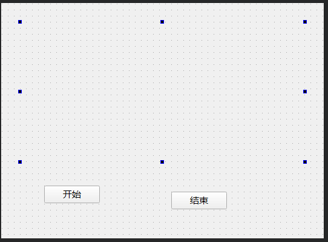

### 定时器

<br>

#### 定时器图片流水灯案例

> 实现效果：构建一个界面，点击开始按钮轮流播放文件夹下图片，点击停止按钮停止播放



构建页面，上部是一个没有内容的 label  
下面是开始和暂停按钮，各自的名称分别为 startBtn 和 stopBtn

<br>

先保持在 UI 设计界面别走  
右键点击开始和停止按钮，选择添加槽，各自添加一个 clicked 槽！

此时不需要为槽添加响应内容，我们打开 `Widget.h`

下图注释部分即为我们需要添加的部分

```cpp
#ifndef WIDGET_H
#define WIDGET_H

#include <QWidget>

// 第一步：定义轮播间隔时间
#define TIMEOUT 1*1000

QT_BEGIN_NAMESPACE
namespace Ui { class Widget; }
QT_END_NAMESPACE

class Widget : public QWidget
{
    Q_OBJECT

public:
    Widget(QWidget *parent = nullptr);

    // 第二步：定义虚函数timerEvent，表示定时器事件，他接受一个QTimerEvent类型的参数
    virtual void timerEvent(QTimerEvent *evt);
    ~Widget();

private slots:

    // 第三步：我们为两个按钮添加槽后，这边自动生成的代码
    void on_startBtn_clicked();
    void on_stopBtn_clicked();

private:
    Ui::Widget *ui;

    // 第四步：定义定时器ID（保证定时器的唯一性），以及当前图片轮播ID
    int myTimerId;
    int pixId;
};
#endif // WIDGET_H
```

<br>

头文件已经处理完毕，打开 `Widget.cpp`

首先在 widget 初始化时，我们就需要为 label 指定显示一张图片

```cpp
#include "Widget.h"
#include "ui_Widget.h"

Widget::Widget(QWidget *parent)
    : QWidget(parent)
    , ui(new Ui::Widget)
{
    ui->setupUi(this);

    // 下一张图片ID
    pixId = 2;
    // 默认显示的图片，即第一张图片1.png
    QPixmap pix("E:\\singlechip\\Linux\\qt\\qt_demo2\\image\\1.png");
    // 将图片绑定到界面内部的label里去
    ui->label->setPixmap(pix);
}
```

<br>

为两个信号槽定义代码

```cpp
// 开始按钮
void Widget::on_startBtn_clicked()
{
    // 开启定时器，并且返回定时器编号
    myTimerId = this->startTimer(TIMEOUT);
}

// 停止按钮
void Widget::on_stopBtn_clicked()
{
    // 杀死指定ID的定时器
    this->killTimer(myTimerId);
}
```

<br>

还记得我们之前在头文件中注册的虚函数 `timerEvent` 吗？  
我们需要在这边实现它，定义事件处理函数

```cpp
void Widget::timerEvent(QTimerEvent *evt)
{
    // 如果取得的定时器ID不对应，那么不执行后续代码
    if(evt->timerId()!=myTimerId) return;

    // 字符串拼接获得图片路径
    QString path("E:\\singlechip\\Linux\\qt\\qt_demo2\\image\\");
    path+=QString::number(pixId);
    path+=".png";

    // 将图片路径绑定到label上，以便显示图片
    QPixmap pix(path);
    ui->label->setPixmap(pix);

    // 每次显示完毕后ID都自增一次，直到递增超过文件夹下最大图片数量，就重置为1，从头开始显示
    pixId++;
    if(pixId==3) pixId=1;
}
```

<br>

这是完整的 Widget.cpp 代码：

```cpp
#include "Widget.h"
#include "ui_Widget.h"

Widget::Widget(QWidget *parent)
    : QWidget(parent)
    , ui(new Ui::Widget)
{
    ui->setupUi(this);

    pixId = 2;
    QPixmap pix("E:\\singlechip\\Linux\\qt\\qt_demo2\\image\\1.png");
    ui->label->setPixmap(pix);
}

Widget::~Widget()
{
    delete ui;
}


void Widget::on_startBtn_clicked()
{
    // 开启定时器，并且返回定时器编号
    myTimerId = this->startTimer(TIMEOUT);
}

void Widget::timerEvent(QTimerEvent *evt)
{
    if(evt->timerId()!=myTimerId) return;

    QString path("E:\\singlechip\\Linux\\qt\\qt_demo2\\image\\");
    path+=QString::number(pixId);
    path+=".png";

    QPixmap pix(path);
    ui->label->setPixmap(pix);

    pixId++;
    if(pixId==3) pixId=1;
}


void Widget::on_stopBtn_clicked()
{
    this->killTimer(myTimerId);
}
```

<br>
