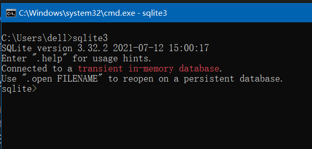
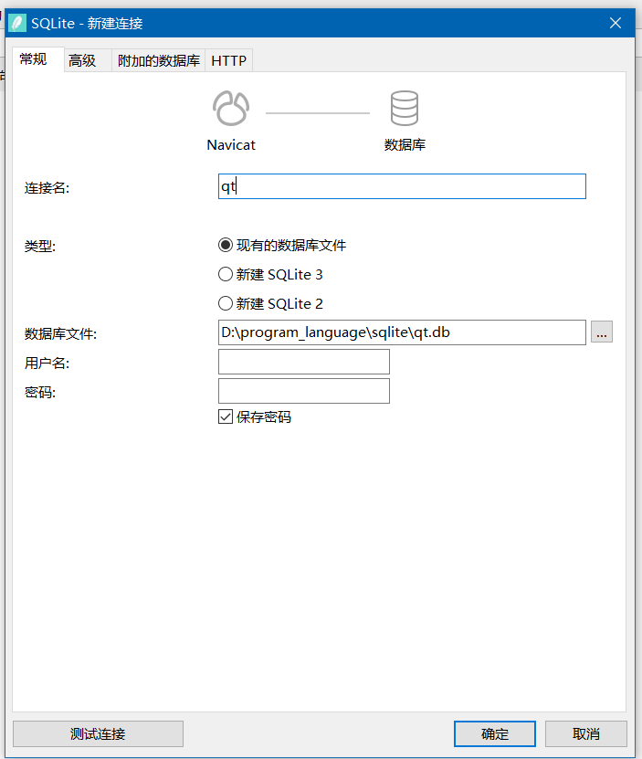

### MySQL

#### 构建 MYSQL 驱动

因为 MYSQL 后续商业化的因素，违背了 QT 所谓的开源理念  
故 QT6.xx 以及后续的新版本都移除了对 MYSQL 驱动的默认支持

纯手动安装 MYSQL 驱动极其复杂而且错误率极高  
而且 QT5.xx 和 QT6.xx 版本的驱动安装又不一样

请详细看以下步骤

<br>

### SQLite

<br>

#### 安装 SQLite3

> 安装过程十分简单，sqlite 本身的文件极小，几乎无需做任何配置即可建立对应的数据库

进入官网：https://www.sqlite.org/download.html

找到标题 `Precompiled Binaries for Windows`  
下载下面的 `sqlite-dll-win64-x64-3420000.zip` 和 `sqlite-tools-win32-x86-3420000.zip`  
如果你的计算机是 32 位的，那么前一个文件就要下载 `sqlite-dll-win32-x86-3420000.zip`

<br>

把下载的两个压缩包内的所有文件全部解压到一个文件夹内，注意全路径不可以包含中文以及特殊符号

把该路径在系统变量的 path 中注册一下，这样子就可以直接直接在命令行中使用 SQLite 数据库了

直接呼出命令行，输入 `sqlite3` ，看见下图所示内容就表示数据库配置完毕了



<br>

**链接 navicat**

任意文件夹下新建一个空文本文档，并将其后缀改为 db，这样子就生成了第一个数据库（数据库内啥都不用填！！！）

打开 navicat，点击新建连接，选择 SQLITE  
按照下图填入指定信息，然后点击确认即可添加数据库  
（用户名和密码都不需要填写）



<br>

#### QT 测试 SQLite

> 由于 QT 默认自带了 SQLite 的驱动，故使用起来极其方便，直接导入对应的库即可

首先在 pro 文件声明使用 sql 库 `QT += sql`

在 Widget.h 中添加对应头文件，并且定义一个 QSqlDatabase 变量

```cpp
#ifndef WIDGET_H
#define WIDGET_H

#include <QWidget>

// 导入接下来用到的所有库
#include <QtSql/QSqlDatabase>
#include <QtSql/QSqlQuery>
#include <QtSql/QSqlError>

// 测试用到的库
#include <QDebug>
#include <QMessageBox>

QT_BEGIN_NAMESPACE
namespace Ui { class Widget; }
QT_END_NAMESPACE

class Widget : public QWidget
{
    Q_OBJECT

public:
    Widget(QWidget *parent = nullptr);
    ~Widget();

private:
    Ui::Widget *ui;

    QSqlDatabase db;    // 定义database，不可以是引用类型的
};
#endif // WIDGET_H
```

<br>

在 Widget.cpp 里面链接数据库

```cpp
#include "Widget.h"
#include "ui_Widget.h"

Widget::Widget(QWidget *parent)
    : QWidget(parent)
    , ui(new Ui::Widget)
{
    ui->setupUi(this);

    // 根据QSQLITE驱动来初始化数据库
    db = QSqlDatabase::addDatabase("QSQLITE");
    // 数据库名称直接使用绝对路径指向我们创建的数据库即可
    // 如果指向路径找不到文件，应用会自己在当前目录下创建一个对应名字的空数据库
    db.setDatabaseName("D:/program_language/sqlite/qt.db");

    // 如果数据库打开失败了，应该做什么
    if(!db.open()){
        QMessageBox::warning(this,"警告","链接mysql数据库错误，请检查网络是否链接正确",QMessageBox::Ok);
        // 记录最后一次错误的原因并且输出的控制台
        QSqlError err = db.lastError();
        qDebug() << err.text();
    }else{
        // 如果成功了...
        QMessageBox::information(this,"提示","成功链接数据库",QMessageBox::Ok);
    }
}

Widget::~Widget()
{
    delete ui;
}
```

<br>

#### 简单 CRUD

QT 中提供的 CRUD 操作比较简单，封装不够完善，大多数情况都需要我们手写 SQL 语句，但是现在可以直接交给 GPT 来做，工作量实际上不会增加多少

下面是 CRUD 的参考模板：

- 定义 QSqlQuery 对象用于执行所有的 SQL 语句
- 使用 prepare 预定义 QSqlQuery 对象需要执行的 SQL 语句
- 使用 bindValue 或者 addBindValue 来填充 SQL 语句中的占位符
- exec 执行 SQL 语句
- 从 QSqlQuery 对象中取回执行后的结果，并进行进一步处理

```cpp
// 创建新的表
void createTable(){
    QSqlQuery q;
    q.prepare("create table person (id int primary key, name varchar(255), age int)");
    if(!q.exec()) qDebug()<<"创建表格失败";
}

// 更新数据
void updateData(){
    QSqlQuery q;
    q.prepare("update person set name = :newname where id = :id");
    q.bindValue(":newname","silly");
    q.bindValue(":id",1);
    q.exec();
}

// 插入数据
// 注意addBindValue中传入的参数必须要和数据库中定义的参数一致
void insertData(){
    QSqlQuery q;
    q.prepare("insert into person values(?,?,?)");
    q.addBindValue(5);
    q.addBindValue("shit");
    q.addBindValue(100);
    q.exec();
}

// 查询所有数据
// 可以吧执行后的QSqlQuery看做是一个迭代器，故使用next依次向后迭代获取值
void queryAll(){
    QSqlQuery q;
    QString sql = "select * from person";
    q.prepare(sql);

    if(!q.exec()){
        qDebug() << q.lastError();
    }else{
        while(q.next()){
            qDebug() << q.value(0).toInt() << q.value(1).toString() << q.value(2).toInt();
        }
    }
}
```

<br>
