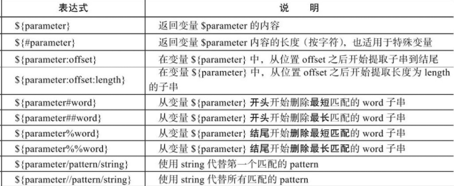
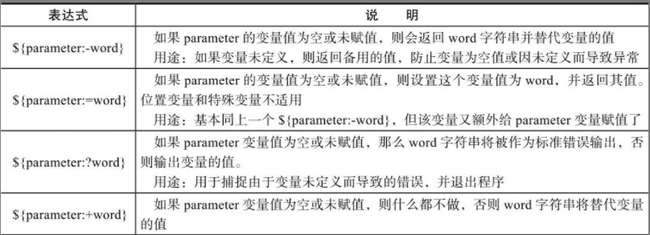
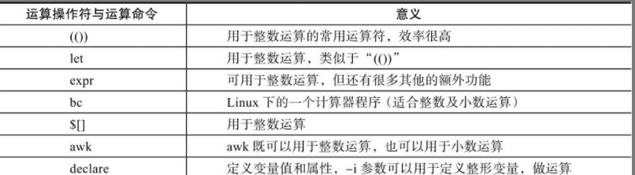
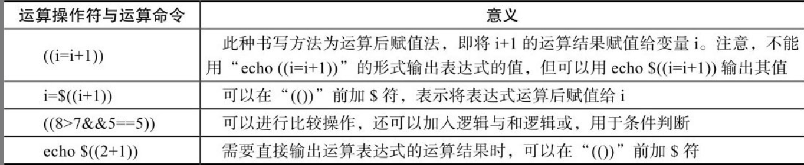

### Shell 初步入门

<br>

#### Shell 分类

对于 Unix/Linux 两种系统，shell 主要由以下两种类型

`Bourne shell` 其下还包括子分支 Bourne shell（sh）、Korn shell（ksh）、Bourne Again Shell（bash）三种类型

`C shell` 又包括 csh、tcsh 两种类型

> 目前主要留学的是 csh 以及 bash

<br>

#### 幻数

任意位置创建一个 sh 文件 `s1.sh`

写入以下代码

```sh
#! /bin/bash
echo tom
```

`#!` 叫做幻数，在其后面指出该文件使用的 shell 解释器  
（对于大多数 linux 系统，目前都会默认使用 bash，但这一行还是不可以省略）

保存该文件，同目录下，使用 bash 指令运行，发现输出了 tom  
运行代码 `bash s1.sh`

<br>

这是书中给出的常用 sh 开头写法

```sh
#! /bin/sh
#! /bin/bash
#! /usr/bin/awk
#! /bin/sed
#! /usr/bin/tcl
#! /usr/bin/expect      #＜==expect解决交互式的语言开头解释器。
#! /usr/bin/perl        #＜==perl语言解释器。
#! /usr/bin/env python  #＜==python语言解释器。
```

<br>

#### 注释

非常简单，使用一个 `#` 即可

<br>

### Shell 核心与实践

<br>

#### 变量

变量名加等号即可赋值

使用美刀符号输出变量值

```sh
#! /bin/bash

value="helloworld"

echo $value
```

<br>

终端模式下，可以使用以下三个命令获取对应作用域内的变量  
`set` 命令输出所有的变量，包括全局变量和局部变量；  
`env` 命令只显示全局变量；  
`declare` 命令输出所有的变量、函数、整数和已经导出的变量

<br>

常见的系统环境变量  
`$HOME`：用户登录时进入的目录。  
`$UID`：当前用户的 UID（用户标识），相当于 id -u。  
`$PWD`：当前工作目录的绝对路径名。  
`$SHELL`：当前 SHELL。  
`$USER`：当前用户。

<br>

#### 引号输出

`a=123` 不加引号直接赋值，值被解析后输出

`a='123'` 单引号，不作任何解析，有什么就输出什么

`a="123"` 双引号，引号里的变量及命令会经过解析后再输出内容

<br>

#### 特殊变量

`$0` 取出当前执行脚本的文件完整名称

`$#` 取出脚本传参的个数

`$*`以及`$@` 均为输出所有传入参数的值，但是会根据变量有无单双引号而呈现不同的解释状态

<br>

#### 特殊状态变量

`$?` 获取执行上一个指令执行状态的返回值  
`$$` 获取当前 shell 脚本进程号 PID  
`$!` 获取上一个于后台工作进程的进程号  
`$_` 获取在此之前执行命令的脚本的最后一个参数

<br>

#### bash 内置变量命令

`eval` 在当前代码执行位置插入新的指令并且执行他  
如`eval "echo $0"`

`exec` 不创建新的子进程的情况下执行对应的指令，执行完毕进程终止  
如`exec data`

<br>

`read` 从标准输入读取字符串信息

`exit` 退出 shell 或者转到下一个数位

<br>

#### 变量子串



即在一个变量表达式内，使用对应的变量子串符号来达到快速操作字符串的效果

指令实例 `${#name}`

<br>

#### 特殊扩展变量



使用特殊扩展变量方法，为未初始化或者未赋值的变量在运行时显示指定内容

如下代码，由于 res 变量未定义，我们通过 `:-` 设置了当变量未初始化时输出的内容

```sh
echo $test # 没有定义的变量直接调用就是0
res=${test:-UNDEFINED} # 定义未定义的变量的方法
echo $res # UNDEFINED
```

<br>

### 变量数值计算实践

#### 基本算术运算符



<br>

#### 双小括号



双小括号可以作为一个简单的表达式使用，进行赋值或者回显操作时务必带上￥符号，否则将会出错  
`echo $((100+200))`

表达式在命令行执行时不需要加$符号，直接使用((6%2))形式即可，但是如果需要输出，就要加$符

`“(())”`里的所有字符之间没有空格、有一个或多个空格都不会影响结果

<br>

#### let 运算命令用法

let 相当于双小括号，你可以这么写

`let i=i+1`
