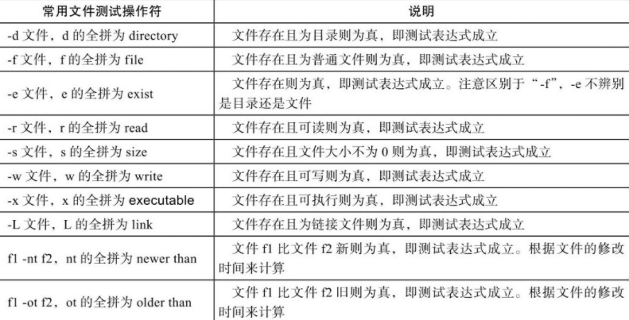
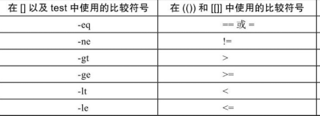
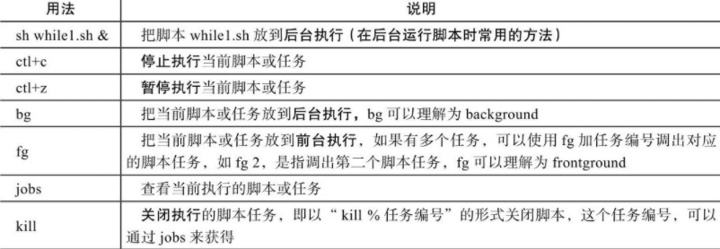
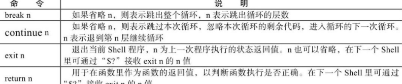

### Shell 初步入门

<br>

#### Shell 分类

对于 Unix/Linux 两种系统，shell 主要由以下两种类型

`Bourne shell` 其下还包括子分支 Bourne shell（sh）、Korn shell（ksh）、Bourne Again Shell（bash）三种类型

`C shell` 又包括 csh、tcsh 两种类型

> 目前主要留学的是 csh 以及 bash

<br>

#### 幻数

任意位置创建一个 sh 文件 `s1.sh`

写入以下代码

```sh
#! /bin/bash
echo tom
```

`#!` 叫做幻数，在其后面指出该文件使用的 shell 解释器  
（对于大多数 linux 系统，目前都会默认使用 bash，但这一行还是不可以省略）

保存该文件，同目录下，使用 bash 指令运行，发现输出了 tom  
运行代码 `bash s1.sh`

<br>

这是书中给出的常用 sh 开头写法

```sh
#! /bin/sh
#! /bin/bash
#! /usr/bin/awk
#! /bin/sed
#! /usr/bin/tcl
#! /usr/bin/expect      #＜==expect解决交互式的语言开头解释器。
#! /usr/bin/perl        #＜==perl语言解释器。
#! /usr/bin/env python  #＜==python语言解释器。
```

<br>

#### 注释

非常简单，使用一个 `#` 即可

<br>

### Shell 核心与实践

<br>

#### 变量

变量名加等号即可赋值

使用美刀符号输出变量值

```sh
#! /bin/bash

value="helloworld"

echo $value
```

<br>

终端模式下，可以使用以下三个命令获取对应作用域内的变量  
`set` 命令输出所有的变量，包括全局变量和局部变量；  
`env` 命令只显示全局变量；  
`declare` 命令输出所有的变量、函数、整数和已经导出的变量

<br>

常见的系统环境变量  
`$HOME`：用户登录时进入的目录。  
`$UID`：当前用户的 UID（用户标识），相当于 id -u。  
`$PWD`：当前工作目录的绝对路径名。  
`$SHELL`：当前 SHELL。  
`$USER`：当前用户。

<br>

#### 引号输出

`a=123` 不加引号直接赋值，值被解析后输出

`a='123'` 单引号，不作任何解析，有什么就输出什么

`a="123"` 双引号，引号里的变量及命令会经过解析后再输出内容

<br>

#### 特殊变量

`$0` 取出当前执行脚本的文件完整名称

`$#` 取出脚本传参的个数

`$*`以及`$@` 均为输出所有传入参数的值，但是会根据变量有无单双引号而呈现不同的解释状态

<br>

#### 特殊状态变量

`$?` 获取执行上一个指令执行状态的返回值  
`$$` 获取当前 shell 脚本进程号 PID  
`$!` 获取上一个于后台工作进程的进程号  
`$_` 获取在此之前执行命令的脚本的最后一个参数

<br>

#### bash 内置变量命令

`eval` 在当前代码执行位置插入新的指令并且执行他  
如`eval "echo $0"`

`exec` 不创建新的子进程的情况下执行对应的指令，执行完毕进程终止  
如`exec data`

<br>

`read` 从标准输入读取字符串信息

`exit` 退出 shell 或者转到下一个数位

<br>

#### 变量子串


即在一个变量表达式内，使用对应的变量子串符号来达到快速操作字符串的效果

指令实例 `${#name}`

<br>

#### 特殊扩展变量


使用特殊扩展变量方法，为未初始化或者未赋值的变量在运行时显示指定内容

如下代码，由于 res 变量未定义，我们通过 `:-` 设置了当变量未初始化时输出的内容

```sh
echo $test # 没有定义的变量直接调用就是0
res=${test:-UNDEFINED} # 定义未定义的变量的方法
echo $res # UNDEFINED
```

<br>

### Shell 变量数值计算实践

#### 基本算术运算符


<br>

#### 双小括号


双小括号可以作为一个简单的表达式使用，进行赋值或者回显操作时务必带上￥符号，否则将会出错  
`echo $((100+200))`

表达式在命令行执行时不需要加$符号，直接使用((6%2))形式即可，但是如果需要输出，就要加$符

`“(())”`里的所有字符之间没有空格、有一个或多个空格都不会影响结果

<br>

#### let

let 相当于双小括号，你可以这么写

`let i=i+1`

<br>

#### expr

可用于求职或者表达式运算

乘法运算要加上反斜杠进行转义

```sh
expr 2 + 2 # 4
expr 2 \* 2 # 4
```

使用反引号包裹 expr，使其以一个表达式的形式出现

```sh
i=5
i=`expr $i + 6`
echo $i # 11
```

利用 expr 做计算，将一个未知的变量和一个已知的整数相加，看返回值是否为 0，如果为 0 就认为做加法的变量为整数，否则就不是整数

可以使用 length 参数来计算对应字符串的长度

```sh
str="asd"
expr length $str # 3

```

<br>

#### bc

bc 是一款 linux 自带的计算器，我们也可将其用在命令行内

```sh
echo 3+4|bc # 7

i=10
i=`echo $i+10|bc` # 20
```

<br>

#### awk

适用于小数加减法

```sh
echo "7.7 8.2" |awk '{print ($1-$2)}' # -0.5
```

<br>

#### read

read 可以读取用户输入

```sh
# -t 10 设置等待时间为10s
# -p "please input:"输入提示词
# num输入内容被赋予的变量
read -t 10 -p "please input:" num
```

<br>

### Shell 条件测试与比较

<br>

#### 脚本条件测试

```sh
# -f判断文件是否存在，如果存在返回真，反之为假
# 一下结构类似于三元运算符，文件存在则执行true，不存在则执行false
test -f file && echo true || echo false

# 使用中括号包裹test所有参数及其对应值
# 中括号左右端都必须预留一个空格距离，否则报错
test [ -f file ] && echo 1 || echo 2
```

一般的，都建议运算符号之间没有距离（即没有很多空格阻隔）

<br>

#### 文本测试表达式



```sh
# 对单个文件变量进行测试
[ -f "$fileval" ] && echo 1 || echo 0
```

<br>

实际开发中常用的条件判断语句模板

如果条件返回 true，则执行大括号内的所有指令

```sh
[ 条件 ] &&{
    命令1
    命令2
    命令3
}
```

<br>

#### 字符串测试表达式

使用时特别注意空格间距的安排！

```sh
# -n "abs" 若字符串长度非0，返回true
[ -n "abs" ] && echo 1 || echo 0

# -z "abs" 若字符串长度为0，返回true
[ -n "" ] && echo 1 || echo 0
```

<br>

#### 整数二元比较操作符



编写时分为两种情况，按照上图针对性使用

在`[[]]`和`(())`内也可以使用文字式比较符号，但是不推荐！

```sh
[ 2 -eq 1 ] && echo 1 || echo 0
[[ 2 > 10 ]] && echo 1 || echo 0

(($num1<$num2)) && echo 1 || echo 0
```

不建议在正式工作中使用 `[[]]` ，因为它比较复杂，这会为开发带来很多麻烦

三种形式使用到的符号总结

- 整数加双引号的比较是对的。
- `[[]]`中用类似`-eq`等的写法是对的，`[[]]`中用类似`＞、＜`的写法也可能不对，有可能会只比较第一位，逻辑结果不对。
- `[]`中用类似`＞、＜`的写法在语法上虽然可能没错，但逻辑结果不对，可以使用`=、! =`正确比较。
- `(())`中不能使用类似`-eq`等的写法，可以使用类似`＞、＜`的写法。

<br>

#### 逻辑操作符

与或非运算，除了在 `[]` 内可以使用字符式表达，其余两个可以使用对应的原始符号（如&&）

```sh
[ 1 -a 1 ] # 相当于 &&
[ 1 -o 1 ] # 相当于 ||
[ 1 ! 1 ] # 相当于 ！
```

<br>

#### 区别总结


<br>

### if 语句

<br>

```sh
# 基础判断语句
# if开头，then衔接，fi结尾
if  ＜条件表达式＞
    then
    指令
fi

# 双分支结构
if  ＜条件表达式＞
    then
    指令集1
else
    指令集2
fi

# 多分支结构
if  ＜条件表达式1＞
    then
    指令1
elif ＜条件表达式2＞
    then
    指令2
else
    指令3
fi
```

除此之外，if 还可以结合 `测试表达式test、[]、[[]]、(())` 作为判断条件使用

<br>

### Shell 函数

<br>

#### 基础执行

shell 中定义函数有三种办法

```sh
# 标准格式
function demo1(){}

# 有function修饰的情况下可不写小括号
function demo2{}

# 无function修饰必须要有小括号
demo3(){}
```

> 特别注意，由于 ubuntu 中 sh 和 bash 相互冲突的关系，执行脚本时务必使用 bash 命令，否则当你使用 function 定义函数的时候会一直报错！！！

<br>

### case

<br>

#### 基本

请注意 case 使用后的闭合问题，开头 case，结尾 esac

```sh
#! /bin/bash

read -p "input your number:" ans

# 双引号内写判据
case "$ans" in
  # 对应值+右小括号
  1)
  echo "1";; # 末尾两个引号可视为break
  2)
  echo "2";;
  # *）可视为default
  *)
  echo "i dont understand what you input"
  exit; # 最后一个程序结尾直接退出
esac # 别忘了case末尾需要闭合！
```

<br>

#### case 企业级案例

此次案例展示：使用函数传参的方式来为 conf 添加用户

```sh
[root@oldboy scripts]# cat add-openvpn-user
#! /bin/bash

. /etc/init.d/functions

#config file path
FILE_PATH=/etc/openvpn_authfile.conf           #＜==这是openvpn的登录授权文件路径。
[ ! -f $FILE_PATH ] && touch $FILE_PATH        #＜==如果变量对应的文件不存在，则创建文件。
usage(){                                       #＜==帮助函数。
    cat ＜＜EOF                                #＜==这是一个可以替代echo的输出菜单等内
                                                        容的方法。
    USAGE: `basename $0` {-add|-del|-search} username
EOF
}

#judge run user
if [ $UID -ne 0 ] ; then    #＜==必须是root用户，才能执行本脚本。
    echo "Youare not supper user, please call root! "
    exit 1;
fi

#judge arg numbers.
if [ $# -ne 2 ] ; then      #＜==传入的参数必须为两个。
    usage
    exit 2
fi
#满足条件后进入case语句判断。
case "$1" in                #＜==获取命令行第一个参数的值。
    -a|-add)                #＜==如果匹配-a或-add，则执行下面的命令语句。
        shift               #＜==将$1清除，将$2替换为$1，位置参数左移。
        if grep "^$1$" ${FILE_PATH} ＞/dev/null 2＞&1     #＜==过滤命令行第一个参
                                                                数的值，如果有
            then              #＜==则执行下面的指令。
            action $"vpnuser, $1 is exist" /bin/false
            exit
            else              #＜==如果文件中不存在命令行传参的一个值，则执行下面的指令。
            chattr -i ${FILE_PATH}             #＜==解锁文件。
            /bin/cp ${FILE_PATH} ${FILE_PATH}.$(date +%F%T)
#＜==备份文件（尾部加时间）。
            echo "$1" ＞＞ ${FILE_PATH}        #＜==将第一个参数（即用户名）加入到文件。
            [ $? -eq 0 ] && action $"Add $1" /bin/true      #＜==如果返回值为0，提
                                                                示成功。
            chattr +i ${FILE_PATH}             #＜==给文件加锁。
        fi
        ;;
    -d|-del)       #＜==如果命令行的第一个参数匹配-d或-del，则执行下面的命令语句。
        shift
        if [ `grep "\b$1\b" ${FILE_PATH}|wc -l` -lt 1 ]   #＜==过滤第一个参数值，
                                                                并看文件中是否存在。

            then     #＜==如果不存在，则执行下面的指令。
            action $"vpnuser, $1 is not exist." /bin/false
            exit
        else       #＜==否则执行下面的指令，存在才删除，不存在就提示不存在，不需要删除。
            chattr -i ${FILE_PATH}                #＜==给文件解锁，准备处理文件的内容。
            /bin/cp ${FILE_PATH} ${FILE_PATH}.$(date +%F%T)
#＜==备份文件（尾部加时间）。
            sed -i "/^${1}$/d" ${FILE_PATH}       #＜==删除文件中包含命令行传参的用户。
            [ $? -eq 0 ] && action $"Del $1" /bin/true
#＜==如果返回值为0，提示成功。
            chattr +i ${FILE_PATH}                #＜==给文件加锁。
            exit
        fi
        ;;
    -s|-search)    #＜==如果命令行的第一个参数匹配-s或-search，就执行下面的命令语句。
        shift
        if [ `grep -w "$1" ${FILE_PATH}|wc -l` -lt 1 ]
#＜==过滤第一个参数值，并看文件中是否存在。
            then
            echo $"vpnuser, $1 is not exist."; exit
        else
            echo $"vpnuser, $1 is exist."; exit
        fi
        ;;
    ＊)
        usage
        exit
        ;;
esac
```

<br>

### while 循环

<br>

#### 当型与直到

当型即 while，当条件成立时才继续执行

```sh
while ＜条件表达式＞
do
    指令...
done
```

直到即 until，当条件成立后就停止循环

```sh
until ＜条件表达式＞
do
    指令...
done
```

<br>

每隔两秒输出一次负载值的程序

```sh
#! /bin/bash

while [ 1 ]
do
  uptime
  sleep 2
done
```

<br>

#### 后台运行



比如这样子可以让程序后台执行 `sh demo1.sh &`

<br>

#### while 实战

每个十秒检测一个网站是否正常

```sh
#! /bin/sh
if [ $# -ne 1 ]; then               #＜==判断，若传参的个数不为1，
    echo $"usage $0 url"            #＜==则打印正确使用提示。
    exit 1                          #＜==以返回值1退出脚本。
fi

while true                          #＜==永远为真，进入while循环。
do
    if [ `curl -o /dev/null --connect-timeout 5 -s -w "%{http_code}"   $1|
egrep -w "200|301|302"|wc -l` -ne 1 ]
    #＜==对传入的URL参数获取状态码，过滤200、301、302任意之一转为数字，如果不等于1，
则表示状态信息不对。
        then
        echo "$1 is error."         #＜==提示URL访问错误。
        #echo "$1 is error."|mail -s "$1 is error." 31333741--@qq.com
                                    #＜==发送邮件报警。
    else
        echo "$1 is ok"             #＜==否则，提示URL访问OK。
    fi
    sleep 10   #＜==休息10秒继续执行while循环，注意，当while后面有true等永远为真的条件时，一般在循环里要有退出循环的条件或类似sleep休息的命令，否则会大量消耗系统资源。
done
```

> 日常开发时，推荐吧常用的函数放置到函数库 function 里面，类似于前端封装的工具类，便于后期调用

<br>

每一个小时检测某个 IP 是否访问量超过了 500 次，如果是，则判定其为恶意的，直接自动封禁

```sh
file=$1          #＜==定义一个变量接收命令行传参，参数为日志文件类型。

while true
do
    awk '{print $1}' $1|grep -v "^$"|sort|uniq -c ＞/tmp/tmp.log
    #＜==分析传入的日志文件，并在排序去重后追加到一个临时文件里。
    exec ＜/tmp/tmp.log     #＜==读取上述临时文件。
    while read line         #＜==进入while循环处理。
    do
        ip=`echo $line|awk '{print $2}'`          #＜==获取文件中的每一行的第二列。
        count=`echo $line|awk '{print $1}'`       #＜==获取文件中的每一行的第一列。
        if [ $count -gt 500 ] && [ `iptables -L -n|grep "$ip"|wc -l` -lt 1 ]
        #＜==如果PV数大于500，并且防火墙里没有封过此IP。
            then
            iptables -I INPUT -s $ip -j DROP      #＜==则封掉PV数大于500的IP。
            echo "$line is dropped" ＞＞/tmp/droplist_$(date +%F).log
                                                    #＜==记录处理日志。
        fi
    done
    sleep 3600  #＜==读者可以按分钟进行分析，不过日志的分割或过滤也得按分钟才行。
done
```

<br>

### for & select

<br>

#### for 循环方法

由两种典型的定义 for 循环的方法

```sh
# shell中foreach风格的for
# 下面展示的被迭代的数据为一个数组，数字之间使用空格隔开
for num in 1 2 3 4 5
do
  echo $num
done

# C风格的for
for ((i=1; i<=3; i++))
do
  echo $i
done
```

<br>

配合其他语法可以实现特殊的效果

```sh
# 花括号列表形式
for n in {5..1}        #＜==实质上也相当于列表。
do
    echo $n
done

# seq步长，反引号实际上规定了一个执行linux命令的区域
for n in `seq 5 -1 1` #＜==5是起始数字，-1是步长，即每次减一，1是结束数字。
do
    echo $n
done
```

<br>

#### linux 生成随机数

```sh
# $RANDOM 系统变量，生成随机数
# 后面的参数表示使用md5进行加密
echo "oldboy$RANDOM"|md5sum|cut -c 8-15

# 借助openssl生成安全稳定的随机数
openssl rand -base64 8

# 通过date获取随机数
date +%s%N

# 借助UUID生成随机数
cat /proc/sys/kernel/random/uuid

# 使用expect的子库mkpassowrd快速生成随机数
# -l长度 -d数字个数 -c小写字母个数 -C大写字母个数 -s特殊字符个数
mkpasswd -l 9 -d 2 -c 3 -C 3 -s 1
```

<br>

#### select

select 的作用和 foreach 对应功能差不多一样，可以借鉴

他可以根据给定数组或者列表，输出对应列表项（即 select 过后，echo 输出的结果将以列表的形式呈现）

```sh
arr=(hey shit pig)
select s in "${arr[@]}"
do
  echo $s
done
```

<br>

### 循环控制

<br>



<br>

### Shell 数组

<br>

三种常见的定义数组的方法

```sh
# 标准数组，空格隔开
arr1=(1 2 3)

# 键值对初始化
arr2=([1]=hello [2]=world)

# 分别定义（分号表示一个语句的结束，这样可以不用换行直接在一行内写）
arr3[0]=shit; arr3[1]=damn;
```

<br>

如何打印数组中的元素呢？

```sh
echo ${array[0]}
#＜==打印单个数组元素用${数组名[下标]}，当未指定数组下标时，数组的下标将从0开始。

echo ${array[＊]} #＜==使用＊或@可以得到整个数组的内容。

echo ${array[@]}  #＜==使用＊或@可以得到整个数组的内容。

```
