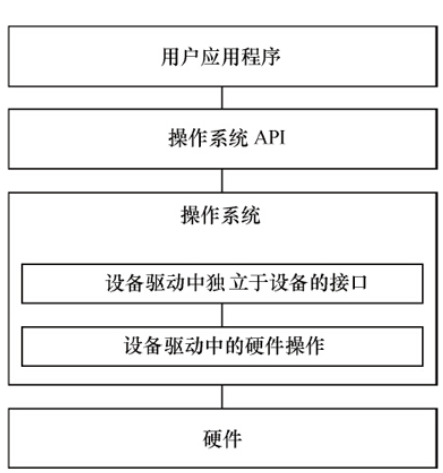
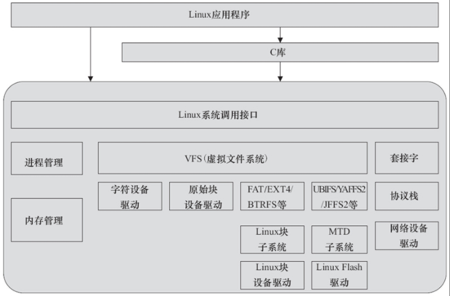

### 第一章 设备驱动概述与开发环境构建

<br>

#### 无操作系统设备驱动

这是一个简易的单任务架构，他不需要完整的操作系统进行执行

```c
int main(int argc, char* argv[])
{
  while (1)
  {
    if (serialInt == 1)
    /* 有串口中断 */
    {
      ProcessSerialInt();   /* 处理串口中断 */
      serialInt = 0;        /* 中断标志变量清0 */
    }
    if (keyInt == 1)
    /* 有按键中断 */
    {
      ProcessKeyInt();      /* 处理按键中断 */
      keyInt = 0;           /* 中断标志变量清0 */
    }
    status = CheckXXX();
    switch (status)
    {
      ...
    }
    ...
  }
}
```

<br>

无操作系统情况下，必须要有设备驱动  
每一种设备驱动都会定义为一个软件模块，包含.h 文件和.c 文件，前者定义该设备驱动的数据结构并声明外部函数，后者进行驱动的具体实现

如下为无操作系统串口驱动实现

```c
/**********************
 *serial.h文件
 **********************/
extern void SerialInit(void);
extern void SerialSend(const char buf*,int count);
extern void SerialRecv(char buf*,int count);
/**********************
 *serial.c文件
 **********************/
/* 初始化串口 */
void SerialInit(void)
{
 ...
}
/* 串口发送 */
void SerialSend(const char buf*,int count)
{
 ...
}
/* 串口接收 */
void SerialRecv(char buf*,int count)
{
 ...
}
/* 串口中断处理函数 */
void SerialIsr(void)
{
 ...
 serialInt = 1;
}
```

<br>

#### 有操作系统设备驱动



当存在操作系统时，设备驱动就变成了链接操作系统和底层硬件的桥梁（API）

此时 OS 会要求驱动具备更加复杂的功能，从而为上层用户提供更加便利的使用条件

<br>

#### Linux 设备驱动



上图展示了 Linux 设备驱动与软硬件关系

<br>

入门驱动开发需要具备的能力

1. 非常好的 C 语言基础
2. 懂得 SRAM、Flash、SDRAM、磁盘的读写方式，UART、I2C、USB 等设备的接口以及轮询、中断、DMA 的原理，PCI 总线的工作方式以及 CPU 的内存管理单元（MMU）等
3. 对于块设备、网络设备、Flash 设备、串口设备等复杂设备的理解
4. 多任务并发控制和同步的基础

<br>

#### 开发环境
