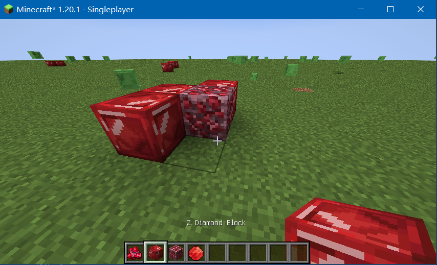

## 前言

Fabric 是 Minecraft 一款非官方的模组 API,与 Forge mod 不同。它以轻量级和高性能为设计目标,专注于支持新版本的 Minecraft。

Fabric 和 Forge 在各自的加载编译流程上差别很大，所以你很难看见有同时支持二者的 mod，除非做了兼容性处理

Fabric 还支持 kotlin 编程

<br>

## 环境配置

> 以下及后续的所有教程均基于 fabric 官方 wiki 总结精华与踩坑得来，如有觉得下方内容不够详细的，可以查看原网站：https://fabricmc.net/wiki/zh_cn:tutorial:setup

<br>

### 安装必要前置

`JDK17` 及以上版本（硬性要求，低于此版本的 JDK 无法编译 Gradle）

`Intellij Idea` 任意版本

此外，我们还需要使用 fabric 提供的 `fabric-example-mod` 作为第一个 mod 的开发模板  
前往官网的模板生成器，生成你想要的对应 MC 版本模板，我这里使用的是 1.20 的  
https://fabricmc.net/develop/template/

<br>

### 配置 gradle

> 众所周知，这是最最最最恶心的环节，有可能卡的你生无可恋并出现无法预知的弱智错误，在此处我将详细介绍我所踩到的坑以及目前遇到错误的解决方案

#### 解压 template 文件

把上一步下载好的 ZIP 文件解压到任意一个文件夹内，并确保全路径绝对不能包含中文和其他特殊符号（下划线可以）

删除多余的 `RAEDME.md` `.github` `LICENSE`

然后使用 IDEA 打开该项目文件夹  
紧接着此时 IDEA 会自动开始配置 gradle，立马点击停止！！！等我们配置代理和镜像源后再重新构建，否则巨慢！！！而且可能直接下载到一半就报错

<br>

#### 修改镜像源

> 配置镜像源以及代理可以参考这个网站：[Fabric 镜像与代理配置](https://fabricmc.cn/2021/06/28/%E5%A6%82%E4%BD%95%E5%8A%A0%E9%80%9FFabric%E6%A8%A1%E7%BB%84%E7%9A%84%E6%9E%84%E5%BB%BA/)

将 `settings.gradle` 替换为以下内容

```groovy
pluginManagement {
    repositories {
        maven {
            name = 'Fabric'
            url = 'https://repository.hanbings.io/proxy'
        }
        gradlePluginPortal()
    }
}
```

向 `build.gradle` 添加如下内容（如果已存在，则直接替换掉）

```groovy
repositories {
    maven {
        url 'https://maven.aliyun.com/nexus/content/groups/public'
    }
    maven {
        url 'https://repository.hanbings.io/proxy'
    }
}
```

<br>

#### 配置外部代理

是的，即使你配置了镜像源，可能依然会非常卡，如果你掌握了科学上网的方法，那么可以尝试添加一个代理

打开项目目录下的 `gradle.properties` 文件

添加如下代码

- proxyHost 即为代理地址（我这边默认就是 127.0.0.1）
- proxyPort 为你开的代理软件对应的端口

```conf
systemProp.http.proxyHost=127.0.0.1
systemProp.http.proxyPort=10809
```

实际上，如果你参考其他教程，可能会在上方顺便注册 https 代理，但是我一旦注册了必定报错而无法下载对应库，所以我就索性删掉了，只留下比较核心的内容

<br>

### 构建 gradle 与反编译

#### 构建

构建的方式很简单，打开 IDEA，右键点击项目目录，选择“重新构建”即可

构建成功的标志是你在构建输出窗口看见 `BUILD SUCCESSFUL`

<br>

#### 反编译

该步骤必须要在 gradle 构建成功后执行，否则会一直卡着动不了

使用管理员权限打开命令提示符，进入项目所在的目录  
执行该代码：`gradlew genSources`

等待时长浮动较大，反正最后构建成功会给你一个大大的绿色提示滴~

<br>

## 第一个物品

> 此系列参考油管教程：https://www.youtube.com/watch?v=fQYNhfAwLf8&list=PLKGarocXCE1EeLZggaXPJaARxnAbUD8Y_&index=2

制作物品所需的图像资源包：https://url.kaupenjoe.net/yt331/assets

由于油管上最新的教程只有 1.19 的，而目前代码风格有所变动，我会针对 1.20 新改动做出对应解释

<br>

### 物品注册

首先请各位按照下图所示文件结构，在对应位置新建空的 Java 类文件，如果文件已存在就不管  
新建的文件将在后续逐步填充，不要在意


#### TutorialMod.java

该文件原始的名称应该是 `ExampleMod.java`

由于 Java 特性，类名必须和文件名一致，故我们可以使用快捷键 `shift+f6` 快速执行主类名称的更改，同时任何引用此类的位置的名称都会做出对应更改，十分方便！

```java
package com.example;

import com.example.item.ModItems;
import net.fabricmc.api.ModInitializer;

import org.slf4j.Logger;
import org.slf4j.LoggerFactory;

// 主要类，用于初始化模组
public class TutorialMod implements ModInitializer {

    // 定义模组的MOD_ID
    public static final String MOD_ID = "tutorialmod";
    public static final Logger LOGGER = LoggerFactory.getLogger(MOD_ID);

    @Override
    public void onInitialize() {
        // 在模组初始化时注册自定义物品
        ModItems.registerModItems();
    }
}
```

<br>

#### TutorialModClient.java

定义客户端，目前暂且用不到，先写入以下代码

```java
package com.example;

import net.fabricmc.api.ClientModInitializer;

public class TutorialModClient implements ClientModInitializer {
    @Override
    public void onInitializeClient() {

    }
}
```

<br>

#### ModItems.java

在该文件内执行物品的注册操作

当我们注册物品时，务必牢记注册物品所用到的物品名！！！后续为物品添加纹理以及模型时都会用到的

```java
package com.example.item;

import com.example.TutorialMod;
import net.fabricmc.fabric.api.item.v1.FabricItemSettings;
import net.minecraft.item.Item;
import net.minecraft.registry.Registries;
import net.minecraft.registry.Registry;
import net.minecraft.util.Identifier;

public class ModItems {

    // 自定义物品示例：ZER_DIAMOND
    public static final Item ZER_DIAMOND = regItem("zer_diamond",
            new Item(new FabricItemSettings()));

    // 自定义物品示例：ZER_INGOT
    public static final Item ZER_INGOT = regItem("zer_ingot",
            new Item(new FabricItemSettings()));

    // 定义注册物品到游戏的物品注册表的方法
    // 物品注册需要接收两个参数：1.MODID 2.物品名称
    private static Item regItem(String name, Item item) {
        return Registry.register(Registries.ITEM, new Identifier(TutorialMod.MOD_ID, name), item);
    }

    // 在模组初始化时调用，用于注册自定义物品
    public static void registerModItems() {
        TutorialMod.LOGGER.debug("TutorialMod正在注册Items，MOD_ID:" + TutorialMod.MOD_ID);
        // 在这里添加更多的自定义物品注册逻辑
    }
}
```

<br>

### 资源文件

为 resources 文件夹新增如下图所示结构


下面将介绍对应结构的作用

1. `lang/en_us.json` 定义物品或者方块在游戏内部显示的名称
2. `models/item/zer_diamond.json` 定义模型
3. `textures/item/zer_diamond.png` 定义模型对应的贴图
4. `fabric.mod.json` 模组属性设置
5. `tutorialmod.mixins.json` 模组混合属性设置

<br>

#### en_us.json

首先当然是配置我们的语言文件啦

对于我们开发者来说，推荐首先使用英文，后续可以逐步补全中文翻译

所以`en_us.json`表示当你的 MC 客户端使用英文时显示的翻译，对于的中文翻译文件就是`zh_cn.json`

填入代码

```json
{
	// 注意格式 item.MOD_ID.物品名称
	// 所以知道为什么我要叫你牢记物品注册时用到的名称了吧！
	"item.tutorialmod.zer_diamond": "Zhiller's Diamond",
	"item.tutorialmod.zer_ingot": "Zhiller's Ingot"
}
```

<br>

#### zer_diamond.json

在这里配置物品的模型文件

因为当前物品只是一个手拿物品，所以模型可以说就是一个简单的平面，不需要做过多修饰  
写入以下代码

```json
{
	"parent": "item/generated",
	"textures": {
		"layer0": "tutorialmod:item/zer_diamond"
	}
}
```

> 另外一个方块文件 `zer_ingot.json` 大家直接如法炮制即可

<br>

#### 纹理

在 textures 文件夹下对应的 block 以及 item 文件夹添加方块和物品的纹理文件

注意，纹理文件名必须和方块或物体注册名完全一致！使用 png 格式！

<br>

#### fabric.mod.json

目前仅需修改我打了注释的几个地方的内容，其他的不管

```json
{
	"schemaVersion": 1,
	"id": "tutorialmod", // 在这修改MOD_ID
	"version": "${version}",
	"name": "Example mod", // 你的MOD名字
	"description": "This is an example description! Tell everyone what your mod is about!",
	"authors": ["zhiller"], // MOD作者
	"contact": {
		"homepage": "https://fabricmc.net/",
		"sources": "https://github.com/FabricMC/fabric-example-mod"
	},
	"license": "CC0-1.0",
	"environment": "*",
	"entrypoints": {
		// main入口点文件所在位置
		"main": ["com.example.TutorialMod"],
		// client客户端入口点文件所在位置
		"client": ["com.example.TutorialModClient"]
	},
	// 混合文件所在位置
	"mixins": ["tutorialmod.mixins.json"],
	"depends": {
		"fabricloader": ">=0.14.21",
		"minecraft": "~1.20.1",
		"java": ">=17",
		"fabric-api": "*"
	},
	"suggests": {
		"another-mod": "*"
	}
}
```

<br>

#### tutorialmod.mixins.json

由于我们在 src 根目录下的 mixin 包内文件没有做任何修改，故下方代码也不需要做任何修改

但请注意要修改该文件的文件名，开头必须是你的 `MOD_ID` 哦！

```json
{
	"required": true,
	"package": "com.example.mixin",
	"compatibilityLevel": "JAVA_17",
	"mixins": ["ExampleMixin"],
	"injectors": {
		"defaultRequire": 1
	}
}
```

<br>

### 运行！

没错！你目前已经创建了第一个属于你的个人物品，现在进入客户端来看看成果把~

依次点击：`gradle->fabric->runClient` 执行客户端


<br>

新建一个超平坦世界，输入该指令获取你注册的物品：`give @p tutorialmod:zer_diamond 1`


## 创造模式物品栏

<br>

### 添加到当前已有物品栏

> 再添加自定义的创造模式物品栏之前，请确保你的确有这个需求！否则建议直接添加到当前已有的物品栏内部

创建新文件：`com/example/item/ModItemGroup.java`

```java
package com.example.item;


import net.fabricmc.fabric.api.itemgroup.v1.FabricItemGroup;
import net.fabricmc.fabric.api.itemgroup.v1.FabricItemGroupEntries;
import net.fabricmc.fabric.api.itemgroup.v1.ItemGroupEvents;
import net.minecraft.item.ItemGroup;
import net.minecraft.item.ItemGroups;
import net.minecraft.item.ItemStack;
import net.minecraft.text.Text;


public class ModItemGroup {

    // 定义我们要把什么物品添加到物品栏里面
    private static void addItemsToGroup(FabricItemGroupEntries entries){
        entries.add(ModItems.ZER_DIAMOND);
        entries.add(ModItems.ZER_INGOT);
    }

    // 注册物品栏方法
    public static void registerItemGroup(){
        // 添加到已有的物品栏INGREDIENTS里面
        ItemGroupEvents.modifyEntriesEvent(ItemGroups.INGREDIENTS).register(ModItemGroup::addItemsToGroup);
    }
}
```

<br>

最后别忘了在 `TutorialMod.java` 里面执行初始化

```java
package com.example;

import com.example.item.ModItemGroup;
import com.example.item.ModItems;
import net.fabricmc.api.ModInitializer;

import org.slf4j.Logger;
import org.slf4j.LoggerFactory;

public class TutorialMod implements ModInitializer {
	...

	@Override
	public void onInitialize() {
		ModItems.registerModItems();

        // 在这里注册物品栏哦！
        // 由于我们需要使用到自定义物品，所以注册物品栏顺序必须晚于物品注册
		ModItemGroup.registerItemGroup();
	}
}
```

最终结果：  


<br>

### 注册自定义物品栏

其他内容保持不变，我们仅需修改 `ModItemGroup.java`

```java
package com.example.item;


import com.example.TutorialMod;
import net.fabricmc.fabric.api.itemgroup.v1.FabricItemGroup;
import net.fabricmc.fabric.api.itemgroup.v1.FabricItemGroupEntries;
import net.fabricmc.fabric.api.itemgroup.v1.ItemGroupEvents;
import net.minecraft.item.ItemGroup;
import net.minecraft.item.ItemGroups;
import net.minecraft.item.ItemStack;
import net.minecraft.registry.Registries;
import net.minecraft.registry.Registry;
import net.minecraft.text.Text;
import net.minecraft.util.Identifier;


public class ModItemGroup {
    // 注册的物品栏
    private static final ItemGroup ZER_GROUP = FabricItemGroup.builder()
            // 物品栏显示的名称
            // Text.translatable表示根据lang文件下的不同语言来翻译名称
            .displayName(Text.translatable("itemgroup.tutorialmod"))

            // 选择一个物品作为物品栏图标
            .icon(() -> new ItemStack(ModItems.ZER_INGOT))

            // 选择你要加入物品栏的物品
            .entries((displayContext, entries) -> {
                entries.add(ModItems.ZER_DIAMOND);
                entries.add(ModItems.ZER_INGOT);
            }).build();

    // 注册物品栏
    public static void registerItemGroup() {
        TutorialMod.LOGGER.debug(TutorialMod.MOD_ID + "已经创建好物品栏了");

        // 在这里注册自定义物品栏
        Registry.register(
                Registries.ITEM_GROUP,
                new Identifier(TutorialMod.MOD_ID, "zer_group"),
                ZER_GROUP
        );
    }
}
```

<br>

别忘了在 en_us.json 或者 zh_cn.json 添加对应名称翻译哦！

```json
{
	"item.tutorialmod.zer_diamond": "Zhiller's Diamond",
	"item.tutorialmod.zer_ingot": "Zhiller's Ingot",

	"itemgroup.tutorialmod": "Zhiller's ItemGroup"
}
```

<br>

打开游戏，发现创造模式下物品栏多出来了一个，点进去就可以看见我们注册好的物品栏了

物品栏内部有两个我们上一期制作的自定义物品


<br>

## 创建方块

> 资源文件下载：https://kaupenjoe.net/files/Minecraft/Videos/MBKJ2023-51%20-%20Fabric%201.20.X%20Blocks/

<br>

### 方块注册流程

方块注册和物品注册基本上没啥区别

但要注意，对于方块，需要注册两次：一次是注册手上拿着的物品，一次是注册放在地上的方块

创建管理方块注册的类：`com/example/block/ModBlocks.json`

```java
package com.example.block;

import com.example.TutorialMod;
import net.fabricmc.fabric.api.item.v1.FabricItemSettings;
import net.fabricmc.fabric.api.object.builder.v1.block.FabricBlockSettings;
import net.minecraft.block.Block;
import net.minecraft.block.Blocks;
import net.minecraft.item.BlockItem;
import net.minecraft.item.Item;
import net.minecraft.registry.Registries;
import net.minecraft.registry.Registry;
import net.minecraft.sound.BlockSoundGroup;
import net.minecraft.util.Identifier;

public class ModBlocks {

    // copyOf表示直接复制现有方块的属性（比如硬度、可开采性以及亮度可堆叠啥的）
    // sounds表示直接复制现有方框的声音（如行走表面声音、破坏声音）
    public static final Block ZER_BLOCK = regBlock("zer_block",
            new Block(FabricBlockSettings.copyOf(Blocks.IRON_BLOCK).sounds(BlockSoundGroup.AMETHYST_BLOCK)));

    public static final Block RAW_ZER_BLOCK = regBlock("raw_zer_block",
            new Block(FabricBlockSettings.copyOf(Blocks.IRON_BLOCK).sounds(BlockSoundGroup.AMETHYST_BLOCK)));

    // 再注册可放置的实体方块
    private static Block regBlock(String name, Block block){
        regBlockItem(name, block);
        return Registry.register(
                Registries.BLOCK,
                new Identifier(TutorialMod.MOD_ID,name),
                block
        );
    }

    // 先注册方块物品
    private static Item regBlockItem(String name, Block block){
        return Registry.register(
                Registries.ITEM,
                new Identifier(TutorialMod.MOD_ID,name),
                new BlockItem(block, new FabricItemSettings())
        );
    }

    public static void registerModBlocks(){
        TutorialMod.LOGGER.debug(TutorialMod.MOD_ID+"的方块已加载完毕");
    }
}
```

<br>

最后别忘了在主入口中执行初始化

```java
package com.example;

import com.example.block.ModBlocks;
import com.example.item.ModItemGroup;
import com.example.item.ModItems;
import net.fabricmc.api.ModInitializer;

import org.slf4j.Logger;
import org.slf4j.LoggerFactory;

public class TutorialMod implements ModInitializer {
    ...

	@Override
	public void onInitialize() {
		ModItems.registerModItems();
		ModBlocks.registerModBlocks(); // 初始化方块管理类
		ModItemGroup.registerItemGroup();
	}
}
```

<br>

### 材质纹理处理

#### blockstates

方块状态文件夹下创建 `blockstates/zer_block.json`

```json
{
	"variants": {
		"": {
			"model": "tutorialmod:block/zer_block"
		}
	}
}
```

<br>

#### models/block

在这里设置方块的渲染模型，创建文件 `models/block/zer_block.json`

```json
{
	"parent": "block/cube_all",
	"textures": {
		"all": "tutorialmod:block/zer_block"
	}
}
```

<br>

#### models/item

创建手持方块的模型，创建文件 `models/item/zer_block.json`

这里不需要写啥了，直接继承前面定义的方块模型即可

```json
{
	"parent": "tutorialmod:block/zer_block"
}
```

<br>

然后就是翻译文件的内容添加啦，这里就不多做赘述了，大家按照这个模板来做就可以了

<br>

### 成果展示



<br>

## 新配方

<br>

### 工作台配方

为便于你快速创建配方，可以直接去这个网站上通过拖拽的方式创建属于你的配方表，它会自动生成 json 文件，非常方便！  
之后你仅需修改对应的物品方块为我们自定义的即可  
https://crafting.thedestruc7i0n.ca/

<br>

#### 无序合成配方

此配方用于将宝石块分解为单个锭

注意，`minecraft:crafting_shapeless` 表示无序合成

```json
{
	"type": "minecraft:crafting_shapeless",
	"ingredients": [
		{
			"item": "tutorialmod:zer_block"
		}
	],
	"result": {
		"item": "tutorialmod:zer_ingot",
		"count": 9
	}
}
```

<br>

#### 有序合成配方

下面展示使用 9 个 ingot 合成一个 block 的配方

```json
{
	"type": "minecraft:crafting_shaped",
	"pattern": ["###", "###", "###"],
	"key": {
		"#": {
			"item": "tutorialmod:zer_ingot"
		}
	},
	"result": {
		"item": "tutorialmod:zer_block",
		"count": 1
	}
}
```

<br>

### 熔炉配方

熔炉配方很简单就三个，一个是普通熔炉配方、一个是高炉配方，当然还有一个烟熏炉配方（只不过我们自定义的物品都是矿石，没法用烟熏炉）

下面是普通熔炉配方（smelting）

```json
{
	"type": "minecraft:smelting",
	"category": "misc",
	"cookingtime": 200,
	"experience": 1,
	"group": "zer",
	"ingredient": {
		"item": "tutorialmod:zer_diamond"
	},
	"result": "tutorialmod:zer_ingot"
}
```

这个是高炉配方（blasting）

```json
{
	"type": "minecraft:blasting",
	"category": "misc",
	"cookingtime": 100,
	"experience": 0.7,
	"group": "copper_ingot",
	"ingredient": {
		"item": "minecraft:copper_ore"
	},
	"result": "minecraft:copper_ingot"
}
```

<br>

## 挖掘等级与掉落物

<br>

### 挖掘等级

> 挖掘等级用于确定你生成的方块能否被挖掘，以及可以使用何种工具进行挖掘

<br>

#### 标准等级配置

首先按照下图所示创建这些文件夹和 json 文件  
根目录 data 和 asstes 同级！


json 文件默认内容均为：

```json
{
	"replace": false,
	"values": []
}
```

<br>

mineable 文件夹下四个文件分别对应斧头、锄头、镐子、铲子可以破坏的对应方块

把你新注册的自定义方块的 id 塞进 values 里面，就表示可以使用这一类工具来破坏

比如我想使用 pickaxe，也就是镐子来破坏宝石方块，那么我应该在 `pickaxe.json` 里面写：

```json
{
	"replace": false,
	"values": ["tutorialmod:zer_block", "tutorialmod:raw_zer_block"]
}
```

<br>

任何一个以“needs”开头的文件均表示方块可以被哪一种等级的工具所挖掘  
目前只有四种等级：

- level_4 最高级，即下界合金工具可破坏
- diamond
- iron
- stone

比如我想让我的方块只能被石质材料的工具破坏，那么我需要在 `needs_stone_tool.json` 里面写对应的 id

```json
{
	"replace": false,
	"values": [
		"tutorialmod:zer_block",
		"tutorialmod:zer_ore",
		"tutorialmod:nether_zer_ore"
	]
}
```

<br>

总而言之，你需要设置两次：

1. 第一次，在对应的工具 json 文件内设置，确定方块可被破坏的最佳工具
2. 第二次，在对应的工具等级 json 文件内设置，确定方块可被破坏的工具等级

<br>

#### 易错点分析

`needs_tool_level_4.json` 可被下界合金工具破坏的方块，这个文件只能在上图显示的固定文件夹内书写！

上图所示的所有文件以及文件夹名称都是死规定！别乱改！照抄就可以了！！！

<br>

### 战利品与掉落物

对于某些特殊的方块，我们需要设置不同类型的掉落物

- 普通方块：掉落方块本身
- 矿石方块：掉落一定数量的矿石原矿

<br>

掉落物配置请在该文件夹下配置：`tutorialmod/loot_tables/blocks`，每个方块对应一种掉落方式！


<br>

#### 普通方块掉落物

> 在这里推荐一个快速生成 loot_tabels 的网站，可以提升开发效率：https://misode.github.io/loot-table/

比如挖掘一个普通方块，直接掉落他自身，那就不需要过多设置，直接抄下方代码即可  
你要修改的地方就是我加注释的地方

代码清单 `zer_block.json`

```json
{
	"type": "minecraft:block",
	"pools": [
		{
			"bonus_rolls": 0.0,
			"conditions": [
				{
					"condition": "minecraft:survives_explosion"
				}
			],
			"entries": [
				{
					"type": "minecraft:item",
					"name": "tutorialmod:zer_block" // 把他修改为方块ID
				}
			],
			"rolls": 1.0
		}
	]
}
```

<br>

#### 矿石方块掉落物

矿石挖掘后会掉落任意数量的矿石原矿，需要人为指定这个范围

同样的，你只需要修改下方代码注释部分，其他的保持默认直接套用即可

```json
{
	"type": "minecraft:block",
	"pools": [
		{
			"bonus_rolls": 0.0,
			"entries": [
				{
					"type": "minecraft:alternatives",
					"children": [
						{
							"type": "minecraft:item",
							"conditions": [
								{
									"condition": "minecraft:match_tool",
									"predicate": {
										"enchantments": [
											{
												"enchantment": "minecraft:silk_touch",
												"levels": {
													"min": 1
												}
											}
										]
									}
								}
							],
							// 设置你的方块ID
							"name": "tutorialmod:end_stone_zer_ore"
						},
						{
							"type": "minecraft:item",
							"functions": [
								{
									"add": false,
									"count": {
										"type": "minecraft:uniform",
										// 挖掘后掉落物的数量范围
										"max": 6.0,
										"min": 4.0
									},
									"function": "minecraft:set_count"
								},
								{
									"enchantment": "minecraft:fortune",
									"formula": "minecraft:ore_drops",
									"function": "minecraft:apply_bonus"
								},
								{
									"function": "minecraft:explosion_decay"
								}
							],
							// 挖掘后掉落的物品或者方块
							"name": "tutorialmod:zer_diamond"
						}
					]
				}
			],
			"rolls": 1.0
		}
	],
	"random_sequence": "minecraft:blocks/copper_ore"
}
```

<br>

## 自定义物品与方块

<br>

### 自动侦测矿藏工具

> 探测器纹理下载地址： https://url.kaupenjoe.net/mbkj57/assets

众所周知，正经人永远不喜欢常规套路挖矿，如果能有一个自定探测脚下矿藏的工具就好了~  
接下来我们将会一步步实现该工具

<br>

#### 工具功能

耐久 64，右击方块使用，每次使用无论找到矿藏与否均销毁一点耐久

被右击的方块向下勘察 128 个方块，如果存在铁或者钻石矿石，就会在聊天框反馈给玩家  
反之，如果找不到，就输出失败信息

<br>

#### 实现

首先创建一个单独的 custom 文件夹，存储我们自定义的物品

新建类 `MetalDetectorItem.java` 具体位置可以查看下图  


<br>

主要代码如下，相信你一定可以看得懂的！

tips：使用 `alt+insert` 快捷键可以快速添加构造函数哦

```java
package com.example.item.custom;

import net.minecraft.block.Block;
import net.minecraft.block.BlockState;
import net.minecraft.block.Blocks;
import net.minecraft.entity.player.PlayerEntity;
import net.minecraft.item.Item;
import net.minecraft.item.ItemUsageContext;
import net.minecraft.text.Text;
import net.minecraft.util.ActionResult;
import net.minecraft.util.math.BlockPos;

import java.util.Objects;

// extends继承父类Item
public class MetalDetectorItem extends Item {

    // 别忘了构造函数
    public MetalDetectorItem(Settings settings){
        super(settings);
    }

    // 当物品对方块使用的时候（即右键点击方块）
    @Override
    public ActionResult useOnBlock(ItemUsageContext context) {
        // 如果是客户端
        if(!context.getWorld().isClient()){
            // 获取方块位置以及玩家位置，并初始化foundBlock变量以确定是否找到方块
            BlockPos posClicked = context.getBlockPos();
            PlayerEntity player = context.getPlayer();
            boolean foundBlock = false;

            // 据方块坐标，以Y轴为基准向下勘察128格
            // posClicked.down(i)表示当前坐标向下i格
            for(int i=0;i<=posClicked.getY()+128;i++){
                // 逐个获取对应方块状态
                BlockState state = context.getWorld().getBlockState(posClicked.down(i));
                // 判断方块状态如果符合条件，输出成功信息
                if(isTargetBlock(state)){
                    assert player != null;
                    outputTargetBlockCoordinates(
                            posClicked.down(i),
                            player,
                            state.getBlock()
                    );
                    foundBlock=true;
                    break;
                }
            }

            // 如果啥都找不到，输出失败信息
            if(!foundBlock){
                assert player != null;
                player.sendMessage(
                        Text.literal("No Target Ore Found!!!")
                );
            }

            // 最后别忘了给玩家手上拿着的物品（也就是我探测器）加上1损耗
            context.getStack().damage(1, Objects.requireNonNull(context.getPlayer()), player1 -> {
                player1.sendToolBreakStatus(player1.getActiveHand());
            });
        }
        return ActionResult.SUCCESS;
    }

    // 探测指定方块是不是铁矿石或者钻石矿石的函数
    private boolean isTargetBlock(BlockState state){
        return state.isOf(Blocks.IRON_ORE) || state.isOf(Blocks.DIAMOND_ORE);
    }

    // 输出矿藏坐标的函数
    private void outputTargetBlockCoordinates(BlockPos blockPos, PlayerEntity player, Block block){
        player.sendMessage(
                Text.literal("Target Ore:"+block.asItem().getName().getString()+" at ("+blockPos.getX()+","+blockPos.getY()+","+blockPos.getZ()+")"),
                false
        );
    }
}

```

<br>

#### 执行结果


<br>

### 自定义音乐方块

和自定义物品一样，我们新建一个 custom 文件夹存储自定义的方块

按照下图所示位置创建自定义音乐盒方块 `SoundBlock.java`  


<br>
   
音乐盒的代码很简单，就是右键点击一次就发出一个声音

代码清单 `SoundBlock.java`

```java
package com.example.block.custom;

import net.minecraft.block.Block;
import net.minecraft.block.BlockState;
import net.minecraft.entity.player.PlayerEntity;
import net.minecraft.sound.SoundCategory;
import net.minecraft.sound.SoundEvent;
import net.minecraft.sound.SoundEvents;
import net.minecraft.util.ActionResult;
import net.minecraft.util.Hand;
import net.minecraft.util.hit.BlockHitResult;
import net.minecraft.util.math.BlockPos;
import net.minecraft.world.World;

public class SoundBlock extends Block {
    public SoundBlock(Settings settings) {
        super(settings);
    }

    // onUse即为右键点击
    @Override
    public ActionResult onUse(BlockState state, World world, BlockPos pos, PlayerEntity player, Hand hand, BlockHitResult hit) {
        // 在玩家所在位置播放一个声音
        world.playSound(player,pos, SoundEvents.BLOCK_NOTE_BLOCK_BASS.value(), SoundCategory.BLOCKS,1f,1f);
        return ActionResult.SUCCESS;
    }
}
```

<br>

注意，我们在 ModBlocks 里面注册这个方块的时候，不要人为指定 sounds，否则会导致声音播放失败！

这是注册方块的写法

```java
public static final Block SOUND_BLOCK = regBlock("sound_block",
            new SoundBlock(FabricBlockSettings.copyOf(Blocks.WHITE_WOOL)));
```

<br>

### 自定义食物

> 番茄纹理下载：https://url.kaupenjoe.net/mbkj61/assets

我们将制作一个番茄，它吃下去会有一定效果

<br>

新建类 `AwfulTomatoFood.java` 用于表示我们的食物

代码清单

```java
package com.example.item.food;

import net.minecraft.command.argument.NbtCompoundArgumentType;
import net.minecraft.entity.effect.StatusEffectInstance;
import net.minecraft.entity.effect.StatusEffects;
import net.minecraft.item.FoodComponent;
import net.minecraft.item.FoodComponents;
import net.minecraft.nbt.NbtCompound;

public class AwfulTomatoFood {
    // 定义一个食物，使用FoodComponent.Builder
    public static final FoodComponent AWFUL_TOMATO = new FoodComponent.Builder()
            // 补充的饥饿值
            .hunger(2)
            // 设置饱和度（即饥饿值开始掉之前先消耗饱和度）
            .saturationModifier(0.25f)

            // 添加吃后的药水效果
            // 参数一：药水效果，参数二：获得效果的几率
            .statusEffect(new StatusEffectInstance(StatusEffects.POISON,200),0.5f)
            .statusEffect(new StatusEffectInstance(StatusEffects.INSTANT_DAMAGE,1),0.25f)

            // 饥饿值满的时候也可以吃
            .alwaysEdible()
            // 可以喂狗吃
            .meat()
            // 指定该食物是一个零食，此时你吃起来就会非常快（大概是吃普通食物耗费时间的一半）
            .snack()
            .build();
}
```

<br>

注册时不要再像之前注册自定义物品一样直接用这个类！请按照如下代码进行注册

代码清单 `ModItems.java`

```java
// 要明确告诉编译器你需要注册一个食物，用到FabricItemSettings().food()
public static final Item AWFUL_TOMATO_FOOD = regItem("awful_tomato",
        new Item(new FabricItemSettings().food(AwfulTomatoFood.AWFUL_TOMATO)));
```

<br>

### 自定义燃料

定义燃料很简单，直接像根据定义普通物品一样定义即可

代码清单 `ModItems.java`

```java
package com.example.item;

import com.example.TutorialMod;
import com.example.item.custom.MetalDetectorItem;
import com.example.item.food.AwfulTomatoFood;
import net.fabricmc.fabric.api.item.v1.FabricItemSettings;
import net.fabricmc.fabric.api.itemgroup.v1.FabricItemGroupEntries;
import net.fabricmc.fabric.api.itemgroup.v1.ItemGroupEvents;
import net.fabricmc.fabric.api.registry.FuelRegistry;
import net.minecraft.item.Item;
import net.minecraft.registry.Registries;
import net.minecraft.registry.Registry;
import net.minecraft.util.Identifier;


public class ModItems {

    ...

    // 定义燃料物品
    public static final Item COAL_BRIQUETTE = regItem("coal_briquette",
            new Item(new FabricItemSettings()));

    private static Item regItem(String name,Item item){
        return Registry.register(Registries.ITEM,new Identifier(TutorialMod.MOD_ID,name),item);
    }

    public static void registerModItems(){
        TutorialMod.LOGGER.debug("TutorialMod正在注册Items，MOD_ID:"+TutorialMod.MOD_ID);

        // 在这里使用FuelRegistry注册燃料
        // 参数一：欲注册的燃料名称
        // 参数二：燃料热值（200即为在普通熔炉下熔炼一个物品的时长，这个时间在应用到高炉内是按比例的）
        FuelRegistry.INSTANCE.add(ModItems.COAL_BRIQUETTE,200);
    }
}
```

<br>

这里有一个关键概念要搞清楚

`FuelRegistry.INSTANCE.add` 接收的第二个参数应该理解为燃料热值，即 200 为一个标准值，能熔炼一个物品；  
同理，在高炉中，由于热值固定，所以依然只够熔炼一个物品；  
不应该将其理解为燃烧时长，否则移动到高炉里面就是两倍的熔炼时长了，这显然不对！！！

<br>

## 工具盔甲组

<br>
