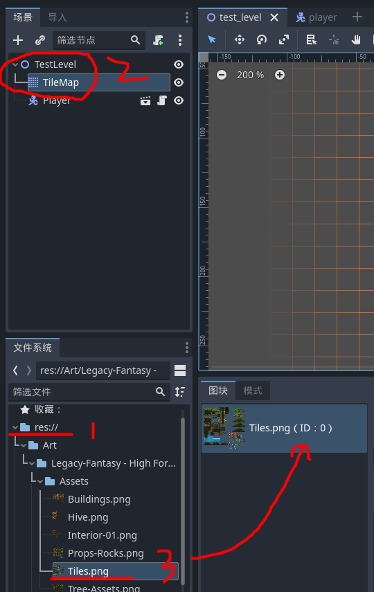
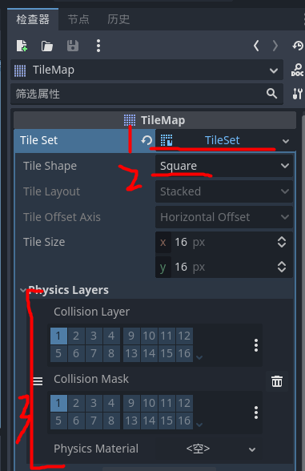
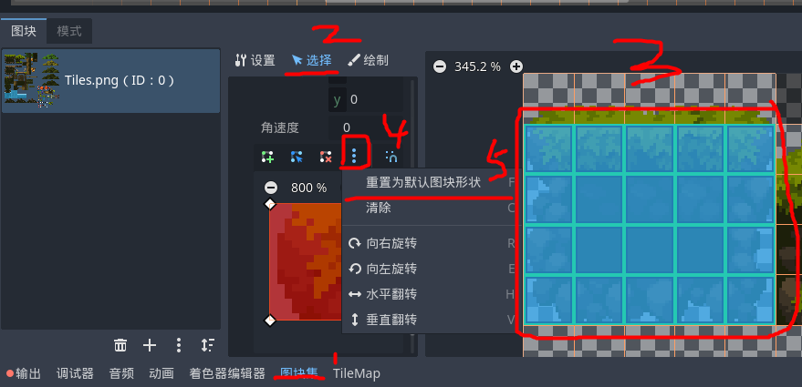
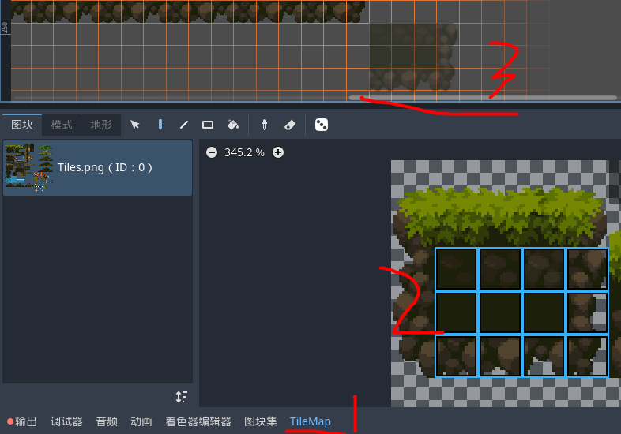
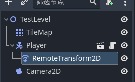

## 场景构建

<br>

### TileMap

> 参考教程：https://www.youtube.com/watch?v=43c-Sm5GMbc  
> 需要下载对应的免费资源包：https://anokolisa.itch.io/sidescroller-pixelart-sprites-asset-pack-forest-16x16

#### 图块编辑

首先打开项目所在文件夹，新建资源文件夹 Art，把资源包全部导入到 Art 文件夹内

之后为主场景添加 `node2d` 节点，再添加对应的子节点 `TileMap`  
选中 tilemap 后，场景编辑界面下方就会出现两个新选项卡“图块集”以及“tilemap”



图块集用于图块的编辑以及碰撞箱的设置  
tilemap 用于选择指定范围然后绘制对应图块

<br>

#### 碰撞箱设置

点击 `tilemap` 对象，在检查器里面，设置其为 `tileset`  
之后 `tile space` 就直接使用长方形 square

特别注意，必须要为 tilemap 添加 physics layout，才可以让其实现碰撞效果！  
按照下图所示第三步，添加物理层，collision 和 mask 都保持默认值，即层 1



<br>

查看下方的调试器，找到“图块集”选项  
按住鼠标左键选择我们需要添加碰撞的 tile 有哪些，被选中的 tile 会被绿色方框圈起来

按照下图指引，选择“重置为默认图块形状”  
此时 tile 就会被淡蓝色小方块遮住，表示碰撞层以及设置完毕



<br>

之后进入 tilemap 选项卡，点击“图块”  
左键按住选择我们需要绘制的图块，被选中的图块显示淡蓝色

然后就可以愉快的在场景里面绘制 tile 了！！！



<br>

## 人物控制

### 简单角色控制

一个基本的角色有以下三个主要部分组成

- `CharacterBody2D` 父节点，表示角色本体
- `Sprite2D` 用于表示角色对应的贴图
- `CollisionShape2D` 角色对应碰撞箱

<br>

直接给 CharacterBody2D 添加一个新的脚本，gds 会自动识别为 player，所以直接就可以使用 gds 附带的角色移动模型套进去就可以用了

我为官方源码添加了一个二段跳的功能，具体实现查看下方完整代码

```js
extends CharacterBody2D


@export var speed:float	 = 200.0
@export var jump_velocity = -150.0
@export var double_jump_velocity = -100 # 配置二段跳加速度

# Get the gravity from the project settings to be synced with RigidBody nodes.
var gravity = ProjectSettings.get_setting("physics/2d/default_gravity")
var has_double_jumped:bool  = false # 检测当前玩家是否正在二段跳


func _physics_process(delta):
	# Add the gravity.
	if not is_on_floor():
		velocity.y += gravity * delta
	else:
		has_double_jumped=false

	# Handle Jump.
	if Input.is_action_just_pressed("jump"):
		if is_on_floor():
			velocity.y = jump_velocity
		elif not has_double_jumped:
			velocity.y = double_jump_velocity
			has_double_jumped = true

	# Get the input direction and handle the movement/deceleration.
	# As good practice, you should replace UI actions with custom gameplay actions.
	var direction = Input.get_axis("left", "right")
	if direction:
		velocity.x = direction * speed
	else:
		velocity.x = move_toward(velocity.x, 0, speed)

	move_and_slide()

```

<br>

#### 相机锁定玩家

> 注意 RemoteTransform2D 必须属于玩家对象 player 的子对象！！！

在主场景根节点之下新增 Camera2D，什么参数都别改，默认格式即可

玩家新增模块 RemoteTransform2D，为其挂在上我们刚刚添加的 Camera2D，即可实现跟踪、


相机跟随更加顺畅

打开 Camera2D 的检查器  
找到项目：`Camera2D->process callback`

把他从 idle 改为 physics

之后记得吧物理计算扥处理方法全部放置到 `_physics_process` 方法里面！！！

<br>
