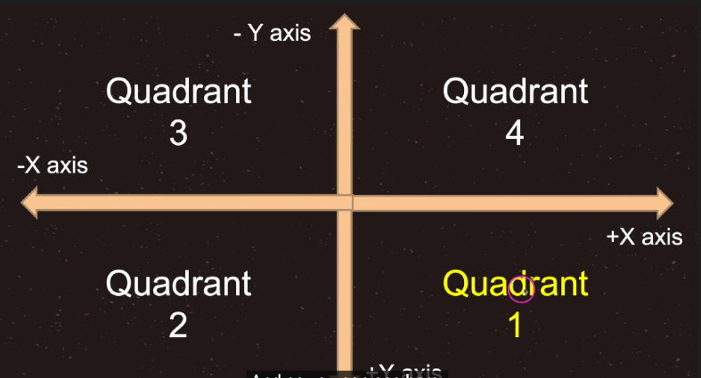

## 代码基础

<br>

### 脚本规范

你需要了解的两个规范

- 类名必须与文件名相同，且为小写
- 尽量继承于 Node2D 节点，Node2D 节点中的 Transform 是我们用的最多的节点

<br>

三个 gds 中的事件函数

- `_init()` 脚本初始化的时候调用，对象的构造器，类似于 Java 的构造函数 construct
- `_ready()` 开始调用一次，可用于初始化脚本
- `_process(delta)` 每帧调用，帧间隔不等，可用于更新游戏

<br>

### 数据类型

#### 常见类型

常见数据类型分类

- bool，一个字节，默认为 false
- int(同 C++和 Java long)，8 个字节，默认为 0
- float(同 C++和 Java double)，8 个字节，默认为 0
- String，默认为 null，字符串可以存储一系列字符，如 "John Doe"。
- 数组
- 对象
- null，变量没有被赋值，则默认为 null

<br>

#### 变量导出

```js
# 导出一个数字
export var a = 1
# 导出一个节点路径
export var b:NodePath
# 导出一个节点路径，不同的写法
export(NodePath) var c
# 导出一个文件路径
export(String, FILE) var e
# 导出一个文件路径，以txt结尾
export(String, FILE, "*.txt") var d
# 导出一个资源文件路径
export(Resource) var f
# 导出一个颜色
export(Color, RGB) var g
```

<br>

#### 函数定义

定义一个函数十分简单，按照如下格式即可

```js
func demo(a,b):
    return a+b;
```

<br>

#### 条件运算

```js
if (a<=0):
    ...
elif (a==0):
    ...
else:
    ...
```

<br>

#### foreach

```js
# 直接遍历字典
for key in dict:
    print("key:" + key as String)
    print("value:" + dict[key] as String)

# 遍历键
for key in dict.keys():
    print("key:" + key as String)
    print("value:" + dict[key] as String)

# 遍历键值
for value in dict.values():
    print("value:" + value as String)
```

<br>

#### 方法与对象

定义一个静态常量以及一个静态方法

```js
# 静态变量
const pi = 3.14;

# 静态方法
static func demo():
    return 0;
```

<br>

#### 面向对象

```js
class Animal:
	extends Object  # 如果不指定继承的类，默认基础Object
	const STATIC_FIELD = "静态变量"
	# 属性
	var height: int

	func _init():
		print("Animal 构造方法")

	func move():
		print("animal，移动")

	static func staticFuction():
		pass
```

<br>

### 生命周期

#### 帧率设置

命令引擎按照指定 FPS 来运行游戏（但会有一定程度波动）

`Engine.target_fps = 120`

<br>

#### 节点生命周期

简要生命周期流程

1. Godot 的 main 启动一个进程，加载所需的驱动设备（如渲染设备：GL/GLES/Vulkan 等）、音频设备，输入控制器设备等等；
2. 进入主循环，加载一个自动创建的对象——SceneTree（场景管理系统对象，它用户管理场景图），
   这个对象包含一个 RootViewPort 节点（它是一个 Node），该节点包含一个默认的 ViewPort（以便提供默认渲染的输出视口）。
3. 当用户用 Godot 编辑器创建一个关卡（或场景文件），并设置默认的启动的场景文件，Godot 将该场景文件的根节点附加到 RootViewPort 节点上，
4. 当节点进入场景树（SceneTree），变为活动状态。
5. 按场景树顺序依次回调各个子节点的\_init()，\_ready()等声明函数。

<br>

获取指定节点的方式

```js
# 获取当前节点
var currentNode1 = $"."
var currentNode2 = self

# 获取父节点
var parentNode1 = get_parent()
var parentNode2 = $"../"

# 获取子节点
var subNode1 = $SubNode2
var subNode2 = $"SubNode2"
var subNode3 = get_node("SubNode2")

# 根节点查找法，会返回节点树从上到下找到的第一个节点
var subNode4 = get_tree().root.find_node("SubNode2", true, false)
```

<br>

#### process 与 physicsprocess

`func _process()` 用于在每一帧渲染之前需要执行的代码

`func _physics_process()` 用于在每一次物理计算之前执行的代码（也就是说，当你为物体添加刚体或者需要执行某些物理计算时，代码写在这里，而不是写在 process 方法，可以加快运行速度与流畅度！）

<br>

#### parent 与 owner

一个节点的 `Parent` 就是场景树上它的父级

如果不修改默认 `Owner` 的话，可以把它视为节点所在场景的顶部节点，如果该节点本身就是顶部节点那么它的 Owner 为 null

<br>

### 信号

#### 基础信号

> 信号和槽机制，可以参考 qt 开发，大体概念和这个差不多

推荐手写一个槽函数，然后获取对应元素（如 button），并通过 connect 方法来链接信号和槽，更易于操作

```js
# connect链接信号pressed，以及对应槽函数onButton
func _ready():
	$Button.connect("pressed", self, "onButton")

func onButton():
	print("button pressed")
```

<br>

#### 自定义信号

```js
# 自定义信号
signal mySignal(a, b)

# 发射信号
emit_signal("mySignal", 1, 2)

# 解绑信号
disconnect("mySignal", 1, 2)
```

<br>

#### yield

> `yield` 的本质是能让一个函数在执行过程中暂停（挂起），然后在接收到恢复指令以后继续执行的机制

`yield` 的三种用法

1. yield()和 resmue()组合，yield()来挂起，用 resmue()来恢复
2. yield(对象,信号 S)的形式，把这个协程（即 GDScriptFunctionState）注册为 节点 N 上信号 S 的接收者，当 节点 N 发出信号 S 以后，函数会恢复执行。
3. yield(协程对象 C,"completed")的形式，协程失效（即 GDScriptFunctionState 的 is_valid 为 false）以后，它会释放一个"completed"信号，用这个信号恢复上一层协程。

<br>

## 编辑器与物体

<br>

### 坐标系及其转换

#### 屏幕坐标系

godot 中，屏幕原点是从左上角开始计算的  
（并且电脑的默认刷新位置也是从左上角开始的）

下面展示了对应的坐标轴以及正负值  


<br>

#### 全局坐标系以及相对坐标系

`position` 的坐标系是以父节点的位置坐标为原点的坐标系

`gloabl_position` 全局位置是以场景的 root 节点为原点的，并不是以当前场景的根结点的位置作为原点的

全局坐标以及相对坐标转换代码演示

```js
# 坐标点测试用例
func positionTest():
	print(position)
	print(global_position)
	print(to_global(position))
	print(to_local(global_position))
	pass
```

<br>

## 物理与算法

<br>

### 物理系统
