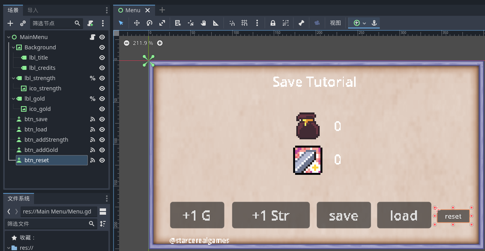

### 前言

以下代码均基于 godot4+版本进行简述

<br>

### 配置文件简单保存与加载

> 油管教程：https://www.youtube.com/watch?v=jGpG58MQf_I  
> 完整项目资源包：https://github.com/patllamas/Save-Tutorial/tree/main

构建下图所示的 GUI 界面

无非就是几个 label 配合 button



<br>

编写代码

很简单，当用户点击 `save` 按钮时，检测项目根目录下是否存在 `save.dat` 配置文件，如果不存在就新建一个并且以键值对的形式保存配置；  
当用户点击 `load` 按钮时，读取配置文件并更新全局变量以及对应 GUI

```go
extends Control

# 全局变量
var gold = 0
var strength = 0

# 获取对应label节点，用于后续实时更新GUI界面
@onready var lbl_gold = get_node("%lbl_gold")
@onready var lbl_strength = get_node("%lbl_strength")

# 读取用户配置文件
var player_file = "user://save.dat"

func _ready():
	# update gold and strength labels to
	load_file()
	lbl_gold.text = str(gold)
	lbl_strength.text = str(strength)

func save_file():
	var file = FileAccess.open(player_file,FileAccess.WRITE)
	var player_data = create_player_data()
	file.store_var(player_data)

func load_file():
	var file = FileAccess.open(player_file, FileAccess.READ)
	if FileAccess.file_exists(player_file):
		var loaded_player_data = file.get_var()
		gold = loaded_player_data.GOLD
		strength = loaded_player_data.STRENGTH

		lbl_gold.text = str(gold)
		lbl_strength.text = str(strength)

func create_player_data():
	var player_dict = {
		"GOLD" : gold,
		"STRENGTH": strength,
	}
	return player_dict

func _on_btn_add_gold_pressed():
	gold += 1
	# we want to update gold label after changing value
	lbl_gold.text = str(gold)

func _on_btn_add_strength_pressed():
	strength += 1
	lbl_strength.text = str(strength)

func _on_btn_reset_pressed():
	gold = 0
	strength = 0
	lbl_gold.text = str(gold)
	lbl_strength.text = str(strength)

func _on_btn_save_pressed():
	save_file()

func _on_btn_load_pressed():
	load_file()

```

<br>
