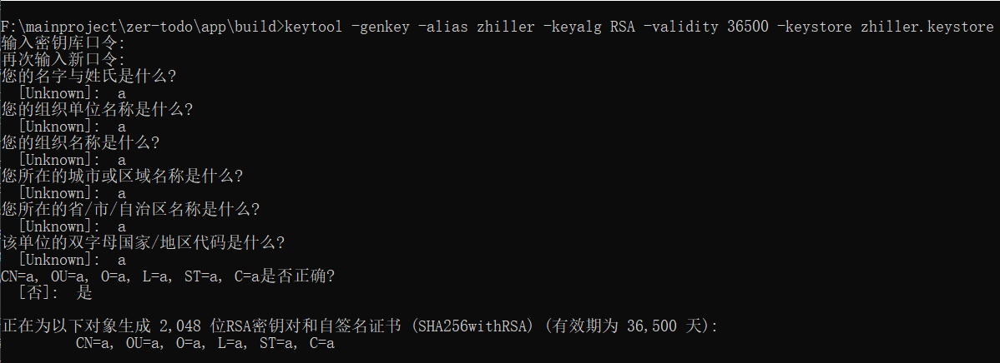
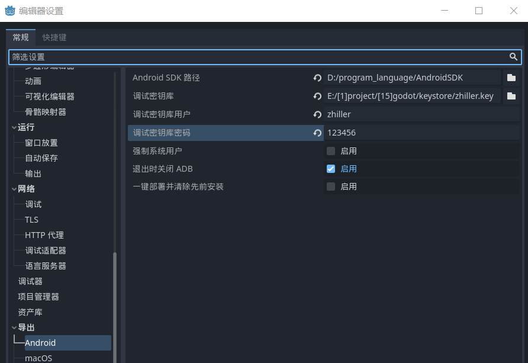
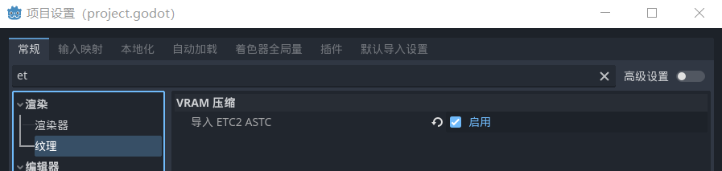
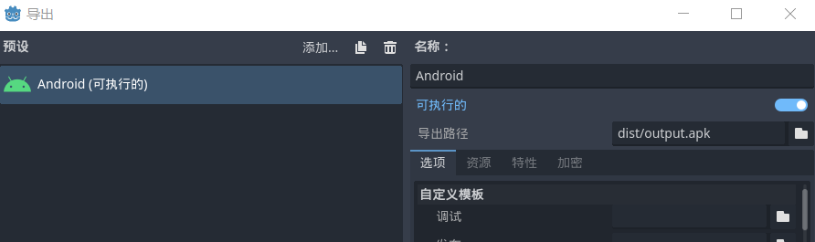

## Android

### Apk 安装后黑屏

由于 GLES3 的原因，目前大部分机型还是不支持这么先进的架构，所以你必须回退到 GLES2 版本进行编译 Apk

对于 4.0 版本，最好选择“兼容”模式，不要选择`forward`以及`移动`（经过测试，这俩编译出来的 Apk 安装后依然黑屏）  
但需要注意的是，兼容模式开发编译出来的 Apk 体积为其他两种模式的两倍！！！

 

### Godot4 导出 Android

#### 安装

再开始之前，需要安装两个东西：

1. android studio
2. JDK

JDK8 或者 JDK16 都可以，但还是推荐使用较新版本的 JDK

AndroidStudio 一般在安装过程中会按照 `AndroidSDK` 我们要记住这个 SDK 的安装位置

 

#### 密钥库签名

> 生成密钥库过程需要记住两个东西：密钥库别名、密钥库口令

安装 JDK 后会默认自带一个生成密钥库的命令 keytool，在命令行中调用来生成指定密钥库

在任意一个文件夹内打开命令提示符，输入以下指令生成密钥库：  
`keytool -genkey -alias zhiller -keyalg RSA -validity 36500 -keystore zhiller.keystore`

这句话代表：  
`-alias zhiller` 生成密钥库的别名（需要记住）  
`-keyalg RSA` 加密方式为 RSA  
`-validity 36500` 密钥库存活时间为 36500 天  
`-keystore zhiller.keystore` 生成的密钥库文件名为 zhiller.keystore

 

命令执行过程中会首先让你指定密钥库密码，这玩意你也要记住  
剩余的配置随便写就可以了

最后需要输入中文的“是”或者“y”来完成密钥库生成

 

#### 编辑器配置

打开 godot4 中的 `编辑器->编辑器设置`

找到导出选项的 android，我们仅需配置前四项内容即可

- AndroidSDK 路径：顾名思义，直接填写 SDK 根目录路径
- 调试密钥库：生成的 keystore 文件路径
- 调试密钥库用户：填写密钥库别名
- 调试密钥库密码：填写密钥库口令

 

#### 项目设置

打开 项目->项目设置

直接搜索 ETC，找到纹理模块，启用“导入 ETC2 ASTC”

关闭项目设置面板

 

#### 开始导出

打开 项目->导出

先点击顶部的“添加”，加入一个 android 构建模块

之后再指定一个输出路径，启用选项目前均保持默认

完毕，点击“导出项目”即可生产 APK

 

## Web

### 使用 itch.io 发布

注册一个 itch.io 账号，然后将导出的 html 游戏所有相关文件都打包到同一个压缩文件夹内

上传至 itch，之后即可保存场景然后朋友就可以使用 itch 提供的私有 URL 访问该游戏了

注意，在你 itch 中编辑选项的时候，务必勾选 SharedArrayBuffer，这样可以避免出现浏览器异常

 

### 解决 Header 异常问题

> 几乎 99%的小伙伴在直接打开 html 文件的时候会跳出如下错误：  
> `Error
The following features required to run Godot projects on the Web are missing:
Cross Origin Isolation - Check web server configuration (send correct headers)
SharedArrayBuffer - Check web server configuration (send correct headers)`

以上的错误可以通过修改服务器的 header 来解决掉

对于使用 express 或者 flask 等服务端框架的开发者来说，仅需简单的修改一下 header 就可以规避此错误

接下来讲的是如何使用 github 部署网站，并且仍可以解决掉这个烦人的 header 问题，搭设属于我们自己的游戏网站，而不是全部依靠 itch 为我们托管

 
