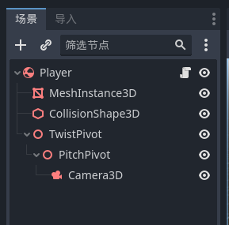
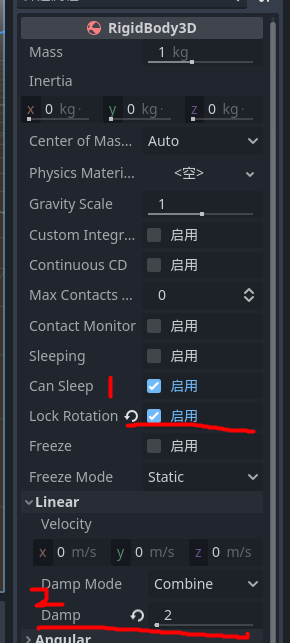

## 摄像机

<br>

### 第三人称控制器

#### 角色设置

新建一个空场景，一次性创建如下几个节点，所有的节点都保持默认，什么都别动  


下面依次修改对应节点的 transform 属性
`Camera3D`，position 的 y 设置为 3  
`PitchPivot`，rotation 的 x 设置为-10  
`TwistPivot`，position 的 y 设置为 1

<br>

之后点击顶层节点 player（这是一个 Ridigbody3D 节点）  
设置对应参数如下

- 锁定旋转，保持玩家不会跌倒
- 设置线性阻力递减，保证玩家不会出现“滑步”现象



<br>

#### 按键映射

依次点击：`项目->项目设置->输入映射`

添加四个按键映射，分别对应 WSAD 四个控制按键  
分别是：`forward` `back` `left` `right`

<br>

#### 代码

为根节点 player 添加新的脚本 `player.gd`

```go
extends RigidBody3D

var mouse_sensitivity := 0.001
var twist_input := 0.0
var pitch_input := 0.0

@onready var twist_pivot := $TwistPivot
@onready var pitch_pivot := $TwistPivot/PitchPivot

# Called when the node enters the scene tree for the first time.
func _ready():
	Input.set_mouse_mode(Input.MOUSE_MODE_CAPTURED)


# Called every frame. 'delta' is the elapsed time since the previous frame.
func _process(delta):
	var input := Vector3.ZERO;
	input.x = Input.get_axis("left","right")
	input.z = Input.get_axis("forward","back")

	apply_central_force(twist_pivot.basis*input*1200*delta)

	if Input.is_action_just_pressed("ui_cancel"):
		Input.set_mouse_mode(Input.MOUSE_MODE_VISIBLE)

	twist_pivot.rotate_y(twist_input)
	pitch_pivot.rotate_x(pitch_input)
	pitch_pivot.rotation.x = clamp(
		pitch_pivot.rotation.x,
		deg_to_rad(-30),
		deg_to_rad(30)
	)
	twist_input=0.0
	pitch_input=0.0

func _unhandled_input(event: InputEvent)->void:
	if event is InputEventMouseMotion:
		if Input.get_mouse_mode()==Input.MOUSE_MODE_CAPTURED:
			twist_input = - event.relative.x * mouse_sensitivity
			pitch_input = - event.relative.y * mouse_sensitivity
```

<br>
