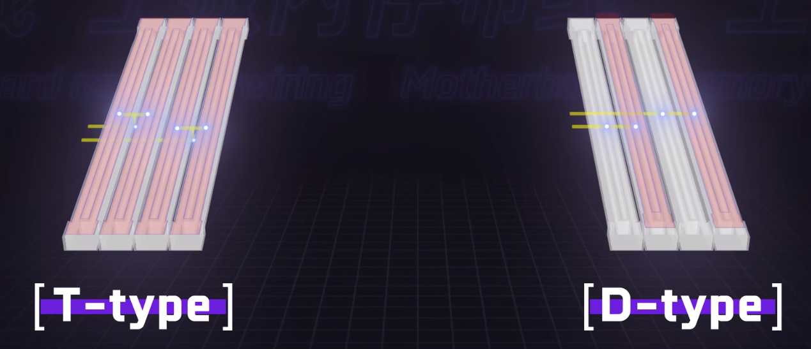
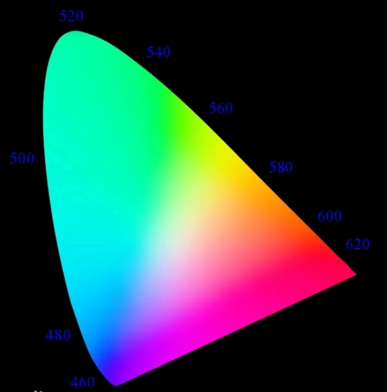
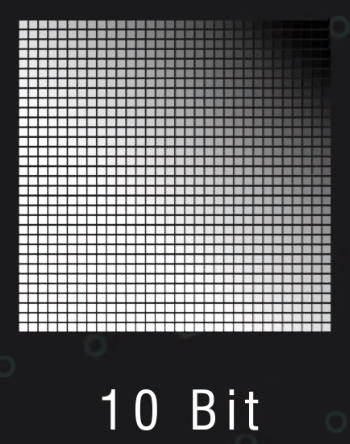
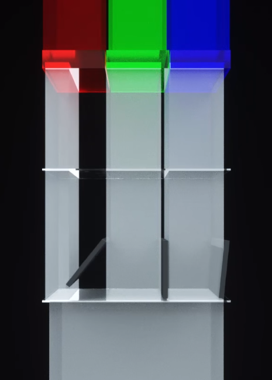

## CPU

 

### Intel

#### 酷睿 Core 代号分析

代号类型及其分析

1. 酷睿 i3/i5/i7/i9：这是 Intel 处理器的主要系列，代表不同的性能级别，其中 i3 是入门级别，i5 是中端级别，i7 是高端级别，i9 是最高端级别。
2. 代号数字：代号中的数字通常表示处理器的代数，例如第 11 代酷睿处理器就是指代号中包含数字 11 的处理器。
3. 代号后缀：代号中的末尾字母后缀通常表示处理器的特性或用途，例如：
   H: 适用于高性能笔记本电脑。
   G: 包含了 Intel 的集成图形处理器。
   K: 高性能，支持超频功能。（不锁倍频）
   T: TDP 更低，适合轻薄笔记本电脑等低功耗设备。
   U: 适用于低功耗设备。
   Y: 极低功耗设备
   F: 没有核显，需要独立显卡
   S: 特别版
   G1-G7: 显卡级别（采用较新集成显卡技术的处理器）
   X/XE: 最高性能设计的面向台式机的“至尊版”处理器

现在来拆解 `i7-12650H`

- i7 即处理器系列，不解释
- 12 表示此为 12 代 i7
- 650 这个是 SKU 参数，数值越高性能越好，通代 CPU 之间的 SKU 差别不是很大
- H 后缀，表示此为高性能笔记本使用的 CPU

 

#### 志强 Xeon 代号分析

直接来看案例：`Intel Xeon Platinum 8180M processor`

- Intel Xeon 表示此为志强系列处理器
- Platinum 表示为铂金版本
- 8 表示 SKU 等级
- 1 表示处理器代数
- 80 表示 SKU 数值
- M 表示内存能力（比如可否扩展、内存容量大小等等）

 

#### 奔腾与赛扬代号分析

二者将在后续合并称为“英特尔处理器”

二者对应的代号划分规定极为混乱，主流型号为 `G\N\J`，在此不做分析

 

### AMD

#### 命名规则

目前主流的 AMD 芯片有这些：速龙 ATHLON，锐龙 RYZEN，线程撕裂者 THREADRIPPER、晓龙 EPYC

 

## GPU

 

### 显卡基本概念

#### 显卡分类

核显：CPU 和 GPU 集成在一块芯片上  
集显：显卡芯片独立的安放在主板北桥部分  
独显：与图形处理的所有内容全部集成于一块独立 PCB 上

 

### 显卡散热原理

 

## RAM

### 单根与套条

内存条一般会以单根出售或者 2-4 根捆绑出售

内存条以套条的形式出售更贵  
是因为套条内的每个内存条具有相同的`型号、频率、时序和容量`等参数。这些内存条是经过精心挑选和测试的，确保它们可以在同一系统中协同工作，并提供更高效的内存性能。

单根多插也不是不行，但是最好具备以下条件

1. 选择大厂家生产的内存条，这样子单根之间的参数差异基本微弱到可以忽略不计
2. 主板特别好，能自动兼容不同参数的内存条

 

### 内存插槽

#### 甩线

CPU 和内存插槽之间的距离比较近，而由于 CPU 是近似方形的，其与内存相关的引脚聚集于右侧，而对应的连接到内存插槽的长条形引脚之上，必然会导致两边电路线过长  
此时针对中间短线使用“甩线”工艺，使得各个电路线连接 CPU 和内存插槽等长，实现数据等距传输

 

#### DPC (DIMM Per Channel)

一个通道对应一个内存槽，称为 1DPC  
一个通道对应两个内存槽，称为 2DPC

 

#### 布线方式

> 单通道主要使用直连方式，而双通道主要使用 T-type 和 D-type 形式

直连（direct-topology）：直接把 CPU 对应通道连接到对应槽位的通道上

D-type 和 T-type 两种布线形式如下图所示  

T-type：插满 4 根内存条是效能最高  
D-type：只插 2、4 槽两根内存条是，效能最高

但无论是 T-type 还是 D-type，请确保当你只有两根内存条时，务必插在 `2、4 槽`上，可以最大限度降低残线率，提高传输效率

目前市面上主流的主板基本都是 D-type 类型的了

 

### 接口与协议

#### M.2

M.2 是一种小型化的计算机扩展卡接口，也被称为 Next Generation Form Factor (NGFF)。

M.2 接口通常比传统的 SATA 接口更小，同时也更快，支持更高的数据传输速率。

M.2 有两个 key，分别为 `B 键(socket 2)` 和 `M 键(socket 3)`

1. B 键（SATA B+M 键）：B 键位于 M.2 插槽的左侧，具有 6 个针脚。B 键的主要用途是支持 SATA 协议的设备，如 SATA SSD、硬盘、光驱、无线网卡等。同时，B 键还可以与 M 键组合使用，以支持更多的接口协议。
2. M 键（PCIe M 键）：M 键位于 M.2 插槽的右侧，具有 5 个针脚。M 键的主要用途是支持 PCIe 协议的设备，如 PCIe SSD、NVMe SSD、显卡、网络适配器等。
3. B+M 键：B+M 键插槽可以同时支持 B 键和 M 键设备，因此可以兼容更多的设备类型。B+M 键插槽具有 8 个针脚，其中 6 个针脚可用于支持 SATA 协议，5 个针脚可用于支持 PCIe 协议。

M.2 可以双面放置闪存颗粒，大大降低了 `mSATA` 接口的对应问题

和 SATA 接口一样，速度同样被限制在 `500MB/S` 左右

 

#### AHCI

高级主机控制器接口(Advanced Host Controller Interface,AHCI)

AHCI 通过包含一个 PCI BAR（基址寄存器），来实现原生 SATA 功能。

AHCI 模式则与 IDE 模式相反，装系统时需要安装 SATA 驱动

为提升多任务负载下性能，AHCI 引入 NCQ 机制，能够大幅度减少硬盘无用的寻道次数和数据查找时间，这样就能显著增强多任务情况下硬盘的性能

AHCI 可视为 SATA 的继任者

 

#### SATA

传统 SATA 接口目前已经被逐渐淘汰  
默认机械硬盘 3.5 寸和 2.5 寸的都在大量使用  
金手指区较大的一部分是供电的，较小的一部分是提供数据的

mSATA 接口：一种适用于小型设备的接口；依然使用 SATA 协议通信，可以和原版 SATA 接口兼容

 

#### PCIe

高速串行计算机扩展总线标准 `PCI-Express(peripheral component interconnect express)`

PCIe 属于高速串行点对点双通道高带宽传输，所连接的设备分配独享通道带宽，不共享总线带宽

PCIe 接口对应 `PCIe` 总线，以及两个协议：`NVMe、SCSI`

 

#### NVMe

`NVMe (Non-Volatile Memory Express) `是一种专门为固态硬盘 (SSD) 设计的高性能、低延迟的存储器访问协议。

NVMe 能够通过 PCIe 总线进行传输，而不需要使用传统的 SATA 接口

 

#### SAS

串行 SCSI（SAS：Serial Attached SCSI）  
基本均给服务器使用，可以看做是 SATA 和 SCSI 的结合体

以下是对应常用的三个协议

1. 串行 SCSI 协议 (SSP) —用于和 SCSI 设备沟通。
2. 串行 ATA 通道协议 (STP) —用于和 SATA 设备沟通。
3. SCSI 管理协议 (SMP) —用于对 SAS 设备的维护和管理。

 

## 硬盘

 

### 垂直盘与叠瓦盘

`PMR` 垂直磁记录，包括 `CMR` 和 `SMR`

CMR 传统垂直磁记录，也就是老款垂直盘  
SMR 叠瓦垂直磁记录，也就是所谓的叠瓦盘

叠瓦盘只能相比于垂直盘多出 25%容量，而且由于工作原理的限制，他的缓存区比传统垂直盘多出几倍

叠瓦盘出错率高且不能频繁擦写，否则损坏率会随之升高

叠瓦盘中的叠瓦区域实际上仅限于一个扇区内部，而不是说整个盘面均为叠瓦

 

### RAID 独立磁盘冗余阵列

> 一种通过将多个磁盘组合在一起来提高数据存储性能和可靠性的技术

常见的 RAID 级别

- RAID 0：将两个或多个磁盘组合在一起，以提高读写速度。RAID 0 不提供数据冗余，如果其中一个磁盘发生故障，所有数据都会丢失。
- RAID 1：将两个磁盘组合在一起，其中一个磁盘是主磁盘，另一个是备份磁盘，在主磁盘上进行写操作时，数据也会同时写入备份磁盘。如果主磁盘发生故障，备份磁盘可以立即接管，保证数据不会丢失。
- RAID 5：通过将数据和校验信息分布在多个磁盘上来提高读写速度和数据冗余性。RAID 5 需要至少三个磁盘，其中一个磁盘用于存储校验信息。如果其中一个磁盘发生故障，数据可以通过校验信息进行恢复。
- RAID 6：类似于 RAID 5，但需要至少四个磁盘，并使用两个磁盘来存储校验信息，提供更高的数据冗余性。
- RAID 10：将 RAID 1 和 RAID 0 组合在一起，需要至少四个磁盘。RAID 10 提供了更高的读写速度和数据冗余性，但成本也更高。

 

### NAS 网络附加存储

一种专门用于存储数据的网络设备，它通常具有多个硬盘，可以提供大容量的数据存储，并通过网络连接与其他设备进行数据共享和访问

实现原理：

1. 准备一个路由器组建局域网
2. 利用一台微机（或 NAS 专用计算机）挂载 N 个硬盘，并把它接入当前局域网
3. 此时链接局域网的任何设备都可以通过该网络访问微机中硬盘的数据

将 NAS 挂载到公网即可实现个人私有云盘

 

### 磁盘容量释疑

硬盘生产商对于容量的计算是这样的：1GB=1000MB  
而操作系统采用二进制，故容量计算是这样的：1GiB=1024MiB

硬盘生产商生产硬盘时的内存实际上确实为 1024GB，但是对外声称 1000GB 是因为剩余的容量都被作为 OP 空间了

 

### OP 过量配置

指在硬盘制造过程中预留的一部分空间，用于提高硬盘的性能和可靠性

OP 空间的主要功能：

1. 坏道管理：硬盘制造过程中可能会出现一些坏道，这些坏道会影响硬盘的性能和可靠性。OP 空间可以作为备用块，用于替代出现坏道的扇区，从而提高硬盘的可靠性。
2. 垃圾回收：硬盘在使用过程中会产生一些无用数据和文件碎片，OP 空间可以用于垃圾回收，从而提高硬盘的性能和寿命。
3. 写入性能：硬盘的写入性能通常比读取性能慢，这是因为写入操作需要进行数据擦除和写入操作。OP 空间可以用于写入缓存，从而提高硬盘的写入性能。
4. 寿命保护：使用 OP 空间还可以提高硬盘的寿命，因为 OP 空间可以减少硬盘的写入次数和擦除操作。

 

## 屏幕

### VA 与 TN 面板

#### IPS

定义：液晶分子默认水平，施加电压水平平行偏转（IPS 控制液晶分子的正负电极在同侧，而 VA 和 TN 都在异侧）

可视角度最宽

对比度 1/1000

平均灰阶响应速度 3-8ms

 

#### VA

定义：液晶分子默认状态为垂直，施加电压让液晶分子水平偏转

可视角度介于 TN 和 IPS 之间

对比度 1/3000

平均灰阶响应速度 5-15ms

 

#### TN

定义：液晶分子默认水平螺旋偏转，施加电压使液晶分子垂直偏转

可视角度窄，只有垂直看向屏幕是色度才是最完整的

对比度 1/600

平均灰阶响应速度 1-3ms

 

### 色域与色准

#### CIE 空间

CIE 空间（CIE color space）是一种用于描述人类视觉颜色感知的数学模型  
CIE 空间中的三个坐标轴分别代表了三种基本颜色，即红色、绿色和蓝色

 

#### 色彩空间

常见的色彩空间有以下四个

1. sRGB
2. NTSC
3. Adobe RGB
4. DCI-P3

 

不同的色彩空间在 CIE 图中覆盖的范围不一样  
比如 `100%sRGB` 覆盖的色域并不比 `100%DCI-P3` 色域范围大

 

#### 色准

顾名思义，即显示颜色的准确度  
确定色准的主要参数为 △E

△E 值越小，表示色彩越准越精确  
可以提供校色仪来校准屏幕色彩

△E 取值范围以及对应的色偏程度

- 小于 1.5 顶级，基本无色偏
- 1.5-3 优秀，极轻微色偏
- 3-5 良好，日常使用不影响
- 5-8 普通，有概率察觉色偏
- 大于 8 差，色偏较为严重

 

### 色彩管理

绝大多数平台目前均使用 `sRGB` 色彩空间作为基准

#### EDID

一种用于描述显示器参数和功能的信息格式。EDID 信息通常存储在显示器的 EEPROM 中，可以通过计算机的图形卡读取

EDID 信息包含了显示器的基本参数和功能，例如分辨率、刷新率、色彩深度、屏幕尺寸、支持的视频模式和音频功能等

EDID 信息的格式是一种二进制格式，其中包含了多个数据块，还包含了一个校验和，用于检查 EDID 信息是否被修改或损坏

 

#### 欠饱和与过饱和

由于不同色彩空间覆盖的色域是不同的，当你从一个 sRGB 空间下的图片迁移到一个 NTSC 空间下的设备显示，可能会造成色彩溢出等问题

举个栗子：  
比如你使用 windows10，他只能使用 100%sRGB 空间，而你用一个 P3 空间的广色域显示屏来显示图片；  
那么 windows 只会向显示器汇报说取 sRGB 中最蓝的部分，那么显示器对应的就是 P3 最蓝的部分，且因为 P3 色域广，故此时显示出来的图像是过饱和的

故目前最佳的色域范围为 100%sRGB

 

### 色深

#### 色深位数

色深一般使用 2 的幂次方表达

色深可以理解为从白过渡到黑具有的阶梯数量，如下图所示  
10bit 色深，表示拥有 2 的 10 次方个色彩阶梯

色深位数越大， 越不容易出现色彩断层现象

但这也同时意味着需要更高的带宽和存储容量来处理和存储 10 位色深的图像和视频

 

屏幕所说的 1680 万色彩实际上是通过色深计算出来的  
比如屏幕色深为 256，则 256x256x256=16800000

 

#### FRC

> FRC 用于模拟高于显示器本身支持的颜色深度

FRC 技术通过快速交替显示两个颜色来模拟一个新的颜色，这个新的颜色是两个颜色的平均值

故一个 `10bit` 的显示器可以通过 `8bit+FRC` 实现

FRC 技术会为图像显示带来更多的噪点

 

### OLED & LCD

#### LCD 液晶显示屏

LCD 显示原理

1. 背光源通常是一个冷阴极荧光灯或 LED 灯条，用于照亮液晶层
2. 液晶层是由两个玻璃基板组成的，中间夹着一层液晶分子。每个液晶分子都是一个长方形的分子，可以通过加电来改变其方向和透光性
3. 当液晶分子受到电场影响时，其会偏转一定角度，此时透过滤光片将三原色按照一定比率配合即可得到对应图像

 

但是 LCD 有以下缺点：

- 由于 LCD 共享一整块背光屏幕，故无法做到 OLED 的息屏显示，一次点亮整个屏幕就全部点亮
- 液晶分子无法做到完全闭合，故在显示黑色的时候由于液晶分子还留有一些缝隙，故会产生漏光现象，导致屏幕上不是显示为纯黑色

 

#### OLED 有机自发光二极管

OLED 屏幕上所有灯珠都是各自独立的，每个灯珠都有 RGB 三色小灯珠，通过直接控制这些小灯珠亮度大小配比得到图像

优点：

- 由于灯珠独立，无需背光，故可以实现熄屏显示功能，但是与此同时也会造成烧屏现象
- OLED 可以实现屏幕完全纯黑，并且不存在漏光现象
- 可以弯折，故能做曲面屏

 

由于 OLED 屏幕限制，故调光策略不能使用 DC 直流调光（LCD 可以采用 DC 调光），因为电压过低屏幕显示就会出问题

OLED 绝大部分采用低频 PWM 方式调节屏幕亮度  
即设置占空比，亮灯时间 60%，灭灯时间 40%，一个周期 0.01s，让人眼觉得屏幕没有频闪而是一直亮着的  
调节占空比一设置亮度大小

目前存在两款新的 LED 技术  
`micro-led`（未量产，研发中）  
`mini-led`（已有小部分使用）

 

## 外设与接口

### 电源

#### 锂电池主要分类

钴酸锂电池：能量密度大（即小重量大能量），循环寿命一般，安全性最差，常用于手机平板电脑电池
三元锂电池：所有参数均适中，常用于小电机  
磷酸铁锂电池：汽车电池，安全性高且造价低，循环寿命高
锰酸锂电池：价格和安全性都较为优秀，但寿命低，适用于充电宝

 

### PS/2

旧式用于链接键鼠的接口，目前已经被高效的 USB 接口淘汰

`PS/2` 接口直接连接到 CPU 上，且无需安装任何驱动，鼠标键盘即插即用  
`USB` 接口连接到主板南桥后才传递到 CPU，且均需要驱动才可以使用

对于部分需要执行超频的 CPU，使用 PS/2 可以更好的节省性能

 

### 鼠标

#### 回报率

CPU 每间隔一段时间都会询问鼠标是否传递过来了新的信息，这一过程叫做轮训机制

回报率即反应 CPU 轮询频率

如 1000Hz 回报率，表示 1s 内 CPU 询问键鼠 1000 次，也即间隔 1ms 询问一次

 

## 散热器

### 塔式鳍片散热器

散热流程

1. CPU 直接接触热管，热管内的液体升温蒸发后蒸汽聚集到热管上部
2. 热管上部有很多散热片，使得热管上方蒸汽快速降温变回冷凝液
3. 冷凝液回流到热管下部，继续下一个循环
4. 散热片上附有一个小风扇，持续为散热片散热

 

单塔风冷价格较为便宜

当前性能较好的显卡都自带下压式风冷（即热管形状变成片状，大大压缩了散热器面积，可以直接塞到显卡里面去）

 

### 水冷散热器

工作原理

1. 冷水流经冷头带走 CPU 或者显卡热量
2. 水流经过冷排，将热量传递给冷排上的鳍片
3. 风扇吹鳍片，使热水降温
4. 降温后的热水变成冷水后回流，进入下一循环

 

一体式水冷就是打包好的直接用的；  
分体式水冷即你需要组装冷头、冷排、水管

水冷价格较高，且冷排面积越大，散热效果越好

 

### 分体式散热器

富爷专用

 
